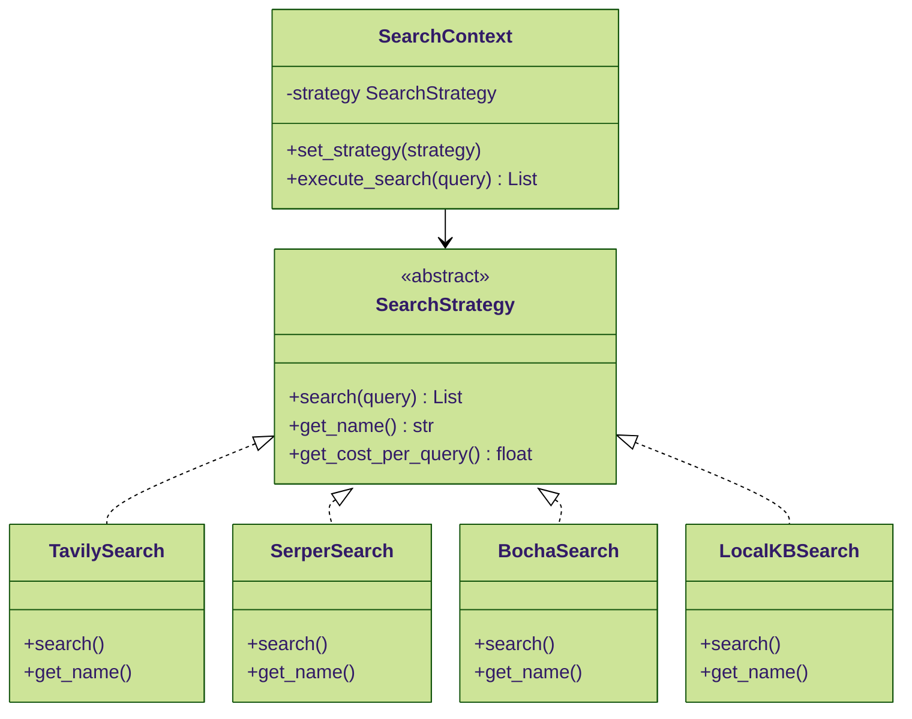
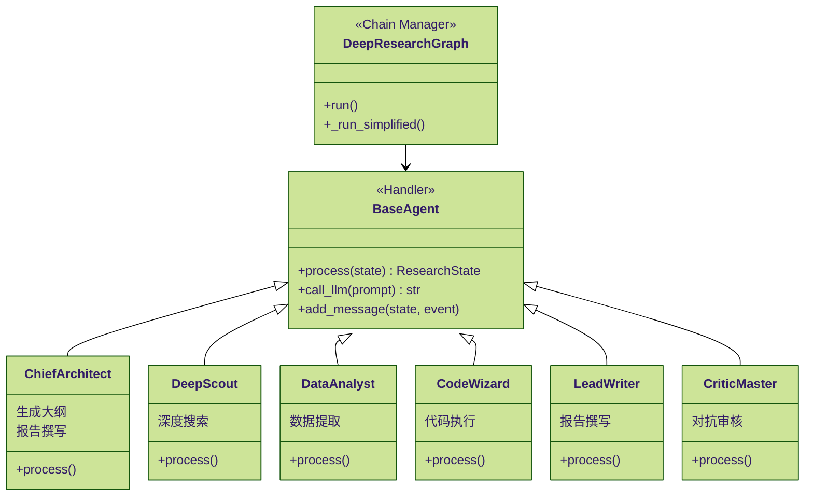
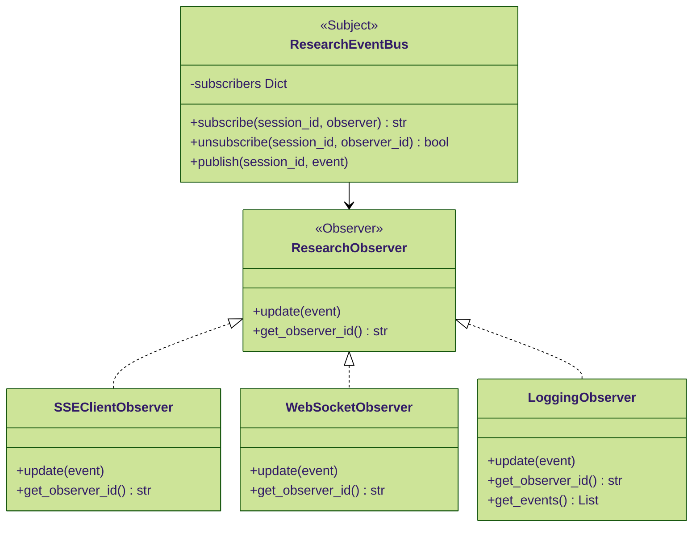
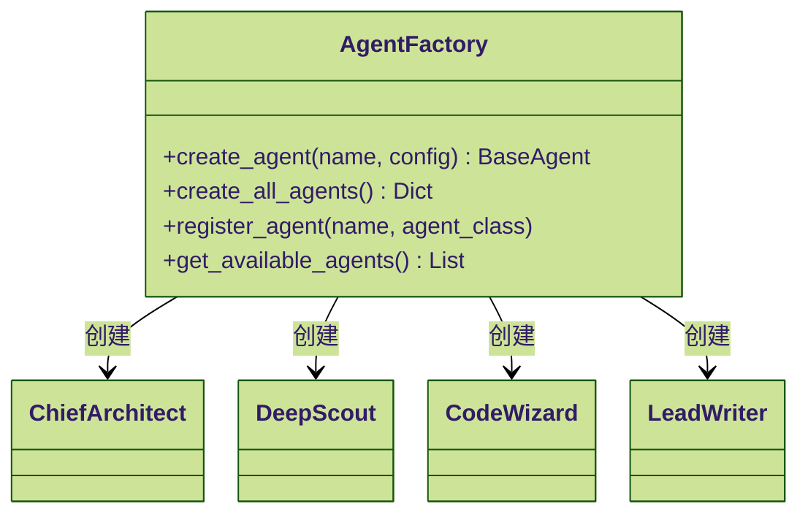
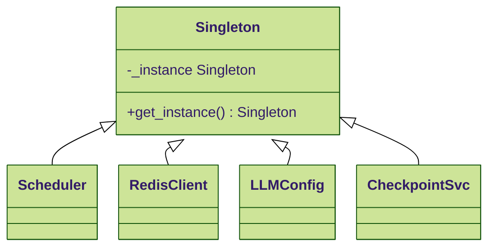
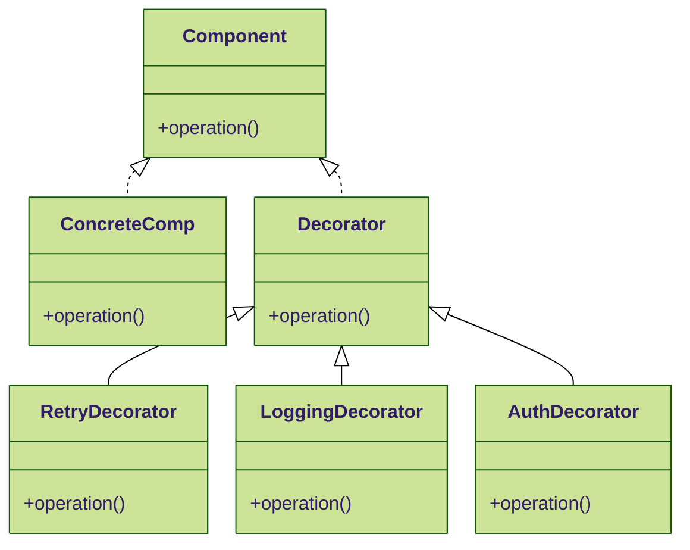

# 5.2 关键设计模式

## 目录

- [1. 概述](#1-概述)
- [2. 策略模式 - 多种搜索引擎切换](#2-策略模式---多种搜索引擎切换)
  - [2.1 模式概述](#21-模式概述)
  - [2.2 UML 类图](#22-uml-类图)
  - [2.3 完整代码实现](#23-完整代码实现)
    - [2.3.1 抽象策略接口](#231-抽象策略接口)
    - [2.3.2 具体策略实现 - Tavily](#232-具体策略实现---tavily)
    - [2.3.3 具体策略实现 - Bocha](#233-具体策略实现---bocha)
    - [2.3.4 具体策略实现 - 本地知识库](#234-具体策略实现---本地知识库)
    - [2.3.5 策略上下文](#235-策略上下文)
  - [2.4 使用示例](#24-使用示例)
  - [2.5 优点与应用场景](#25-优点与应用场景)
- [3. 责任链模式 - Agent 顺序执行](#3-责任链模式---agent-顺序执行)
  - [3.1 模式概述](#31-模式概述)
  - [3.2 UML 类图](#32-uml-类图)
  - [3.3 完整代码实现](#33-完整代码实现)
    - [3.3.1 Handler 基类](#331-handler-基类)
    - [3.3.2 具体 Handler - ChiefArchitect](#332-具体-handler---chiefarchitect)
    - [3.3.3 具体 Handler - DeepScout](#333-具体-handler---deepscout)
    - [3.3.4 Chain Manager - DeepResearchGraph](#334-chain-manager---deepresearchgraph)
  - [3.4 优点与应用场景](#34-优点与应用场景)
- [4. 观察者模式 - SSE 事件推送](#4-观察者模式---sse-事件推送)
  - [4.1 模式概述](#41-模式概述)
  - [4.2 UML 类图](#42-uml-类图)
  - [4.3 完整代码实现](#43-完整代码实现)
    - [4.3.1 Observer 接口](#431-observer-接口)
    - [4.3.2 具体 Observer - SSE 客户端](#432-具体-observer---sse-客户端)
    - [4.3.3 具体 Observer - WebSocket 客户端](#433-具体-observer---websocket-客户端)
    - [4.3.4 具体 Observer - 日志记录器](#434-具体-observer---日志记录器)
    - [4.3.5 Subject - ResearchEventBus](#435-subject---researcheventbus)
  - [4.4 集成到 DeepResearchGraph](#44-集成到-deepresearchgraph)
  - [4.5 使用示例](#45-使用示例)
  - [4.6 优点与应用场景](#46-优点与应用场景)
- [5. 工厂模式 - Agent 实例创建](#5-工厂模式---agent-实例创建)
  - [5.1 模式概述](#51-模式概述)
  - [5.2 UML 类图](#52-uml-类图)
  - [5.3 完整代码实现](#53-完整代码实现)
  - [5.4 优点与应用场景](#54-优点与应用场景)
- [6. 单例模式 - Scheduler、Redis 客户端](#6-单例模式---schedulerredis-客户端)
  - [6.1 模式概述](#61-模式概述)
  - [6.2 UML 类图](#62-uml-类图)
  - [6.3 完整代码实现](#63-完整代码实现)
    - [6.3.1 单例装饰器](#631-单例装饰器)
    - [6.3.2 Scheduler 单例](#632-scheduler-单例)
    - [6.3.3 Redis 客户端单例](#633-redis-客户端单例)
    - [6.3.4 LLMConfig 单例](#634-llmconfig-单例)
  - [6.4 优点与应用场景](#64-优点与应用场景)
- [7. 装饰器模式 - Retry、权限检查](#7-装饰器模式---retry权限检查)
  - [7.1 模式概述](#71-模式概述)
  - [7.2 UML 类图](#72-uml-类图)
  - [7.3 完整代码实现](#73-完整代码实现)
    - [7.3.1 Retry 装饰器](#731-retry-装饰器)
    - [7.3.2 权限检查装饰器](#732-权限检查装饰器)
    - [7.3.3 日志装饰器](#733-日志装饰器)
    - [7.3.4 缓存装饰器](#734-缓存装饰器)
    - [7.3.5 组合装饰器](#735-组合装饰器)
  - [7.4 优点与应用场景](#74-优点与应用场景)
- [8. 设计模式总结](#8-设计模式总结)
  - [8.1 模式对比表](#81-模式对比表)
  - [8.2 项目中的应用统计](#82-项目中的应用统计)

## 1. 概述

本文档详细解析行业信息助手项目中使用的关键设计模式，包括**策略模式、责任链模式、观察者模式、工厂模式、单例模式和装饰器模式**。每个模式都配有完整的代码实现、UML 类图和使用场景分析。

> 当前截图覆盖到策略模式、责任链模式和观察者模式的 `ResearchEventBus` 部分；后续模式如工厂模式、单例模式、装饰器模式未出现在本批截图中。

## 2. 策略模式 - 多种搜索引擎切换

### 2.1 模式概述

**意图**：定义一系列算法，将每个算法封装起来，并使它们可以互换。策略模式让算法独立于使用它的客户端而变化。

**应用场景**：系统支持 Tavily、Serper、BochaAI 三种搜索引擎，可以根据配置动态切换。

### 2.2 UML 类图



### 2.3 完整代码实现

#### 2.3.1 抽象策略接口

```python
from abc import ABC, abstractmethod
from typing import List, Dict, Any


class SearchStrategy(ABC):
    """搜索策略抽象基类"""

    @abstractmethod
    async def search(self, query: str, count: int = 10) -> List[Dict[str, Any]]:
        """
        执行搜索

        Args:
            query: 搜索查询
            count: 返回结果数量

        Returns:
            搜索结果列表，统一格式：
            [
                {
                    "url": "https://...",
                    "title": "标题",
                    "summary": "摘要",
                    "site_name": "来源",
                    "date": "发布日期"
                },
                ...
            ]
        """
        pass

    @abstractmethod
    def get_name(self) -> str:
        """获取策略名称"""
        pass

    @abstractmethod
    def get_cost_per_query(self) -> float:
        """获取每次查询的成本（美元）"""
        pass
```

#### 2.3.2 具体策略实现 - Tavily

```python
import requests
import asyncio
from typing import List, Dict, Any


class TavilySearchStrategy(SearchStrategy):
    """Tavily 搜索引擎策略"""

    def __init__(self, api_key: str):
        self.api_key = api_key
        self.endpoint = "https://api.tavily.com/search"

    async def search(self, query: str, count: int = 10) -> List[Dict[str, Any]]:
        """执行 Tavily 搜索"""
        payload = {
            "api_key": self.api_key,
            "query": query,
            "search_depth": "advanced",  # basic/advanced
            "include_answer": True,
            "include_raw_content": False,
            "max_results": count,
            "include_domains": [],
            "exclude_domains": [],
        }

        try:
            response = await asyncio.to_thread(
                requests.post,
                self.endpoint,
                json=payload,
                timeout=30,
            )

            if response.status_code != 200:
                return []

            data = response.json()
            results = data.get("results", [])

            # 转换为统一格式
            formatted_results = []
            for item in results:
                formatted_results.append({
                    "url": item.get("url", ""),
                    "title": item.get("title", ""),
                    "summary": item.get("content", ""),
                    "site_name": self._extract_domain(item.get("url", "")),
                    "date": item.get("published_date", ""),
                    "score": item.get("score", 0.0),
                })

            return formatted_results

        except Exception as e:
            print(f"Tavily search error: {e}")
            return []

    def get_name(self) -> str:
        return "Tavily"

    def get_cost_per_query(self) -> float:
        return 0.001  # $0.001 per query

    @staticmethod
    def _extract_domain(url: str) -> str:
        """从 URL 提取域名"""
        from urllib.parse import urlparse

        parsed = urlparse(url)
        return parsed.netloc
```

#### 2.3.3 具体策略实现 - Bocha

```python
class BochaSearchStrategy(SearchStrategy):
    """Bocha AI 搜索引擎策略（当前系统使用）"""

    def __init__(self, api_key: str):
        self.api_key = api_key
        self.endpoint = "https://api.bocha.cn/v1/web-search"

    async def search(self, query: str, count: int = 10) -> List[Dict[str, Any]]:
        """执行 Bocha 搜索"""
        payload = {
            "query": query,
            "summary": True,
            "count": count,
            "freshness": "noLimit",  # noLimit/day/week/month
        }
        headers = {
            "Authorization": f"Bearer {self.api_key}",
            "Content-Type": "application/json",
        }

        try:
            response = await asyncio.to_thread(
                requests.post,
                self.endpoint,
                headers=headers,
                json=payload,
                timeout=30,
            )

            if response.status_code != 200:
                return []

            data = response.json()

            if data.get("code") != 200:
                return []

            webpages = data.get("data", {}).get("webPages", {}).get("value", [])

            # 转换为统一格式
            formatted_results = []
            for item in webpages:
                if item.get("url") and (item.get("snippet") or item.get("summary")):
                    formatted_results.append({
                        "url": item.get("url"),
                        "title": item.get("name", "N/A"),
                        "summary": item.get("summary", "") or item.get("snippet", ""),
                        "snippet": item.get("snippet", ""),
                        "site_name": item.get("siteName", "N/A"),
                        "date": item.get("datePublished", "") or item.get("dateLastCrawled", ""),
                    })

            return formatted_results

        except Exception as e:
            print(f"Bocha search error: {e}")
            return []

    def get_name(self) -> str:
        return "BochaAI"

    def get_cost_per_query(self) -> float:
        return 0.0005  # $0.0005 per query
```

#### 2.3.4 具体策略实现 - 本地知识库

```python
class LocalKBSearchStrategy(SearchStrategy):
    """本地知识库搜索策略（Milvus 向量检索）"""

    def __init__(self, milvus_service, embedding_service):
        self.milvus_service = milvus_service
        self.embedding_service = embedding_service

    async def search(self, query: str, count: int = 10) -> List[Dict[str, Any]]:
        """执行本地知识库搜索"""
        try:
            # 生成查询向量
            query_vector = await asyncio.to_thread(
                self.embedding_service.generate_embedding,
                query,
            )

            if not query_vector:
                return []

            # 向量检索
            results = self.milvus_service.search(
                collection_name="knowledge_base",
                query_vector=query_vector,
                top_k=count,
            )

            # 转换为统一格式
            formatted_results = []
            for r in results:
                formatted_results.append({
                    "url": f"local://kb/{r.get('kb_id')}/{r.get('doc_id')}",
                    "title": r.get("filename", "N/A"),
                    "summary": r.get("content", "")[:500],
                    "snippet": r.get("content", "")[:200],
                    "site_name": "本地知识库",
                    "date": "",
                    "score": r.get("score", 0),
                    "is_local": True,
                })

            return formatted_results

        except Exception as e:
            print(f"Local KB search error: {e}")
            return []

    def get_name(self) -> str:
        return "LocalKnowledgeBase"

    def get_cost_per_query(self) -> float:
        return 0.0  # Free
```

#### 2.3.5 策略上下文

```python
class SearchContext:
    """搜索上下文 - 管理策略切换"""

    def __init__(self, default_strategy: SearchStrategy):
        self._strategy = default_strategy
        self._strategies: Dict[str, SearchStrategy] = {}
        self.register_strategy(default_strategy)

    def register_strategy(self, strategy: SearchStrategy):
        """注册策略"""
        self._strategies[strategy.get_name()] = strategy

    def set_strategy(self, strategy_name: str):
        """切换策略"""
        if strategy_name in self._strategies:
            self._strategy = self._strategies[strategy_name]
        else:
            raise ValueError(f"Unknown strategy: {strategy_name}")

    def get_current_strategy(self) -> str:
        """获取当前策略名称"""
        return self._strategy.get_name()

    async def execute_search(
        self,
        query: str,
        count: int = 10,
    ) -> List[Dict[str, Any]]:
        """执行搜索（使用当前策略）"""
        return await self._strategy.search(query, count)

    def get_all_strategies(self) -> list[str]:
        """获取所有可用策略"""
        return list(self._strategies.keys())
```

### 2.4 使用示例

```python
import os


async def main():
    # 初始化所有策略
    tavily_strategy = TavilySearchStrategy(
        api_key=os.getenv("TAVILY_API_KEY"),
    )
    bocha_strategy = BochaSearchStrategy(
        api_key=os.getenv("BOCHA_API_KEY"),
    )
    local_kb_strategy = LocalKBSearchStrategy(
        milvus_service=get_milvus_service(),
        embedding_service=get_embedding_service(),
    )

    # 创建上下文，默认使用 Bocha
    context = SearchContext(default_strategy=bocha_strategy)
    context.register_strategy(tavily_strategy)
    context.register_strategy(local_kb_strategy)

    # 使用默认策略搜索
    results = await context.execute_search("智慧交通市场规模", count=5)
    print(f"[{context.get_current_strategy()}] 搜索结果: {len(results)} 条")

    # 切换到 Tavily
    context.set_strategy("Tavily")
    results = await context.execute_search("智慧交通市场规模", count=5)
    print(f"[{context.get_current_strategy()}] 搜索结果: {len(results)} 条")

    # 切换到本地知识库
    context.set_strategy("LocalKnowledgeBase")
    results = await context.execute_search("智慧交通市场规模", count=5)
    print(f"[{context.get_current_strategy()}] 搜索结果: {len(results)} 条")

    # 列出所有可用策略
    print(f"可用策略: {context.get_all_strategies()}")


if __name__ == "__main__":
    asyncio.run(main())
```

输出：

```text
[BochaAI] 搜索结果: 5 条
[Tavily] 搜索结果: 5 条
[LocalKnowledgeBase] 搜索结果: 3 条
可用策略: ['BochaAI', 'Tavily', 'LocalKnowledgeBase']
```

### 2.5 优点与应用场景

优点：

1. 符合**开闭原则**：新增搜索引擎不需要修改现有代码。
2. 运行时切换：可以根据 API 额度、响应速度动态选择。
3. 统一接口：所有搜索引擎返回格式一致。

应用场景：

- 搜索引擎降级：Tavily 失败时自动切换到 Bocha。
- 混合搜索：同时查询多个搜索引擎，合并结果。
- 成本优化：优先使用免费的本地知识库，超出范围才调用网络搜索。

## 3. 责任链模式 - Agent 顺序执行

### 3.1 模式概述

**意图**：为请求创建一个处理对象链，每个对象处理请求的一部分，并将剩余部分传递给链中的下一个对象。

**应用场景**：DeepResearch V2 的 6 个 Agent 按顺序处理研究任务，每个 Agent 处理特定阶段。

### 3.2 UML 类图



### 3.3 完整代码实现

#### 3.3.1 Handler 基类

```python
from abc import ABC, abstractmethod
from typing import Dict, Any
import logging


class BaseAgent(ABC):
    """Agent 基类 - 责任链 Handler"""

    def __init__(
        self,
        name: str,
        role: str,
        llm_api_key: str,
        llm_base_url: str,
        model: str,
    ):
        self.name = name
        self.role = role
        self.model = model
        self.client = OpenAI(api_key=llm_api_key, base_url=llm_base_url)
        self.logger = logging.getLogger(f"Agent.{name}")

    @abstractmethod
    async def process(self, state: Dict[str, Any]) -> Dict[str, Any]:
        """
        处理状态并返回更新后的状态

        Args:
            state: 当前研究状态

        Returns:
            更新后的状态
        """
        pass

    def can_handle(self, state: Dict[str, Any]) -> bool:
        """
        判断是否可以处理当前状态（责任链决策）

        默认实现：检查 phase 字段
        """
        phase = state.get("phase", "")
        expected_phase = self._get_expected_phase()
        return phase == expected_phase

    @abstractmethod
    def _get_expected_phase(self) -> str:
        """获取期望的处理阶段"""
        pass

    async def call_llm(self, system_prompt: str, user_prompt: str, **kwargs) -> str:
        """调用 LLM"""
        response = await asyncio.to_thread(
            self.client.chat.completions.create,
            model=self.model,
            messages=[
                {"role": "system", "content": system_prompt},
                {"role": "user", "content": user_prompt},
            ],
            **kwargs,
        )
        return response.choices[0].message.content

    def add_message(
        self,
        state: Dict[str, Any],
        event_type: str,
        content: Any,
    ):
        """添加消息到状态"""
        message = {
            "type": event_type,
            "agent": self.name,
            "timestamp": datetime.now().isoformat(),
            "content": content,
        }
        state["messages"].append(message)

        # 推送到消息队列（SSE 流式输出）
        if "_message_queue" in state and state["_message_queue"] is not None:
            state["_message_queue"].put_nowait(message)
```

#### 3.3.2 具体 Handler - ChiefArchitect

```python
class ChiefArchitect(BaseAgent):
    """首席架构师 - 规划研究大纲"""

    def __init__(self, llm_api_key: str, llm_base_url: str, model: str):
        super().__init__(
            name="ChiefArchitect",
            role="首席架构师",
            llm_api_key=llm_api_key,
            llm_base_url=llm_base_url,
            model=model,
        )

    def _get_expected_phase(self) -> str:
        return ResearchPhase.INIT.value

    async def process(self, state: Dict[str, Any]) -> Dict[str, Any]:
        """生成研究大纲"""
        if not self.can_handle(state):
            return state

        query = state["query"]

        self.add_message(state, "thought", {
            "agent": self.name,
            "content": f"分析问题：{query}",
        })

        prompt = f"""请为以下研究问题生成详细的研究大纲：

问题：{query}

要求：
1. 将问题拆解为 3-5 个章节
2. 每个章节包含：标题、描述、是否需要数据、是否需要图表
3. 生成 2-3 个研究假设

输出 JSON 格式：
{{
  "outline": [
    {{
      "id": "sec_1",
      "title": "章节标题",
      "description": "章节描述",
      "requires_data": true,
      "requires_chart": true,
      "search_queries": ["关键词1", "关键词2"]
    }}
  ],
  "hypotheses": [
    {{
      "id": "h_1",
      "content": "假设内容",
      "status": "unverified"
    }}
  ]
}}
"""

        response = await self.call_llm(
            system_prompt="你是专业的研究规划专家。",
            user_prompt=prompt,
            response_format={"type": "json_object"},
            temperature=0.7,
        )

        result = json.loads(response)

        # 更新状态
        state["outline"] = result.get("outline", [])
        state["hypotheses"] = result.get("hypotheses", [])
        state["phase"] = ResearchPhase.PLANNING.value

        self.add_message(state, "outline_generated", {
            "outline": state["outline"],
            "hypotheses": state["hypotheses"],
        })

        return state
```

#### 3.3.3 具体 Handler - DeepScout

```python
class DeepScout(BaseAgent):
    """深度侦探 - 信息收集"""

    def __init__(
        self,
        llm_api_key: str,
        llm_base_url: str,
        search_api_key: str,
        model: str,
    ):
        super().__init__(
            name="DeepScout",
            role="深度侦探",
            llm_api_key=llm_api_key,
            llm_base_url=llm_base_url,
            model=model,
        )
        self.search_api_key = search_api_key

    def _get_expected_phase(self) -> str:
        return ResearchPhase.RESEARCHING.value

    async def process(self, state: Dict[str, Any]) -> Dict[str, Any]:
        """执行深度搜索"""
        if not self.can_handle(state):
            return state

        self.add_message(state, "thought", {
            "agent": self.name,
            "content": "开始深度搜索...",
        })

        # 获取需要研究的章节
        pending_sections = [
            s for s in state["outline"]
            if s.get("status") == "pending"
        ]

        # 并行搜索
        tasks = []
        for section in pending_sections[:3]:
            tasks.append(self._research_section(state, section))

        await asyncio.gather(*tasks)

        state["phase"] = ResearchPhase.ANALYZING.value
        return state

    async def _research_section(self, state: Dict[str, Any], section: Dict):
        """研究单个章节（详见前文）"""
        # ... 搜索逻辑
        pass
```

#### 3.3.4 Chain Manager - DeepResearchGraph

```python
class DeepResearchGraph:
    """责任链管理器 - 协调 Agent 执行"""

    def __init__(self, **kwargs):
        # 初始化责任链
        self.agent_chain = [
            ChiefArchitect(**kwargs),
            DeepScout(**kwargs),
            DataAnalyst(**kwargs),
            CodeWizard(**kwargs),
            LeadWriter(**kwargs),
            CriticMaster(**kwargs),
        ]

    async def run(
        self,
        query: str,
        session_id: str,
    ) -> AsyncGenerator[Dict[str, Any], None]:
        """执行责任链"""
        state = create_initial_state(query, session_id)

        for agent in self.agent_chain:
            if agent.can_handle(state):
                self.logger.info(f"Executing agent: {agent.name}")
                state = await agent.process(state)

            # 检查是否需要终止
            if state.get("phase") == ResearchPhase.COMPLETED.value:
                break

            # 流式输出消息
            for message in state["messages"]:
                yield message
            state["messages"] = []  # 清空已输出的消息

        yield {
            "type": "research_complete",
            "final_report": state["final_report"],
        }

    async def run_with_retry(
        self,
        query: str,
        session_id: str,
        max_retry: int = 3,
    ):
        """带重试的执行"""
        for attempt in range(max_retry):
            try:
                async for event in self.run(query, session_id):
                    yield event
                break  # 成功则退出
            except Exception as e:
                self.logger.error(f"Attempt {attempt + 1} failed: {e}")
                if attempt == max_retry - 1:
                    yield {
                        "type": "error",
                        "content": f"Max retry exceeded: {e}",
                    }
                else:
                    await asyncio.sleep(2 ** attempt)  # 指数退避
```

### 3.4 优点与应用场景

优点：

1. 解耦：每个 Agent 独立实现，不依赖其他 Agent。
2. 灵活性：可以动态调整责任链顺序。
3. 扩展性：新增 Agent 不影响现有代码。

应用场景：

- 多阶段数据处理：数据清洗 -> 数据分析 -> 数据可视化。
- 审批流程：初审 -> 复审 -> 终审。
- 中间件管道：身份验证 -> 权限检查 -> 业务逻辑。

## 4. 观察者模式 - SSE 事件推送

### 4.1 模式概述

**意图**：定义对象间一对多的依赖关系，当一个对象的状态发生改变时，所有依赖它的对象都得到通知并自动更新。

**应用场景**：后端研究过程中的事件实时推送到前端。

### 4.2 UML 类图



### 4.3 完整代码实现

#### 4.3.1 Observer 接口

```python
from abc import ABC, abstractmethod
from typing import Dict, Any


class ResearchObserver(ABC):
    """研究事件观察者接口"""

    @abstractmethod
    async def update(self, event: Dict[str, Any]):
        """
        接收事件通知

        Args:
            event: 事件数据
                {
                    "type": "search_progress",
                    "agent": "DeepScout",
                    "content": {...},
                    "timestamp": "2025-01-31T10:30:00Z"
                }
        """
        pass

    @abstractmethod
    def get_observer_id(self) -> str:
        """获取观察者 ID"""
        pass
```

#### 4.3.2 具体 Observer - SSE 客户端

```python
import asyncio
from fastapi import WebSocket


class SSEClientObserver(ResearchObserver):
    """SSE 客户端观察者（前端订阅者）"""

    def __init__(self, session_id: str, queue: asyncio.Queue):
        self.session_id = session_id
        self.queue = queue
        self.observer_id = f"sse_{session_id}_{id(self)}"

    async def update(self, event: Dict[str, Any]):
        """推送事件到 SSE 队列"""
        try:
            await self.queue.put(event)
            print(f"[SSE] Event pushed: {event['type']}")
        except Exception as e:
            print(f"[SSE] Failed to push event: {e}")

    def get_observer_id(self) -> str:
        return self.observer_id
```

#### 4.3.3 具体 Observer - WebSocket 客户端

```python
class WebSocketObserver(ResearchObserver):
    """WebSocket 客户端观察者"""

    def __init__(self, session_id: str, websocket: WebSocket):
        self.session_id = session_id
        self.websocket = websocket
        self.observer_id = f"ws_{session_id}_{id(self)}"

    async def update(self, event: Dict[str, Any]):
        """推送事件到 WebSocket"""
        try:
            await self.websocket.send_json(event)
            print(f"[WebSocket] Event sent: {event['type']}")
        except Exception as e:
            print(f"[WebSocket] Failed to send event: {e}")

    def get_observer_id(self) -> str:
        return self.observer_id
```

#### 4.3.4 具体 Observer - 日志记录器

```python
class LoggingObserver(ResearchObserver):
    """日志记录观察者"""

    def __init__(self, session_id: str):
        self.session_id = session_id
        self.observer_id = f"logger_{session_id}"
        self.events = []

    async def update(self, event: Dict[str, Any]):
        """记录事件到日志"""
        self.events.append(event)
        print(f"[Logger] Event logged: {event['type']} - {event.get('content', '')[:50]}")

    def get_observer_id(self) -> str:
        return self.observer_id

    def get_events(self) -> List[Dict[str, Any]]:
        """获取所有事件"""
        return self.events
```

#### 4.3.5 Subject - ResearchEventBus

```python
from typing import Dict, List, Optional
import uuid


class ResearchEventBus:
    """研究事件总线（Subject）"""

    def __init__(self):
        # {session_id: {observer_id: observer}}
        self.subscribers: Dict[str, Dict[str, ResearchObserver]] = {}

    def subscribe(
        self,
        session_id: str,
        observer: ResearchObserver,
    ) -> str:
        """
        订阅研究事件

        Args:
            session_id: 研究会话 ID
            observer: 观察者实例

        Returns:
            订阅 ID
        """
        if session_id not in self.subscribers:
            self.subscribers[session_id] = {}

        observer_id = observer.get_observer_id()
        self.subscribers[session_id][observer_id] = observer

        print(f"[EventBus] Observer subscribed: {observer_id} for session {session_id}")
        return observer_id

    def unsubscribe(self, session_id: str, observer_id: str) -> bool:
        """
        取消订阅

        Args:
            session_id: 研究会话 ID
            observer_id: 观察者 ID

        Returns:
            是否成功
        """
        if session_id in self.subscribers:
            if observer_id in self.subscribers[session_id]:
                del self.subscribers[session_id][observer_id]
                print(f"[EventBus] Observer unsubscribed: {observer_id}")

                # 如果没有订阅者了，删除 session
                if not self.subscribers[session_id]:
                    del self.subscribers[session_id]

                return True

        return False

    async def publish(self, session_id: str, event: Dict[str, Any]):
        """
        发布事件到所有订阅者

        Args:
            session_id: 研究会话 ID
            event: 事件数据
        """
        if session_id not in self.subscribers:
            print(f"[EventBus] No subscribers for session: {session_id}")
            return

        observers = list(self.subscribers[session_id].values())
        if not observers:
            return

        print(
            f"[EventBus] Publishing event: {event['type']} to "
            f"{len(observers)} observers"
        )

        # 并发通知所有观察者
        tasks = [observer.update(event) for observer in observers]
        await asyncio.gather(*tasks, return_exceptions=True)

    def get_subscriber_count(self, session_id: str) -> int:
        """获取订阅者数量"""
        if session_id in self.subscribers:
            return len(self.subscribers[session_id])
        return 0

    def clear_session(self, session_id: str):
        """清除会话的所有订阅者"""
        if session_id in self.subscribers:
            del self.subscribers[session_id]
            print(f"[EventBus] Session cleared: {session_id}")


# 全局事件总线单例
_event_bus: Optional[ResearchEventBus] = None


def get_event_bus() -> ResearchEventBus:
    """获取全局事件总线"""
    global _event_bus
    if _event_bus is None:
        _event_bus = ResearchEventBus()
    return _event_bus
```

### 4.4 集成到 DeepResearchGraph

```python
class DeepResearchGraph:
    """集成观察者模式的研究工作流"""

    def __init__(self, **kwargs):
        self.architect = ChiefArchitect(**kwargs)
        self.scout = DeepScout(**kwargs)
        # ... 其他 Agent
        self.event_bus = get_event_bus()

    async def run(
        self,
        query: str,
        session_id: str,
        observers: List[ResearchObserver] = None,
    ) -> AsyncGenerator[Dict[str, Any], None]:
        """执行研究并发布事件"""
        # 注册观察者
        if observers:
            for observer in observers:
                self.event_bus.subscribe(session_id, observer)

        state = create_initial_state(query, session_id)

        try:
            # Phase 1: Plan
            await self._publish_event(session_id, {
                "type": "phase",
                "phase": "planning",
                "content": "开始规划研究...",
            })

            state = await self.architect.process(state)

            # 发布大纲生成事件
            await self._publish_event(session_id, {
                "type": "outline_generated",
                "outline": state["outline"],
                "hypotheses": state["hypotheses"],
            })

            # Phase 2: Research
            await self._publish_event(session_id, {
                "type": "phase",
                "phase": "researching",
                "content": "开始深度搜索...",
            })

            state = await self.scout.process(state)

            # 发布搜索结果事件
            await self._publish_event(session_id, {
                "type": "search_results",
                "facts_count": len(state["facts"]),
                "sources_count": len(state["references"]),
            })

            # ... 其他阶段类似

            # 完成
            await self._publish_event(session_id, {
                "type": "research_complete",
                "final_report": state["final_report"],
            })

        finally:
            # 清理订阅者
            self.event_bus.clear_session(session_id)

    async def _publish_event(self, session_id: str, event: Dict[str, Any]):
        """发布事件到事件总线"""
        event["timestamp"] = datetime.now().isoformat()
        await self.event_bus.publish(session_id, event)
```

### 4.5 使用示例

```python
from fastapi import FastAPI, Request
from fastapi.responses import StreamingResponse
import asyncio

app = FastAPI()


@app.post("/research/stream")
async def stream_research(request: Request):
    """SSE 流式研究接口"""
    data = await request.json()
    query = data["query"]
    session_id = data["session_id"]

    # 创建 SSE 队列
    sse_queue = asyncio.Queue()

    # 创建 SSE 观察者
    sse_observer = SSEClientObserver(session_id, sse_queue)

    # 创建日志观察者
    logger_observer = LoggingObserver(session_id)

    # 创建研究工作流
    graph = DeepResearchGraph(...)

    async def generate_sse():
        """SSE 生成器"""
        # 启动研究任务（后台）
        research_task = asyncio.create_task(
            graph.run(query, session_id, observers=[sse_observer, logger_observer])
        )

        try:
            while not research_task.done():
                try:
                    # 从队列获取事件
                    event = await asyncio.wait_for(sse_queue.get(), timeout=1.0)
                    yield f"data: {json.dumps(event, ensure_ascii=False)}\n\n"

                    # 检查是否完成
                    if event.get("type") == "research_complete":
                        break

                except asyncio.TimeoutError:
                    # 发送心跳
                    yield f"data: {json.dumps({'type': 'heartbeat'})}\n\n"
                    continue

            # 等待任务完成
            await research_task

        except Exception as e:
            yield f"data: {json.dumps({'type': 'error', 'content': str(e)})}\n\n"

        finally:
            # 清理
            event_bus = get_event_bus()
            event_bus.clear_session(session_id)

    return StreamingResponse(generate_sse(), media_type="text/event-stream")
```

### 4.6 优点与应用场景

优点：

1. 解耦：发布者不需要知道订阅者的具体实现。
2. 动态订阅：可以在运行时添加 / 移除观察者。
3. 广播：一次发布，多个订阅者同时接收。

应用场景：

- 实时通知：订单状态变更推送到用户。
- 日志聚合：多个服务的日志统一收集。
- 消息队列：Kafka、RabbitMQ 的发布-订阅模式。

## 5. 工厂模式 - Agent 实例创建

### 5.1 模式概述

**意图**：定义一个创建对象的接口，让子类决定实例化哪个类。工厂方法让类的实例化延迟到子类。

**应用场景**：根据配置动态创建不同的 Agent 实例。

### 5.2 UML 类图



### 5.3 完整代码实现

```python
from typing import Dict, Any, Optional, Type, List
from config.llm_config import get_config, LLMConfig


class AgentFactory:
    """Agent 工厂类"""

    # Agent 类型注册表
    _agent_classes: Dict[str, Type[BaseAgent]] = {
        "architect": ChiefArchitect,
        "scout": DeepScout,
        "data_analyst": DataAnalyst,
        "wizard": CodeWizard,
        "critic": CriticMaster,
        "writer": LeadWriter,
    }

    @classmethod
    def register_agent(cls, name: str, agent_class: Type[BaseAgent]):
        """注册新的 Agent 类型"""
        cls._agent_classes[name] = agent_class
        print(f"[AgentFactory] Registered: {name} -> {agent_class.__name__}")

    @classmethod
    def create_agent(
        cls,
        name: str,
        config: Optional[LLMConfig] = None,
    ) -> BaseAgent:
        """
        创建 Agent 实例

        Args:
            name: Agent 名称（architect/scout/wizard/...）
            config: LLM 配置（可选，默认从配置文件读取）

        Returns:
            Agent 实例

        Raises:
            ValueError: 未知的 Agent 类型
        """
        if name not in cls._agent_classes:
            raise ValueError(f"Unknown agent type: {name}")

        if config is None:
            config = get_config()

        agent_class = cls._agent_classes[name]
        agent_config = config.get_agent_config(name)

        # 根据 Agent 类型传入不同的参数
        if name == "scout":
            # DeepScout 需要 search_api_key
            return agent_class(
                llm_api_key=config.api_key,
                llm_base_url=config.base_url,
                search_api_key=config.search_api_key,
                model=agent_config.model,
            )
        else:
            # 其他 Agent 只需要 LLM 配置
            return agent_class(
                llm_api_key=config.api_key,
                llm_base_url=config.base_url,
                model=agent_config.model,
            )

    @classmethod
    def create_all_agents(
        cls,
        config: Optional[LLMConfig] = None,
    ) -> Dict[str, BaseAgent]:
        """
        创建所有 Agent 实例

        Returns:
            {agent_name: agent_instance}
        """
        if config is None:
            config = get_config()

        agents = {}
        for name in cls._agent_classes.keys():
            agents[name] = cls.create_agent(name, config)

        print(f"[AgentFactory] Created {len(agents)} agents")
        return agents

    @classmethod
    def create_custom_agent(
        cls,
        agent_class: Type[BaseAgent],
        **kwargs,
    ) -> BaseAgent:
        """
        创建自定义 Agent

        Args:
            agent_class: Agent 类
            **kwargs: 初始化参数

        Returns:
            Agent 实例
        """
        return agent_class(**kwargs)

    @classmethod
    def get_available_agents(cls) -> List[str]:
        """获取所有可用的 Agent 类型"""
        return list(cls._agent_classes.keys())


# 使用示例
if __name__ == "__main__":
    # 创建单个 Agent
    architect = AgentFactory.create_agent("architect")
    print(f"Created: {architect.name}")

    # 创建所有 Agent
    agents = AgentFactory.create_all_agents()
    for name, agent in agents.items():
        print(f"- {name}: {agent.model}")

    # 注册自定义 Agent
    class CustomAgent(BaseAgent):
        def _get_expected_phase(self) -> str:
            return "custom"

        async def process(self, state: Dict[str, Any]) -> Dict[str, Any]:
            return state

    AgentFactory.register_agent("custom", CustomAgent)
    custom_agent = AgentFactory.create_agent("custom")
    print(f"Created custom: {custom_agent.name}")

    # 列出所有可用 Agent
    print(f"Available agents: {AgentFactory.get_available_agents()}")
```

输出：

```text
Created: ChiefArchitect
[AgentFactory] Created 6 agents
- architect: deepseek-v3.2
- scout: qwen-plus
- data_analyst: deepseek-v3.2
- wizard: deepseek-v3.2
- critic: deepseek-v3.2
- writer: deepseek-v3.2
[AgentFactory] Registered: custom -> CustomAgent
Created custom: CustomAgent
Available agents: ['architect', 'scout', 'data_analyst', 'wizard', 'critic', 'writer', 'custom']
```

### 5.4 优点与应用场景

优点：

1. 封装创建逻辑：客户端不需要知道如何创建 Agent。
2. 易于扩展：新增 Agent 类型只需注册到工厂。
3. 统一管理：所有 Agent 的创建都经过工厂。

应用场景：

- 插件系统：动态加载插件。
- 数据库连接：根据配置创建不同数据库的连接。
- 日志记录器：创建不同级别的日志记录器。

## 6. 单例模式 - Scheduler、Redis 客户端

### 6.1 模式概述

**意图**：确保一个类只有一个实例，并提供全局访问点。

**应用场景**：Scheduler、Redis 客户端、配置管理器等全局唯一的资源。

### 6.2 UML 类图



### 6.3 完整代码实现

#### 6.3.1 单例装饰器

```python
from functools import wraps
from typing import Any, Callable


def singleton(cls):
    """单例装饰器"""
    instances = {}

    @wraps(cls)
    def get_instance(*args, **kwargs):
        if cls not in instances:
            instances[cls] = cls(*args, **kwargs)
        return instances[cls]

    return get_instance
```

#### 6.3.2 Scheduler 单例

```python
from apscheduler.schedulers.asyncio import AsyncIOScheduler
from typing import Optional


@singleton
class SchedulerService:
    """调度器服务 - 单例"""

    def __init__(self):
        self.scheduler = AsyncIOScheduler()
        self.scheduler.start()
        print("[Scheduler] Initialized")

    def add_job(self, func: Callable, trigger: str, **trigger_args):
        """添加定时任务"""
        job = self.scheduler.add_job(func, trigger, **trigger_args)
        print(f"[Scheduler] Job added: {func.__name__}")
        return job

    def remove_job(self, job_id: str):
        """移除任务"""
        self.scheduler.remove_job(job_id)
        print(f"[Scheduler] Job removed: {job_id}")

    def get_jobs(self):
        """获取所有任务"""
        return self.scheduler.get_jobs()

    def shutdown(self):
        """关闭调度器"""
        self.scheduler.shutdown()
        print("[Scheduler] Shutdown")


# 全局访问函数
def get_scheduler() -> SchedulerService:
    """获取调度器实例"""
    return SchedulerService()


# 使用示例
async def collect_news():
    print("[Job] Collecting news...")


scheduler = get_scheduler()
scheduler.add_job(collect_news, trigger="cron", hour=8, minute=0)  # 每天 8:00 执行

# 多次调用返回同一实例
assert get_scheduler() is get_scheduler()
```

#### 6.3.3 Redis 客户端单例

```python
import redis
from typing import Any, Optional


@singleton
class RedisClient:
    """Redis 客户端 - 单例"""

    def __init__(self, host: str = "localhost", port: int = 6379, db: int = 0):
        self.client = redis.Redis(
            host=host,
            port=port,
            db=db,
            decode_responses=True,
        )
        self._test_connection()
        print(f"[Redis] Connected to {host}:{port}/{db}")

    def _test_connection(self):
        """测试连接"""
        try:
            self.client.ping()
        except redis.ConnectionError as e:
            raise RuntimeError(f"Failed to connect to Redis: {e}")

    def set(self, key: str, value: Any, expire: Optional[int] = None):
        """设置值"""
        if isinstance(value, dict):
            value = json.dumps(value)
        self.client.set(key, value)
        if expire:
            self.client.expire(key, expire)

    def get(self, key: str) -> Any:
        """获取值"""
        value = self.client.get(key)
        if value:
            try:
                return json.loads(value)
            except json.JSONDecodeError:
                return value
        return None

    def delete(self, key: str):
        """删除键"""
        self.client.delete(key)

    def exists(self, key: str) -> bool:
        """检查键是否存在"""
        return self.client.exists(key) > 0


# 全局访问函数
_redis_client: Optional[RedisClient] = None


def get_redis_client() -> RedisClient:
    """获取 Redis 客户端实例"""
    global _redis_client
    if _redis_client is None:
        _redis_client = RedisClient()
    return _redis_client


# 使用示例
cache = get_redis_client()
cache.set("research:cancel:session_123", {"cancelled": True}, expire=300)
result = cache.get("research:cancel:session_123")
print(result)  # {'cancelled': True}

# 多次调用返回同一实例
assert get_redis_client() is get_redis_client()
```

#### 6.3.4 LLMConfig 单例

```python
from dataclasses import dataclass
import os


@dataclass
class LLMConfig:
    """LLM 配置 - 单例"""

    api_key: str
    base_url: str
    search_api_key: str
    default_model: str

    @staticmethod
    def _create_instance():
        """创建配置实例"""
        return LLMConfig(
            api_key=os.getenv("DASHSCOPE_API_KEY", ""),
            base_url=os.getenv(
                "LLM_BASE_URL",
                "https://dashscope.aliyuncs.com/compatible-mode/v1",
            ),
            search_api_key=os.getenv("BOCHA_API_KEY", ""),
            default_model="deepseek-v3.2",
        )


# 全局配置实例
_config_instance: Optional[LLMConfig] = None


def get_config() -> LLMConfig:
    """获取全局配置实例"""
    global _config_instance
    if _config_instance is None:
        _config_instance = LLMConfig._create_instance()
    return _config_instance


def reload_config() -> LLMConfig:
    """重新加载配置"""
    global _config_instance
    _config_instance = LLMConfig._create_instance()
    return _config_instance
```

### 6.4 优点与应用场景

优点：

1. 节省资源：避免重复创建昂贵的对象（数据库连接、线程池）。
2. 全局访问：提供统一的访问点。
3. 延迟初始化：只在需要时创建实例。

应用场景：

- 配置管理器
- 日志记录器
- 数据库连接池
- 线程池
- 缓存管理器

## 7. 装饰器模式 - Retry、权限检查

### 7.1 模式概述

**意图**：动态地给对象添加额外的职责，比继承更灵活。

**应用场景**：为函数 / 方法添加重试逻辑、权限检查、日志记录等横切关注点。

### 7.2 UML 类图



### 7.3 完整代码实现

#### 7.3.1 Retry 装饰器

```python
import asyncio
import logging
from functools import wraps
from typing import Callable, Any, Type


def retry(
    max_attempts: int = 3,
    delay: float = 1.0,
    backoff: float = 2.0,
    exceptions: tuple = (Exception,),
):
    """
    重试装饰器

    Args:
        max_attempts: 最大尝试次数
        delay: 初始延迟（秒）
        backoff: 指数退避系数
        exceptions: 需要重试的异常类型
    """
    def decorator(func: Callable) -> Callable:
        @wraps(func)
        async def wrapper(*args, **kwargs) -> Any:
            current_delay = delay

            for attempt in range(max_attempts):
                try:
                    return await func(*args, **kwargs)
                except exceptions as e:
                    if attempt == max_attempts - 1:
                        logging.error(
                            f"[Retry] Max attempts ({max_attempts}) "
                            f"exceeded for {func.__name__}: {e}"
                        )
                        raise

                    logging.warning(
                        f"[Retry] Attempt {attempt + 1}/{max_attempts} "
                        f"failed for {func.__name__}: {e}"
                    )
                    await asyncio.sleep(current_delay)
                    current_delay *= backoff

        return wrapper
    return decorator


# 使用示例
@retry(max_attempts=3, delay=1.0, backoff=2.0)
async def unstable_api_call(url: str):
    """不稳定的 API 调用"""
    import random

    if random.random() < 0.7:  # 70% 失败率
        raise ConnectionError("API temporarily unavailable")

    return {"status": "success"}


# 测试
async def test_retry():
    result = await unstable_api_call("https://api.example.com")
    print(result)


# asyncio.run(test_retry())
```

#### 7.3.2 权限检查装饰器

```python
from functools import wraps
from fastapi import HTTPException, status


def require_auth(required_role: str = "user"):
    """
    权限检查装饰器

    Args:
        required_role: 需要的角色（user/admin/superadmin）
    """
    def decorator(func: Callable) -> Callable:
        @wraps(func)
        async def wrapper(*args, current_user: dict = None, **kwargs) -> Any:
            if not current_user:
                raise HTTPException(
                    status_code=status.HTTP_401_UNAUTHORIZED,
                    detail="Not authenticated",
                )

            user_role = current_user.get("role", "guest")

            # 角色层级：guest < user < admin < superadmin
            role_hierarchy = {
                "guest": 0,
                "user": 1,
                "admin": 2,
                "superadmin": 3,
            }

            if role_hierarchy.get(user_role, 0) < role_hierarchy.get(required_role, 999):
                raise HTTPException(
                    status_code=status.HTTP_403_FORBIDDEN,
                    detail=f"Insufficient permissions. Required: {required_role}",
                )

            logging.info(f"[Auth] User {current_user.get('username')} authorized for {func.__name__}")
            return await func(*args, current_user=current_user, **kwargs)

        return wrapper
    return decorator


# 使用示例
from fastapi import APIRouter, Depends

router = APIRouter()


async def get_current_user():
    """获取当前用户（依赖注入）"""
    # 实际项目中从 JWT token 解析
    return {"username": "alice", "role": "admin"}


@router.delete("/research/checkpoint/{session_id}")
@require_auth(required_role="admin")
async def delete_checkpoint(
    session_id: str,
    current_user: dict = Depends(get_current_user),
):
    """删除检查点（仅管理员）"""
    return {"message": f"Checkpoint {session_id} deleted by {current_user['username']}"}
```

#### 7.3.3 日志装饰器

```python
import time
from functools import wraps


def log_execution(log_args: bool = True, log_result: bool = True):
    """
    日志装饰器

    Args:
        log_args: 是否记录参数
        log_result: 是否记录返回值
    """
    def decorator(func: Callable) -> Callable:
        @wraps(func)
        async def wrapper(*args, **kwargs) -> Any:
            start_time = time.time()
            func_name = func.__name__

            # 记录参数
            if log_args:
                args_str = ", ".join([repr(a) for a in args])
                kwargs_str = ", ".join([f"{k}={repr(v)}" for k, v in kwargs.items()])
                logging.info(f"[Execution] {func_name}({args_str}, {kwargs_str}) started")
            else:
                logging.info(f"[Execution] {func_name}() started")

            try:
                result = await func(*args, **kwargs)

                duration = (time.time() - start_time) * 1000  # 转换为毫秒
                if log_result:
                    logging.info(
                        f"[Execution] {func_name}() completed in "
                        f"{duration:.2f}ms, result: {repr(result)[:100]}"
                    )
                else:
                    logging.info(f"[Execution] {func_name}() completed in {duration:.2f}ms")

                return result

            except Exception as e:
                duration = (time.time() - start_time) * 1000
                logging.error(f"[Execution] {func_name}() failed in {duration:.2f}ms: {e}")
                raise

        return wrapper
    return decorator


# 使用示例
@log_execution(log_args=True, log_result=True)
async def complex_calculation(x: int, y: int) -> int:
    """复杂计算"""
    await asyncio.sleep(0.1)  # 模拟耗时操作
    return x * y + x ** 2


# asyncio.run(complex_calculation(5, 3))
# 输出: [Execution] complex_calculation(5, 3) started
#      [Execution] complex_calculation() completed in 102.34ms, result: 40
```

#### 7.3.4 缓存装饰器

```python
from functools import wraps
import hashlib
import json


def cache(ttl: int = 300):
    """
    缓存装饰器

    Args:
        ttl: 缓存过期时间（秒）
    """
    def decorator(func: Callable) -> Callable:
        cache_store = {}

        @wraps(func)
        async def wrapper(*args, **kwargs) -> Any:
            # 生成缓存键
            cache_key = hashlib.md5(
                json.dumps(
                    {"args": args, "kwargs": kwargs},
                    default=str,
                ).encode()
            ).hexdigest()

            # 检查缓存
            if cache_key in cache_store:
                cached_data = cache_store[cache_key]
                if time.time() - cached_data["timestamp"] < ttl:
                    logging.info(f"[Cache] HIT for {func.__name__}")
                    return cached_data["result"]

            # 缓存未命中，执行函数
            logging.info(f"[Cache] MISS for {func.__name__}")
            result = await func(*args, **kwargs)

            # 存储到缓存
            cache_store[cache_key] = {
                "result": result,
                "timestamp": time.time(),
            }

            return result

        return wrapper
    return decorator


# 使用示例
@cache(ttl=60)
async def expensive_computation(n: int) -> int:
    """昂贵的计算"""
    await asyncio.sleep(1)  # 模拟耗时
    return sum(range(n))


# 第一次调用：耗时 1 秒
# result1 = await expensive_computation(1000000)
# 第二次调用：立即返回（缓存命中）
# result2 = await expensive_computation(1000000)
```

#### 7.3.5 组合装饰器

```python
@retry(max_attempts=3, delay=1.0)
@log_execution(log_args=True, log_result=False)
@cache(ttl=300)
async def api_call_with_all_features(endpoint: str):
    """
    集成多个装饰器的 API 调用

    执行顺序（从下到上）：
    1. cache: 检查缓存
    2. log_execution: 记录日志
    3. retry: 重试逻辑
    """
    response = await asyncio.to_thread(requests.get, endpoint)
    return response.json()
```

### 7.4 优点与应用场景

优点：

1. 灵活性：可以动态添加 / 移除功能。
2. 可组合：多个装饰器可以叠加使用。
3. 符合单一职责原则：每个装饰器只关注一个横切关注点。

应用场景：

- 重试逻辑
- 权限检查
- 日志记录
- 性能监控
- 缓存
- 事务管理
- 限流

## 8. 设计模式总结

### 8.1 模式对比表

| 设计模式 | 项目中的位置 | 解决的问题 | 典型收益 |
| --- | --- | --- | --- |
| 策略模式 | Tavily、Serper、Bocha 搜索引擎 | 多搜索实现的动态切换 | 解耦算法与调用方 |
| 责任链模式 | 6 个 Agent 顺序执行 | 多阶段任务按阶段传递 | 每个 Agent 独立演进 |
| 观察者模式 | SSE 事件总线 | 后端事件实时推送前端 | 发布者与订阅者解耦 |
| 工厂模式 | AgentFactory | 根据配置创建 Agent | 统一实例创建入口 |
| 单例模式 | Scheduler、Redis、LLMConfig、CheckpointService | 全局唯一资源管理 | 节省资源，统一访问 |
| 装饰器模式 | retry、auth、log、cache、rate_limit | 横切关注点复用 | 功能可叠加、低侵入 |

### 8.2 项目中的应用统计

```python
# 统计各模式在项目中的使用次数
pattern_usage = {
    "策略模式": 3,      # Tavily, Serper, Bocha搜索引擎
    "责任链模式": 6,    # 6个Agent顺序执行
    "观察者模式": 1,    # SSE事件总线
    "工厂模式": 1,      # AgentFactory
    "单例模式": 4,      # Scheduler, Redis, LLMConfig, CheckpointService
    "装饰器模式": 5,    # retry, auth, log, cache, rate_limit
}

import matplotlib.pyplot as plt

plt.bar(pattern_usage.keys(), pattern_usage.values())
plt.title("设计模式使用统计")
plt.xlabel("设计模式")
plt.ylabel("使用次数")
plt.xticks(rotation=45)
plt.tight_layout()
plt.savefig("pattern_usage.png")
```
