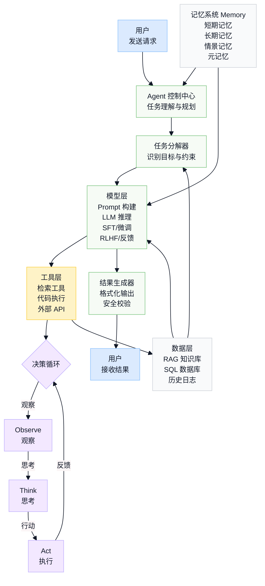

# 第一周-01：Agent开发岗位要求 & 课程安排

本文讨论了 Agent 开发岗位的要求和相关课程安排，旨在帮助学习者掌握岗位所需技能并通过面试。

## 到底要会什么

1. 到底要会什么
2. 到底要怎么学
3. 学会了之后该怎么去准备简历、面试求职

## 1. 岗位要求

从招聘信息中可以看到，Agent 开发岗位通常会覆盖以下几类能力：

- AI 应用能力：RAG、Chatbot、Agent、工具调用、工作流编排。
- 大模型能力：模型架构、SFT、强化学习或 RL 相关理解。
- 工程能力：Python/Java/Go 之一，后端服务、微服务、Docker、Redis、数据库等。
- 系统集成能力：把 RAG、Web Search、Text2SQL、Code Interpreter、MCP 等工具统一到 Agent 系统里。
- 项目经验：需要能讲清楚 Agent 项目如何从业务问题出发，如何拆模块，如何落地和优化。

### 1.1 Agent工程师到底需要什么？

**AI能力：**

- RAG
- Chatbot（调用 API）
- Agent
  - workflow 的设计（plan-action-reflect、multi-agent）
  - memory 层的设计（长期记忆）
  - tools（tool 的集成和 MCP）
- Model
  - decode-only 的架构原理
  - SFT
  - RL（可选）

**后端/部署能力：**

- RESTful API（language + framework），比如 Python + FastAPI（可以去看第四周）
- Docker
- Redis（可选）
- vLLM（会用就行）、sglang、ollama
- AI coding：trae、cursor、codex、copilot、只有 ChatGPT、Claude Code

**微服务、前后端架构：**

- 微服务架构
- 前后端分离
- 服务编排和 API 对接

**数据库：**

- SQL -> Text2SQL
- 向量数据库：Milvus
- MongoDB（可选）

### 1.2 会了这些 skills 然后呢

需要回答的核心问题：

- 为什么我们很多通过过来的时候已经有了一定基础，RAG、Agent 都懂，还是一直挂面试？
- 场景、核心的业务背景是什么？
- 遇到了哪些问题？
- 如何用 skill、什么方法解决？
- 针对遇到的什么问题，做了哪些深度的优化？
- 取得了什么量化的结果？

也就是说，不能只停留在“我会某个工具或技术点”，还要能把技术点放到真实项目背景里，讲清楚问题、方案、优化和结果。

## 2. 课程安排

先搞清楚项目背景：同第一周-02：项目背景。  
我们先看一看一个工业级的系统是怎么构成的。

把上面的知识都学会之后，我们放在 DeepResearch 的一个项目背景中：

- **模块拆解-合并**：以前的课程一般一个大型项目就讲一节课，本次我们就把一个项目完全拆解下来，以项目为主体，里面涉及到的 skill、涉及思路，一个个模块讲解清楚。
- **0 基础可直接上手**：0 基础也可以从这里开始，课程中基础讲解 + Lab 实践 + 20 周系统课程的相关内容课后阅读 + 最终合成项目中，同时最后配置项目中一个个模块的讲解视频。
- **每周内容安排**
  - 技术原理
  - Lab
  - 工业中会遇到的问题和解决方案

### 第一周：Agent的知识核心（Data Pipeline & RAG）

- **学习目标**：为 Agent 构建“感官”和“长期记忆”系统。这是所有智能决策的数据基础，是 Agent 的“图书馆”和知识沉淀体系，从传统 RAG 到 DataAgent 和长期记忆。
- **核心理论**：
  - **Agent 知识系统导论**：深入理解为何 RAG（检索增强生成）是构建可信、可控 Agent 的基石。
  - **Embedding 与向量数据库**：学习主流文本向量化模型（如 BGE、M3E）的原理与选型，并深入掌握 Milvus 向量数据库的核心架构与使用方法。
- **工程实践**：
  - **Lab 1：构建工业级 RAG 知识库管道**
    - 实现对非结构化数据的清洗、去重、多粒度切块策略。
    - 调用 Embedding 模型将文本块向量化，并存入 Milvus。
    - 设计并实现知识库的增量更新与过期淘汰机制，确保知识的时效性。
- **本周产出**：一个功能完备、可持续更新的自动化知识处理管道，并且部署为一个持久化的服务。

### 第二周：DeepResearch核心——决策循环与基础工具（Core Logic & Basic Tools）

- **学习目标**：开发 Agent 的核心“大脑”，实现智能决策与执行的核心逻辑，并集成基础的信息获取工具。
- **核心理论**：
  - **ReAct 决策模型**：深入理解“规划（Plan）-> 行动（Action）-> 反思（Reflect）”的自主决策循环，这是 Agent 智能的源泉。
  - **Function Calling/Tool Use**：学习如何通过精心设计的 Prompt 和模型能力，让 LLM 理解并调用外部工具。
  - **Agent 记忆机制**：学习短期记忆与长期记忆的设计理念。
- **工程实践**：
  - **Lab 1：实现 Agent 的 ReAct 决策引擎**
    - 开发**任务规划器（Planner）**，接收用户复杂问题，并调用 LLM 生成结构化的多步骤执行计划。
    - 开发**工具调用器（Executor）**和**反思器（Reflector）**，形成 Plan -> Act -> Reflect 的闭环。
  - **Lab 2：集成信息检索工具与短期记忆**
    - 将第一周构建的 RAG 知识库封装成 Agent 可调用的工具。
    - 集成 Web Search 工具，赋予 Agent 获取实时信息的能力。
    - 实现需求：使用 Redis 实现“短期记忆模块”，存储当前对话的上下文和任务执行的中间步骤。
  - **Lab 3：数据采集 Agent（DataAgent）**
    - 开发一个可配置的 Web 抓取器，通过定时任务持续从指定的行业网站（如财经新闻、政策发布平台）采集最新信息。
    - 实现一个 API 数据对接器，连接外部金融数据 API，将结构化信息源源不断地输入系统。
- **本周产出**：一个具备初步智能、能够结合内外知识回答问题的单体 Agent。

### 第三周：组件化集成——高级数据分析工具集成（Advanced Tools）

- **学习目标**：极大地扩展 Agent 的能力边界，使其从信息检索者进化为数据分析师和定量策略师。
- **核心理论**：
  - **Text-to-SQL 原理**：学习大模型如何将自然语言转化为精确的 SQL 查询，及其在企业数据分析中的应用。
  - **代码解释器（Code Interpreter）**：探讨其强大的数据处理、计算和可视化能力，以及安全执行代码的沙箱机制。
- **工程实践**：
  - **Lab 1：集成 Text2SQL 工具**
    - 连接到一个示例的结构化数据库（如 SQLite、PostgreSQL）。
    - 将 Text2SQL 封装成一个工具，让 Agent 能够通过自然语言查询内部业务数据。
  - **Lab 2：集成代码解释器工具**
    - 构建一个安全的执行环境来运行 Python 代码。
    - 实现需求：将代码解释器封装成工具，使其能够对其他工具返回的数据进行二次处理、数学计算和**数据可视化**（生成图表）。
- **本周产出**：一个能关联、既能检索信息又能进行深度数据分析的强大 Agent。

### 第四周：Agent进阶——多智能体协作与长期记忆（Multi-Agent & Memory）

- **学习目标**：从单体智能走向群体智能，学习如何设计和编排多个专业 Agent 协同工作，并完善其长期记忆机制。
- **核心理论**：
  - **多智能体系统（Multi-Agent System）**：学习其设计模式，如分层结构、协作模型等，理解分而治之的优势。
  - **MCP（Model Context Protocol）**：学习 MCP 作为一种通用的 Agent 间通信与工具调用协议，实现系统的解耦和可扩展性。
- **工程实践**：
  - **Lab 1：构建基于 MCP 的多智能体系统**
    - 实现需求：将系统重构为微服务架构的 **MCP Server** 和多个 **MCP Client**。
    - 定义不同角色的 Agent：如“总控 Agent”“数据检索 Agent”“数据分析 Agent”。
    - 将所有工具（RAG、Web Search、Text2SQL、Code Interpreter 等）全部封装为可独立调用的 MCP 客户端。
  - **Lab 2：实现高级长期记忆机制**
    - 实现需求：设计并实现 Agent 的长期记忆模块。当短期记忆（如对话历史）达到一定长度（例如 10000 个 token）时，自动触发一次总结，将核心洞察和知识点压缩后，存入 Milvus 向量数据库，并用总结更新短期记忆。
- **本周产出**：一个模块化、可扩展、具备长期学习能力的多智能体协作系统。

### 第五周：工程级算法——模型微调与部署上线（Fine-tuning & Deployment）

- **学习目标**：通过训练打造特定领域的“专家大脑”，并完成系统的最终部署、监控和调优，交付一个完整的工业级项目。
- **核心理论**：
  - **指令微调（SFT）**：系统学习 SFT 的完整流程，从数据收集与标注、数据集构建到模型训练与评估。
  - **（选修）进阶对齐技术**：简要介绍 DPO/RLHF 等技术，理解其如何让模型输出更符合人类偏好。
  - **Agent 生产环境运维**：学习部署、监控、日志、版本迭代等工程化落地关键环节。
- **工程实践**：
  - **Lab 1：Agent 能力指令微调（SFT）**
    - 设计并收集一批高质量的行业相关数据（问答对、工具调用轨迹）。
    - 使用开源框架（如 LLaMA Factory、Axolotl）对一个基础模型（如 Qwen、Llama）进行微调，强化其在特定领域的任务规划和工具调用能力。
  - **Lab 2：系统部署与监控**
    - 将微调后的模型部署到模型服务接口中。
    - 完善日志体系和监控仪表盘，对 Agent 在生产环境中的稳定性与性能进行调优。
  - **最终项目**：进行端到端的项目演示，展示一个完整的行业分析任务，从提出问题到 Agent 自主规划、调用多个工具、进行数据分析并生成可视化报告的全过程。
- **本周产出**：一个经过领域优化的、可部署、可监控的工业级 AI Agent，以及一个足以打动面试官的顶级简历项目。

### 第六周：高并发、高性能工程——Agent的工程化底座（Backend & Microservices）

- **学习目标**：搭建稳定、可扩展的 Agent 后端服务。这是 Agent 运行的“身体”，确保其能够 7x24 小时稳定地提供服务。
- **核心理论**：
  - **微服务架构设计**：理解为何 Agent 系统适合采用微服务，学习服务拆分、API 网关、服务间通信等核心原则。
  - **容器化与部署**：掌握 Docker 核心技术（Dockerfile、Docker Compose），实现开发、测试、生产环境的一致性。
  - **缓存的力量**：学习 Redis 在 AI 应用中的多种用途，包括结果缓存、会话管理、任务队列等。
- **工程实践**：
  - **Lab 1：基于 FastAPI 构建核心后端服务**
    - 设计并实现系统的核心 API 接口，如用户查询入口、任务状态查询等。
    - 构建模型服务接口层，统一封装对 OpenAI 兼容接口的调用，方便未来切换或增加新模型。
  - **Lab 2：系统容器化与 Redis 缓存集成**
    - 为所有后端服务编写 Dockerfile 和 Docker Compose 配置，实现一键启动整个系统。
    - 实现需求：集成 Redis，为完全相同的问题查询增加缓存机制，实现秒级响应。
  - **Lab 3：RAG评估**
- **本周产出**：一套可运行、可扩展、容器化的 Agent 后端服务框架。
