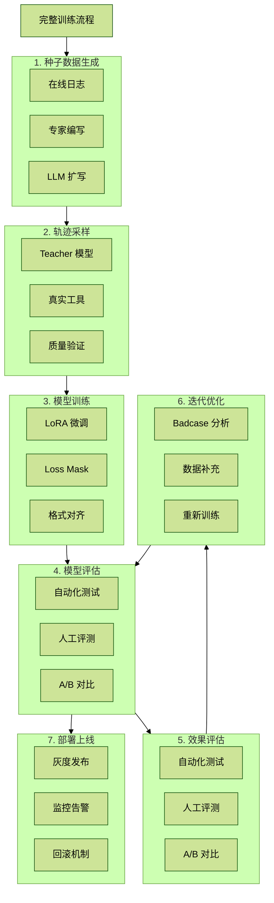
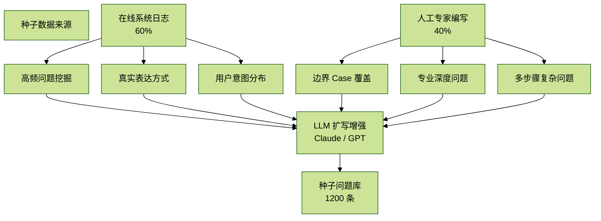
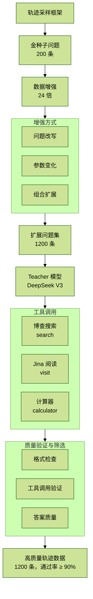

# 【Deepresearch训练】拓业智询 Deep Research Agent 完整训练手册

## 1. 概述

### 1.1 系统简介

“拓业智询”是面向银行对公业务的智能咨询助手，具备以下核心能力：

- **自主工具调用**：根据用户问题自动选择搜索、网页访问、计算器等工具
- **多步推理**：支持复杂问题的多轮工具调用和信息整合
- **思维链展示**：通过 `<think>` 标签展示推理过程
- **引用溯源**：答案标注信息来源，支持事实核查

### 1.2 训练流程总览



### 1.3 数据规模规划

| 阶段 | 数据量 | 说明 |
|---|---:|---|
| 种子问题 | 200 条 | 4 行业 × 6 类型 |
| 轨迹数据 | 1200 条 | 种子 × 24 倍增强 |
| 验证集 | 120 条 | 10% 留出（SFT 测试），学会格式，学会调用 |
| 测试集 | 50 条 | 人工标注金标准（最终的端到端测试） |

## 2. 种子数据生成

种子数据是训练的基础，其质量直接影响最终模型效果。本章详细介绍种子数据的生成流程。

### 2.1 数据来源

种子问题来自两个渠道：



### 2.2 在线系统日志提取

#### 2.2.1 日志采集

从已上线的 Deep Research 系统中提取用户真实查询：

```python
# scripts/extract_online_queries.py

"""
从在线 Deep Research 系统提取用户查询日志
"""

import json
from datetime import datetime, timedelta
from typing import List, Dict


def extract_queries_from_logs(
    log_path: str,
    start_date: str,
    end_date: str,
    min_query_length: int = 10,
    max_query_length: int = 200
) -> List[Dict]:
    """
    提取指定时间段内的用户查询

    Args:
        log_path: 日志文件路径
        start_date: 开始日期（YYYY-MM-DD）
        end_date: 结束日期（YYYY-MM-DD）
        min_query_length: 最小查询长度
        max_query_length: 最大查询长度

    Returns:
        提取的查询列表
    """
    queries = []

    with open(log_path, "r", encoding="utf-8") as f:
        for line in f:
            try:
                log_entry = json.loads(line)

                query = log_entry.get("user_query", "")
                timestamp = log_entry.get("timestamp", "")

                if not (min_query_length <= len(query) <= max_query_length):
                    continue

                log_date = timestamp[:10]
                if not (start_date <= log_date <= end_date):
                    continue

                if not is_valid_query(query):
                    continue

                queries.append({
                    "query": query,
                    "timestamp": timestamp,
                    "session_id": log_entry.get("session_id"),
                    "tool_calls": log_entry.get("tool_calls", []),
                    "user_satisfaction": log_entry.get("user_feedback", {}).get("satisfaction")
                })
            except json.JSONDecodeError:
                continue

    return queries
```

```python
def is_valid_query(query: str) -> bool:
    """验证查询是否有效"""

    invalid_patterns = [
        "测试", "test", "你好", "hello", "?", "？",
        "帮我", "请问", "我想"  # 过于简短的开头
    ]

    query_lower = query.lower().strip()

    if query_lower in invalid_patterns:
        return False

    content = query_lower
    for p in ["请问", "帮我", "我想知道", "能不能告诉我"]:
        content = content.replace(p, "")

    if len(content.strip()) < 8:
        return False

    sensitive_keywords = ["密码", "身份证", "手机号", "银行卡"]
    for kw in sensitive_keywords:
        if kw in query:
            return False

    return True


def deduplicate_queries(queries: List[Dict], similarity_threshold: float = 0.85) -> List[Dict]:
    """
    对查询进行去重。
    使用编辑距离或语义相似度，保留用户满意度更高的问题。
    """
    from difflib import SequenceMatcher

    unique_queries = []
    for q in queries:
        is_duplicate = False
        for uq in unique_queries:
            similarity = SequenceMatcher(None, q["query"], uq["query"]).ratio()
            if similarity > similarity_threshold:
                is_duplicate = True
                if (q.get("user_satisfaction") or 0) > (uq.get("user_satisfaction") or 0):
                    unique_queries.remove(uq)
                    unique_queries.append(q)
                break

        if not is_duplicate:
            unique_queries.append(q)

    return unique_queries
```

#### 2.2.2 高频问题挖掘

初始标签怎么来？

> 一开始认为构造，然后 LLM 提取，留一个选项是无标签，再次对无标签的数据认为归纳。

```python
# scripts/analyze_query_patterns.py

"""
分析查询模式，挖掘高频问题类型
"""

from collections import Counter
from typing import List, Dict, Tuple
import re


INDUSTRY_KEYWORDS = {
    "finance": ["金融", "银行", "贷款", "融资", "理财", "投资", "证券", "保险", "基金"],
    "catering": ["餐饮", "餐厅", "饭店", "外卖", "美食", "厨房", "食材", "菜品"],
    "startup": ["创业", "创新", "孵化", "融资", "天使", "VC", "股权", "估值"],
    "smart_transport": ["交通", "物流", "运输", "车联网", "自动驾驶", "智慧出行"]
}

QUESTION_TYPE_KEYWORDS = {
    "policy": ["政策", "法规", "规定", "条例", "通知", "文件", "补贴", "扶持"],
    "market": ["市场", "趋势", "行情", "规模", "增长", "前景", "预测"],
    "competitor": ["竞争", "对手", "竞品", "同行", "对比", "优势", "劣势"],
    "calculation": ["计算", "多少", "费用", "成本", "利息", "月供", "利率"],
    "risk": ["风险", "隐患", "问题", "挑战", "困难", "障碍"],
    "expansion": ["扩张", "拓展", "发展", "规划", "战略", "布局"]
}


def classify_query(query: str) -> Tuple[str, str]:
    """对查询进行行业和类型分类"""

    industry = "unknown"
    max_industry_score = 0
    for ind, keywords in INDUSTRY_KEYWORDS.items():
        score = sum(1 for kw in keywords if kw in query)
        if score > max_industry_score:
            max_industry_score = score
            industry = ind

    question_type = "unknown"
    max_type_score = 0
    for qtype, keywords in QUESTION_TYPE_KEYWORDS.items():
        score = sum(1 for kw in keywords if kw in query)
        if score > max_type_score:
            max_type_score = score
            question_type = qtype

    return industry, question_type
```

```python
def analyze_distribution(queries: List[Dict]) -> Dict:
    """分析查询分布"""

    industry_counter = Counter()
    type_counter = Counter()
    cross_counter = Counter()  # 行业 × 类型

    for q in queries:
        industry, qtype = classify_query(q["query"])
        q["industry"] = industry
        q["question_type"] = qtype

        industry_counter[industry] += 1
        type_counter[qtype] += 1
        cross_counter[(industry, qtype)] += 1

    return {
        "by_industry": dict(industry_counter),
        "by_type": dict(type_counter),
        "cross_distribution": dict(cross_counter),
        "total": len(queries)
    }


def select_representative_queries(
    queries: List[Dict],
    target_per_cell: int = 8
) -> List[Dict]:
    """
    按行业 × 类型矩阵选取代表性问题。
    确保覆盖均衡。
    """

    grouped = {}
    for q in queries:
        key = (q.get("industry", "unknown"), q.get("question_type", "unknown"))
        if key not in grouped:
            grouped[key] = []
        grouped[key].append(q)

    selected = []
    for (industry, qtype), group_queries in grouped.items():
        if industry == "unknown" or qtype == "unknown":
            continue

        sorted_queries = sorted(
            group_queries,
            key=lambda x: x.get("user_satisfaction") or 0,
            reverse=True
        )
        selected.extend(sorted_queries[:target_per_cell])

    return selected
```

#### 2.2.3 日志提取流程

```bash
# 1. 提取近 3 个月的用户查询
python scripts/extract_online_queries.py \
  --log-path /data/logs/deepresearch/ \
  --start-date 2024-10-01 \
  --end-date 2024-12-31 \
  --output data/raw_queries.jsonl

# 2. 去重和过滤
python scripts/analyze_query_patterns.py \
  --input data/raw_queries.jsonl \
  --output data/filtered_queries.jsonl \
  --min-satisfaction 3

# 3. 按分布选取
python scripts/select_queries.py \
  --input data/filtered_queries.jsonl \
  --output data/online_seeds.jsonl \
  --per-cell 5  # 每个行业 × 类型格子取 5 条
```

预期产出：**约 120 条来自在线系统的种子问题（60%）**。

### 2.3 人工专家编写

#### 2.3.1 专家编写指南

人工编写的问题主要覆盖以下场景：

| 场景 | 说明 | 数量 |
|---|---|---:|
| 边界 Case | 在线系统未覆盖的极端情况 | 20 条 |
| 专业深度 | 需要深入行业知识的问题 | 30 条 |
| 多步骤 | 需要 2 步以上工具调用的复杂问题 | 20 条 |
| 计算类 | 涉及精确数值计算的问题 | 10 条 |

#### 2.3.2 专家编写模板

```markdown
## 种子问题编写模板

### 基本信息
- 行业：[finance/catering/startup/smart_transport]
- 类型：[policy/market/competitor/calculation/risk/expansion]
- 难度：[简单/中等/复杂]
- 预期工具调用：[search/visit/calculator] × N

### 问题内容
[企业端写问题，要求：]
1. 问题长度 15-100 字
2. 语言自然，符合真实用户表达习惯
3. 问题意图明确，不含歧义
4. 避免过于宽泛或过于具体

### 预期答案要点
- 要点1：...
- 要点2：...
- 要点3：...

### 参考信息来源
- 来源1：[URL或文献]
- 来源2：[URL或文献]
```

#### 2.3.3 专家编写示例

```json
{
  "industry": "finance",
  "question_type": "calculation",
  "difficulty": "中等",
  "query": "我想申请一笔经营贷，额度300万，银行报价年利率4.35%，贷款期限5年，采用等额本息还款方式，请帮我计算每月还款额和总利息是多少？",
  "expected_tools": ["calculator"],
  "expected_steps": 2,
  "answer_points": [
    "月供约 5,567.79 元",
    "总利息约 34,067.4 元",
    "总还款额约 334,067.4 元"
  ],
  "author": "金融专家A",
  "create_date": "2024-12-15"
}
```

### 2.4 LLM 扩写增强

使用 Claude 对现有种子问题进行扩写和变体生成。

#### 2.4.1 扩写 Prompt

```python
EXPANSION_PROMPT = """你是一个银行对公业务咨询专家。现在需要你基于给定的种子问题，生成多个变体问题。

## 种子问题
{seed_query}

## 行业：{industry}
## 问题类型：{question_type}

## 要求
请生成 5 个变体问题，每个变体需要：
1. 保持相同的核心意图
2. 使用不同的表达方式
3. 可以改变具体参数（时间、金额、地点等）
4. 语言自然，符合真实用户习惯

## 变体类型
1. 表述改写：用不同的词汇和句式表达相同意思
2. 参数变化：改变时间、金额、比例等具体数值
3. 场景迁移：将问题迁移到相似但不同的场景
4. 深度延伸：在原问题基础上追问更深入的细节
5. 组合扩展：将原问题与相关问题组合

## 输出格式
请以 JSON 数组格式输出：
[
  {
    "variant_type": "表述改写",
    "query": "变体问题内容",
    "changes": "说明与原问题的差异"
  }
]
"""
```

#### 2.4.2 扩写脚本

```python
# scripts/expand_seeds_with_llm.py

import json
import os
from openai import OpenAI
from typing import List, Dict


def expand_seed_with_llm(
    seed: Dict,
    client: OpenAI,
    num_variants: int = 5
) -> List[Dict]:
    """使用 LLM 扩写种子问题"""

    prompt = EXPANSION_PROMPT.format(
        seed_query=seed["query"],
        industry=seed.get("industry", "unknown"),
        question_type=seed.get("question_type", "unknown")
    )

    response = client.chat.completions.create(
        model="claude-sonnet-4-20250514",
        messages=[{"role": "user", "content": prompt}],
        max_tokens=2000,
        temperature=0.8
    )

    content = response.choices[0].message.content

    try:
        json_match = re.search(r"\[[\s\S]*\]", content)
        if json_match:
            variants = json.loads(json_match.group())
            for v in variants:
                v["source_seed"] = seed["query"]
                v["industry"] = seed.get("industry")
                v["question_type"] = seed.get("question_type")
            return variants
    except json.JSONDecodeError:
        pass

    return []
```

```python
def batch_expand_seeds(
    seeds: List[Dict],
    output_path: str,
    variants_per_seed: int = 5
) -> List[Dict]:
    """批量扩写种子问题"""

    client = OpenAI(
        # 凭据从环境变量读取，此处按安全要求省略具体变量名
        base_url="https://api.anthropic.com/v1"
    )

    all_expanded = []
    for i, seed in enumerate(seeds):
        print(f"扩写进度: {i+1}/{len(seeds)}")

        variants = expand_seed_with_llm(seed, client, variants_per_seed)
        all_expanded.extend(variants)

        if (i + 1) % 10 == 0:
            with open(output_path, "w", encoding="utf-8") as f:
                for item in all_expanded:
                    f.write(json.dumps(item, ensure_ascii=False) + "\n")

    return all_expanded
```

### 2.5 种子数据整合

#### 2.5.1 数据合并与去重

```python
"""
合并所有种子数据来源
"""

import json
from typing import List, Dict
from difflib import SequenceMatcher


def merge_all_seeds(
    online_seeds_path: str,
    expert_seeds_path: str,
    expanded_seeds_path: str,
    output_path: str,
    target_count: int = 200
) -> List[Dict]:
    """
    合并所有来源的种子数据。

    优先级：
    1. 专家编写（质量最高）
    2. 在线高满意度（真实性最强）
    3. LLM 扩写（覆盖度最广）
    """

    def load_jsonl(path):
        data = []
        with open(path, "r", encoding="utf-8") as f:
            for line in f:
                if line.strip():
                    data.append(json.loads(line))
        return data

    expert_seeds = load_jsonl(expert_seeds_path)
    online_seeds = load_jsonl(online_seeds_path)
    expanded_seeds = load_jsonl(expanded_seeds_path)

    for s in expert_seeds:
        s["source"] = "expert"
        s["priority"] = 1
    for s in online_seeds:
        s["source"] = "online"
        s["priority"] = 2
    for s in expanded_seeds:
        s["source"] = "llm_expanded"
        s["priority"] = 3

    all_seeds = expert_seeds + online_seeds + expanded_seeds

    unique_seeds = deduplicate_by_priority(all_seeds)
    selected = balance_selection(unique_seeds, target_count)

    with open(output_path, "w", encoding="utf-8") as f:
        for s in selected:
            f.write(json.dumps(s, ensure_ascii=False) + "\n")

    return selected
```

```python
def deduplicate_by_priority(seeds: List[Dict], threshold: float = 0.8) -> List[Dict]:
    """去重，保留优先级高的"""

    sorted_seeds = sorted(seeds, key=lambda x: x.get("priority", 99))
    unique = []
    for s in sorted_seeds:
        is_dup = False
        for u in unique:
            sim = SequenceMatcher(None, s["query"], u["query"]).ratio()
            if sim > threshold:
                is_dup = True
                break
        if not is_dup:
            unique.append(s)

    return unique


def balance_selection(seeds: List[Dict], target: int) -> List[Dict]:
    """均衡选取，确保行业 × 类型覆盖"""

    target_per_cell = target // 24  # 4 行业 × 6 类型

    cells = {}
    for s in seeds:
        key = (s.get("industry", "unknown"), s.get("question_type", "unknown"))
        if key not in cells:
            cells[key] = []
        cells[key].append(s)

    selected = []
    for key, group in cells.items():
        sorted_group = sorted(group, key=lambda x: x.get("priority", 99))
        selected.extend(sorted_group[:target_per_cell + 1])

    if len(selected) < target:
        remaining = [s for s in seeds if s not in selected]
        remaining.sort(key=lambda x: x.get("priority", 99))
        selected.extend(remaining[:target - len(selected)])

    return selected[:target]
```

### 2.6 种子数据质量检查

#### 2.6.1 自动检查脚本

```python
"""
种子数据质量检查
"""

import json
from typing import List, Dict, Tuple


def validate_seed(seed: Dict) -> Tuple[bool, List[str]]:
    """
    验证单条种子数据。

    Returns:
        (is_valid, error_messages)
    """
    errors = []

    query = seed.get("query", "")

    if len(query) < 10:
        errors.append(f"问题过短：{len(query)} 字")
    if len(query) > 200:
        errors.append(f"问题过长：{len(query)} 字")

    if not query.endswith(("?", "？", "。", "！", "!")):
        errors.append("问题应以标点结尾")

    valid_industries = ["finance", "catering", "startup", "smart_transport"]
    if seed.get("industry") not in valid_industries:
        errors.append(f"无效行业标签：{seed.get('industry')}")

    valid_types = ["policy", "market", "competitor", "calculation", "risk", "expansion"]
    if seed.get("question_type") not in valid_types:
        errors.append(f"无效类型标签：{seed.get('question_type')}")

    sensitive_words = ["密码", "身份证号", "银行卡号", "手机号"]
    for sw in sensitive_words:
        if sw in query:
            errors.append(f"包含敏感词：{sw}")

    filter_words = ["请问", "帮我", "我想知道", "能不能"]
    content = query
    for fw in filter_words:
        content = content.replace(fw, "")
    if len(content.strip()) < 8:
        errors.append("实质内容过少")

    return len(errors) == 0, errors
```

```python
def validate_all_seeds(seeds_path: str) -> Dict:
    """验证所有种子数据"""

    with open(seeds_path, "r", encoding="utf-8") as f:
        seeds = [json.loads(line) for line in f if line.strip()]

    valid_count = 0
    invalid_seeds = []

    for i, seed in enumerate(seeds):
        is_valid, errors = validate_seed(seed)
        if is_valid:
            valid_count += 1
        else:
            invalid_seeds.append({
                "index": i,
                "query": seed.get("query", "")[:50],
                "errors": errors
            })

    return {
        "total": len(seeds),
        "valid": valid_count,
        "invalid": len(invalid_seeds),
        "pass_rate": valid_count / len(seeds) * 100,
        "invalid_samples": invalid_seeds[:10]
    }
```

#### 2.6.2 执行检查

```bash
# 运行质量检查
python scripts/validate_seeds.py \
  --input data/final_seeds.jsonl \
  --report data/seed_validation_report.json

# 查看报告
cat data/seed_validation_report.json | python -m json.tool
```

质量要求：通过率 ≥ 95%。

### 2.7 种子数据文件格式

最终种子数据文件格式：

```json
{"query": "2025年餐饮行业有哪些税收优惠政策？", "industry": "catering", "question_type": "policy", "source": "online", "difficulty": "简单", "expected_tools": ["search", "visit"], "expected_steps": 3}
{"query": "申请经营贷300万，年利率4.35%，5年等额本息，月供多少？", "industry": "finance", "question_type": "calculation", "source": "expert", "difficulty": "中等", "expected_tools": ["calculator"], "expected_steps": 2}
```

### 2.8 种子数据分布统计

最终种子数据应满足以下分布。

#### 按来源分布

| 来源 | 数量 | 占比 |
|---|---:|---:|
| 在线系统（online） | 120 | 60% |
| 专家编写（expert） | 80 | 40% |
| 合计 | 200 | 100% |

#### 按行业 × 类型分布（实际）

| 行业 \ 类型 | policy | market | competitor | calculation | risk | expansion |
|---|---:|---:|---:|---:|---:|---:|
| finance | 8 | 8 | 8 | 8 | 8 | 8 |
| catering | 8 | 8 | 8 | 8 | 8 | 8 |
| startup | 8 | 8 | 8 | 8 | 8 | 8 |
| smart_transport | 8 | 8 | 8 | 8 | 12 | 12 |
| 小计 | 32 | 32 | 32 | 32 | 36 | 36 |

#### 按复杂度分布

| 复杂度 | 数量 | 占比 | 预期工具调用 |
|---|---:|---:|---|
| simple | 28 | 14% | 1-2 步（直接计算） |
| medium | 96 | 48% | 2 步（搜索→结果） |
| complex | 76 | 38% | 3+ 步（搜索→访问→结果） |
| 合计 | 200 | 100% | - |

## 3. 轨迹数据采样

轨迹数据是模型学习工具调用行为的核心训练素材。本章介绍如何从 50 条种子问题生成 1200 条高质量轨迹。

### 3.1 采样策略概述



### 3.2 数据增强策略

从 200 条种子问题扩展到 1200 条，采用多层增强策略。

#### 3.2.1 问题改写

使用 LLM 生成同一问题的多种表达方式：

```python
# scripts/augment_questions.py

REWRITE_PROMPT = """你是一个银行对公业务专家。请将以下问题改写为 8 种不同的表达方式。

原问题：{original_question}
行业：{industry}
类型：{question_type}

要求：
1. 保持核心意图不变
2. 使用不同的词汇、句式、语气
3. 模拟不同类型用户的表达习惯（专业/口语化/正式/简洁）
4. 长度可以有变化（15-80字）

输出 JSON 数组：
[
  {"variant": "改写1", "style": "专业"},
  {"variant": "改写2", "style": "口语"},
  ...
]
"""
```

示例：

```text
原始问题：餐饮行业最近有什么食品安全方面的新规定？

改写变体：
1. [专业] 请问2025年餐饮业食品安全监管有哪些政策更新？
2. [口语] 开餐厅的话，食品安全方面现在要注意啥新规定？
3. [简洁] 餐饮食安新规有哪些？
4. [详细] 我客户想开连锁餐厅，最新的食品安全法规有什么变化需要注意？
5. [场景化] 打算加盟一个餐饮品牌，食品安全证照方面有新要求吗？
6. [对比式] 和去年比，今年餐饮食品安全检查有什么不同？
7. [问题导向] 餐厅被食品安全检查，现在主要查什么项目？
8. [数据导向] 餐饮业食品安全合规的最新标准和处罚力度是怎样的？
```

#### 3.2.2 参数变化（2倍扩展）

修改问题中的具体参数（时间、金额、地点等）：

```python
PARAM_VARIATION_RULES = {
    # 时间参数
    "time": ["2025年", "2024年", "今年", "最近", "近期"],

    # 金额参数
    "amount": ["100万", "200万", "300万", "500万", "1000万"],

    # 利率参数
    "rate": ["4.35%", "4.5%", "5%", "5.6%", "6%"],

    # 期限参数
    "period": ["1年", "2年", "3年", "5年", "10年"],

    # 地域参数
    "region": ["北京", "上海", "深圳", "杭州", "成都", "二三线城市"],

    # 行业细分
    "sub_industry": {
        "catering": ["火锅", "奶茶", "快餐", "正餐", "烘焙"],
        "finance": ["供应链金融", "消费金融", "小微贷款", "普惠金融"],
        "startup": ["AI", "SaaS", "硬科技", "消费", "出海"],
        "smart_transport": ["网约车", "充电桩", "自动驾驶", "物流配送"]
    }
}
```

#### 3.2.3 组合扩展（1.5倍扩展）

将单一问题扩展为组合问题或追问：

```python
COMBINATION_TEMPLATES = [
    # 追问模板
    "{original}另外，{follow_up}",
    "{original}顺便问一下，{related}",

    # 组合模板
    "我想了解两个问题：一是{q1}，二是{q2}",
    "{original}同时帮我计算一下{calculation}",

    # 深入模板
    "{original}能详细说说{detail_aspect}吗？",
    "除了{original}，还有什么{additional_aspect}？"
]
```

### 3.3 Teacher 模型调用

使用 DeepSeek V3 作为 Teacher 模型生成轨迹。

#### 3.3.1 System Prompt

```python
SYSTEM_PROMPT = """你是拓业智询，银行对公客户经理的智能助手。

## 可用工具

1. search - 搜索信息
   参数：{"query": "搜索关键词"}

2. visit - 访问网页获取详情
   参数：{"url": "网页地址", "goal": "获取目标"}

3. calculator - 数学计算
   参数：{"expression": "计算表达式"}

4. finish - 输出最终答案
   参数：{"answer": "答案内容", "references": ["来源1", "来源2"]}

## 输出格式

每次回复必须包含：
1. <think> 标签包裹的思考过程
2. <tool_call> 标签包裹的工具调用（JSON格式）

示例：
<think>
用户询问餐饮政策，我需要搜索最新的餐饮行业政策信息。
</think>

<tool_call>
{"name": "search", "arguments": {"query": "2025年餐饮行业政策"}}
</tool_call>

## 注意事项
1. 每次只调用一个工具
2. 最多调用3次工具后必须finish
3. 答案要有引用标注[1][2]
"""
```

#### 3.3.2 轨迹生成脚本

```python
# scripts/synthesize_trajectories_v3.py

import json
import requests
from typing import Dict, List
from concurrent.futures import ThreadPoolExecutor
from tqdm import tqdm


class TrajectoryGenerator:
    def __init__(
        self,
        teacher_model: str = "deepseek-v3",
        search_auth=None,
        reader_auth=None,
        max_turns: int = 5
    ):
        self.teacher_model = teacher_model
        self.search_auth = search_auth
        self.reader_auth = reader_auth
        self.max_turns = max_turns

    def generate_trajectory(self, question: Dict) -> Dict:
        """为单个问题生成完整轨迹"""

        messages = [
            {"role": "system", "content": SYSTEM_PROMPT},
            {"role": "user", "content": question["query"]}
        ]

        trajectory = {
            "question_id": question.get("id"),
            "question": question["query"],
            "industry": question.get("industry"),
            "question_type": question.get("question_type"),
            "messages": messages.copy()
        }

        for turn in range(self.max_turns):
            response = self._call_teacher(messages)
            messages.append({"role": "assistant", "content": response})
            trajectory["messages"].append({"role": "assistant", "content": response})

            tool_call = self._parse_tool_call(response)
            if not tool_call:
                break

            if tool_call["name"] == "finish":
                break

            tool_result = self._execute_tool(tool_call)
            messages.append({"role": "tool", "content": tool_result})
            trajectory["messages"].append({"role": "tool", "content": tool_result})

        trajectory["is_valid"] = self._validate_trajectory(trajectory)
        return trajectory
```

```python
    def _call_teacher(self, messages: List[Dict]) -> str:
        """调用 Teacher 模型"""
        response = requests.post(
            "https://api.deepseek.com/v1/chat/completions",
            headers={"Authorization": "<redacted>"},
            json={
                "model": self.teacher_model,
                "messages": messages,
                "temperature": 0.7,
                "max_tokens": 2000
            }
        )
        return response.json()["choices"][0]["message"]["content"]

    def _parse_tool_call(self, response: str) -> Dict:
        """解析工具调用"""
        import re
        match = re.search(r"<tool_call>\s*(\{.*?\})\s*</tool_call>", response, re.DOTALL)
        if match:
            return json.loads(match.group(1))
        return None

    def _execute_tool(self, tool_call: Dict) -> str:
        """执行工具调用"""
        name = tool_call["name"]
        args = tool_call.get("arguments", {})

        if name == "search":
            return self._execute_search(args["query"])
        elif name == "visit":
            return self._execute_visit(args["url"], args.get("goal", ""))
        elif name == "calculator":
            return self._execute_calculator(args["expression"])
        else:
            return f"未知工具：{name}"
```

```python
    def _execute_search(self, query: str) -> str:
        """执行搜索"""
        response = requests.get(
            "https://api.bochaai.com/v1/web-search",
            params={"q": query, "count": 5},
            headers={"Authorization": "<redacted>"}
        )
        results = response.json().get("web_results", [])
        return json.dumps(results[:5], ensure_ascii=False)

    def _execute_visit(self, url: str, goal: str) -> str:
        """访问网页"""
        response = requests.get(
            f"https://r.jina.ai/{url}",
            headers={"Authorization": "<redacted>"}
        )
        content = response.text[:3000]
        return content

    def _execute_calculator(self, expression: str) -> str:
        """执行计算"""
        try:
            allowed_chars = set("0123456789+-*/().% ")
            if all(c in allowed_chars for c in expression):
                result = eval(expression)
                return f"计算结果：{result}"
            else:
                return "表达式包含不允许的字符"
        except Exception as e:
            return f"计算错误：{str(e)}"
```

```python
    def _validate_trajectory(self, trajectory: Dict) -> bool:
        """验证轨迹质量"""
        messages = trajectory["messages"]

        has_finish = any(
            "finish" in msg.get("content", "")
            for msg in messages if msg["role"] == "assistant"
        )
        if not has_finish:
            return False

        tool_calls = sum(
            1 for msg in messages
            if msg["role"] == "assistant" and "<tool_call>" in msg.get("content", "")
        )
        if tool_calls > 4:
            return False

        has_think = any(
            "<think>" in msg.get("content", "")
            for msg in messages if msg["role"] == "assistant"
        )
        if not has_think:
            return False

        return True


def batch_generate(
    questions: List[Dict],
    output_path: str,
    num_threads: int = 8
) -> List[Dict]:
    """批量生成轨迹"""

    generator = TrajectoryGenerator(
        search_auth=os.getenv("SEARCH_AUTH"),
        reader_auth=os.getenv("READER_AUTH")
    )

    trajectories = []
    with ThreadPoolExecutor(max_workers=num_threads) as executor:
        futures = [
            executor.submit(generator.generate_trajectory, q)
            for q in questions
        ]

        for future in tqdm(futures, desc="生成轨迹"):
            try:
                traj = future.result()
                trajectories.append(traj)

                with open(output_path, "a", encoding="utf-8") as f:
                    f.write(json.dumps(traj, ensure_ascii=False) + "\n")
            except Exception as e:
                print(f"生成失败：{e}")

    return trajectories
```

#### 3.3.3 执行命令

```bash
# 生成 1200 条轨迹（200种子 × 6变体）
python scripts/synthesize_trajectories_v3.py \
  --seed-file src/data/seed_questions_v2.py \
  --augment-factor 24 \
  --output data/trajectories_raw.jsonl \
  --threads 8

# 预计耗时：3-4小时（取决于 API 速度）
```

### 3.4 质量验证与筛选

#### 3.4.1 自动验证规则

```python
# scripts/validate_data_v2.py

VALIDATION_RULES = {
    "format_check": {
        "has_system": True,
        "has_user": True,
        "has_assistant": True,
        "has_finish": True,
        "has_think": True
    },
    "tool_call_check": {
        "max_calls": 4,
        "min_calls": 1,
        "valid_tools": ["search", "visit", "calculator", "finish"]
    },
    "content_check": {
        "min_answer_length": 50,
        "has_references": True,
        "no_error_messages": True
    }
}
```

```python
def validate_trajectory(traj: Dict) -> Tuple[bool, List[str]]:
    """验证单条轨迹"""
    errors = []

    messages = traj.get("messages", [])

    roles = [m["role"] for m in messages]
    if "system" not in roles:
        errors.append("缺少 system 消息")
    if "user" not in roles:
        errors.append("缺少 user 消息")
    if "assistant" not in roles:
        errors.append("缺少 assistant 消息")

    assistant_msgs = [m for m in messages if m["role"] == "assistant"]
    tool_calls = []
    for msg in assistant_msgs:
        content = msg.get("content", "")
        if "<tool_call>" in content:
            match = re.search(r'"name":\s*"(\w+)"', content)
            if match:
                tool_calls.append(match.group(1))

    if not tool_calls:
        errors.append("没有工具调用")
    elif tool_calls[-1] != "finish":
        errors.append("最后一个工具不是 finish")
    elif len(tool_calls) > 4:
        errors.append(f"工具调用次数过多：{len(tool_calls)}")

    finish_content = ""
    for msg in assistant_msgs:
        if '"finish"' in msg.get("content", ""):
            match = re.search(r'"answer":\s*"([^"]+)"', msg["content"])
            if match:
                finish_content = match.group(1)

    if len(finish_content) < 50:
        errors.append(f"答案过短：{len(finish_content)} 字")

    return len(errors) == 0, errors
```

#### 3.4.2 验证与筛选执行

```bash
# 验证数据
python scripts/validate_data_v2.py \
  --input data/trajectories_raw.jsonl \
  --output data/validation_report.json

# 筛选通过的数据
python scripts/filter_valid.py \
  --input data/trajectories_raw.jsonl \
  --output data/trajectories_valid.jsonl

# 预期通过率：≥90%（1080+ 条）
```

### 3.5 格式标准化

将 Teacher 模型生成的格式统一为 Qwen3 原生格式。

#### 3.5.1 标准化规则

| 原格式 | 目标格式 | 说明 |
|---|---|---|
| `<name>search</name>` | `"name": "search"` | XML → JSON |
| `role: tool_response` | `role: tool` | 角色统一 |
| 无 think | 添加 `<think>` | 补充思考标签 |

### 3.6 训练数据分布（1200条）

#### 3.6.1 按行业分布

| 行业 | 种子问题 | 增强倍数 | 训练样本 | 占比 |
|---|---:|---:|---:|---:|
| 金融服务（finance） | 12 | ×24 | 288 | 24% |
| 餐饮服务（catering） | 13 | ×24 | 312 | 26% |
| 创业创新（startup） | 12 | ×24 | 288 | 24% |
| 智慧交通（smart_transport） | 13 | ×24 | 312 | 26% |
| 合计 | 50 | - | 1200 | 100% |

#### 3.6.2 按问题类型分布

| 问题类型 | 种子问题 | 训练样本 | 占比 |
|---|---:|---:|---:|
| 政策解读（policy） | 8 | 192 | 16% |
| 市场分析（market） | 8 | 192 | 16% |
| 竞品情报（competitor） | 8 | 192 | 16% |
| 数据计算（calculation） | 8 | 192 | 16% |
| 风险评估（risk） | 9 | 216 | 18% |
| 扩张建议（expansion） | 9 | 216 | 18% |
| 合计 | 50 | 1200 | 100% |

#### 3.6.3 按工具调用步数分布

| 调用步数 | 样本数 | 占比 | 典型场景 |
|---|---:|---:|---|
| 1步（finish only） | 36 | 3% | 简单知识问答 |
| 2步（tool → finish） | 312 | 26% | 单次搜索或计算 |
| 3步（tool × 2 → finish） | 528 | 44% | 搜索后访问详情 |
| 4步（tool × 3 → finish） | 252 | 21% | 多源信息整合 |
| 5步（tool × 4 → finish） | 72 | 6% | 复杂综合分析 |
| 合计 | 1200 | 100% | - |

## 4. 安全与脱敏说明

截图中的工具调用代码包含外部服务凭据读取和请求头示例。本文档保留训练流程、数据结构和执行逻辑，但将具体凭据变量名、鉴权头内容统一替换为 `<redacted>` 或 `*_auth`，避免在原始知识库中留下可被误复制的敏感字段形态。
