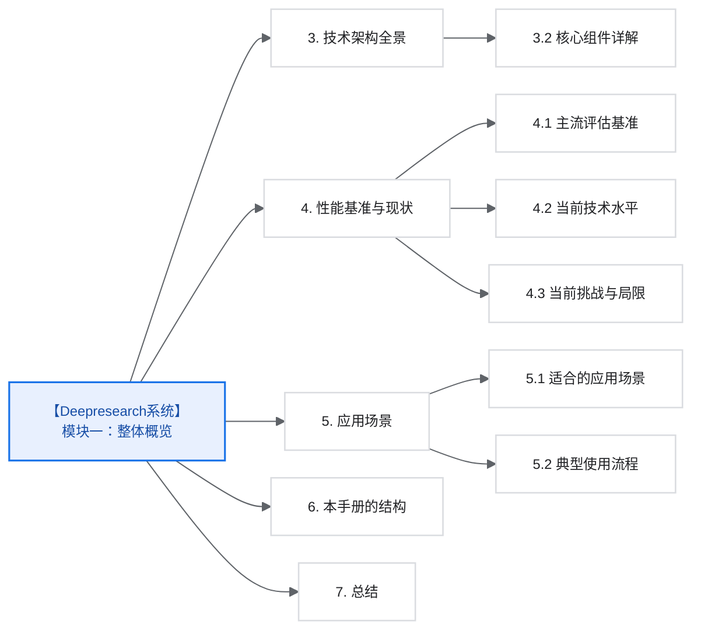
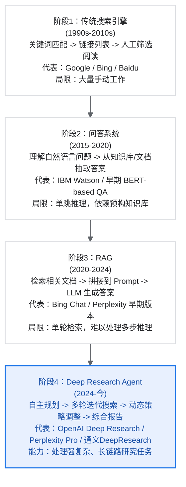
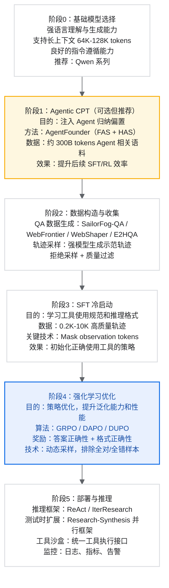
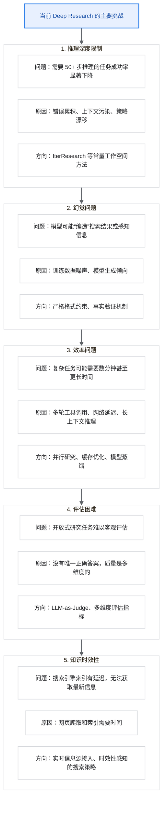
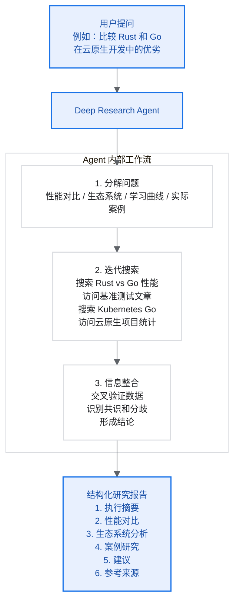

# 【Deepresearch系统】模块一：整体概览

> Deep Research Agent 的背景、定义、能力边界与技术全景

## 目录



## 1. 背景与动机

### 1.1 从搜索到研究：信息获取范式的演进

人类获取信息的方式经历了几个关键阶段：



### 1.2 为什么需要 Deep Research Agent？

现实场景中的复杂信息需求：

| 场景 | 传统方法的困境 | Deep Research 的解决方案 |
| --- | --- | --- |
| 学术研究 | 需要阅读数十篇论文，手动整理文献综述 | 自动检索、阅读、分析、综合成报告 |
| 商业尽调 | 分散在多个数据源的公司信息 | 跨源检索、交叉验证、生成调研报告 |
| 技术调研 | 需要对比多个方案的优劣 | 多角度搜索、实际测试、综合评估 |
| 事实核查 | 需要追溯信息源头验证真伪 | 多跳追溯、交叉验证、标注可信度 |
| 复杂问答 | 答案分散在多个网页的不同位置 | 迭代搜索、信息聚合、推理整合 |

一个具体例子：

> 问题：比较 2024 年全球前五大电动汽车制造商在固态电池技术上的投资和进展

传统 RAG 的处理：

1. 搜索“电动车制造商 固态电池”
2. 返回几篇相关文章
3. 生成一个可能不完整或过时的答案

Deep Research Agent 的处理：

1. 首先确定 2024 年全球前五大电动汽车制造商（特斯拉、比亚迪、大众、通用、现代等）
2. 分别搜索每家公司的固态电池战略
3. 查找各公司的研发投入数据
4. 搜索最新的技术突破新闻
5. 交叉验证不同来源的信息
6. 如果信息不足，调整搜索策略
7. 综合所有信息，生成结构化对比报告

## 2. Deep Research Agent 的定义

### 2.1 正式定义

Deep Research Agent 是一种能够自主进行复杂信息检索和研究任务的 AI 系统，它结合了：

- 大语言模型（LLM）的推理和生成能力
- Agent 架构的规划和执行能力
- 工具使用的环境交互能力
- 长程记忆的信息管理能力

形式化定义：

```text
Deep Research Agent = f(LLM, Tools, Memory, Policy)

其中：
- LLM：核心推理引擎，负责理解、规划、生成
- Tools：与外部世界交互的能力（搜索、浏览、计算等）
- Memory：管理长程上下文和中间结果
- Policy：决定何时采取何种行动的策略，可抽象为 DAG
```

### 2.2 与相关概念的区分

| 概念 | 定义 | 与 Deep Research Agent 的关系 |
| --- | --- | --- |
| RAG | 检索增强生成，单轮检索后生成 | Deep Research 是多轮迭代的 RAG |
| Agentic RAG | 具有决策能力的 RAG | Deep Research 是 Agentic RAG 的一种实现 |
| Web Agent | 能在网页上执行操作的 AI | Deep Research 专注于信息检索，是 Web Agent 的子集 |
| ReAct Agent | 思考-行动-观察循环的 Agent | Deep Research 通常基于 ReAct，但有增强 |
| Research Assistant | 辅助人类研究的工具 | Deep Research 追求自主完成研究任务 |

### 2.3 核心能力边界

Deep Research Agent 能做什么：

1. 信息检索与综合
   - 多轮迭代搜索
   - 多源信息聚合
   - 交叉验证事实
   - 生成研究报告

2. 复杂推理
   - 多跳推理（A -> B -> C -> 答案）
   - 条件推理（如果……则……）
   - 比较推理（A vs B）
   - 数值计算和分析

3. 动态规划
   - 根据中间结果调整策略
   - 识别信息缺口
   - 探索新的信息路径

Deep Research Agent 不能或不应该做什么：

1. 不是知识库：不存储事实，每次都需要实时检索
2. 不保证 100% 准确：受限于信息源质量和推理能力
3. 不适合时效性极强的任务：搜索引擎索引有延迟
4. 不适合需要专业工具的任务：如编程、数据分析等需要集成相应工具

## 3. 技术架构全景

### 3.1 端到端训练流程

构建一个 Deep Research Agent 需要经历以下阶段：



### 3.2 核心组件详解

#### 组件1：数据引擎

数据引擎负责生成高质量的训练数据，这是 Deep Research Agent 成功的基础。

为什么数据如此重要？

- 复杂研究任务的训练数据稀缺
- 现有 benchmark（如 HotpotQA）过于简单
- 需要覆盖真实世界的复杂度和多样性

数据引擎的核心方法：

| 方法           | 核心思想            | 优势           | 适用场景   |
| ------------ | --------------- | ------------ | ------ |
| SailorFog-QA | 基于知识图谱随机游走生成 QA | 高不确定性，需要深度推理 | 复杂多跳问答 |
| WebFrontier  | 迭代式复杂度升级        | 可控的难度递增      | 渐进式训练  |
| WebShaper    | 形式化驱动推理结构       | 精确控制推理链      | 结构化推理  |
| E2HQA        | 从简单问题演化到复杂问题    | 保证答案一致性      | 快速数据扩充 |

#### 组件2：Agent 框架

Agent 框架定义了模型如何与环境交互。

ReAct 框架（基础）：

```text
Think -> Action -> Observation -> Think -> Action -> ...
```

- 优点：简单直观，易于实现
- 缺点：历史信息累积，长上下文溢出

IterResearch 框架（进阶）：

```text
[Question, Report, Last_Action, Last_Response]
    -> Think
    -> Updated_Report
    -> Action
```

- 优点：常量大小工作空间，支持无限深度研究
- 核心创新：滚动报告作为中央记忆

#### 组件3：训练系统

训练系统负责将原始数据转化为有效的模型能力。

为什么需要 SFT + RL 两阶段？

> 本期不介绍 RL，但是 2 月推训平台的时候会给大家带来 RL 的训练过程。


为什么不能只用 SFT？

- 模仿学习容易过拟合示范轨迹
- 无法学习“探索”行为
- 泛化能力有限

为什么不能只用 RL？

- 复杂任务的奖励极度稀疏
- 从零探索几乎不可能找到正确解
- 训练不稳定，容易崩溃

#### 组件4：工具集

工具集是 Agent 与外部世界交互的接口。

核心工具及其作用：

| 工具 | 作用 | 实现要点 |
| --- | --- | --- |
| Search | 搜索引擎查询 | 返回 Top-K 结果的标题、摘要、URL |
| Visit | 访问并理解网页 | 使用摘要模型提取目标相关信息 |
| Scholar | 学术文献搜索 | 获取论文元数据（标题、作者、摘要、引用） |
| Python | 代码执行 | 用于数值计算、数据处理 |
| File Parser | 文档解析 | 支持 PDF、Word、Excel 等格式 |

工具设计原则：

1. 简单性：每个工具做一件事
2. 可靠性：有重试和降级机制
3. 确定性：相同输入产生相同输出，便于训练
4. 可观测性：完善的日志和监控

## 4. 性能基准与现状

### 4.1 主流评估基准

| 基准 | 任务类型 | 难度级别 | 代表性问题示例 |
| --- | --- | --- | --- |
| BrowseComp | 复杂网页浏览 | ★★★★★ | 需要访问多个网页并综合信息 |
| HLE | 博士级专家问题 | ★★★★★ | 需要专业领域深度知识 |
| GAIA | 通用助手任务 | ★★★★☆ | 需要多步推理和工具使用 |
| FRAMES | 多跳 RAG | ★★★☆☆ | 需要检索多个文档并推理 |
| SimpleQA | 简单事实问答 | ★★☆☆☆ | 单一事实查询 |

### 4.2 当前技术水平

2024-2025 年主流系统性能对比（截至 2025 年 5 月）：

| 系统 | BrowseComp-EN | HLE | GAIA | 备注 |
| --- | ---: | ---: | ---: | --- |
| OpenAI Deep Research | 51.50% | 26.60% | 67.40% | 闭源商业系统 |
| Gemini Deep Research | ~48% | ~24% | ~65% | 闭源商业系统 |
| 通义DeepResearch-30B | 43.40% | 32.90% | 70.90% | 开源，性价比高 |
| WebResearcher-30B | 37.30% | 28.80% | 72.80% | 开源，GAIA 表现优异 |
| WebSailor-V2-30B | 35.30% | 30.60% | 74.10% | 开源，GAIA SOTA |

关键发现：

1. 开源模型正在缩小差距：特别是在 GAIA 基准上，开源已超越闭源
2. HLE 仍是巨大挑战：最好的系统也只有约 33% 准确率
3. 规模不是唯一因素：30B 模型通过更好的训练可以超越更大模型
4. 数据质量至关重要：合成数据的质量直接决定最终性能

### 4.3 当前挑战与局限



## 5. 应用场景

### 5.1 适合的应用场景

| 场景 | 具体应用 | 价值 |
| --- | --- | --- |
| 学术研究 | 文献综述、研究动态追踪、跨领域知识发现 | 节省数小时的手动搜索和整理时间 |
| 商业分析 | 竞品分析、市场调研、行业报告生成 | 快速获得结构化的市场洞察 |
| 投资研究 | 公司尽调、财务分析、风险评估 | 提供全面的投资决策支持 |
| 新闻调查 | 事实核查、背景调查、时间线重建 | 提升新闻报道的准确性和深度 |
| 技术选型 | 框架对比、最佳实践调研、技术趋势分析 | 做出更明智的技术决策 |
| 法律研究 | 案例检索、法规解读、判例分析 | 提升法律研究效率 |

### 5.2 典型使用流程



## 6. 本手册的结构

本手册将按以下顺序详细介绍构建 Deep Research Agent 的各个方面：

| 章节 | 内容 | 目标读者 |
| --- | --- | --- |
| 模块2：系统架构设计 | Agent 执行框架、工具集设计 | 架构师、算法工程师 |
| 模块3：数据构造方法 | QA 生成、轨迹采样、质量控制 | 数据工程师、研究员 |
| 模块4：训练流程 | CPT、SFT、RL 各阶段详解 | 训练工程师 |
| 模块5：推理模式 | ReAct、IterResearch、ReSum | 算法工程师、后端工程师 |
| 模块6：评估方法 | 基准、指标、评估流程 | 研究员、QA 工程师 |

## 7. 总结

Deep Research Agent 代表了 AI 辅助信息检索的最新前沿，它将大语言模型的推理能力与 Agent 的自主执行能力相结合，能够处理传统方法无法解决的复杂研究任务。

核心要点回顾：

1. 定位：自主完成复杂研究任务的 AI 系统，不是简单的搜索引擎或问答系统
2. 能力：多轮迭代搜索、动态策略调整、信息综合与报告生成
3. 架构：需要经历数据构造、SFT 冷启动、RL 优化的完整流程
4. 挑战：推理深度、幻觉、效率、评估等仍有提升空间
5. 趋势：开源模型正在快速追赶闭源，30B 级模型已具备实用价值

在接下来的模块中，我们将深入每个技术细节，提供可操作的实践指导。
