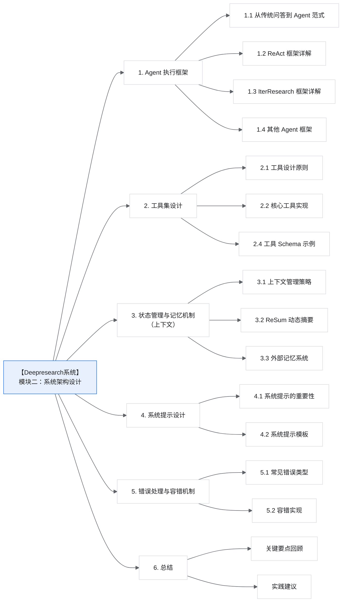
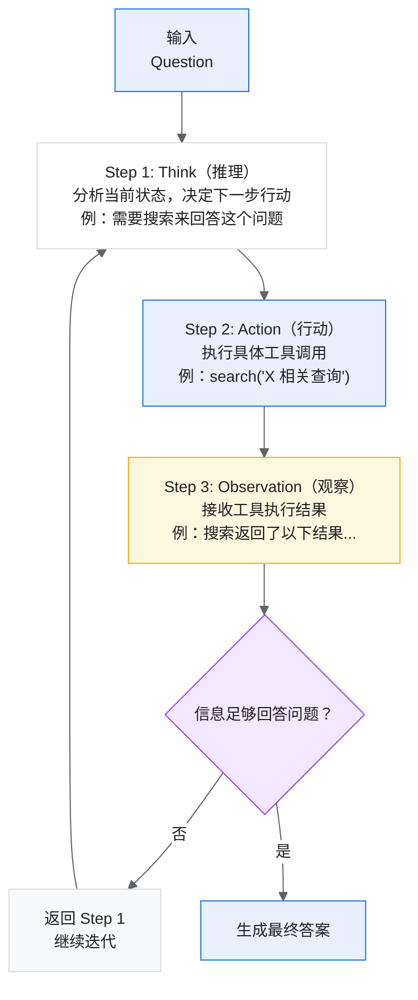
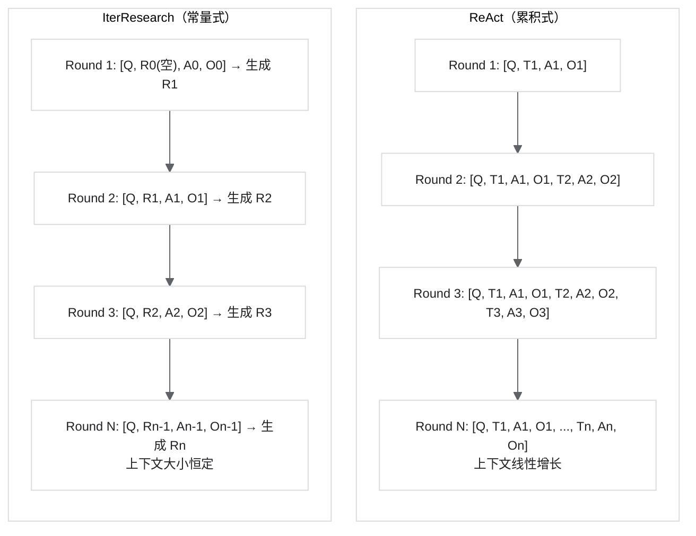
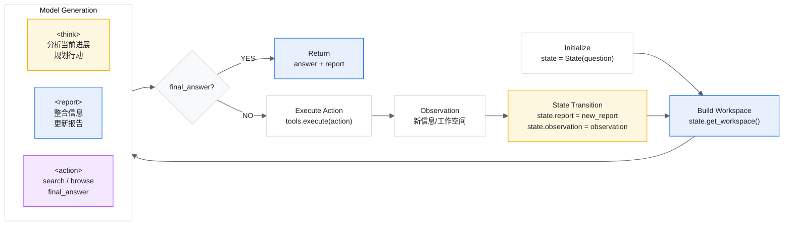
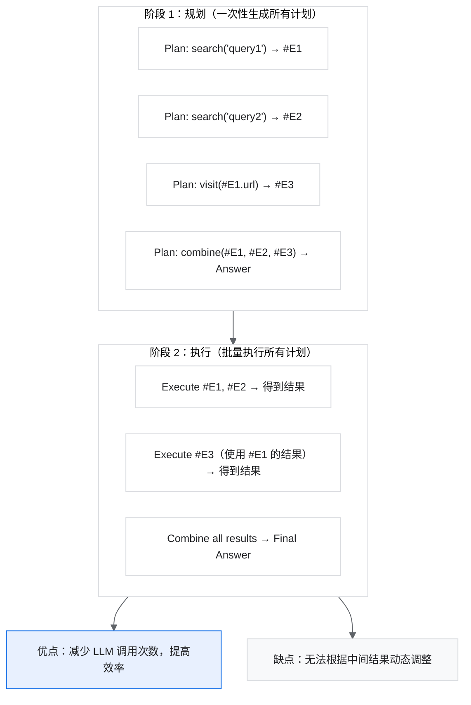
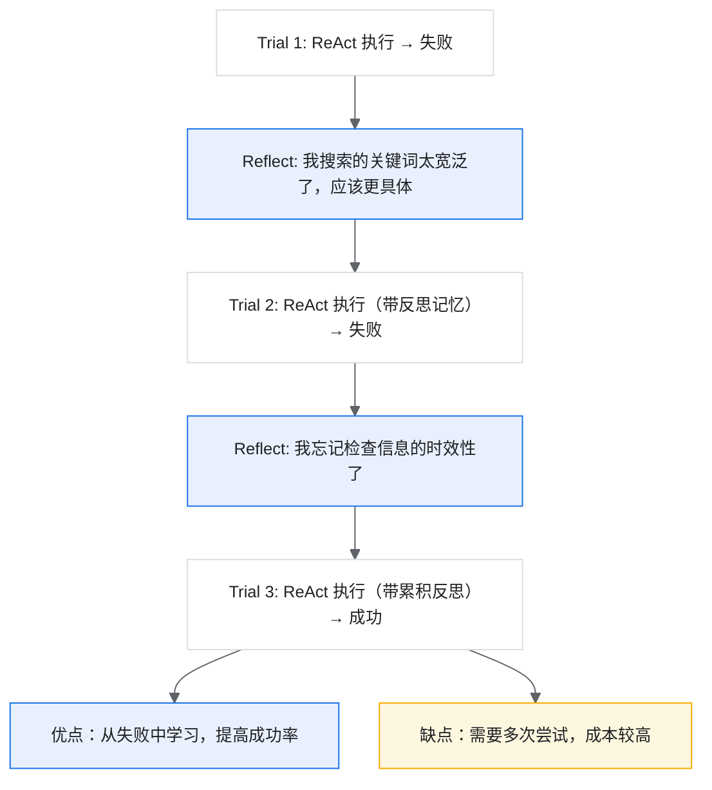
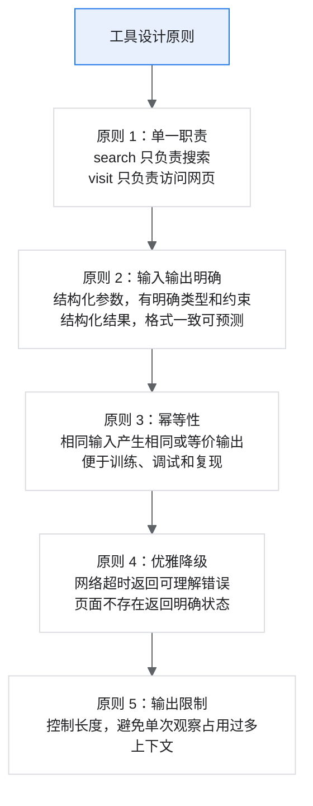
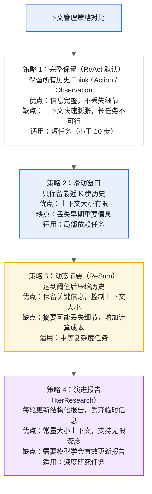
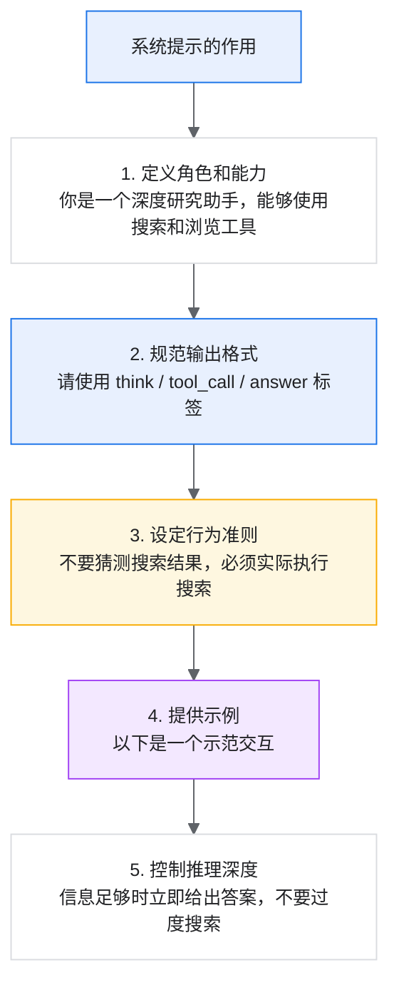

# 【Deepresearch系统】模块二：系统架构设计

> Agent 执行框架、工具集设计、状态管理与记忆机制的深度解析

## 目录



## 1. Agent 执行框架

### 1.1 从传统问答到 Agent 范式

传统的 LLM 问答是一次性的输入-输出过程：

```text
Input (Question) -> LLM -> Output (Answer)
```

Agent 范式引入了与环境的交互循环：

```text
Input -> LLM -> Action -> Environment -> Observation -> LLM -> Action -> ... -> Output
```

为什么需要 Agent 范式？

| 场景 | 传统 LLM 的局限 | Agent 的解决方案 |
| --- | --- | --- |
| 信息不在训练数据中 | 无法回答或幻觉 | 实时搜索获取 |
| 需要精确计算 | 计算能力有限 | 调用 Python 执行 |
| 信息分布在多个来源 | 无法整合 | 多轮搜索和访问 |
| 任务需要多步推理 | 一次生成难以完成 | 迭代推理和执行 |

### 1.2 ReAct 框架详解

ReAct（Reasoning and Acting）是最基础也是最广泛使用的 Agent 框架。

#### 1.2.1 核心思想

ReAct 的核心是将**推理（Reasoning）**和**行动（Acting）**交织在一起：



#### 1.2.2 消息格式设计

ReAct 使用特定的标签来区分不同类型的内容：

```xml
<!-- 系统提示 -->
<system>
你是一个研究助手，能够使用以下工具来回答问题：
- search：搜索互联网
- visit：访问网页获取详细内容
- python：执行 Python 代码

请按照以下格式回答：
1. 先思考需要做什么
2. 然后调用工具
3. 根据结果继续思考或给出答案
</system>

<!-- 用户问题 -->
<user>
法国 2024 年的 GDP 是多少？与 2023 年相比增长了多少？
</user>

<!-- Assistant 第一轮 -->
<assistant>
<think>
用户询问法国 2024 年的 GDP 及其增长率。这需要两个数据点：
1. 法国 2024 年的 GDP
2. 法国 2023 年的 GDP（用于计算增长率）

让我先搜索法国 2024 年的 GDP 数据。
</think>
<tool_call>
{"name": "search", "arguments": {"query": "France GDP 2024"}}
</tool_call>
</assistant>

<!-- 工具返回 -->
<user>
<tool_response>
1. France GDP 2024 - World Bank
   France's GDP reached $3.03 trillion in 2024...
2. French Economy 2024 Statistics
   The French economy showed modest growth...
</tool_response>
</user>

<!-- Assistant 第二轮 -->
<assistant>
<think>
搜索结果显示法国 2024 年 GDP 约为 3.03 万亿美元。
现在我需要获取 2023 年的数据来计算增长率。
</think>
<tool_call>
{"name": "search", "arguments": {"query": "France GDP 2023"}}
</tool_call>
</assistant>

<!-- 最终答案 -->
<assistant>
<think>
现在我有了所需的数据：
- 2024 年 GDP：3.03 万亿美元
- 2023 年 GDP：2.93 万亿美元
- 增长率：(3.03 - 2.93) / 2.93 = 3.4%
</think>
<answer>
法国 2024 年的 GDP 约为 3.03 万亿美元，与 2023 年的 2.93 万亿美元相比，增长了约 3.4%（即增加了约 1000 亿美元）。
</answer>
</assistant>
```

#### 1.2.3 ReAct 的优势与局限

优势：

| 优势 | 说明 |
| --- | --- |
| 简单直观 | 思考-行动-观察的循环易于理解和实现 |
| 可解释性强 | 每步推理都有明确的思考过程 |
| 灵活性高 | 可以根据观察结果动态调整策略 |
| 通用性好 | 适用于各种需要工具使用的任务 |

局限：

| 局限 | 原因 | 影响 |
| --- | --- | --- |
| 上下文溢出 | 历史信息持续累积 | 长任务无法完成 |
| 错误累积 | 早期错误持续影响后续决策 | 降低任务成功率 |
| 信息噪声 | 无关的 observation 持续占用上下文 | 推理能力下降 |
| 效率问题 | 每轮都需要处理完整历史 | 计算成本高 |

### 1.3 IterResearch 框架详解

IterResearch 是针对 Deep Research 任务设计的高级框架，专门解决 ReAct 在长 horizon 任务中的问题。

#### 1.3.1 核心创新：马尔可夫决策过程建模

IterResearch 将深度研究建模为**马尔可夫决策过程（MDP）**，关键创新是：

> 🧐 马尔可夫决策过程（MDP）其实就是一套描述“如何在不确定环境中做出一系列决策”的数学框架。让我们用一个生活例子来解释：
>
> 想象你在玩一个迷宫游戏：
>
> 1. **状态（State）**：你当前所在的位置。比如“在入口”、“在岔路口”、“在终点”。
> 2. **动作（Action）**：你能做的选择。比如“向左走”、“向右走”、“原地不动”。
> 3. **转移概率（Transition）**：你做了某个动作后，会到达哪里。这里有个关键：结果可能是随机的。例如地板很滑，你想往左走，但有 80% 概率真的往左，20% 概率滑到别处。
> 4. **奖励（Reward）**：每一步的得失。走到终点得 100 分，掉进陷阱扣 50 分，普通移动扣 1 分（鼓励你尽快到达）。
> 5. **策略（Policy）**：你的行动指南，也就是“在每个位置应该怎么走”。MDP 的目标就是找到一个**最优策略**，让你长期累积的奖励最大。
>
> “马尔可夫”这个词是什么意思？  
> 就是“只看现在，不管过去”。你下一步会怎样，只取决于你现在在哪、做了什么选择，和你之前怎么走到这里无关。就像下棋时，棋盘当前的局面决定一切，而不是你之前走了哪些步。
>
> 一句话总结：  
> MDP 就是在一个“做了选择后结果有点随机”的世界里，找出“在每种情况下该怎么做”才能获得最大长期收益的方法。

- **演进报告（Evolving Report）**作为中央记忆。
- 每轮只保留固定大小的状态空间。
- 丢弃临时信息，避免上下文污染。

#### ReAct 与 IterResearch 对比



其中：

- `Q`：原始问题
- `T`：Think（思考）
- `A`：Action（动作）
- `O`：Observation（观察结果）
- `R`：Report（演进报告），包含了所有历史信息的压缩表示

#### 1.3.2 状态定义与转移

形式化定义：

```text
MDP = (S, A, T, R, γ)

其中：
- S（状态空间）：s_i = (Q, Report_{i-1}, Action_{i-1}, Observation_{i-1})
- A（动作空间）：{search, visit, scholar, python, final_answer}
- T（转移函数）：执行动作后获得观察结果，更新状态
- R（奖励函数）：基于最终答案正确性
- γ（折扣因子）：通常设为 1（任务导向）
```

状态转移过程：

```python
class IterResearchState:
    """IterResearch 状态容器：只保留稳定报告和上一轮交互。"""

    def __init__(self, question: str):
        self.question = question
        self.report = ""              # 初始报告为空
        self.last_action = None
        self.last_observation = None

    def get_workspace(self) -> str:
        """构造当前工作空间。"""
        workspace = f"Question: {self.question}\n\n"
        workspace += f"Current Report\n{self.report}\n\n"

        if self.last_action:
            workspace += f"Last Action: {self.last_action}\n"
            workspace += f"Observation: {self.last_observation}\n"

        return workspace

    def transition(self, think: str, new_report: str, action, observation: str):
        """状态转移：丢弃临时 think，只保留 report。"""
        self.report = new_report
        self.last_action = action
        self.last_observation = observation
```

#### 1.3.3 演进报告的设计

演进报告是 IterResearch 的核心，它需要：

1. **信息完整性**：包含所有已发现的关键信息。
2. **结构清晰性**：便于模型理解和更新。
3. **大小可控性**：不能无限增长。

报告模板示例：

```markdown
## 研究报告

### 1. 问题分析
[对原始问题的理解和分解]

### 2. 已确认信息
- 信息点1：[来源：URL]
- 信息点2：[来源：URL]
- ...

### 3. 待验证信息
- 待验证点1：[需要进一步搜索]
- ...

### 4. 信息缺口
- 还需要：[描述需要但未获得的信息]

### 5. 当前结论
[基于已有信息的初步结论]

### 6. 下一步计划
[下一步应该做什么]
```

#### 1.3.4 完整执行流程



优化后的执行代码示例：

```python
def iterresearch_execute(model, question, tools, max_rounds: int = 100):
    """IterResearch 完整执行流程。"""
    state = IterResearchState(question)

    for round_idx in range(max_rounds):
        workspace = state.get_workspace()

        prompt = f"""
{workspace}

请基于上述信息：
1. 在 <think> 标签中分析当前进展和下一步计划
2. 在 <report> 标签中更新研究报告（整合新信息，移除无关内容）
3. 在 <action> 标签中决定下一步动作

如果信息足够回答问题，使用 final_answer 动作。
"""

        output = model.generate(prompt)

        think = extract_tag(output, "think")
        new_report = extract_tag(output, "report")
        action = extract_tag(output, "action")

        if action.type == "final_answer":
            return {
                "answer": action.content,
                "report": new_report,
                "rounds": round_idx + 1,
            }

        observation = tools.execute(action)

        state.transition(
            think=think,              # 不保存到状态，只用于当前轮推理
            new_report=new_report,
            action=action,
            observation=observation,
        )

    return {
        "answer": state.report,
        "report": state.report,
        "rounds": max_rounds,
        "status": "max_rounds_reached",
    }
```

### 1.4 其他 Agent 框架

除了 ReAct 和 IterResearch，还有一些值得了解的框架。

#### 1.4.1 ReWOO（Reasoning WithOut Observation）

先完成所有规划，再批量执行：



#### 1.4.2 Reflexion

引入自我反思机制：



#### 1.4.3 框架选择建议

| 任务特点 | 推荐框架 | 理由 |
| --- | --- | --- |
| 简单、步数少（<10 步） | ReAct | 简单直接，overhead 小 |
| 复杂、步数多（10-100 步） | IterResearch | 避免上下文溢出 |
| 计划可预知 | ReWOO | 效率高 |
| 允许多次尝试 | Reflexion | 可以从错误中学习 |
| 需要高可靠性 | IterResearch + 并行采样 | 多路径提高成功率 |

## 2. 工具集设计

### 2.1 工具设计原则

> 🧐 LLM 应用成功的核心在于基础建设和细节。

好的工具设计是 Agent 成功的关键：



单一职责示例：

- `search`：只负责搜索，返回搜索结果。
- `visit`：只负责访问网页，返回网页内容。
- 不建议把 `search_and_summarize` 这种职责混合的工具暴露给 Agent，难以调试。

输入输出明确示例：

```python
def search(query: str, max_results: int = 10) -> list["SearchResult"]:
    ...
```

幂等性要求：

- 相同输入应产生相同或等价输出。
- 便于训练（确定性环境）和调试（可复现）。
- 可通过结果缓存、固定随机种子等方式实现。

优雅降级：

- 网络超时：返回“暂时无法访问，请稍后重试”。
- 页面不存在：返回“页面不存在”。
- 不抛出异常导致整个流程崩溃。

输出限制：

- 限制输出长度，避免单个观察结果占用过多上下文。
- `search`：每个结果 200 字以内，最多 10 个结果。
- `visit`：总输出 4000 字以内。

### 2.2 核心工具实现

#### 2.2.1 Search 工具

功能：调用搜索引擎，返回相关网页列表。

优化后的实现示例：

```python
import os
from dataclasses import dataclass
from typing import Optional

import requests


@dataclass
class SearchResult:
    title: str
    url: str
    snippet: str


class SearchTool:
    """搜索工具实现。"""

    def __init__(self, config: dict):
        self.serper_key = config.get("serper_key") or os.getenv("SERPER_KEY")
        self.search_engine = config.get("engine", "google")  # google / bing / serper
        self.max_results = config.get("max_results", 10)
        self.timeout = config.get("timeout", 10)

        if not self.serper_key:
            raise ValueError("Missing SERPER_KEY. Put it in env or config.")

    def __call__(
        self,
        query: str,
        filter_year: Optional[int] = None,
        site: Optional[str] = None,
    ) -> list[SearchResult]:
        """执行搜索。

        Args:
            query: 搜索查询
            filter_year: 过滤特定年份的结果
            site: 限制搜索特定网站，如 site:wikipedia.org

        Returns:
            搜索结果列表
        """
        full_query = query
        if filter_year:
            full_query += f" {filter_year}"
        if site:
            full_query += f" site:{site}"

        try:
            response = requests.post(
                "https://google.serper.dev/search",
                headers={"X-" + "API-" + "KEY": self.serper_key},
                json={"q": full_query, "num": self.max_results},
                timeout=self.timeout,
            )
            response.raise_for_status()
            data = response.json()

            results = []
            for item in data.get("organic", [])[: self.max_results]:
                results.append(
                    SearchResult(
                        title=item.get("title", ""),
                        url=item.get("link", ""),
                        snippet=item.get("snippet", "")[:200],
                    )
                )

            return results

        except requests.Timeout:
            return [
                SearchResult(
                    title="搜索超时",
                    url="",
                    snippet="搜索请求超时，请稍后重试或尝试不同的查询。",
                )
            ]
        except requests.RequestException as exc:
            return [
                SearchResult(
                    title="搜索失败",
                    url="",
                    snippet=f"搜索遇到错误：{exc}",
                )
            ]

    def format_output(self, results: list[SearchResult]) -> str:
        """格式化输出供模型阅读。"""
        if not results:
            return "没有找到相关结果。"

        lines = []
        for index, result in enumerate(results, start=1):
            lines.append(f"{index}. {result.title}")
            lines.append(f"   URL: {result.url}")
            lines.append(f"   {result.snippet}")
            lines.append("")

        return "\n".join(lines)
```

#### 2.2.2 Visit 工具

功能：访问网页并提取与目标相关的信息。

优化后的实现示例：

```python
import requests
import trafilatura


class VisitTool:
    """网页访问工具实现。"""

    def __init__(self, config: dict):
        self.summarizer = config.get("summarizer")  # 摘要模型，可选
        self.max_content_length = config.get("max_content_length", 50_000)
        self.max_output_length = config.get("max_output_length", 4_000)
        self.timeout = config.get("timeout", 30)
        self.use_jina = config.get("use_jina", True)

    def __call__(self, url: str, goal: str) -> str:
        """访问网页并提取相关信息。

        Args:
            url: 要访问的网页 URL
            goal: 提取信息的目标，如“了解公司的财务状况”

        Returns:
            与目标相关的信息摘要
        """
        try:
            if self.use_jina:
                content = self._fetch_with_jina(url)
            else:
                content = self._fetch_direct(url)

            if not content:
                return f"无法获取网页内容：{url}"

            if len(content) > self.max_output_length and self.summarizer:
                content = self.summarizer(content, goal)

            return content[: self.max_output_length]

        except Exception as exc:
            return f"访问网页失败：{exc}"

    def _fetch_with_jina(self, url: str) -> str:
        """使用 Jina Reader 获取网页内容。"""
        jina_url = f"https://r.jina.ai/{url}"
        response = requests.get(
            jina_url,
            headers={"Accept": "text/plain"},
            timeout=self.timeout,
        )
        response.raise_for_status()
        return response.text[: self.max_content_length]

    def _fetch_direct(self, url: str) -> str:
        """直接抓取网页内容。"""
        response = requests.get(url, timeout=self.timeout)
        response.raise_for_status()

        content = trafilatura.extract(response.text)
        if content:
            return content[: self.max_content_length]

        return response.text[: self.max_content_length]
```

#### 2.2.3 Scholar 工具

功能：搜索学术文献，获取论文元数据。

优化后的实现示例：

```python
import requests


class ScholarTool:
    """学术搜索工具实现。"""

    def __init__(self, config: dict):
        self.sem_scholar_value = config.get("sem_scholar_value")
        self.max_results = config.get("max_results", 10)
        self.timeout = config.get("timeout", 10)

    def __call__(
        self,
        query: str,
        year_from: int | None = None,
        year_to: int | None = None,
    ) -> str:
        """搜索学术文献。

        Args:
            query: 搜索查询
            year_from: 起始年份
            year_to: 结束年份

        Returns:
            论文列表的格式化输出
        """
        try:
            params = {
                "query": query,
                "limit": self.max_results,
                "fields": "title,authors,year,abstract,citationCount,url",
            }

            if year_from or year_to:
                start = str(year_from) if year_from else ""
                end = str(year_to) if year_to else ""
                params["year"] = f"{start}-{end}"

            headers = {}
            if self.sem_scholar_value:
                headers["x-" + "api-" + "key"] = self.sem_scholar_value

            response = requests.get(
                "https://api.semanticscholar.org/graph/v1/paper/search",
                params=params,
                headers=headers,
                timeout=self.timeout,
            )
            response.raise_for_status()
            data = response.json()

            return self._format_results(data.get("data", []))

        except Exception as exc:
            return f"学术搜索失败：{exc}"

    def _format_results(self, papers: list) -> str:
        """格式化论文结果。"""
        if not papers:
            return "没有找到相关学术文献。"

        output = []
        for index, paper in enumerate(papers, start=1):
            authors = ", ".join(
                author.get("name", "") for author in paper.get("authors", [])[:3]
            )
            if len(paper.get("authors", [])) > 3:
                authors += " et al."

            output.append(f"{index}. {paper.get('title', 'Unknown Title')}")
            output.append(f"   作者：{authors}")
            output.append(f"   年份：{paper.get('year', 'Unknown')}")
            output.append(f"   引用数：{paper.get('citationCount', 0)}")

            abstract = paper.get("abstract", "")
            if abstract:
                output.append(f"   摘要：{abstract[:200]}...")

            output.append("")

        return "\n".join(output)
```

#### 2.2.4 Python 工具

功能：执行 Python 代码，用于数值计算和数据处理。

优化后的实现示例：

```python
import subprocess


class PythonTool:
    """Python 代码执行工具。"""

    def __init__(self, config: dict):
        self.timeout = config.get("timeout", 30)
        self.max_output_length = config.get("max_output_length", 2000)
        self.allowed_modules = config.get(
            "allowed_modules",
            ["math", "statistics", "datetime", "json", "re", "collections", "itertools", "functools"],
        )

    def __call__(self, code: str) -> str:
        """执行 Python 代码。

        Args:
            code: 要执行的 Python 代码

        Returns:
            执行结果或错误信息
        """
        if not self._is_safe(code):
            return "代码包含不允许的操作（如文件系统访问、网络请求等）。"

        try:
            result = subprocess.run(
                ["python", "-c", code],
                capture_output=True,
                text=True,
                timeout=self.timeout,
            )

            output = result.stdout
            if result.stderr:
                output += f"\n错误：{result.stderr}"

            return output[: self.max_output_length]

        except subprocess.TimeoutExpired:
            return "代码执行超时。"
        except Exception as exc:
            return f"代码执行失败：{exc}"

    def _is_safe(self, code: str) -> bool:
        """检查代码是否安全。"""
        dangerous_patterns = [
            "import os",
            "import sys",
            "import subprocess",
            "open(",
            "exec(",
            "eval(",
            "__import__",
            "importlib",
            "requests",
            "urllib",
            "socket",
        ]

        code_lower = code.lower()
        return not any(pattern.lower() in code_lower for pattern in dangerous_patterns)
```

### 2.3 工具调用接口设计

统一的工具调用接口便于管理和扩展：

```python
import json
from abc import ABC, abstractmethod
from typing import Any

from cachetools import LRUCache


class BaseTool(ABC):
    """工具基类。"""

    @property
    @abstractmethod
    def name(self) -> str:
        """工具名称。"""
        raise NotImplementedError

    @property
    @abstractmethod
    def description(self) -> str:
        """工具描述，供模型理解。"""
        raise NotImplementedError

    @property
    @abstractmethod
    def parameters(self) -> dict[str, Any]:
        """参数定义，JSON Schema 格式。"""
        raise NotImplementedError

    @abstractmethod
    def __call__(self, **kwargs) -> str:
        """执行工具。"""
        raise NotImplementedError


class ToolRegistry:
    """工具注册中心。"""

    def __init__(self):
        self.tools: dict[str, BaseTool] = {}
        self.cache = LRUCache(maxsize=1000)

    def register(self, tool: BaseTool):
        """注册工具。"""
        self.tools[tool.name] = tool

    def get_tool_descriptions(self) -> str:
        """获取所有工具的描述，用于系统提示。"""
        descriptions = []
        for name, tool in self.tools.items():
            descriptions.append(f"- {name}: {tool.description}")
            descriptions.append(f"  参数：{tool.parameters}")
        return "\n".join(descriptions)

    def execute(self, tool_call: dict[str, Any]) -> str:
        """执行工具调用。"""
        name = tool_call["name"]
        args = tool_call.get("arguments", {})

        if name not in self.tools:
            return f"未知工具：{name}"

        cache_key = f"{name}:{json.dumps(args, sort_keys=True)}"
        if cache_key in self.cache:
            return self.cache[cache_key]

        try:
            result = self.tools[name](**args)
            self.cache[cache_key] = result
            return result
        except Exception as exc:
            return f"工具执行错误：{exc}"
```

### 2.4 工具 Schema 示例

完整的工具定义，便于模型理解如何调用：

```json
{
  "tools": [
    {
      "name": "search",
      "description": "搜索互联网获取相关信息。当你需要查找事实、数据、新闻或任何网上可找到的信息时使用此工具。",
      "parameters": {
        "type": "object",
        "properties": {
          "query": {
            "type": "string",
            "description": "搜索查询词。应该简洁、具体，包含关键词。"
          },
          "filter_year": {
            "type": "integer",
            "description": "可选。过滤特定年份的结果。"
          }
        },
        "required": ["query"]
      }
    },
    {
      "name": "visit",
      "description": "访问网页并提取相关信息。当你需要获取特定网页的详细内容时使用此工具。",
      "parameters": {
        "type": "object",
        "properties": {
          "url": {
            "type": "string",
            "description": "要访问的网页 URL。"
          },
          "goal": {
            "type": "string",
            "description": "你想从这个网页中获取什么信息。"
          }
        },
        "required": ["url", "goal"]
      }
    },
    {
      "name": "scholar",
      "description": "搜索学术文献和论文。当你需要查找研究论文、学术观点或科学数据时使用此工具。",
      "parameters": {
        "type": "object",
        "properties": {
          "query": {
            "type": "string",
            "description": "学术搜索查询。"
          },
          "year_from": {
            "type": "integer",
            "description": "可选。论文发表的起始年份。"
          },
          "year_to": {
            "type": "integer",
            "description": "可选。论文发表的结束年份。"
          }
        },
        "required": ["query"]
      }
    },
    {
      "name": "python",
      "description": "执行 Python 代码进行计算。当你需要进行数学计算、数据处理或分析时使用此工具。",
      "parameters": {
        "type": "object",
        "properties": {
          "code": {
            "type": "string",
            "description": "要执行的 Python 代码。代码应该打印出结果。"
          }
        },
        "required": ["code"]
      }
    },
    {
      "name": "final_answer",
      "description": "当你已经收集到足够的信息来回答问题时，使用此工具提供最终答案。",
      "parameters": {
        "type": "object",
        "properties": {
          "answer": {
            "type": "string",
            "description": "对用户问题的完整回答。"
          }
        },
        "required": ["answer"]
      }
    }
  ]
}
```

## 3. 状态管理与记忆机制（上下文）

### 3.1 上下文管理策略

长任务的上下文管理是 Deep Research 的核心挑战：



### 3.2 ReSum 动态摘要机制

ReSum 在上下文即将溢出时触发摘要：

```python
class ReSumContextManager:
    """ReSum 上下文管理器。"""

    def __init__(self, config: dict):
        self.max_tokens = config.get("max_tokens", 32000)
        self.trigger_threshold = config.get("trigger_threshold", 0.9)
        self.summarizer = config["summarizer"]
        self.tokenizer = config["tokenizer"]

    def should_summarize(self, messages: list) -> bool:
        """检查是否需要摘要。"""
        current_tokens = self._count_tokens(messages)
        return current_tokens > self.max_tokens * self.trigger_threshold

    def summarize(self, messages: list, question: str) -> list:
        """执行摘要，返回压缩后的消息列表。"""
        history_content = self._extract_history(messages)

        summary_prompt = f"""
请将以下研究历史压缩为一个简洁的摘要，保留：
1. 关键发现和事实
2. 已验证的信息来源
3. 尚未解决的问题

原始问题：{question}

研究历史：
{history_content}

请生成结构化摘要。
"""

        summary = self.summarizer.generate(summary_prompt)

        new_messages = [
            {
                "role": "user",
                "content": (
                    f"{question}\n\n"
                    f"<previous_research_summary>\n{summary}\n</previous_research_summary>"
                ),
            }
        ]

        return new_messages

    def _count_tokens(self, messages: list) -> int:
        """统计 token 数量。"""
        total = 0
        for msg in messages:
            total += len(self.tokenizer.encode(msg["content"]))
        return total

    def _extract_history(self, messages: list) -> str:
        """提取历史内容。"""
        history = []
        for msg in messages:
            role = msg["role"]
            content = msg["content"]
            history.append(f"[{role}] {content}")
        return "\n\n".join(history)
```

### 3.3 外部记忆系统

对于需要处理大量信息的场景，可以引入外部记忆系统：

```python
import time
from typing import Tuple

import numpy as np


class ExternalMemory:
    """外部向量记忆系统。"""

    def __init__(self, config: dict):
        self.embedding_model = config["embedding_model"]
        self.dimension = config.get("dimension", 1024)
        self.max_entries = config.get("max_entries", 1000)
        self.memories: list[dict[str, object]] = []

    def add(self, content: str, metadata: dict | None = None):
        """添加记忆条目。"""
        embedding = self._embed(content)

        entry = {
            "content": content,
            "embedding": embedding,
            "metadata": metadata or {},
            "timestamp": time.time(),
        }

        self.memories.append(entry)

        if len(self.memories) > self.max_entries:
            self.memories = self.memories[-self.max_entries :]

    def retrieve(self, query: str, top_k: int = 5) -> list[str]:
        """检索相关记忆。"""
        if not self.memories:
            return []

        query_embedding = self._embed(query)

        similarities = []
        for entry in self.memories:
            sim = self._cosine_similarity(query_embedding, entry["embedding"])
            similarities.append((sim, entry["content"]))

        similarities.sort(key=lambda item: item[0], reverse=True)
        return [content for _, content in similarities[:top_k]]

    def _embed(self, text: str) -> np.ndarray:
        """生成文本嵌入。"""
        return self.embedding_model.encode(text)

    def _cosine_similarity(self, a: np.ndarray, b: np.ndarray) -> float:
        """计算余弦相似度。"""
        return float(np.dot(a, b) / (np.linalg.norm(a) * np.linalg.norm(b)))
```

## 4. 系统提示设计

### 4.1 系统提示的重要性

系统提示定义了 Agent 的行为边界和风格：



### 4.2 系统提示模板

**ReAct 模式系统提示：**

```text
你是一个专业的深度研究助手，能够通过多轮搜索和分析来回答复杂问题。

## 可用工具

{tool_descriptions}

## 输出格式

每次回复请按以下格式：

1. 首先在 <think> 标签中分析当前状态和计划：
   - 已知什么信息
   - 还需要什么信息
   - 下一步应该做什么

2. 然后在 <tool_call> 标签中调用工具（如果需要）：
   {
     "name": "工具名",
     "arguments": {
       "参数名": "参数值"
     }
   }

3. 如果信息足够，在 <answer> 标签中给出最终答案。

## 行为准则

- 不要猜测不确定的信息，必须搜索确认。
- 验证信息：重要事实尽量从多个来源验证。
- 注明来源：答案中应包含信息来源。
- 保持专注：围绕问题核心，不要偏离主题。
- 适时停止：信息足够时立即回答，不要过度搜索。

## 示例

用户：特斯拉 2024 年的全球交付量是多少？

<think>
用户询问特斯拉 2024 年的交付数据。这是一个需要最新数据的问题，
我需要搜索特斯拉 2024 年的官方交付数据。
</think>
<tool_call>
{"name": "search", "arguments": {"query": "Tesla 2024 global deliveries official"}}
</tool_call>
```

**IterResearch 模式系统提示：**

```text
你是一个专业的深度研究助手，使用迭代研究方法来回答复杂问题。

## 核心机制

你维护一份“研究报告”，每轮更新。这份报告是你的中央记忆，
包含了所有重要发现。每轮结束后，临时信息会被丢弃，只保留报告。

## 可用工具

{tool_descriptions}

## 每轮输出格式

1. **思考** <think>：分析当前进展，规划下一步
2. **更新报告** <report>：整合新信息到报告中
3. **执行动作** <action>：调用工具或给出最终答案

## 报告结构

<report>
## 研究进展

### 已确认信息
- [信息1]：[来源]
- [信息2]：[来源]

### 待验证信息
- [待验证点]

### 信息缺口
- [还需要了解的内容]

### 当前结论
[基于已有信息的初步结论]
</report>

## 行为准则

1. 每轮都要更新报告，不要遗漏重要发现。
2. 从报告中移除已被证伪或不相关的信息。
3. 当报告中的信息足以回答问题时，使用 final_answer。
4. 报告应保持简洁，避免冗余。
```

## 5. 错误处理与容错机制

### 5.1 常见错误类型

| 错误类型 | 表现 | 原因 | 处理策略 |
| --- | --- | --- | --- |
| 格式错误 | 工具调用 JSON 格式不正确 | 模型输出不规范 | 重试或格式修复 |
| 工具调用失败 | 搜索超时、网页无法访问 | 网络问题、服务不可用 | 重试或优雅降级 |
| 无限循环 | 重复相同的搜索查询 | 策略陷入局部最优 | 检测并强制终止 |
| 幻觉 | 编造搜索结果或信息 | 模型生成倾向 | 格式约束、验证机制 |
| 上下文溢出 | 历史太长无法处理 | 任务步数过多 | 摘要或截断 |

### 5.2 容错实现

```python
import time


class RobustAgentExecutor:
    """健壮的 Agent 执行器。"""

    def __init__(self, config: dict):
        self.model = config["model"]
        self.tools = config["tools"]
        self.max_retries = config.get("max_retries", 3)
        self.max_steps = config.get("max_steps", 50)
        self.loop_detector = LoopDetector(window_size=5)

    def execute(self, question: str) -> dict:
        """执行 Agent 任务。"""
        messages = [{"role": "user", "content": question}]

        for step in range(self.max_steps):
            try:
                response = self._generate_with_retry(messages)
                parsed = self._parse_response(response)

                if parsed.get("is_final"):
                    return {"answer": parsed["answer"], "steps": step + 1}

                if self.loop_detector.is_loop(parsed.get("action")):
                    response = self._handle_loop(messages)
                    parsed = self._parse_response(response)

                observation = self._execute_tool_with_fallback(parsed["action"])

                messages.append({"role": "assistant", "content": response})
                messages.append(
                    {
                        "role": "user",
                        "content": f"<tool_response>{observation}</tool_response>",
                    }
                )

            except Exception as exc:
                messages.append(
                    {
                        "role": "user",
                        "content": f"<system_error>发生错误：{exc}。请调整策略继续。</system_error>",
                    }
                )

        return {
            "answer": "达到最大步数限制",
            "steps": self.max_steps,
            "status": "incomplete",
        }

    def _generate_with_retry(self, messages: list) -> str:
        """带重试的生成。"""
        last_error = None
        for attempt in range(self.max_retries):
            try:
                response = self.model.generate(messages)
                if self._is_valid_format(response):
                    return response
            except Exception as exc:
                last_error = exc
                time.sleep(2 ** attempt)

        raise RuntimeError(f"生成失败，重试 {self.max_retries} 次后仍然失败：{last_error}")

    def _execute_tool_with_fallback(self, action: dict) -> str:
        """带降级的工具执行。"""
        try:
            return self.tools.execute(action)
        except TimeoutError:
            return "工具调用超时。请尝试其他方法或稍后重试。"
        except Exception as exc:
            return f"工具调用失败：{exc}。请尝试其他方法。"

    def _handle_loop(self, messages: list) -> str:
        """处理循环。"""
        messages.append(
            {
                "role": "user",
                "content": (
                    "<system_hint>检测到你可能陷入循环，请尝试不同的搜索策略"
                    "或根据已有信息给出答案。</system_hint>"
                ),
            }
        )
        return self.model.generate(messages)
```

```python
import json


class LoopDetector:
    """循环检测器。"""

    def __init__(self, window_size: int = 5, threshold: float = 0.8):
        self.window_size = window_size
        self.threshold = threshold
        self.recent_actions = []

    def is_loop(self, action: dict) -> bool:
        """检测是否进入循环。"""
        action_str = json.dumps(action, sort_keys=True)
        self.recent_actions.append(action_str)

        if len(self.recent_actions) > self.window_size:
            self.recent_actions = self.recent_actions[-self.window_size :]

        if len(self.recent_actions) < 3:
            return False

        unique_actions = set(self.recent_actions)
        repetition_rate = 1 - len(unique_actions) / len(self.recent_actions)

        return repetition_rate > self.threshold
```

## 6. 总结

本模块详细介绍了 Deep Research Agent 的系统架构设计：

### 关键要点回顾

1. **Agent 框架选择**
   - ReAct：简单任务的首选，直观易实现。
   - IterResearch：复杂任务的首选，支持无限深度。

2. **工具设计原则**
   - 单一职责、输入输出明确、幂等性、优雅降级。

3. **核心工具**
   - Search：搜索引擎接入。
   - Visit：网页内容提取。
   - Scholar：学术文献搜索。
   - Python：代码执行。

4. **上下文管理**
   - 完整保留、滑动窗口、动态摘要、演进报告各有适用场景。

5. **容错机制**
   - 重试策略、循环检测、优雅降级。

### 实践建议

| 场景 | 推荐配置 |
| --- | --- |
| 快速原型 | ReAct + Search + Visit |
| 生产系统 | IterResearch + 完整工具集 + 容错机制 |
| 学术研究 | IterResearch + Scholar + 外部记忆 |
| 高可靠性要求 | 并行采样 + 结果综合 |

> 🧐 **训练一致性**

在下一模块中，我们将详细介绍如何构造高质量的训练数据。
