# 【Deepresearch系统】模块三：数据构造方法

> QA 数据生成、轨迹采样与质量控制的完整指南

## 目录

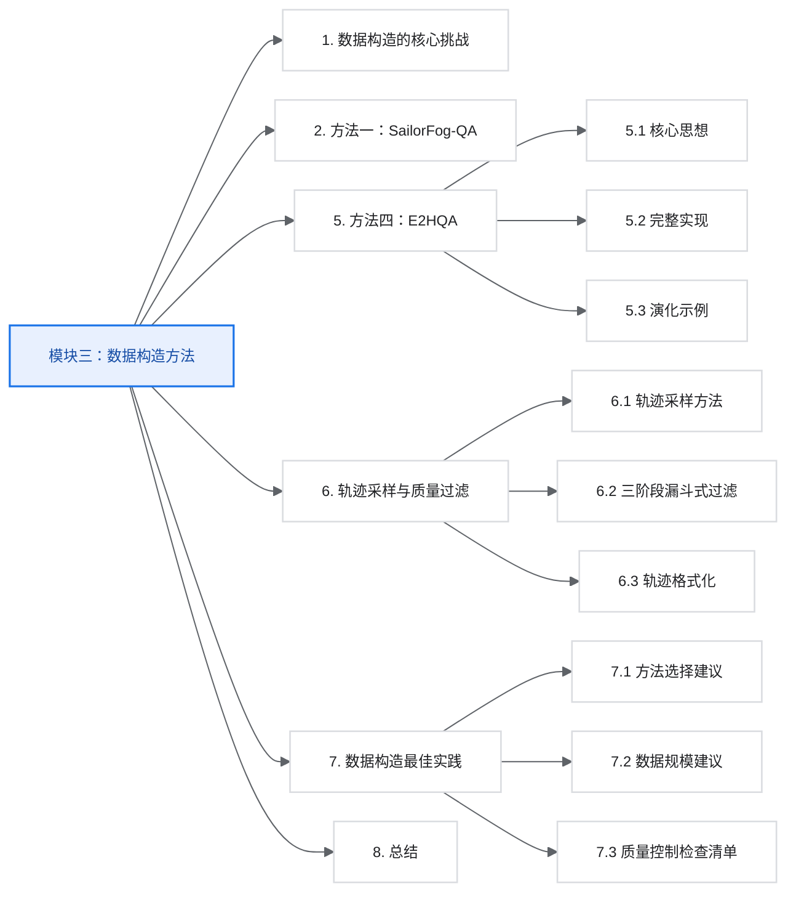

## 1. 数据构造的核心挑战

### 1.1 为什么数据如此重要？

Deep Research Agent 的性能高度依赖训练数据的质量和多样性：

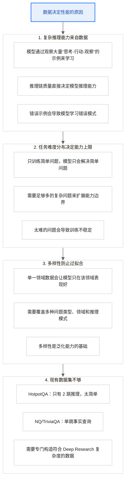

这两个都是经典的问答数据集，接下来举例说明它们的样子和为什么“不够用”。

#### NQ / TriviaQA（单跳问答）

特点：问题可以直接从一个段落里找到答案，不需要推理。

```text
[问题]
Who is the CEO of Tesla?

[证据段落]
Tesla, Inc. is an American electric vehicle company.
Elon Musk is the CEO of Tesla and also leads SpaceX...

[答案]
Elon Musk
```

为什么太简单：一搜就有答案，不需要跨文档整合信息。

#### HotpotQA（2 跳推理）

特点：需要结合两个段落的信息才能回答，稍微复杂一点。

```text
[问题]
The director of "Inception" also directed which movie about dreams
starring Leonardo DiCaprio?

[证据段落1]
Inception is a 2010 science fiction film directed by Christopher Nolan,
starring Leonardo DiCaprio...

[证据段落2]
Christopher Nolan is a British-American filmmaker known for directing
The Dark Knight trilogy, Interstellar, and Inception...

[推理过程]
第1跳：Inception 的导演是 Christopher Nolan
第2跳：Leonardo DiCaprio 主演 + Nolan 导演 + 关于梦 -> Inception

[答案]
Inception
```

为什么还是不够：只要 2 步推理，而 Deep Research 可能需要 10-20 步。

#### Deep Research 需要什么样的数据？

```text
[问题]
比较 2024 年中美两国在新能源汽车领域的政策差异，
并分析这些政策对特斯拉和比亚迪未来 5 年竞争格局的影响。

[需要的步骤]（10+ 跳）
1. 搜索中国 2024 年新能源汽车政策
2. 搜索美国 2024 年新能源汽车政策（IRA 法案等）
3. 对比两国补贴力度
4. 搜索特斯拉近期报价和中国市场表现
5. 搜索比亚迪出口数据和海外布局
6. 搜索关税政策变化
7. 搜索电池技术路线差异
8. 搜索分析师预测报告
9. 综合对比分析
10. 形成结论

[答案]
一份数千字的分析报告，包含多维度对比和预测。
```

一句话总结：

| 数据集 | 推理深度 | 答案形式 |
| --- | --- | --- |
| NQ/TriviaQA | 1 跳（直接查） | 几个词 |
| HotpotQA | 2 跳 | 短句 |
| Deep Research | 10-20 跳 | 长篇报告 |

现有数据集就像“小学数学题”，而 Deep Research 需要“研究生论文级”的复杂度，所以必须专门构造新数据。

### 1.2 数据构造的目标

理想的 Deep Research 训练数据应该具备：

| 维度 | 要求 | 原因 |
| --- | --- | --- |
| 复杂度 | 需要多步推理（5-50 步） | 简单问题无法锻炼深度研究能力 |
| 多样性 | 覆盖多领域、多类型 | 防止过拟合，提升泛化 |
| 真实性 | 答案可通过网络搜索验证 | 确保可训练性，避免无解问题 |
| 清晰性 | 问题和答案定义明确 | 便于自动评估和奖励计算 |
| 时效性 | 信息在网上可查到 | 工具调用能获得有效结果 |

### 1.3 数据构造方法全景

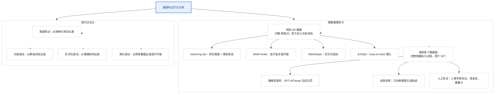

## 基础：种子数据来源

在介绍各种数据扩展方法之前，首先需要解决一个根本问题：**最初的种子数据从哪里来？**

### 种子数据的三种类型

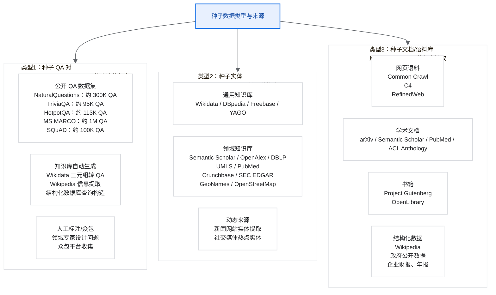

### 种子数据获取实现

#### 从公开 QA 数据集获取种子

下面是截图中 `SeedQACollector` 的优化版。它保留了 NQ、TriviaQA、HotpotQA 三类来源，但把重复加载逻辑收敛到统一的采集接口里。

```python
from datasets import load_dataset


class SeedQACollector:
    """从公开 QA 数据集中收集可用种子问题。"""

    def __init__(self):
        self.loaders = {
            "natural_questions": self._load_nq,
            "triviaqa": self._load_triviaqa,
            "hotpotqa": self._load_hotpotqa,
        }

    def collect(self, source: str, limit: int = 1000) -> list[dict]:
        if source not in self.loaders:
            raise ValueError(f"Unknown source: {source}")
        return self.loaders[source](limit)

    def _load_nq(self, limit: int) -> list[dict]:
        dataset = load_dataset("natural_questions", split="train")
        rows = []

        for item in dataset:
            answers = item.get("annotations", {}).get("short_answers", [])
            if not answers:
                continue

            rows.append({
                "question": item["question"]["text"],
                "answer": answers[0]["text"],
                "source": "natural_questions",
                "complexity": 1,
            })

            if len(rows) >= limit:
                break

        return rows

    def _load_hotpotqa(self, limit: int) -> list[dict]:
        dataset = load_dataset("hotpot_qa", "fullwiki", split="train")
        rows = []

        for item in dataset:
            rows.append({
                "question": item["question"],
                "answer": item["answer"],
                "source": "hotpotqa",
                "complexity": 2,
                "supporting_facts": item["supporting_facts"],
            })

            if len(rows) >= limit:
                break

        return rows
```

#### 从知识库生成种子 QA

下面是 `WikidataQAGenerator` 的优化版。截图中的核心思路是：准备关系模板，查询实体与属性值，再把三元组转成自然语言 QA。

```python
import requests


class WikidataQAGenerator:
    """从 Wikidata 关系模板生成种子 QA。"""

    def __init__(self):
        self.sparql_url = "https://query.wikidata.org/sparql"
        self.relation_templates = {
            "P20": ("死亡地", "{entity}在哪里去世？"),
            "P69": ("毕业院校", "{entity}毕业于哪所学校？"),
            "P108": ("工作单位", "{entity}在哪里工作？"),
            "P26": ("配偶", "{entity}的配偶是谁？"),
            "P40": ("子女", "{entity}有哪些子女？"),
            "P112": ("创始人", "{entity}是由谁创立的？"),
            "P571": ("成立时间", "{entity}是什么时候成立的？"),
            "P17": ("所在国家", "{entity}位于哪个国家？"),
            "P131": ("所在行政区", "{entity}位于哪个行政区？"),
        }

    def generate_qa(self, limit: int = 1000) -> list[dict]:
        qa_pairs = []

        for relation_id, (relation_name, template) in self.relation_templates.items():
            query = self._build_query(relation_id, limit)
            results = self._execute_query(query)

            for result in results:
                entity = result["entityLabel"]["value"]
                value = result["valueLabel"]["value"]
                qa_pairs.append({
                    "question": template.format(entity=entity),
                    "answer": value,
                    "source": "wikidata",
                    "relation": relation_name,
                    "complexity": 1,
                })

        return qa_pairs

    def _build_query(self, relation_id: str, limit: int) -> str:
        return f"""
        SELECT ?entity ?entityLabel ?value ?valueLabel WHERE {{
          ?entity wdt:{relation_id} ?value .
          ?entity rdfs:label ?entityLabel .
          ?value rdfs:label ?valueLabel .
          FILTER(LANG(?entityLabel) = "zh" || LANG(?entityLabel) = "en")
          FILTER(LANG(?valueLabel) = "zh" || LANG(?valueLabel) = "en")
        }}
        LIMIT {limit}
        """

    def _execute_query(self, query: str) -> list[dict]:
        response = requests.get(
            self.sparql_url,
            params={"query": query, "format": "json"},
            headers={"User-Agent": "DeepResearchBot/1.0"},
            timeout=30,
        )
        response.raise_for_status()
        return response.json()["results"]["bindings"]
```

#### 从文档语料生成种子

```python
import json


class DocumentSeedGenerator:
    """从文档语料生成种子数据。"""

    def __init__(self, llm):
        self.llm = llm

    def generate_from_documents(
        self,
        documents: list[str],
        qa_per_doc: int = 3,
    ) -> list[dict]:
        all_qa = []

        for doc in documents:
            key_facts = self._extract_key_facts(doc)
            for fact in key_facts[:qa_per_doc]:
                qa = self._fact_to_qa(fact, doc)
                if qa:
                    all_qa.append(qa)

        return all_qa

    def _extract_key_facts(self, document: str) -> list[dict]:
        prompt = f"""
        从以下文档中提取 5-10 个关键事实，每个事实应该是一个可验证的陈述。

        文档：
        {document[:2000]}

        请以 JSON 数组返回，每个事实包含：
        - fact：事实描述
        - entities：涉及的实体列表
        - type：事实类型（人物、事件、数据、关系等）
        """
        response = self.llm.generate(prompt)
        return json.loads(response)

    def _fact_to_qa(self, fact: dict, source_doc: str) -> dict:
        prompt = f"""
        将事实转换为一个问答对。

        事实：{fact["fact"]}
        涉及实体：{fact["entities"]}

        要求：
        1. 问题应该自然、清晰
        2. 答案应该是事实中的某个具体信息
        3. 问题不应该直接包含答案

        返回 JSON：{{"question": "...", "answer": "..."}}
        """
        qa = json.loads(self.llm.generate(prompt))
        qa["source"] = "document_extraction"
        qa["complexity"] = 1
        qa["original_fact"] = fact
        return qa
```

### 种子数据质量筛选

获取种子数据后，需要进行质量筛选：

```python
class SeedQualityFilter:
    """种子数据质量筛选器。"""

    def __init__(self, tools, llm):
        self.tools = tools
        self.llm = llm

    def filter(self, seed_qa: list[dict]) -> list[dict]:
        filtered = []

        for qa in seed_qa:
            if not self._is_answer_searchable(qa):
                continue
            if self._llm_can_answer_directly(qa):
                continue
            if not self._is_question_clear(qa):
                continue
            filtered.append(qa)

        return filtered

    def _is_answer_searchable(self, qa: dict) -> bool:
        results = self.tools.execute({
            "name": "search",
            "arguments": {"query": qa["question"]},
        })
        answer = str(qa["answer"]).lower()
        return any(answer in item.snippet.lower() for item in results[:5])

    def _llm_can_answer_directly(self, qa: dict) -> bool:
        prompt = f"请直接回答，不要搜索：{qa['question']}"
        response = self.llm.generate(prompt, temperature=0)
        return str(qa["answer"]).lower() in response.lower()

    def _is_question_clear(self, qa: dict) -> bool:
        prompt = f"""
        判断以下问题是否清晰、无歧义，且有唯一确定答案。

        问题：{qa["question"]}

        返回：YES 或 NO，以及简要理由。
        """
        response = self.llm.generate(prompt)
        return response.strip().upper().startswith("YES")
```

### 2.4 种子数据来源选择建议

| 应用场景 | 推荐种子来源 | 理由 |
| --- | --- | --- |
| 🌐 通用问答 | NQ + TriviaQA | 覆盖广，来自真实用户查询 |
| 🔗 多跳推理 | HotpotQA | 已有 2 跳结构，便于扩展 |
| 📚 学术研究 | arXiv + Semantic Scholar | 领域专业，信息密度高 |
| 📰 时事问答 | 新闻语料 + Wikidata 近期实体 | 时效性强 |
| 🎯 特定领域 | 领域知识库 + 专业文档 | 领域针对性强 |
| 🚀 冷启动 | Wikidata 自动生成 | 量大、结构化、易获取 |

### 数据来源的许可与合规

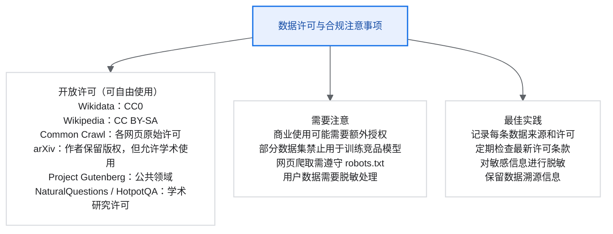

## 2. 方法一：SailorFog-QA

### 2.1 核心思想

SailorFog-QA 通过构建知识图谱并在其上随机游走来生成复杂的 QA 对。核心洞察是：

- 复杂问题 = 图谱中的复杂路径
- 问题难度 = 路径长度 + 节点模糊度
- 答案可验证性 = 图谱中存在路径

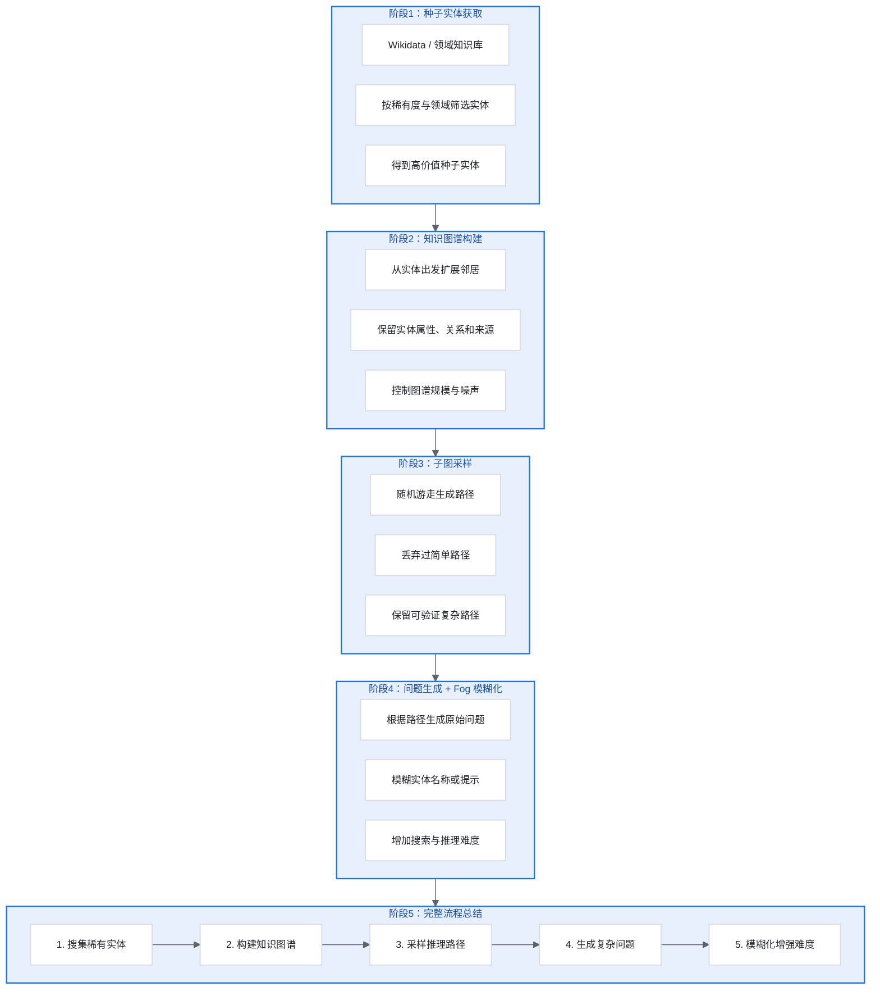

### 2.2 阶段一：知识图谱构建

#### 2.2.1 种子实体获取

```python
import requests


class SeedEntityCollector:
    """种子实体收集器。"""

    def __init__(self, config: dict):
        self.sparql_url = "https://query.wikidata.org/sparql"
        self.target_domains = config.get(
            "domains",
            ["人物", "组织", "地点", "事件", "作品", "科学概念"],
        )
        self.rarity_threshold = config.get("rarity_threshold", 0.3)

    def collect_seeds(self, limit: int = 1000) -> list[dict]:
        seeds = []

        for domain in self.target_domains:
            domain_seeds = self._query_domain_entities(domain)
            rare_seeds = [seed for seed in domain_seeds if self._is_rare(seed)]
            seeds.extend(rare_seeds)

        return seeds[:limit]

    def _query_domain_entities(self, domain: str) -> list[dict]:
        query = f"""
        SELECT ?entity ?label ?description WHERE {{
          ?entity wdt:P31 wd:Q5 .
          ?entity rdfs:label ?label .
          FILTER(LANG(?label) = "en")
          OPTIONAL {{ ?entity schema:description ?description . }}
        }}
        LIMIT 500
        """
        response = requests.get(
            self.sparql_url,
            params={"query": query, "format": "json"},
            timeout=30,
        )
        response.raise_for_status()
        return self._parse_results(response.json())

    def _is_rare(self, entity: dict) -> bool:
        """判断实体是否足够稀有，但又不是完全不可检索。"""
        test_question = f"Who is {entity['label']}?"
        llm_answer = self.llm_generate(test_question)
        return not self._contains_key_info(llm_answer, entity)
```

#### 2.2.2 实体特征提取

```python
import json


class EntityFeatureExtractor:
    """实体特征提取器。"""

    def __init__(self, tools):
        self.tools = tools

    def extract_features(self, entity: dict) -> dict:
        features = {
            "basic_info": entity,
            "attributes": {},
            "relations": [],
            "sources": [],
        }

        search_results = self.tools.execute({
            "name": "search",
            "arguments": {"query": entity["label"]},
        })

        for result in search_results[:3]:
            content = self.tools.execute({
                "name": "visit",
                "arguments": {
                    "url": result.url,
                    "goal": f"Extract key facts about {entity['label']}",
                },
            })
            features["sources"].append({
                "url": result.url,
                "content": content,
            })

        features["attributes"] = self._extract_attributes(features["sources"])
        features["relations"] = self._extract_relations(features["sources"])
        return features

    def _extract_attributes(self, sources: list[dict]) -> dict:
        prompt = f"""
        从以下内容中提取关键属性信息，如出生日期、地点、职业等：

        {sources}

        请以 JSON 格式返回属性。
        """
        response = self.llm.generate(prompt)
        return json.loads(response)
```

#### 2.2.3 图谱扩展（随机游走启发）

这是 SailorFog-QA 的核心创新：使用随机游走思想来扩展图谱。

```python
import random
import networkx as nx


class KnowledgeGraphBuilder:
    """知识图谱构建器。"""

    def __init__(self, config: dict):
        self.max_nodes = config.get("max_nodes", 500)
        self.max_edges = config.get("max_edges", 2000)
        self.p_new = config.get("p_new", 0.7)
        self.feature_extractor = EntityFeatureExtractor(config["tools"])

    def build_graph(self, seed_entities: list[dict]) -> nx.DiGraph:
        graph = nx.DiGraph()

        for entity in seed_entities:
            features = self.feature_extractor.extract_features(entity)
            graph.add_node(entity["id"], **features)

        current_node = random.choice(list(graph.nodes()))

        for _ in range(self.max_edges):
            if random.random() < self.p_new:
                new_entity = self._discover_related_entity(graph, current_node)
                if new_entity and new_entity["id"] not in graph:
                    features = self.feature_extractor.extract_features(new_entity)
                    graph.add_node(new_entity["id"], **features)

                    relation = self._determine_relation(current_node, new_entity)
                    graph.add_edge(current_node, new_entity["id"], relation=relation)
                    current_node = new_entity["id"]
            else:
                existing_nodes = [n for n in graph.nodes() if n != current_node]
                target = random.choice(existing_nodes)
                relation = self._find_or_create_relation(current_node, target)

                if relation:
                    graph.add_edge(current_node, target, relation=relation)
                    current_node = target

            if len(graph.nodes()) >= self.max_nodes:
                break

        return graph

    def _discover_related_entity(self, graph: nx.DiGraph, node_id: str) -> dict:
        """发现与当前节点相关的新实体。"""
        node_data = graph.nodes[node_id]
        search_query = f"{node_data['basic_info']['label']} related"
        results = self.tools.execute({
            "name": "search",
            "arguments": {"query": search_query},
        })

        for result in results:
            entities = self._extract_entities_from_text(result.snippet)
            for entity in entities:
                if entity["id"] not in graph:
                    return entity
```

补充关系判定逻辑：

```python
class KnowledgeGraphBuilder:
    # ... 省略前文 build_graph / _discover_related_entity

    def _determine_relation(self, source: str, target: str | dict) -> str:
        """确定两个实体之间的关系。"""
        source_info = self.graph.nodes[source]["basic_info"]["label"]
        target_info = target if isinstance(target, str) else target["label"]

        prompt = f"""
        确定以下两个实体之间的关系：

        实体1：{source_info}
        实体2：{target_info}

        可能的关系类型：出生于、工作于、创作、参与、属于、位于、发生在……
        请返回最合适的关系名称。
        """
        return self.llm.generate(prompt).strip()
```

### 2.3 阶段二：子图采样与 QA 生成

#### 2.3.1 基于 Weisfeiler-Lehman 的非同构子图采样

为什么需要非同构子图采样？

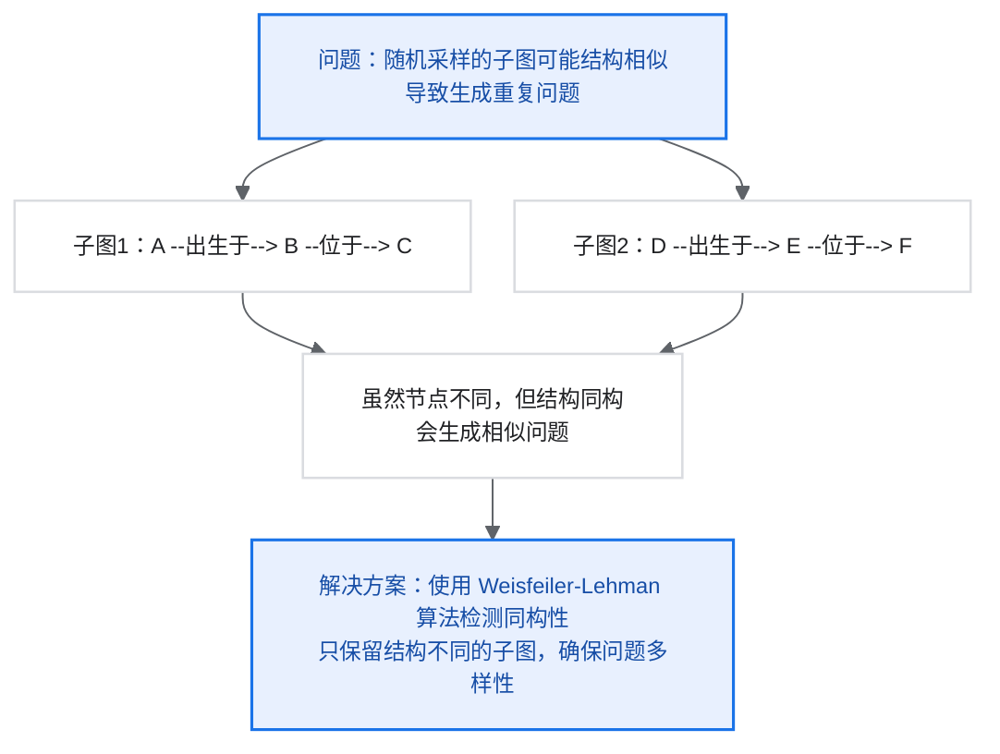

```python
import random
import networkx as nx
from networkx.algorithms import weisfeiler_lehman_graph_hash


class SubgraphSampler:
    """子图采样器：随机游走采样，并用 WL hash 去重。"""

    def __init__(self, graph: nx.DiGraph, config: dict):
        self.graph = graph
        self.min_nodes = config.get("min_nodes", 3)
        self.max_nodes = config.get("max_nodes", 10)
        self.seen_hashes = set()

    def sample_subgraphs(self, limit: int) -> list[nx.DiGraph]:
        subgraphs = []

        for _ in range(limit * 10):
            subgraph = self._random_walk_sample()
            if subgraph is None:
                continue

            graph_hash = weisfeiler_lehman_graph_hash(
                subgraph,
                edge_attr="relation",
            )

            if graph_hash not in self.seen_hashes:
                self.seen_hashes.add(graph_hash)
                subgraphs.append(subgraph)

            if len(subgraphs) >= limit:
                break

        return subgraphs

    def _random_walk_sample(self) -> nx.DiGraph | None:
        start_node = random.choice(list(self.graph.nodes()))
        visited = {start_node}
        current = start_node
        target_size = random.randint(self.min_nodes, self.max_nodes)

        while len(visited) < target_size:
            neighbors = (
                list(self.graph.neighbors(current))
                + list(self.graph.predecessors(current))
            )
            if not neighbors:
                break

            next_node = random.choice(neighbors)
            visited.add(next_node)
            current = next_node

        if len(visited) < self.min_nodes:
            return None

        return self.graph.subgraph(visited).copy()
```

#### 2.3.2 轨道节点分析与问题焦点选择

```python
import random


class OrbitAnalyzer:
    """
    轨道节点分析器。

    轨道节点：在同构映射下等价的节点。
    将问题焦点均匀分布在轨道节点上，可以增加问题多样性。
    """

    def find_orbit_nodes(self, subgraph: nx.DiGraph) -> list[list[str]]:
        node_features: dict[tuple, list[str]] = {}

        for node in subgraph.nodes():
            features = (
                subgraph.in_degree(node),
                subgraph.out_degree(node),
                self._get_neighbor_pattern(subgraph, node),
            )
            node_features.setdefault(features, []).append(node)

        return list(node_features.values())

    def _get_neighbor_pattern(self, graph: nx.DiGraph, node: str) -> tuple:
        in_relations = tuple(sorted(
            graph.edges[pred, node].get("relation", "")
            for pred in graph.predecessors(node)
        ))
        out_relations = tuple(sorted(
            graph.edges[node, succ].get("relation", "")
            for succ in graph.neighbors(node)
        ))
        return in_relations, out_relations

    def select_focus_node(
        self,
        subgraph: nx.DiGraph,
        previous_orbits: list[int],
    ) -> str:
        """优先选择之前使用次数较少的轨道，让问题焦点更分散。"""
        orbits = self.find_orbit_nodes(subgraph)
        orbit_counts = [0] * len(orbits)

        for previous_orbit in previous_orbits:
            if previous_orbit < len(orbit_counts):
                orbit_counts[previous_orbit] += 1

        min_count = min(orbit_counts)
        candidates = [i for i, count in enumerate(orbit_counts) if count == min_count]
        selected_orbit = random.choice(candidates)
        return random.choice(orbits[selected_orbit])
```

#### 2.3.3 问题生成

```python
class QuestionGenerator:
    """问题生成器。"""

    def __init__(self, llm):
        self.llm = llm

    def generate_qa(
        self,
        subgraph: nx.DiGraph,
        focus_node: str,
        apply_fog: bool = True,
    ) -> dict:
        graph_description = self._describe_subgraph(subgraph, focus_node)

        prompt = f"""
        基于以下知识图谱信息，生成一个需要多步推理才能回答的问题。
        问题的答案应该是节点 {focus_node} 的某个属性。

        知识图谱：
        {graph_description}

        要求：
        1. 问题应该需要遍历多个节点才能找到答案
        2. 问题应该使用自然语言，不要暴露图谱结构
        3. 问题应该有唯一确定的答案

        请生成问题。
        """
        question = self.llm.generate(prompt)
        answer = self._get_answer(subgraph, focus_node)

        if apply_fog:
            question = self._apply_fog(question, subgraph)

        return {
            "question": question,
            "answer": answer,
            "subgraph": nx.node_link_data(subgraph),
            "focus_node": focus_node,
        }

    def _describe_subgraph(self, subgraph: nx.DiGraph, focus_node: str) -> str:
        descriptions = []
        for u, v, data in subgraph.edges(data=True):
            u_label = subgraph.nodes[u].get("basic_info", {}).get("label", u)
            v_label = subgraph.nodes[v].get("basic_info", {}).get("label", v)
            relation = data.get("relation", "相关")
            descriptions.append(f"- {u_label} --[{relation}]--> {v_label}")
        return "\n".join(descriptions)

    def _apply_fog(self, question: str, subgraph: nx.DiGraph) -> str:
        """应用信息模糊化，增加问题难度。"""
        prompt = f"""
        将以下问题中的具体信息替换为模糊描述，增加问题难度。

        原问题：{question}

        模糊化规则：
        - 具体年份 -> “某个时期”/“X年代”
        - 具体地点 -> “某个地方”/“一个城市”
        - 人名 -> “某人”/“一位……”
        - 组织名 -> “某组织”/“一家公司”

        但要保证：
        1. 问题仍然有唯一答案
        2. 模糊化的信息可以通过搜索找到

        模糊化后的问题：
        """
        return self.llm.generate(prompt)
```

### 2.4 SailorFog V1 vs V2 的关键区别

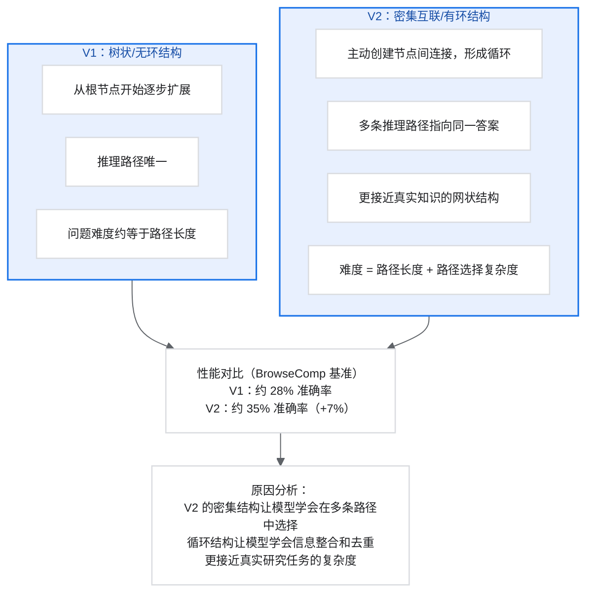

## 3. 方法二：WebFrontier

### 3.1 核心思想

WebFrontier 通过迭代复杂度升级来生成复杂问题：

- 从简单的种子 QA 开始
- 每轮通过四种操作增加复杂度
- 使用质量控制确保问题有效

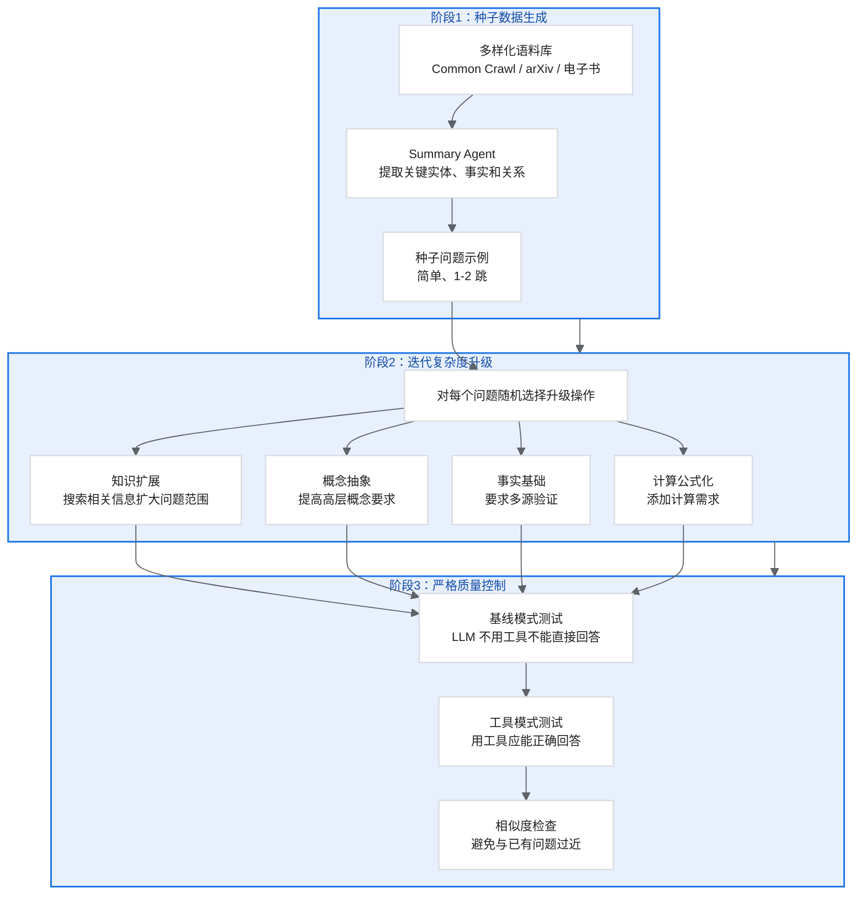

### 3.2 三阶段工作流

```text
WebFrontier 完整流程

阶段1：种子数据生成
输入：多样化语料库
- 网页（Common Crawl）
- 学术论文（arXiv, Semantic Scholar）
- 电子书（Gutenberg）

Summary Agent：预处理和蒸馏
- 提取关键实体和事实
- 识别实体间关系
- 生成结构化摘要

组合单元：关联主题
- 聚类相关实体
- 建立跨文档连接

输出：种子 QA 对（简单，1-2 跳）

阶段2：迭代复杂度升级（核心）
for iteration in range(N):
    for qa in current_qa_set:
        operation = random.choice([
            "知识扩展",    # 搜索相关信息扩大问题范围
            "概念抽象",    # 提炼高层概念
            "事实基础",    # 多源验证
            "计算公式化",  # 添加计算需求
        ])
        new_qa = ItemWriter.upgrade(qa, operation)

        if quality_check(new_qa):
            current_qa_set.add(new_qa)

阶段3：严格质量控制
- 过滤器1：基线模式测试，让 LLM 不用工具不能直接回答
- 过滤器2：工具模式测试，让 LLM 使用工具可以回答
- 过滤器3：相似度检查，和已有问题过于相似则丢弃
```

### 3.3 四种升级操作详解

```python
class ItemWriter:
    """问题复杂度升级器。"""

    def __init__(self, tools, llm):
        self.tools = tools
        self.llm = llm

    def upgrade(self, qa: dict, operation: str) -> dict:
        operations = {
            "知识扩展": self._knowledge_expansion,
            "概念抽象": self._concept_abstraction,
            "事实基础": self._fact_grounding,
            "计算公式化": self._computational_formulation,
        }
        if operation not in operations:
            raise ValueError(f"Unknown operation: {operation}")
        return operations[operation](qa)

    def _knowledge_expansion(self, qa: dict) -> dict:
        entities = self._extract_entities(qa["question"])
        search_results = []

        for entity in entities:
            search_results.extend(self.tools.execute({
                "name": "search",
                "arguments": {"query": f"{entity} related facts"},
            }))

        new_facts = self._extract_linkable_facts(search_results, qa)
        if not new_facts:
            return qa

        new_question = self._expand_question(qa["question"], new_facts)
        return {
            "question": new_question,
            "answer": qa["answer"],
            "complexity": qa.get("complexity", 1) + 1,
            "operation": "knowledge_expansion",
        }

    def _concept_abstraction(self, qa: dict) -> dict:
        prompt = f"""
        将以下问题中的具体概念替换为更抽象的描述，
        使得回答问题需要先推理出具体概念。

        原问题：{qa["question"]}
        答案：{qa["answer"]}

        要求：
        1. 新问题的答案必须和原问题相同
        2. 抽象后的描述必须能唯一确定原概念
        3. 新问题应该更难直接回答

        示例：
        原问题：“特斯拉 2024 年生产了多少辆汽车？”
        新问题：“这家由南非出生的企业家创立的电动车公司在 2024 年生产了多少辆汽车？”

        新问题：
        """
        return {
            "question": self.llm.generate(prompt),
            "answer": qa["answer"],
            "complexity": qa.get("complexity", 1) + 1,
            "operation": "concept_abstraction",
        }

    def _fact_grounding(self, qa: dict) -> dict:
        prompt = f"""
        修改以下问题，使其需要从多个来源验证信息。

        原问题：{qa["question"]}

        修改方式：
        1. 添加“根据官方数据”或“多个来源确认”等要求
        2. 或要求比较不同来源的说法

        新问题：
        """
        return {
            "question": self.llm.generate(prompt),
            "answer": qa["answer"],
            "complexity": qa.get("complexity", 1) + 0.5,
            "operation": "fact_grounding",
        }

    def _computational_formulation(self, qa: dict) -> dict:
        if not self._is_numeric_answer(qa["answer"]):
            return qa

        prompt = f"""
        将以下问题改写为需要计算才能得到答案的形式。

        原问题：{qa["question"]}
        原答案：{qa["answer"]}

        改写方式：
        - 如果答案是总数，可以改为增长率/变化量
        - 如果答案是单个值，可以改为多个值的总和/平均
        - 添加单位换算需求

        新问题和计算方法：
        """
        result = self.llm.generate(prompt)
        new_question, calculation = self._parse_computational_result(result)
        return {
            "question": new_question,
            "answer": qa["answer"],
            "calculation": calculation,
            "complexity": qa.get("complexity", 1) + 1,
            "operation": "computational_formulation",
        }
```

### 3.4 质量控制实现

```python
import numpy as np
from sentence_transformers import SentenceTransformer


class QualityController:
    """质量控制器。"""

    def __init__(self, tools, llm):
        self.tools = tools
        self.llm = llm
        self.embedding_model = SentenceTransformer("all-MiniLM-L6-v2")
        self.existing_embeddings: list[np.ndarray] = []

    def check_quality(self, qa: dict) -> tuple[bool, str]:
        if self._can_answer_without_tools(qa):
            return False, "问题太简单，无需工具即可回答"

        if not self._can_answer_with_tools(qa):
            return False, "使用工具也无法正确回答，可能问题有误"

        if self._is_too_similar(qa):
            return False, "与已有问题太相似"

        if not self._answer_is_verifiable(qa):
            return False, "答案无法通过搜索验证"

        return True, "通过所有检查"

    def _can_answer_without_tools(self, qa: dict) -> bool:
        prompt = f"请直接回答这个问题，不要搜索：\n\n{qa['question']}\n\n答案："
        response = self.llm.generate(prompt, temperature=0)
        return self._check_answer(response, qa["answer"])

    def _can_answer_with_tools(self, qa: dict) -> bool:
        agent_result = self._run_agent(qa["question"])
        return self._check_answer(agent_result, qa["answer"])

    def _is_too_similar(self, qa: dict, threshold: float = 0.85) -> bool:
        qa_embedding = self.embedding_model.encode(qa["question"])

        for existing_embedding in self.existing_embeddings:
            similarity = np.dot(qa_embedding, existing_embedding) / (
                np.linalg.norm(qa_embedding) * np.linalg.norm(existing_embedding)
            )
            if similarity > threshold:
                return True

        self.existing_embeddings.append(qa_embedding)
        return False

    def _answer_is_verifiable(self, qa: dict) -> bool:
        search_results = self.tools.execute({
            "name": "search",
            "arguments": {"query": qa["question"]},
        })
        answer = str(qa["answer"]).lower()
        return any(answer in result.snippet.lower() for result in search_results)
```

## 4. 方法三：WebShaper

### 4.1 核心思想

WebShaper 使用形式化方法来精确控制问题的推理结构：

- 将问题建模为“知识投影（Knowledge Projection）”操作
- 通过形式化语言精确定义推理链
- 保证生成的问题具有可控的复杂度

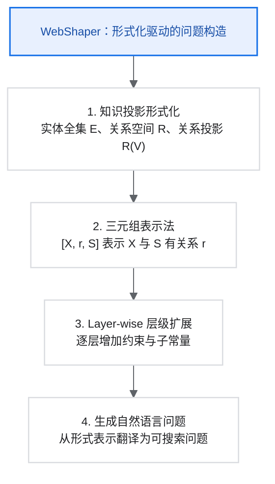

### 4.2 知识投影形式化定义

```text
Knowledge Projection 形式化定义

基本定义：
- E：实体全集（所有可能的实体）
- R ⊆ E × E：关系子空间（具有特定关系的实体对）
- R(V)：关系投影，R(V) = {u | ∃v ∈ V, (u, v) ∈ R}

示例：
- E = {所有人、所有城市、所有年份……}
- R_born = “出生于”关系
- R_born({北京}) = 所有出生于北京的人

复合操作：
1. R-Union（处理不确定性）
   R({2000}) ∪ R({2001}) ∪ ... ∪ R({2010})
   = 2000-2010 年间的所有实体

2. Intersection（满足多条件）
   R1({清华}) ∩ R2({计算机})
   = 在清华学习且专业是计算机的人

3. Chain（推理链）
   R2(R1({X}))
   = 先找到与 X 有 R1 关系的实体，再找与这些实体有 R2 关系的实体

三元组表示：
[X, r, S] 表示 “X 与 S 有关系 r”
- X：变量（V@前缀）或常量（C@前缀）
- r：关系名称
- S：变量或常量
```

### 4.3 形式化问题示例

自然语言问题：

```text
“有哪些球员在 1966 年成立的东德足球队效力，
并且在 2004-05 赛季出场，且出生于 90 年代？”
```

形式化表示：

```text
q(T) ≜ ?T s.t. [
  [V@T, playIn, V@X],                 # T 在 X 队效力
  [V@T, playAt, C@2004_05],           # T 在 2004-05 赛季出场
  [V@T, bornIn, C@90s],               # T 出生于 90 年代
  [V@X, foundIn, C@1966],             # X 成立于 1966 年
  [V@X, isA, C@East_German_football_team]  # X 是东德足球队
]
```

推理链分析：

1. 找到成立于 1966 年的东德足球队 X
2. 找到在 X 队效力的球员 T
3. 过滤：T 在 2004-05 赛季出场
4. 过滤：T 出生于 90 年代
5. 返回满足所有条件的 T

### 4.4 Layer-wise 扩展策略

```python
import random


class LayerwiseExpander:
    """Layer-wise 问题扩展器。"""

    def __init__(self, llm, knowledge_base):
        self.llm = llm
        self.kb = knowledge_base

    def expand_question(self, base_question: dict) -> dict:
        formal_repr = self._parse_formal(base_question)
        leaf_constants = self._find_leaf_constants(formal_repr)

        for constant in leaf_constants:
            sub_question = self._build_sub_question(constant)
            if sub_question:
                formal_repr = self._merge_question(
                    formal_repr,
                    sub_question,
                    constant,
                )

        new_question = self._formal_to_natural(formal_repr)
        return {
            "question": new_question,
            "answer": base_question["answer"],
            "formal_repr": formal_repr,
        }

    def _find_leaf_constants(self, formal_repr: list[list]) -> list[str]:
        all_constants = set()
        used_in_relation = set()

        for x, _r, s in formal_repr:
            if str(x).startswith("C@"):
                all_constants.add(x)
            if str(s).startswith("C@"):
                all_constants.add(s)
            if str(x).startswith("V@"):
                used_in_relation.add(x)

        return [c for c in all_constants if c not in used_in_relation]

    def _build_sub_question(self, constant: str) -> dict | None:
        entity = constant.replace("C@", "")
        facts = self.kb.get_facts_about(entity)
        if not facts:
            return None

        fact = random.choice(facts)
        return {
            "formal": [[f"V@{entity}", fact["relation"], f"C@{fact['value']}"]],
            "natural": f"满足 {fact['description']} 的实体",
        }

    def _merge_question(
        self,
        base: list[list],
        sub: dict,
        constant: str,
    ) -> list[list]:
        new_var = f"V@{constant.replace('C@', '')}"
        merged = []

        for triple in base:
            merged.append([
                new_var if item == constant else item
                for item in triple
            ])

        merged.extend(sub["formal"])
        return merged
```

### 4.5 为什么 Layer-wise 优于其他策略？

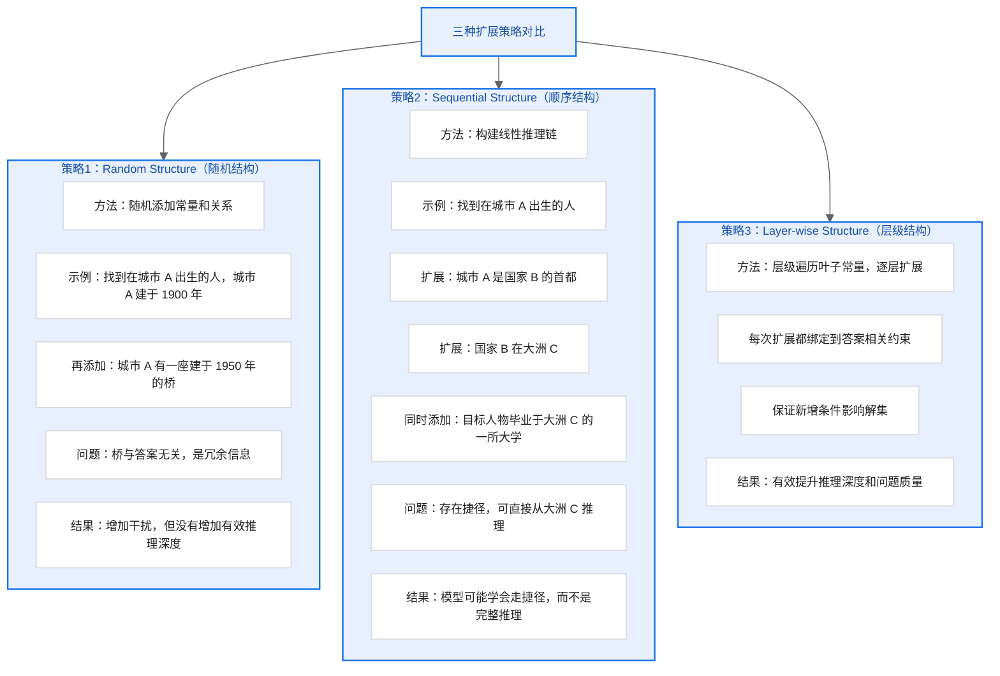

补充示例：

```text
问题示例：
原问题 q^n(T)：“找到出生于城市 A 且工作于公司 B 的人 T”

层级叶子：
- {城市 A，公司 B}

扩展城市 A：
- 城市 A 位于以 wine 闻名的地区

扩展公司 B：
- 公司 B 由某诺贝尔奖得主创立

新问题 q^(n+1)(T)：
找到出生于某 wine 产区城市，且工作于某诺贝尔奖得主创立公司的人员 T。

关键：
- q^(n+1)(T) 与 q^n(T) 有相同答案
- 没有冗余信息，没有推理捷径
- 复杂度线性增加，完全可控
```

## 5. 方法四：E2HQA

### 5.1 核心思想

E2HQA（Easy-to-Hard Question Answering）是一种简单高效的方法：

- 从已有的简单 QA 数据开始
- 通过实体替换迭代增加复杂度
- 保持答案不变

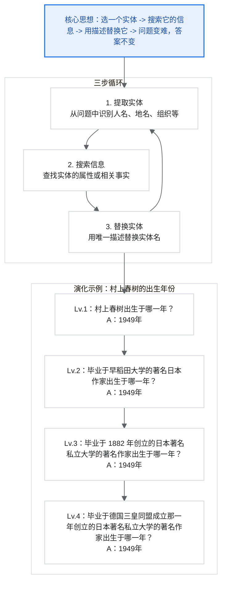

### 5.2 完整实现

```python
import json
import random


class E2HQAGenerator:
    """E2HQA 问题生成器。"""

    def __init__(self, tools, llm):
        self.tools = tools
        self.llm = llm

    def evolve_question(
        self,
        simple_qa: dict,
        num_iterations: int = 3,
    ) -> dict:
        current_qa = simple_qa.copy()

        for _ in range(num_iterations):
            entities = self._extract_entities(current_qa["question"])
            if not entities:
                break

            entity = random.choice(entities)
            related_info = self._search_entity_info(entity)
            if not related_info:
                continue

            replacement = self._build_replacement(entity, related_info)
            new_question = self._replace_entity(
                current_qa["question"],
                entity,
                replacement,
            )

            current_qa = {
                "question": new_question,
                "answer": simple_qa["answer"],  # 答案始终不变
                "evolution_steps": current_qa.get("evolution_steps", []) + [{
                    "entity": entity,
                    "replacement": replacement,
                    "related_info": related_info,
                }],
            }

        return current_qa

    def _extract_entities(self, question: str) -> list[str]:
        prompt = f"""
        从以下问题中提取所有命名实体（人名、地名、组织名、作品名等）：

        问题：{question}

        请以 JSON 列表格式返回实体。
        """
        return json.loads(self.llm.generate(prompt))

    def _search_entity_info(self, entity: str) -> dict | None:
        search_results = self.tools.execute({
            "name": "search",
            "arguments": {"query": entity},
        })
        if not search_results:
            return None

        prompt = f"""
        从以下搜索结果中提取关于“{entity}”的关键属性，
        如出生日期、创立时间、所属类别、关联人物等。

        搜索结果：
        {search_results}

        请以 JSON 格式返回属性。
        """
        return json.loads(self.llm.generate(prompt))

    def _build_replacement(self, entity: str, info: dict) -> str:
        prompt = f"""
        为实体“{entity}”构建一个间接描述，使用以下信息：

        实体信息：{info}

        要求：
        1. 描述应该能唯一确定该实体
        2. 不要直接提到实体名称
        3. 使用自然的表达方式

        示例：
        - “村上春树” -> “毕业于早稻田大学的日本著名作家”
        - “特斯拉” -> “由马斯克担任 CEO 的电动车公司”

        替换描述：
        """
        return self.llm.generate(prompt)

    def _replace_entity(self, question: str, entity: str, replacement: str) -> str:
        return question.replace(entity, replacement)
```

### 5.3 演化示例

```text
E2HQA 演化示例

初始问题（1跳）：
Q：村上春树出生于哪一年？
A：1949年

演化轮次1：
选择实体：村上春树
搜索信息：毕业院校：早稻田大学；职业：作家；国籍：日本
替换描述：毕业于早稻田大学的著名日本作家

新问题（2跳）：
Q：毕业于早稻田大学的著名日本作家出生于哪一年？
A：1949年（不变）

演化轮次2：
选择实体：早稻田大学
搜索信息：创立时间：1882年；类型：私立大学；位置：东京
替换描述：1882年创立的日本著名私立大学

新问题（3跳）：
Q：毕业于1882年创立的日本著名私立大学的著名日本作家出生于哪一年？
A：1949年（不变）

演化轮次3：
选择实体：1882年
搜索信息：同年事件：德国三皇同盟成立；中国：清朝光绪八年
替换描述：德国三皇同盟成立的那一年

最终问题（4跳）：
Q：毕业于德国三皇同盟成立那年创立的日本著名私立大学的著名日本作家出生于哪一年？
A：1949年（不变）

推理链：1882年 -> 早稻田大学 -> 村上春树 -> 1949年
```

## 6. 轨迹采样与质量过滤

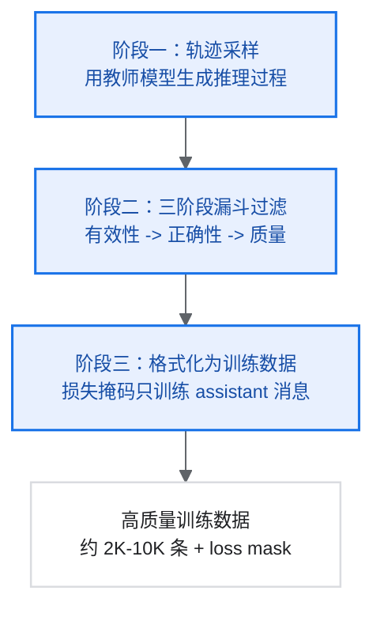

### 6.1 轨迹采样方法

```python
class TrajectorySampler:
    """轨迹采样器。"""

    def __init__(self, config: dict):
        self.teacher_model = config["teacher_model"]  # GPT-4、Claude 等
        self.tools = config["tools"]
        self.max_steps = config.get("max_steps", 50)
        self.num_samples_per_question = config.get("num_samples", 3)

    def sample_trajectories(self, qa_dataset: list[dict]) -> list[dict]:
        trajectories = []

        for qa in qa_dataset:
            for _ in range(self.num_samples_per_question):
                trajectory = self._sample_single(qa)
                if trajectory:
                    trajectories.append(trajectory)

        return trajectories

    def _sample_single(self, qa: dict) -> dict | None:
        question = qa["question"]
        answer = qa["answer"]
        messages = [{"role": "user", "content": question}]
        trajectory = []

        for step in range(self.max_steps):
            response = self.teacher_model.generate(
                messages,
                temperature=0.7,  # 采样需要一定随机性
            )
            trajectory.append({"role": "assistant", "content": response})

            if "<answer>" in response:
                extracted_answer = self._extract_answer(response)
                is_correct = self._check_answer(extracted_answer, answer)
                return {
                    "question": question,
                    "answer": answer,
                    "trajectory": trajectory,
                    "is_correct": is_correct,
                    "num_steps": step + 1,
                }

            tool_call = self._parse_tool_call(response)
            if not tool_call:
                return None

            observation = self.tools.execute(tool_call)
            messages.append({"role": "assistant", "content": response})
            messages.append({
                "role": "user",
                "content": f"<tool_response>{observation}</tool_response>",
            })
            trajectory.append({"role": "tool", "content": observation})

        return None
```

### 6.2 三阶段漏斗式过滤

```python
class TrajectoryFilter:
    """轨迹过滤器。"""

    def __init__(self, config: dict):
        self.min_steps = config.get("min_steps", 10)
        self.min_tool_calls = config.get("min_tool_calls", 5)
        self.max_tokens = config.get("max_tokens", 64000)
        self.ngram_n = config.get("ngram_n", 10)
        self.max_ngram_repeat = config.get("max_ngram_repeat", 4)
        self.judge_model = config["judge_model"]

    def filter(self, trajectories: list[dict]) -> list[dict]:
        valid = self._validity_filter(trajectories)
        print(f"有效性过滤：{len(trajectories)} -> {len(valid)}")

        correct = self._correctness_filter(valid)
        print(f"正确性过滤：{len(valid)} -> {len(correct)}")

        high_quality = self._quality_filter(correct)
        print(f"质量过滤：{len(correct)} -> {len(high_quality)}")
        return high_quality

    def _validity_filter(self, trajectories: list[dict]) -> list[dict]:
        valid = []

        for traj in trajectories:
            if not self._check_format(traj):
                continue
            if self._count_tokens(traj) > self.max_tokens:
                continue

            num_steps = len([t for t in traj["trajectory"] if t["role"] == "assistant"])
            num_tool_calls = len([t for t in traj["trajectory"] if t["role"] == "tool"])

            if num_steps < self.min_steps or num_tool_calls < self.min_tool_calls:
                continue
            if self._has_excessive_repetition(traj):
                continue

            valid.append(traj)

        return valid

    def _correctness_filter(self, trajectories: list[dict]) -> list[dict]:
        correct = []
        for traj in trajectories:
            is_correct = self._verify_answer(
                traj["question"],
                traj["answer"],
                self._extract_final_answer(traj),
            )
            if is_correct:
                correct.append(traj)
        return correct

    def _quality_filter(self, trajectories: list[dict]) -> list[dict]:
        high_quality = []

        for traj in trajectories:
            quality_score = self._evaluate_quality(traj)
            if quality_score >= 0.7:
                traj["quality_score"] = quality_score
                high_quality.append(traj)

        return high_quality

    def _evaluate_quality(self, traj: dict) -> float:
        prompt = f"""
        评估以下研究轨迹的质量（0-1分）：

        问题：{traj["question"]}

        轨迹：
        {self._format_trajectory(traj["trajectory"])}

        评估维度：
        1. 逻辑连贯性：推理步骤是否清晰合理
        2. 无幻觉：是否有编造信息的情况
        3. 工具使用合理性：工具调用是否必要和有效
        4. 信息非冗余性：是否有无效的重复搜索

        请给出总体评分（0-1）和简要理由。
        """
        response = self.judge_model.generate(prompt)
        return self._parse_score(response)

    def _has_excessive_repetition(self, traj: dict) -> bool:
        text = " ".join(t["content"] for t in traj["trajectory"])
        words = text.split()
        ngram_counts = {}

        for i in range(len(words) - self.ngram_n + 1):
            ngram = tuple(words[i:i + self.ngram_n])
            ngram_counts[ngram] = ngram_counts.get(ngram, 0) + 1

        max_count = max(ngram_counts.values()) if ngram_counts else 0
        return max_count > self.max_ngram_repeat
```

### 6.3 轨迹格式化

```python
def format_trajectory_for_training(trajectory: dict) -> dict:
    """将轨迹格式化为训练数据格式。"""
    messages = []

    messages.append({
        "role": "system",
        "content": SYSTEM_PROMPT,
    })

    messages.append({
        "role": "user",
        "content": trajectory["question"],
    })

    for item in trajectory["trajectory"]:
        if item["role"] == "assistant":
            messages.append({
                "role": "assistant",
                "content": item["content"],
            })
        elif item["role"] == "tool":
            messages.append({
                "role": "user",
                "content": f"<tool_response>{item['content']}</tool_response>",
            })

    loss_mask = []
    for msg in messages:
        if msg["role"] == "assistant":
            loss_mask.append(True)
        else:
            loss_mask.append(False)

    return {
        "messages": messages,
        "loss_mask": loss_mask,
        "metadata": {
            "question": trajectory["question"],
            "answer": trajectory["answer"],
            "num_steps": trajectory["num_steps"],
            "quality_score": trajectory.get("quality_score", 1.0),
        },
    }
```

## 7. 数据构造最佳实践

### 7.1 方法选择建议

| 场景 | 推荐方法 | 理由 |
| --- | --- | --- |
| 快速启动 | E2HQA | 实现简单，可以现有数据快速生成 |
| 高复杂度需求 | SailorFog-QA V2 | 密集图谱结构，高推理深度 |
| 精确控制复杂度 | WebShaper | 形式化定义，完全可控 |
| 多领域覆盖 | WebFrontier | 多源语料，自动扩展 |
| 综合使用 | 混合策略 | 结合各方法优势 |

### 7.2 数据规模建议

| 训练阶段 | QA 数据量 | 轨迹数据量 | 说明 |
| --- | ---: | ---: | --- |
| SFT 冷启动 | 5K-10K | 2K-5K | 高质量过滤后 |
| RL 训练 | 10K-50K | 动态采样 | 用于奖励计算 |
| 持续优化 | 持续生成 | 持续采样 | 数据-策略共生 |

### 7.3 质量控制检查清单

```text
数据质量检查清单

QA 数据检查：
□ 问题是否清晰、无歧义？
□ 答案是否唯一确定？
□ 答案是否可通过网络搜索验证？
□ 问题复杂度是否达到要求（步数、跳数）？
□ 问题是否与已有数据足够不同？
□ 问题是否覆盖目标领域？

轨迹数据检查：
□ 格式是否正确（标签闭合、JSON 有效）？
□ 最终答案是否正确？
□ 推理过程是否连贯？
□ 是否存在幻觉（编造 observation）？
□ 工具调用是否合理必要？
□ 是否存在严重重复？
□ 总长度是否在限制内？

数据集检查：
□ 领域分布是否均衡？
□ 难度分布是否合理？
□ 是否有训练/测试泄露风险？
□ 数据量是否足够？
```

## 8. 总结

本模块详细介绍了 Deep Research Agent 的数据构造方法。

关键要点：

1. 数据质量决定模型性能：高质量、多样化的数据是成功的基础
2. 四种 QA 生成方法各有优势：
   - SailorFog-QA：适合高复杂度、深度推理
   - WebFrontier：适合迭代式复杂度升级
   - WebShaper：适合精确控制推理结构
   - E2HQA：适合快速生成
3. 轨迹采样需要严格过滤：三阶段漏斗确保质量
4. 持续迭代优化：数据-策略共生循环

在下一模块中，我们将详细介绍如何使用这些数据进行模型训练。
