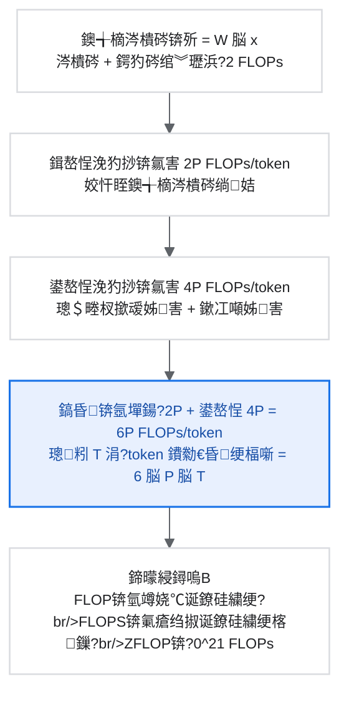
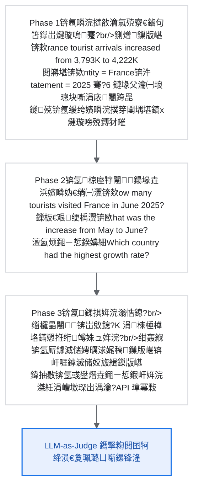

# 銆怐eepresearch绯荤粺銆戞ā鍧楀洓锛氳缁冩祦绋?
> Agentic CPT銆丼FT 鍐峰惎鍔ㄤ笌寮哄寲瀛︿範鐨勫畬鏁存寚鍗?
## 鐩綍

```mermaid
%%{init: {"theme": "base", "flowchart": {"nodeSpacing": 24, "rankSpacing": 34, "padding": 16, "htmlLabels": true, "curve": "basis"}, "themeVariables": {"fontFamily": "Source Code Pro, JetBrains Mono, Consolas, Microsoft YaHei, monospace", "fontSize": "12px", "background": "#FFFFFF", "primaryColor": "#FFFFFF", "primaryTextColor": "#202124", "primaryBorderColor": "#DADCE0", "lineColor": "#5F6368", "secondaryColor": "#F8F9FA", "tertiaryColor": "#E8F0FE", "clusterBkg": "#FFFFFF", "clusterBorder": "#DADCE0", "edgeLabelBackground": "#FFFFFF"}}}%%
flowchart LR
    A["妯″潡鍥涳細璁粌娴佺▼"]
    A --> B["1. 璁粌娴佺▼鎬昏"]
    A --> C["2. 闃舵0锛欰gentic CPT"]
    C --> C1["2.1 涓轰粈涔堥渶瑕?Agentic CPT"]
    C --> C2["2.2 AgentFounder 鏁版嵁鍚堟垚妗嗘灦"]
    C --> C3["2.3 CPT 璁粌閰嶇疆"]
    A --> D["3. 闃舵1锛歋FT 鍐峰惎鍔?]
    D --> D1["3.1 SFT 鐨勭洰鏍囦笌浣滅敤"]
    D --> D2["3.2 鏁版嵁鍑嗗"]
    A --> E["4. 寮哄寲瀛︿範闃舵"]
    A --> F["5. 鍙岀幆澧冭缁冩鏋?]
    F --> F1["5.1 涓轰粈涔堥渶瑕佸弻鐜"]
    F --> F2["5.2 妯℃嫙鐜瀹炵幇"]
    F --> F3["5.3 鐪熷疄鐜鎺ュ彛"]
    A --> G["6. 璁粌鎶€宸т笌鏈€浣冲疄璺?]
    G --> G1["6.1 甯歌闂涓庤В鍐虫柟妗?]
    G --> G2["6.2 瓒呭弬鏁拌皟浼樺缓璁?]
    G --> G3["6.3 璁粌鐩戞帶鎸囨爣"]
    G --> G4["6.4 妫€鏌ョ偣绠＄悊"]
    A --> H["7. 鎬荤粨"]

    classDef card fill:#FFFFFF,stroke:#DADCE0,stroke-width:1.3px,color:#202124;
    classDef accent fill:#E8F0FE,stroke:#1A73E8,stroke-width:1.6px,color:#174EA6;
    class A accent;
    class B,C,C1,C2,C3,D,D1,D2,E,F,F1,F2,F3,G,G1,G2,G3,G4,H card;
```

    "lr": 1e-6,
    "weight_decay": 0.01,
    "max_grad_norm": 1.0,
    "reward_weights": {
        "format": 0.1,
        "answer": 0.9,
    },
    "filter_truncated": True,
    "num_iterations": 1000,
    "eval_interval": 50,
}
```

## 1. 璁粌娴佺▼鎬昏

### 1.1 涓轰粈涔堥渶瑕佸闃舵璁粌锛?
Deep Research Agent 鐨勮缁冧笉鑳界畝鍗曞湴浣跨敤鍗曚竴鏂规硶锛屽師鍥犲涓嬶細

```mermaid
%%{init: {"theme": "base", "flowchart": {"nodeSpacing": 24, "rankSpacing": 34, "padding": 16, "htmlLabels": true, "curve": "basis"}, "themeVariables": {"fontFamily": "Source Code Pro, JetBrains Mono, Consolas, Microsoft YaHei, monospace", "fontSize": "12px", "background": "#FFFFFF", "primaryColor": "#FFFFFF", "primaryTextColor": "#202124", "primaryBorderColor": "#DADCE0", "lineColor": "#5F6368", "secondaryColor": "#F8F9FA", "tertiaryColor": "#E8F0FE", "clusterBkg": "#FFFFFF", "clusterBorder": "#DADCE0", "edgeLabelBackground": "#FFFFFF"}}}%%
flowchart TB
    R["鍗曚竴璁粌鏂规硶鐨勫眬闄愭€?]

    subgraph SFT["鍙敤 SFT 鐨勯棶棰?]
        S1["妯′豢瀛︿範涓婇檺锛氬彈绀鸿寖鏁版嵁璐ㄩ噺闄愬埗"]
        S2["鏃犳硶瀛︿範鎺㈢储琛屼负锛氬彧浼氬鍒惰杩囩殑妯″紡"]
        S3["鍒嗗竷澶栭棶棰樻硾鍖栬兘鍔涘急"]
        S4["瀹规槗杩囨嫙鍚堢壒瀹氳建杩规ā寮?]
    end

    subgraph RL["鍙敤 RL 鐨勯棶棰?]
        R1["濂栧姳鏋佸害绋€鐤忥細闅忔満鎺㈢储鍑犱箮涓嶅彲鑳芥垚鍔?]
        R2["浠庨浂瀛︿範宸ュ叿浣跨敤鏍煎紡闈炲父鍥伴毦"]
        R3["璁粌涓嶇ǔ瀹氾紝瀹规槗宕╂簝"]
        R4["闇€瑕佹捣閲忔帰绱㈡牱鏈紝鎴愭湰鏋侀珮"]
    end

    subgraph Multi["澶氶樁娈佃缁冪殑浼樺娍"]
        M1["闃舵0 CPT锛氶璁粌娉ㄥ叆 Agent 褰掔撼鍋忕疆"]
        M2["闃舵1 SFT锛氬涔犲熀鏈牸寮忓拰宸ュ叿浣跨敤"]
        M3["闃舵2 RL锛氫紭鍖栫瓥鐣ュ苟鏈€澶у寲濂栧姳"]
        M4["闃舵3 鎸佺画浼樺寲锛氱瓥鐣ュ叡鐢熷惊鐜笌鍦ㄧ嚎閫傚簲"]
    end

    R --> SFT
    R --> RL
    SFT --> Multi
    RL --> Multi

    classDef card fill:#FFFFFF,stroke:#DADCE0,stroke-width:1.3px,color:#202124;
    classDef accent fill:#E8F0FE,stroke:#1A73E8,stroke-width:1.6px,color:#174EA6;
    class R accent;
    class S1,S2,S3,S4,R1,R2,R3,R4,M1,M2,M3,M4 card;
```

澶氶樁娈佃缁冪殑浼樺娍鍙互绫绘瘮涓哄寮€杞︼細

- CPT = 浜嗚В浜ら€氳鍒欏拰杞﹁締鍘熺悊
- SFT = 鏁欑粌绀鸿寖鍩烘湰鎿嶄綔
- RL = 鐙珛椹鹃┒涓笉鏂紭鍖?
### 1.2 瀹屾暣璁粌娴佺▼鍥?
```mermaid
%%{init: {"theme": "base", "flowchart": {"nodeSpacing": 24, "rankSpacing": 34, "padding": 16, "htmlLabels": true, "curve": "basis"}, "themeVariables": {"fontFamily": "Source Code Pro, JetBrains Mono, Consolas, Microsoft YaHei, monospace", "fontSize": "12px", "background": "#FFFFFF", "primaryColor": "#FFFFFF", "primaryTextColor": "#202124", "primaryBorderColor": "#DADCE0", "lineColor": "#5F6368", "secondaryColor": "#F8F9FA", "tertiaryColor": "#E8F0FE", "clusterBkg": "#FFFFFF", "clusterBorder": "#DADCE0", "edgeLabelBackground": "#FFFFFF"}}}%%
flowchart TB
    B["鍩虹妯″瀷閫夋嫨<br/>Qwen3-7B / 14B / 30B / 72B<br/>瑕佹眰锛氶暱涓婁笅鏂囨敮鎸侊紙>=64K锛夈€佽壇濂芥寚浠ら伒寰兘鍔?]
    C["闃舵0锛欰gentic CPT锛堝彲閫変絾鎺ㄨ崘锛?br/>鏁堟灉锛?5%-10% 浠诲姟鎴愬姛鐜?br/>Stage 1锛?2K 涓婁笅鏂囷紝绾?200B tokens<br/>Stage 2锛?28K 涓婁笅鏂囷紝绾?100B tokens<br/>鏁版嵁锛欶AS + HAS"]
    S["闃舵1锛歋FT 鍐峰惎鍔?br/>鏁堟灉锛氫粠 0 鍒板彲鐢?br/>鏁版嵁锛?K-10K 楂樿川閲忚建杩?br/>鍏抽敭锛歁ask observation tokens<br/>鐩爣锛氬浼氬伐鍏蜂娇鐢ㄦ牸寮忓拰鍩烘湰鎺ㄧ悊妯″紡"]
    R["闃舵2锛氬己鍖栧涔?br/>鏁堟灉锛?10%-20% 浠诲姟鎴愬姛鐜?br/>绠楁硶锛欸RPO / DAPO / DUPO<br/>鏁版嵁锛氬姩鎬侀噰鏍凤紝鎺掗櫎鍏ㄥ/鍏ㄩ敊<br/>濂栧姳锛氱瓟妗堟纭€?+ 鏍煎紡姝ｇ‘鎬?br/>鍏抽敭锛氳礋鏍锋湰绛涢€夛紝闃叉鏍煎紡宕╂簝"]
    O["闃舵3锛氭寔缁紭鍖栵紙鍙€夛級<br/>鏁版嵁-绛栫暐鍏辩敓寰幆<br/>鍦ㄧ嚎瀛︿範涓庨€傚簲"]

    B --> C --> S --> R --> O

    classDef card fill:#FFFFFF,stroke:#DADCE0,stroke-width:1.3px,color:#202124;
    classDef accent fill:#E8F0FE,stroke:#1A73E8,stroke-width:1.6px,color:#174EA6;
    class B,C,S,R,O card;
    class C,R accent;
```

## 2. 闃舵0锛欰gentic Continual Pre-training

### 2.1 涓轰粈涔堥渶瑕?Agentic CPT锛?
閫氱敤鍩虹妯″瀷锛堝 Qwen銆丩LaMA锛夎櫧鐒跺叿鏈夊己澶х殑璇█鑳藉姏锛屼絾缂轰箯 Agent 褰掔撼鍋忕疆锛?
| 鑳藉姏 | 閫氱敤 LLM | Agent 闇€姹?|
| --- | --- | --- |
| 闀跨▼瑙勫垝 | 杈冨急 | 寮洪渶姹?|
| 宸ュ叿鐞嗚В | 鏈夐檺 | 鏍稿績鑳藉姏 |
| 杩唬鎺ㄧ悊 | 鍋忓急 | 蹇呭 |
| 閿欒鎭㈠ | 杈冨急 | 閲嶈 |
| 鐘舵€佽拷韪?| 鏈夐檺 | 鍏抽敭 |

Agentic CPT 閫氳繃鍦ㄩ璁粌闃舵娉ㄥ叆杩欎簺鍋忕疆锛岃鍚庣画鐨?SFT 鍜?RL 鏇撮珮鏁堛€?
### 闃舵0锛欰gentic CPT 鏁版嵁

鎸佺画棰勮缁冧細鍦ㄥ熀纭€妯″瀷涓敞鍏?Agent 褰掔撼鍋忕疆銆?
```mermaid
%%{init: {"theme": "base", "flowchart": {"nodeSpacing": 24, "rankSpacing": 34, "padding": 16, "htmlLabels": true, "curve": "basis"}, "themeVariables": {"fontFamily": "Source Code Pro, JetBrains Mono, Consolas, Microsoft YaHei, monospace", "fontSize": "12px", "background": "#FFFFFF", "primaryColor": "#FFFFFF", "primaryTextColor": "#202124", "primaryBorderColor": "#DADCE0", "lineColor": "#5F6368", "secondaryColor": "#F8F9FA", "tertiaryColor": "#E8F0FE", "clusterBkg": "#FFFFFF", "clusterBorder": "#DADCE0", "edgeLabelBackground": "#FFFFFF"}}}%%
flowchart TB
    D["鏁版嵁閲忥細绾?300B tokens<br/>Stage1锛?00B + Stage2锛?00B"]

    subgraph FAS["涓€闃跺姩浣滃悎鎴?FAS锛氫笉鎵ц鐪熷疄 API锛屼綆鎴愭湰鐢熸垚"]
        F1["Phase 1锛氬疄浣?鐭ヨ瘑鏄犲皠"]
        F2["Phase 2锛氬椋庢牸闂鍚堟垚"]
        F3["Phase 3锛氳鍒掑姩浣滃悎鎴?]
    end

    subgraph HAS["楂橀樁鍔ㄤ綔鍚堟垚 HAS锛氬涔犻€夋嫨鑰岄潪妯′豢"]
        H1["缁欏畾闂涓庝笂涓嬫枃"]
        H2["灞曠ず澶氫釜鍙兘鏂规"]
        H3["鏍囨敞姝ｇ‘閫夋嫨"]
        H4["璁粌涓嬩竴姝ュ喅绛栬兘鍔?]
    end

    T["CPT 鏁版嵁鎬荤粨<br/>FAS锛氬畯瑙傚姩浣?+ 闂鍚堟垚 + 瑙勫垝鍔ㄤ綔<br/>HAS锛氬喅绛栧寮猴紝瀛︿範涓轰粈涔堥€夎繖涓姩浣?]

    D --> FAS --> HAS --> T

    classDef card fill:#FFFFFF,stroke:#DADCE0,stroke-width:1.3px,color:#202124;
    classDef accent fill:#E8F0FE,stroke:#1A73E8,stroke-width:1.6px,color:#174EA6;
    class D,T accent;
    class F1,F2,F3,H1,H2,H3,H4 card;
```

### CPT 鏁版嵁閲忚绠?
| 椤圭洰 | 浼扮畻鍊?|
| --- | --- |
| FAS Phase1锛堝疄浣?鐭ヨ瘑锛?| 绾?200 tokens/鏉?|
| FAS Phase2锛堥棶棰樺悎鎴愶級 | 绾?350 tokens/鏉?|
| FAS Phase3锛堣鍒掑姩浣滐級 | 绾?500 tokens/鏉?|
| HAS锛堝喅绛栬建杩癸級 | 绾?1000 tokens/鏉?|
| 骞冲潎鍊?| 绾?500 tokens/鏉?|
| 鍘熷鏁版嵁鏉℃暟 | 300B / 500 鈮?6 浜挎潯 |

鎵撳寘鍚庣殑搴忓垪鏁帮細

| 闃舵 | 涓婁笅鏂?| Token 鏁?| 搴忓垪闀垮害 | 绾﹁缁冨簭鍒?|
| --- | --- | ---: | ---: | ---: |
| Stage 1 | 32K | 200B | 32768 tokens | 绾?610 涓?|
| Stage 2 | 128K | 100B | 131072 tokens | 绾?76 涓?|

璁粌 Batch 鍜?Steps 浼扮畻锛?
| 闃舵 | 璁粌閰嶇疆 | 绾?steps |
| --- | --- | ---: |
| Stage 1 | 姣?step 绾?4M tokens | 200B / 4M 鈮?50,000 |
| Stage 2 | 姣?step 绾?4M tokens | 100B / 4M 鈮?25,000 |

鎬荤粨锛?00B tokens 鈮?6 浜挎潯鍘熷鏁版嵁 鈮?686 涓囨潯鎵撳寘搴忓垪 鈮?7.5 涓囪缁?steps銆?
### A100 璁粌鎴愭湰浼扮畻

| 椤圭洰 | 浼扮畻鍊?|
| --- | --- |
| 璁粌 FLOPs 鍏紡 | FLOPs 鈮?6 脳 P 脳 T |
| 7B 妯″瀷銆?00B tokens | 绾?12.6 ZFLOPs |
| A100 80GB SXM 鐞嗚 BF16 | 312 TFLOPS |
| 瀹為檯鍒╃敤鐜?| 绾?45%锛屾湁鏁堢害 140 TFLOPS |
| 7B 鍗曞崱璁粌鏃堕棿 | 绾?25,000 灏忔椂锛岀害 1,042 澶?|

涓嶅悓 GPU 鏁伴噺鐨勮缁冩椂闂达紙7B 妯″瀷锛夛細

| GPU 鏁伴噺 | 璁粌鏃堕棿 | 鎹㈢畻 | 鏄惧瓨闇€姹?| 澶囨敞 |
| --- | ---: | ---: | ---: | --- |
| 8 脳 A100 | 3,125 灏忔椂 | 绾?130 澶?| 640 GB | 鍗曟満锛屽ぇ骞?|
| 32 脳 A100 | 781 灏忔椂 | 绾?33 澶?| 2.5 TB | 4 鑺傜偣锛屽彲鎺ュ彈 |
| 64 脳 A100 | 390 灏忔椂 | 绾?16 澶?| 5 TB | 鎺ㄨ崘閰嶇疆 |
| 128 脳 A100 | 195 灏忔椂 | 绾?8 澶?| 10 TB | 澶у疄楠岄厤缃?|
| 256 脳 A100 | 98 灏忔椂 | 绾?4 澶?| 20 TB | 蹇€熻凯浠?|

瀹為檯璁粌杩樿鑰冭檻 checkpoint 淇濆瓨銆佽瘎浼般€佽皟璇曟椂闂达紝鎬绘椂闂村彲鑳藉鍔?20%-30%銆?
### 鍓嶅悜 2 + 鍙嶅悜 4 = 6 鐨勭敱鏉?


### 2.2 AgentFounder 鏁版嵁鍚堟垚妗嗘灦

AgentFounder 鍖呭惈涓ょ鏁版嵁鍚堟垚绛栫暐锛?
#### 2.2.1 涓€闃跺姩浣滃悎鎴愶紙First-order Action Synthesis, FAS锛?
FAS 浠庡師濮嬫暟鎹嚭鍙戯紝鍚堟垚 Agent 鐩稿叧鐨勮缁冩暟鎹€?


浼樺寲鍚庣殑 FAS 绀轰緥锛?
```text
Phase 1锛氬疄浣撻敋瀹?
鍘熷鏁版嵁锛?"France tourist arrivals increased from 3,793K in May 2025 to
4,222K in June 2025, showing a 11.3% month-over-month growth."

閲嶆柊琛ㄨ堪锛?Entity: "France"
Statement: "Tourist arrivals in France reached 4,222K in June 2025,
showing 11.3% growth from the previous month."

鐩殑锛氬缓绔嬧€滃疄浣?-> 闄堣堪鎬х煡璇嗏€濈殑鏄犲皠鍏崇郴锛岃妯″瀷瀛︿細璁颁綇涓庡疄浣撶浉鍏崇殑浜嬪疄銆?```

```text
Phase 2锛氬椋庢牸闂鍚堟垚

浜嬪疄妫€绱㈠瀷锛?Q: "How many tourists visited France in June 2025?"
A: "4,222K tourists visited France in June 2025."

鏁板€艰绠楀瀷锛?Q: "What was the increase in France's tourist arrivals from May to June 2025?"
A: "The increase was 429K, from 3,793K to 4,222K."

澶氳烦鎺ㄧ悊鍨嬶細
Q: "Which European country had the highest tourist growth rate in June 2025,
and how many visitors did it receive?"
A: "France had 11.3% growth, receiving 4,222K visitors."
```

```text
Phase 3锛氳鍒掑姩浣滃悎鎴?
Q: "Compare France and Spain's tourist arrivals in June 2025"

鍒嗘瀽1 + 鍔ㄤ綔1锛?<think>闇€瑕佸垎鍒煡璇袱鍥芥暟鎹紝鍏堟悳绱㈡硶鍥?/think>
<action>search("France tourist arrivals June 2025")</action>

鍒嗘瀽2 + 鍔ㄤ綔2锛?<think>鍙互涓€娆℃悳绱袱鍥芥瘮杈冩暟鎹?/think>
<action>search("France Spain tourist comparison June 2025")</action>

鍒嗘瀽3 + 鍔ㄤ綔3锛?<think>鍏堟煡鎵炬娲叉梾娓哥粺璁℃姤鍛?/think>
<action>search("European tourism statistics June 2025")</action>

鍏抽敭锛氬彧鐢熸垚鎺ㄧ悊鍜屽姩浣滐紝涓嶆墽琛屽疄闄?API 璋冪敤銆?浣跨敤 LLM-as-Judge 杩涜鎷掔粷閲囨牱锛岀瓫閫夐珮璐ㄩ噺鏍锋湰銆?```

#### 2.2.2 楂橀樁鍔ㄤ綔鍚堟垚锛圚igh-order Action Synthesis, HAS锛?
HAS 鐨勬牳蹇冩礊瀵燂細**杞ㄨ抗涓殑姣忎竴姝ラ兘鏄竴涓殣钘忕殑鍐崇瓥杩囩▼**銆?
涓嬮潰鏄埅鍥句腑 `HighOrderActionSynthesis` 鐨勪紭鍖栫増锛屾牳蹇冮€昏緫鏄細瀵规瘡涓€姝ョ敓鎴愬涓閫夋€濊€?鍔ㄤ綔锛岃妯″瀷瀛︿範鈥滀负浠€涔堟纭姩浣滄洿濂解€濄€?
```python
import random


class HighOrderActionSynthesis:
    """楂橀樁鍔ㄤ綔鍚堟垚锛氫负姣忎竴姝ヨ建杩规瀯閫犲閫夊喅绛栨暟鎹€?""

    def __init__(self, llm, num_alternatives: int = 3):
        self.llm = llm
        self.num_alternatives = num_alternatives

    def synthesize(self, trajectory: dict) -> dict:
        question = trajectory["question"]
        steps = trajectory["steps"]  # [(think, action, observation), ...]
        expanded = []

        for index, (think, action, observation) in enumerate(steps):
            context = self._build_context(question, steps[:index])
            alternatives = self._generate_alternatives(context, think, action)

            options = alternatives + [(think, action)]
            random.shuffle(options)

            expanded.append({
                "context": context,
                "options": options,
                "correct_idx": options.index((think, action)),
                "observation": observation,
            })

        return self._format_for_training(question, expanded)

    def _generate_alternatives(
        self,
        context: str,
        original_think: str,
        original_action: str,
    ) -> list[tuple[str, str]]:
        prompt = f"""
        缁欏畾浠ヤ笅鐮旂┒涓婁笅鏂囷紝鐢熸垚 {self.num_alternatives} 涓笉鍚堢悊浣嗚矊浼煎彲琛岀殑
        涓嬩竴姝ユ€濊€冨拰鍔ㄤ綔鏂规銆?
        涓婁笅鏂囷細
        {context}

        鍘熷鏂规锛堜笉瑕侀噸澶嶏級锛?        鎬濊€冿細{original_think}
        鍔ㄤ綔锛歿original_action}

        杩斿洖鏍煎紡锛?        鏂规1锛?        鎬濊€冿細...
        鍔ㄤ綔锛?..
        """
        response = self.llm.generate(prompt)
        return self._parse_alternatives(response)

    def _format_for_training(self, question: str, expanded: list[dict]) -> dict:
        text = f"闂锛歿question}\n\n"

        for step in expanded:
            text += f"鎴戞湁 {len(step['options'])} 涓彲鑳界殑鏂规锛歕n"
            for i, (think, action) in enumerate(step["options"], start=1):
                text += f"鏂规{i}锛歕n鎬濊€冿細{think}\n鍔ㄤ綔锛歿action}\n"

            text += f"\n鎴戦€夋嫨鏂规{step['correct_idx'] + 1}\n"
            text += f"瑙傚療锛歿step['observation']}\n\n"

        return {"text": text}
```

HAS 鐨勪紭鍔匡細

1. 閲嶇敤娆′紭杞ㄨ抗锛氬嵆浣挎槸閿欒鐨勬楠や篃鍙互浣滀负璐熼潰鏍锋湰
2. 闃叉杩囨嫙鍚堬細妯″瀷瀛︿範鐨勬槸鍐崇瓥鑳藉姏锛岃€岄潪鐗瑰畾杞ㄨ抗
3. 鎻愬崌娉涘寲锛氳杩囨洿澶氶€夋嫨锛岄潰瀵规柊鎯呭喌鏃跺喅绛栨洿濂?
### 2.3 CPT 璁粌閰嶇疆

```python
cpt_config = {
    "stage1": {
        "context_length": 32768,
        "total_tokens": 200_000_000_000,  # 200B
        "batch_size": 4096,
        "learning_rate": 3e-5,
        "warmup_steps": 2000,
        "data_mix": {
            "fas_phase1": 0.3,   # 瀹炰綋-鐭ヨ瘑鏄犲皠
            "fas_phase2": 0.3,   # 闂鍚堟垚
            "fas_phase3": 0.2,   # 瑙勫垝鍔ㄤ綔
            "general_text": 0.2, # 淇濇寔閫氱敤鑳藉姏
        },
    },
    "stage2": {
        "context_length": 131072,
        "total_tokens": 100_000_000_000,  # 100B
        "batch_size": 1024,
        "learning_rate": 1e-5,
        "data_mix": {
            "has_trajectories": 0.5, # 楂橀樁鍔ㄤ綔鍚堟垚
            "long_context_qa": 0.3,  # 闀夸笂涓嬫枃 QA
            "general_text": 0.2,
        },
    },
}
```

## 3. 闃舵1锛歋FT 鍐峰惎鍔?
### 3.1 SFT 鐨勭洰鏍囦笌浣滅敤

SFT锛圫upervised Fine-Tuning锛夌殑涓昏鐩爣鏄細

1. 瀛︿範杈撳嚭鏍煎紡锛氭纭娇鐢?`<think>`銆乣<tool_call>`銆乣<answer>` 绛夋爣绛?2. 瀛︿範宸ュ叿浣跨敤锛氱悊瑙ｆ瘡涓伐鍏风殑鐢ㄩ€斿拰鍙傛暟鏍煎紡
3. 瀛︿範鎺ㄧ悊妯″紡锛氬缓绔嬪熀鏈殑鈥滃垎鏋?琛屽姩-瑙傚療鈥濇€濈淮妯″紡
4. 鍒濆鍖栫瓥鐣ワ細涓?RL 闃舵鎻愪緵鍚堢悊鐨勮捣鐐?
### 闃舵1锛歋FT 鏁版嵁

```mermaid
%%{init: {"theme": "base", "flowchart": {"nodeSpacing": 24, "rankSpacing": 34, "padding": 16, "htmlLabels": true, "curve": "basis"}, "themeVariables": {"fontFamily": "Source Code Pro, JetBrains Mono, Consolas, Microsoft YaHei, monospace", "fontSize": "12px", "background": "#FFFFFF", "primaryColor": "#FFFFFF", "primaryTextColor": "#202124", "primaryBorderColor": "#DADCE0", "lineColor": "#5F6368", "secondaryColor": "#F8F9FA", "tertiaryColor": "#E8F0FE", "clusterBkg": "#FFFFFF", "clusterBorder": "#DADCE0", "edgeLabelBackground": "#FFFFFF"}}}%%
flowchart TB
    D["鏁版嵁閲忥細2K-10K 鏉￠珮璐ㄩ噺瀹屾暣杞ㄨ抗"]

    subgraph F["鏁版嵁鏍煎紡锛氬畬鏁寸殑澶氳疆瀵硅瘽杞ㄨ抗"]
        F1["system锛氳鑹蹭笌宸ュ叿璇存槑"]
        F2["user锛氱敤鎴烽棶棰?]
        F3["assistant锛歵hink + tool_call"]
        F4["tool_response锛氬伐鍏疯瀵熺粨鏋?]
        F5["assistant锛歵hink + answer"]
    end

    subgraph M["Loss Mask 鐨勪綔鐢?]
        M1["鍙绠楀姪鎵嬮渶瑕佸涔犵敓鎴愮殑閮ㄥ垎"]
        M2["涓嶈绠楃敤鎴疯緭鍏ャ€佺郴缁熸彁绀哄拰宸ュ叿瑙傚療"]
        M3["閬垮厤妯″瀷瀛︿細浼€?observation"]
    end

    subgraph Q["鏁版嵁璐ㄩ噺瑕佹眰涓庤繃婊?]
        Q1["蹇呴』婊¤冻锛氭牸寮忓畬鏁淬€佺瓟妗堟纭€佽川閲忓垎鏁?> 0.8"]
        Q2["浼氳杩囨护锛氬お绠€鍗曘€佸惊鐜崱姝汇€佹牸寮忛敊璇?]
        Q3["鎺ㄨ崘鏁版嵁閲忥細7B 妯″瀷 2K-5K锛?4B-30B 妯″瀷 5K-10K"]
    end

    D --> F --> M --> Q

    classDef card fill:#FFFFFF,stroke:#DADCE0,stroke-width:1.3px,color:#202124;
    classDef accent fill:#E8F0FE,stroke:#1A73E8,stroke-width:1.6px,color:#174EA6;
    class D accent;
    class F1,F2,F3,F4,F5,M1,M2,M3,Q1,Q2,Q3 card;
```

### 3.2 鏁版嵁鍑嗗

#### 3.2.1 杞ㄨ抗鏁版嵁鏍煎紡

涓嬮潰鏄埅鍥句腑杞ㄨ抗 JSON 鐨勬暣鐞嗙増锛?
```json
{
  "messages": [
    {
      "role": "system",
      "content": "浣犳槸涓€涓爺绌跺姪鎵嬶紝鑳藉浣跨敤宸ュ叿杩涜娣卞害鐮旂┒..."
    },
    {
      "role": "user",
      "content": "娉曞浗2024骞寸殑GDP鏄灏戯紵"
    },
    {
      "role": "assistant",
      "content": "<think>鐢ㄦ埛璇㈤棶娉曞浗2024骞碐DP...</think>\n<tool_call>{\"name\":\"search\",\"arguments\":{\"query\":\"France GDP 2024\"}}</tool_call>"
    },
    {
      "role": "tool_response",
      "content": "1. France GDP 2024 - World Bank..."
    },
    {
      "role": "assistant",
      "content": "<think>鎼滅储缁撴灉鏄剧ず娉曞浗GDP绾︿负3.03涓囦嚎缇庡厓...</think>\n<answer>娉曞浗2024骞寸殑GDP绾︿负3.03涓囦嚎缇庡厓銆?/answer>"
    }
  ],
  "metadata": {
    "num_steps": 2,
    "num_tool_calls": 1,
    "quality_score": 0.95
  }
}
```

#### 3.2.2 Loss Mask 鐨勯噸瑕佹€?
鍏抽敭鎶€鏈細Mask Observation Tokens銆?
```mermaid
%%{init: {"theme": "base", "flowchart": {"nodeSpacing": 24, "rankSpacing": 34, "padding": 16, "htmlLabels": true, "curve": "basis"}, "themeVariables": {"fontFamily": "Source Code Pro, JetBrains Mono, Consolas, Microsoft YaHei, monospace", "fontSize": "12px", "background": "#FFFFFF", "primaryColor": "#FFFFFF", "primaryTextColor": "#202124", "primaryBorderColor": "#DADCE0", "lineColor": "#5F6368", "secondaryColor": "#F8F9FA", "tertiaryColor": "#E8F0FE", "clusterBkg": "#FFFFFF", "clusterBorder": "#DADCE0", "edgeLabelBackground": "#FFFFFF"}}}%%
flowchart TB
    A["涓轰粈涔堣 Mask Observation锛?]
    B["涓?Mask 鐨勯棶棰?]
    B1["妯″瀷浼氳璁粌鍘荤敓鎴愬伐鍏疯繑鍥炲唴瀹?]
    B2["瀹规槗瀛︿細浼€犳悳绱㈢粨鏋滄垨缃戦〉鍐呭"]
    B3["闄嶄綆鐪熷疄宸ュ叿璋冪敤鐨勫繀瑕佹€?]
    C["Mask 鍚庣殑鐩爣"]
    C1["鍙涔?assistant 鐨勬帹鐞嗐€佸伐鍏疯皟鐢ㄥ拰鏈€缁堢瓟妗?]
    C2["鐢ㄦ埛杈撳叆銆佺郴缁熸彁绀恒€佸伐鍏疯瀵熶笉鍙備笌 loss"]
    C3["璁╂ā鍨嬫妸 observation 褰撴垚澶栭儴鐜鍙嶉"]

    A --> B --> B1
    B --> B2
    B --> B3
    A --> C --> C1
    C --> C2
    C --> C3

    classDef card fill:#FFFFFF,stroke:#DADCE0,stroke-width:1.3px,color:#202124;
    classDef accent fill:#E8F0FE,stroke:#1A73E8,stroke-width:1.6px,color:#174EA6;
    class A accent;
    class B,B1,B2,B3,C,C1,C2,C3 card;
```

> 褰撳墠鎵规鍒拌繖閲屼负姝€傜 9 寮犳埅鍥惧彸渚х殑 Loss Mask 浠ｇ爜鍧椾粛鍦ㄧ户缁紝鍚庣画鍥剧墖鍙戞潵鍚庡彲浠ヤ粠 `3.2.2 Loss Mask 鐨勯噸瑕佹€` 缁х画杩藉姞銆?

#### 3.2.3 瀹炵幇浠ｇ爜

```python
import torch
from datasets import Dataset
from transformers import Trainer, TrainingArguments
from typing import Dict, List, Tuple


class AgentSFTTrainer:
    """Agent SFT璁粌鍣?"""

    def __init__(self, model, tokenizer, config: dict):
        self.model = model
        self.tokenizer = tokenizer
        self.config = config

    def prepare_dataset(self, trajectories: List[Dict]) -> Dataset:
        """鍑嗗璁粌鏁版嵁闆?"""
        processed = []
        for traj in trajectories:
            input_ids, labels = self._tokenize_with_mask(traj["messages"])
            processed.append({
                "input_ids": input_ids,
                "attention_mask": [1] * len(input_ids),
                "labels": labels,
            })
        return Dataset.from_list(processed)

    def _tokenize_with_mask(self, messages: List[Dict]) -> Tuple[List[int], List[int]]:
        """Tokenize骞跺垱寤?loss mask"""
        full_text = ""
        label_mask = []  # True = 璁＄畻loss锛孎alse = mask

        for msg in messages:
            role = msg["role"]
            content = msg["content"]

            if role == "system":
                full_text += f"<|system|>\n{content}\n"
                label_mask.extend([False] * len(self.tokenizer.encode(f"<|system|>\n{content}\n")))
            elif role == "user":
                full_text += f"<|user|>\n{content}\n"
                label_mask.extend([False] * len(self.tokenizer.encode(f"<|user|>\n{content}\n")))
            elif role == "assistant":
                full_text += f"<|assistant|>\n{content}\n"
                label_mask.extend([True] * len(self.tokenizer.encode(f"<|assistant|>\n{content}\n")))

        input_ids = self.tokenizer.encode(full_text)

        labels = []
        for token_idx, token_id in enumerate(input_ids):
            if label_mask[token_idx]:
                labels.append(token_id)
            else:
                labels.append(-100)

        return input_ids, labels

    def train(self, train_dataset: Dataset, eval_dataset: Dataset = None):
        """鎵ц璁粌"""
        training_args = TrainingArguments(
            output_dir=self.config["output_dir"],
            num_train_epochs=self.config.get("epochs", 3),
            per_device_train_batch_size=self.config.get("batch_size", 4),
            gradient_accumulation_steps=self.config.get("grad_accum", 8),
            learning_rate=self.config.get("lr", 5e-6),
            lr_scheduler_type="cosine",
            warmup_ratio=0.1,
            weight_decay=0.1,
            logging_steps=10,
            save_steps=500,
            eval_steps=500 if eval_dataset else None,
            evaluation_strategy="steps" if eval_dataset else "no",
            bf16=True,
            gradient_checkpointing=True,
            max_grad_norm=1.0,
        )

        trainer = Trainer(
            model=self.model,
            args=training_args,
            train_dataset=train_dataset,
            eval_dataset=eval_dataset,
        )

        trainer.train()
        return trainer
```

### 3.3 SFT 璁粌閰嶇疆

```python
sft_config = {
    "model_name": "Qwen/Qwen2.5-7B-Instruct",
    "max_length": 131072,
    "batch_size": 4,
    "grad_accum": 8,
    "epochs": 3,
    "lr": 5e-6,
    "min_lr": 1e-10,
    "warmup_ratio": 0.1,
    "weight_decay": 0.1,
    "train_data_path": "data/sft_trajectories.json",
    "min_quality_score": 0.8,
    "output_dir": "outputs/sft_checkpoint",
    "save_steps": 500,
}
```

### 3.4 SFT 鏁版嵁閲忓缓璁?

| 浠诲姟澶嶆潅搴? | 鎺ㄨ崘鏁版嵁閲? | 璇存槑 |
| --- | --- | --- |
| 绠€鍗昰gent | 2K-5K | 鍗曞伐鍏枫€佸皯姝ラ |
| 涓瓑澶嶆潅搴? | 5K-8K | 澶氬伐鍏枫€佷腑绛夋鏁?|
| Deep Research | 6K-10K | 澶氬伐鍏枫€侀暱杞ㄨ抗 |

閲嶈锛氭暟鎹川閲忔瘮鏁伴噺鏇撮噸瑕侊紝灏戦噺楂樿川閲忔暟鎹?澶ч噺浣庤川閲忔暟鎹€?

## 4. 闃舵2锛氬己鍖栧涔?

### 闃舵2锛歊L 鏁版嵁

```mermaid
%%{init: {"theme": "forest", "flowchart": {"nodeSpacing": 22, "rankSpacing": 28, "padding": 14, "htmlLabels": true, "curve": "basis"}}}%%
flowchart TB
    A["闃舵2锛歊L鏁版嵁<br/>鍦ㄧ湡瀹炵幆澧冧腑閲囨牱锛岄€氳繃濂栧姳淇″彿浼樺寲绛栫暐"]
    B["鏁版嵁閲忥細鍔ㄦ€佺敓鎴?<br/>姣忚疆128涓棶棰?8鏉¤建杩?= 1024鏉?]
    C["涓轰粈涔堥渶瑕?RL锛?br/>琛屼负鍏嬮殕澶╄姳鏉? 鍒嗗竷鍋忕Щ + 鎺㈢储缂哄け"]
    D["鏁版嵁鏍煎紡锛氫竴涓棶棰?+ 澶氭潯杞ㄨ抗 + 濂栧姳"]
    E["GRPO锛氱粍鍐呯浉瀵逛紭鍔縜r/>A_i = (R_i - mean(R)) / std(R)"]
    F["璐熸牱鏈瓫閫?br/>杩囨护琚埅鏂殑澶辫触鏍锋湰"]
    G["RL閰嶇疆<br/>group_size=8锛?max_steps=60锛?batch_size=128锛?lr=1e-6"]

    A --> B --> C --> D --> E --> F --> G

    classDef card fill:#ffffff,stroke:#7a8b6f,stroke-width:1.1px,color:#1d2a17;
    classDef accent fill:#eef6e6,stroke:#4e7a3e,stroke-width:1.5px,color:#27401d;
    class A,B accent;
    class C,D,E,F,G card;
```

### 4.1 涓轰粈涔堥渶瑕佸己鍖栧涔?

SFT鍚庣殑妯″瀷瀛樺湪浠ヤ笅灞€闄愶細

#### 1. 琛屼负鍏嬮殕鐨勫ぉ鑺辨澘

SFT妯″瀷鍙細妯夸豢绀鸿寖鏁版嵁涓殑琛屼负妯″紡銆傚鏋滅ず鑼冩暟鎹敤3姝ヨВ鍐抽棶棰橈紝妯″瀷涔熶細鍊惧悜浜庣敤3姝ワ紱浣嗘煇浜涢棶棰樺彲鑳界敤2姝ユ洿楂樻晥锛屾垨闇€瑕?姝ユ洿鍑嗙‘銆?

#### 2. 鍒嗗竷鍋忕Щ闂

璁粌鏃剁殑 `tool_response` 鏉ヨ嚜绀鸿寖鏁版嵁锛屾帹鐞嗘椂鐨?`tool_response` 鏉ヨ嚜鐪熷疄宸ュ叿璋冪敤锛屼袱鑰呭垎甯冧笉鍚岋紝瀵艰嚧妯″瀷鍦ㄧ湡瀹炵幆澧冧腑琛ㄧ幇涓嬮檷銆?

#### 3. 鎺㈢储鑳藉姏缂哄け

SFT妯″瀷涓嶄細涓诲姩鎺㈢储鏂扮殑瑙ｅ喅绛栫暐锛岄潰瀵规湭瑙佽繃鐨勯棶棰樼被鍨嬫椂锛屽鏄撻櫡鍏ュ浐瀹氭ā寮忋€?

RL鐨勮В鍐虫柟妗堬細

- 閫氳繃濂栧姳淇″彿鐩存帴浼樺寲鈥滄壘鍒版纭瓟妗堚€濊繖涓洰鏍?
- 鍦ㄧ湡瀹炵幆澧冧腑閲囨牱锛屾秷闄ゅ垎甯冨亸绉?
- 閫氳繃鎺㈢储鍙戠幇鏇翠紭绛栫暐

### 4.2 GRPO 绠楁硶璇﹁В

GRPO锛圙roup Relative Policy Optimization锛夋槸鐩墠鏈€甯哥敤鐨凙gent RL绠楁硶銆?

#### 4.2.1 鏍稿績鎬濇兂

浼犵粺RL锛圥PO锛夛細

- 闇€瑕佽缁冧竴涓?Critic缃戠粶鏉ヤ及璁?Value Function
- Advantage = R - V(s)
- Critic璁粌鍥伴毦锛屽挨鍏跺闀胯建杩?
- 澧炲姞璁粌澶嶆潅搴﹀拰璁＄畻鎴愭湰

GRPO锛?

- 涓嶉渶瑕?Critic锛屼娇鐢ㄧ粍鍐呯浉瀵逛紭鍔夸及璁?
- 瀵规瘡涓棶棰橈紝閲囨牱 G 涓建杩癸細`{τ1, τ2, ..., τG}`
- 璁＄畻姣忎釜杞ㄨ抗鐨勫鍔憋細`{R1, R2, ..., RG}`

$$
\hat{A}_i = \frac{R_i - \operatorname{mean}(R)}{\operatorname{std}(R)}
$$

#### 4.2.2 鏁板鍏紡

$$
J(\theta) = \mathbb{E}\left[\mathbb{E}_{t \sim \tau,\ \theta' \sim \pi}
\min\left(r_t(\theta)\hat{A}_t,\ \operatorname{clip}(r_t(\theta), 1-\epsilon, 1+\epsilon)\hat{A}_t\right)\right]
$$

- `r_t(θ) = π_θ(a_t | s_t) / π_{θ_old}(a_t | s_t)`
- `Â_t = (R - mean(R_group)) / std(R_group)`
- `ε` 閫氬父涓?`0.2-0.28`

```python
def compute_reward(trajectory: dict, ground_truth: str) -> float:
    """璁＄畻杞ㄨ抗濂栧姳"""
    format_reward = 1.0 if is_valid_format(trajectory) else 0.0

    if not has_answer(trajectory):
        answer_reward = 0.0
    else:
        answer_reward = llm_judge(
            question=trajectory["question"],
            prediction=extract_answer(trajectory),
            ground_truth=ground_truth,
        )

    total_reward = 0.1 * format_reward + 0.9 * answer_reward
    return total_reward
```

#### 4.2.3 瀹屾暣瀹炵幇

```python
import copy
import numpy as np
import torch
import torch.nn.functional as F
from typing import Dict, List


class GRPOTrainer:
    """GRPO璁粌鍣?"""

    def __init__(self, model, tokenizer, tools, config: dict):
        self.model = model
        self.tokenizer = tokenizer
        self.tools = tools
        self.config = config
        self.optimizer = torch.optim.AdamW(
            model.parameters(),
            lr=config.get("lr", 1e-6),
            weight_decay=config.get("weight_decay", 0.01),
        )

        self.ref_model = copy.deepcopy(model)
        self.ref_model.eval()
        for param in self.ref_model.parameters():
            param.requires_grad = False

    def train_step(self, questions: List[Dict]) -> Dict[str, float]:
        rollouts = self._sample_rollouts(questions)
        filtered_rollouts = self._filter_rollouts(rollouts)
        if not filtered_rollouts:
            return {"loss": 0.0, "filtered_ratio": 1.0}

        advantages = self._compute_advantages(filtered_rollouts)
        loss = self._compute_loss(filtered_rollouts, advantages)

        self.optimizer.zero_grad()
        loss.backward()
        torch.nn.utils.clip_grad_norm_(self.model.parameters(), 1.0)
        self.optimizer.step()

        return {
            "loss": loss.item(),
            "filtered_ratio": 1 - len(filtered_rollouts) / len(rollouts),
            "mean_reward": np.mean([r["reward"] for group in filtered_rollouts for r in group]),
        }

    def _sample_rollouts(self, questions: List[Dict]) -> List[List[Dict]]:
        group_size = self.config.get("group_size", 8)
        rollouts = []

        for q in questions:
            group = []
            for _ in range(group_size):
                trajectory = self._sample_trajectory(q)
                reward = compute_reward(trajectory, q["answer"])
                group.append({
                    "question": q["question"],
                    "trajectory": trajectory,
                    "reward": reward,
                    "log_probs": trajectory["log_probs"],
                })
            rollouts.append(group)

        return rollouts

    def _sample_trajectory(self, question: dict) -> dict:
        messages = [{"role": "user", "content": question["question"]}]
        trajectory = []
        log_probs = []

        for step in range(self.config.get("max_steps", 50)):
            with torch.no_grad():
                output = self.model.generate(
                    self._encode(messages),
                    max_new_tokens=2048,
                    temperature=self.config.get("temperature", 1.0),
                    do_sample=True,
                    return_dict_in_generate=True,
                    output_scores=True,
                )

            response = self._decode(output.sequences[0])
            step_log_prob = self._compute_log_prob(output)
            log_probs.append(step_log_prob)
            trajectory.append({"role": "assistant", "content": response})

            if "<answer>" in response:
                break

            tool_call = parse_tool_call(response)
            if tool_call:
                observation = self.tools.execute(tool_call)
                messages.append({"role": "assistant", "content": response})
                messages.append({
                    "role": "user",
                    "content": f"<tool_response>{observation}</tool_response>",
                })
                trajectory.append({"role": "tool", "content": observation})

        return {"trajectory": trajectory, "log_probs": log_probs}

    def _filter_rollouts(self, rollouts: List[List[Dict]]) -> List[List[Dict]]:
        filtered = []
        for group in rollouts:
            rewards = [r["reward"] for r in group]
            if 0 < sum(rewards) < len(rewards):
                filtered.append(group)
        return filtered

    def _compute_advantages(self, rollouts: List[List[Dict]]) -> List[List[float]]:
        advantages = []
        for group in rollouts:
            rewards = [r["reward"] for r in group]
            mean_r = np.mean(rewards)
            std_r = np.std(rewards) + 1e-8
            advantages.append([(r - mean_r) / std_r for r in rewards])
        return advantages

    def _compute_loss(self, rollouts: List[List[Dict]], advantages: List[List[float]]) -> torch.Tensor:
        total_loss = 0.0
        clip_eps_low = self.config.get("clip_eps_low", 0.2)
        clip_eps_high = self.config.get("clip_eps_high", 0.28)

        for group, group_adv in zip(rollouts, advantages):
            for rollout, adv in zip(group, group_adv):
                current_log_prob = self._get_log_prob(rollout["trajectory"])
                old_log_prob = rollout["log_probs"]
                ratio = torch.exp(current_log_prob - old_log_prob)
                surr1 = ratio * adv
                surr2 = torch.clamp(ratio, 1 - clip_eps_low, 1 + clip_eps_high) * adv
                loss = -torch.min(surr1, surr2).mean()
                total_loss += loss

        return total_loss / len(rollouts)
```

### 4.3 璐熸牱鏈瓫閫夛細闃叉鏍煎紡宕╂簝

```python
def filter_negative_samples(rollouts: List[dict]) -> List[dict]:
    filtered = []
    for rollout in rollouts:
        if rollout["reward"] > 0:
            filtered.append(rollout)
        else:
            if has_answer_tag(rollout["trajectory"]):
                filtered.append(rollout)
            elif is_truncated(rollout["trajectory"]):
                continue
            else:
                filtered.append(rollout)
    return filtered


def is_truncated(trajectory: List[dict]) -> bool:
    last_assistant = None
    for msg in reversed(trajectory):
        if msg["role"] == "assistant":
            last_assistant = msg["content"]
            break

    if last_assistant is None:
        return True

    open_tags = ["<think>", "<tool_call>", "<answer>"]
    close_tags = ["</think>", "</tool_call>", "</answer>"]
    has_open = any(tag in last_assistant for tag in open_tags)
    has_close = any(tag in last_assistant for tag in close_tags)
    return has_open and not has_close
```

### 4.4 ReSum-GRPO锛氶暱 Horizon 浼樺寲

```python
class ReSumGRPOTrainer(GRPOTrainer):
    """ReSum-GRPO璁粌鍣?"""

    def _compute_loss(self, rollouts: List[List[dict]], advantages: List[List[float]]) -> torch.Tensor:
        total_loss = 0.0
        for group, group_adv in zip(rollouts, advantages):
            for rollout, adv in zip(group, group_adv):
                segments = self._split_by_summary(rollout["trajectory"])
                for segment in segments:
                    segment_loss = self._compute_segment_loss(segment, adv)
                    total_loss += segment_loss
        return total_loss / len(rollouts)

    def _split_by_summary(self, trajectory: List[dict]) -> List[List[dict]]:
        segments = []
        current_segment = []
        for msg in trajectory:
            current_segment.append(msg)
            if self._is_summary_event(msg):
                segments.append(current_segment)
                current_segment = []
        if current_segment:
            segments.append(current_segment)
        return segments

    def _is_summary_event(self, msg: dict) -> bool:
        if msg["role"] == "user":
            return "<previous_research_summary>" in msg["content"]
        return False
```

### 4.5 RL 璁粌閰嶇疆

```python
rl_config = {
    "algorithm": "GRPO",
    "group_size": 8,
    "clip_eps_low": 0.2,
    "clip_eps_high": 0.28,
    "temperature": 1.0,
    "top_p": 1.0,
    "max_steps": 60,
    "max_tokens": 131072,
    "batch_size": 128,
    "mini_batch_size": 32,
    "lr": 1e-6,
    "weight_decay": 0.01,
    "max_grad_norm": 1.0,
    "reward_weights": {
        "format": 0.1,
        "answer": 0.9,
    },
    "filter_truncated": True,
    "num_iterations": 1000,
    "eval_interval": 50,
}
```
