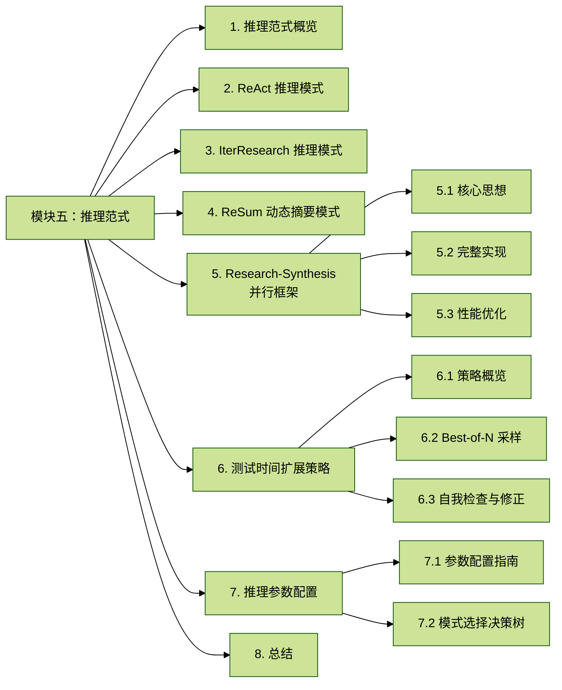
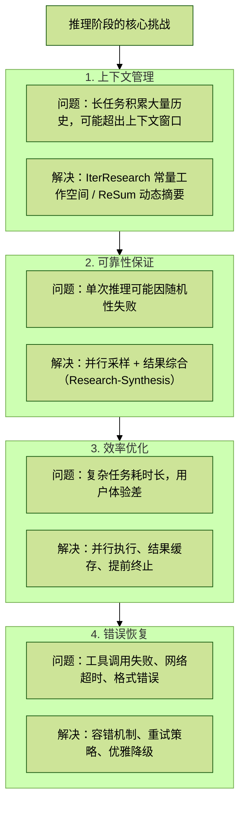
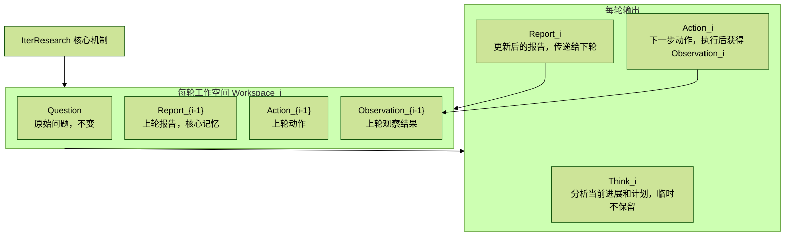
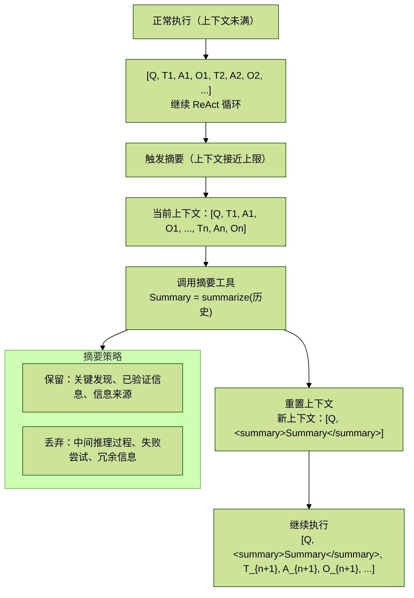
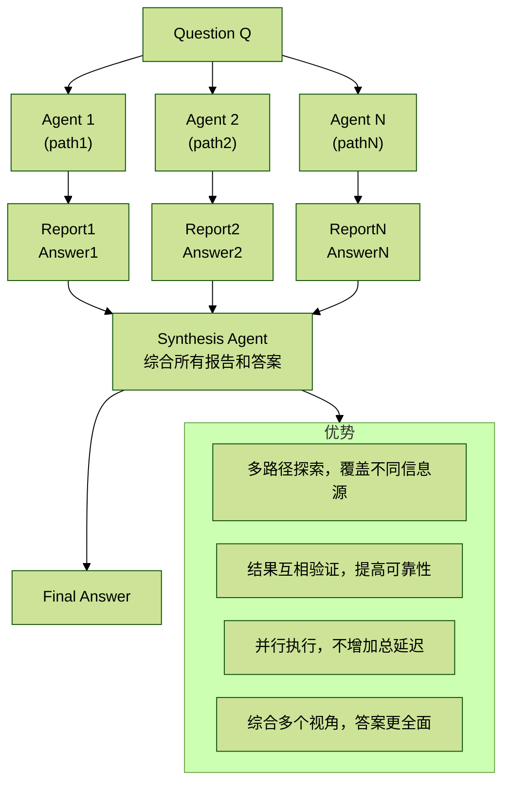
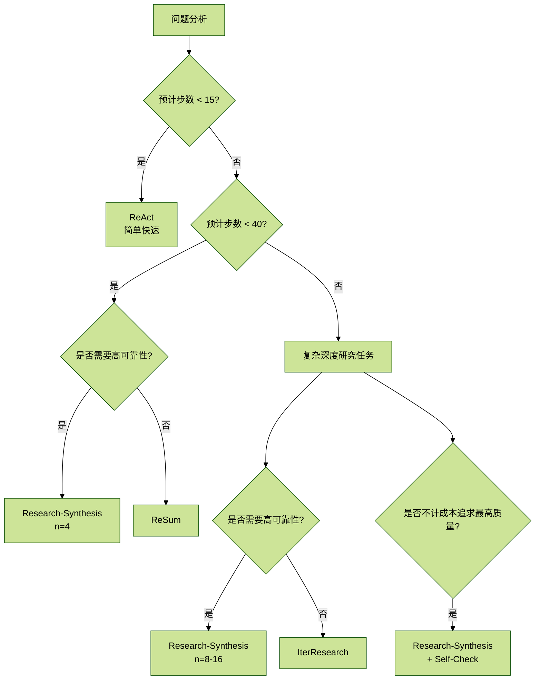

# 【Deepresearch系统】模块五：推理范式

> ReAct、IterResearch、ReSum 与测试时间扩展策略详解

## 目录



## 1. 推理范式概览

### 1.1 推理阶段的核心挑战

在推理（Inference）阶段，Deep Research Agent 面临与训练不同的挑战：



### 1.2 推理范式分类

| 范式 | 适用场景 | 上下文管理 | 复杂度支持 |
| --- | --- | --- | --- |
| ReAct | 简单任务（<15步） | 完整保留 | 低-中 |
| IterResearch | 复杂研究（15-100步） | 演进报告 | 高 |
| ReSum | 中等复杂度 | 动态摘要 | 中 |
| Research-Synthesis | 高可靠性需求 | 并行+综合 | 高 |

## 2. ReAct 推理模式

### 2.1 基本实现

ReAct 通过 `Thought -> Action -> Observation` 的循环执行研究任务，优点是简单直接，缺点是上下文会随每次工具调用持续增长。

```python
class ReActInference:
    """ReAct 推理引擎。"""

    def __init__(self, model, tools, config: dict):
        self.model = model
        self.tools = tools
        self.config = config
        self.max_steps = config.get("max_steps", 30)
        self.temperature = config.get("temperature", 0.7)
        self.top_p = config.get("top_p", 0.95)

    def run(self, question: str) -> dict:
        messages = [
            {"role": "system", "content": self._get_system_prompt()},
            {"role": "user", "content": question},
        ]

        for step in range(self.max_steps):
            response = self._generate(messages)
            messages.append({"role": "assistant", "content": response})

            if "<answer>" in response:
                return {
                    "answer": self._extract_answer(response),
                    "steps": step + 1,
                    "trajectory": messages,
                }

            tool_call = self._parse_tool_call(response)
            if tool_call:
                observation = self._execute_tool(tool_call)
                messages.append({
                    "role": "user",
                    "content": f"<tool_response>{observation}</tool_response>",
                })
            else:
                messages.append({
                    "role": "user",
                    "content": "<system_hint>请按正确格式输出 <tool_call> 或 <answer></system_hint>",
                })

        return {
            "answer": "无法在限定步数内完成",
            "steps": self.max_steps,
            "trajectory": messages,
            "status": "max_steps_exceeded",
        }

    def _generate(self, messages: list) -> str:
        return self.model.generate(
            messages,
            temperature=self.temperature,
            top_p=self.top_p,
            max_tokens=4096,
        )

    def _execute_tool(self, tool_call: dict) -> str:
        try:
            return self.tools.execute(tool_call)
        except TimeoutError:
            return "工具调用超时，请尝试其他方法"
        except Exception as exc:
            return f"工具调用失败：{exc}"

    def _get_system_prompt(self) -> str:
        return """你是一个研究助手，能够使用以下工具进行深度研究：

## 可用工具
- search(query)：搜索互联网
- visit(url, goal)：访问网页并提取相关信息
- scholar(query)：搜索学术文献
- python(code)：执行 Python 代码

## 输出格式
1. 使用 <think> 标签进行推理
2. 使用 <tool_call> 标签调用工具
3. 使用 <answer> 标签给出最终答案

## 示例
<think>用户询问X，我需要先搜索...</think>
<tool_call>{"name": "search", "arguments": {"query": "..."}}</tool_call>
"""
```

### 2.2 优化技巧

#### 2.2.1 提前终止检测

```python
from collections import Counter


class EarlyTerminationDetector:
    """提前终止检测器。"""

    def __init__(self, config: dict):
        self.confidence_threshold = config.get("confidence_threshold", 0.9)
        self.min_sources = config.get("min_sources", 2)

    def should_terminate(self, trajectory: list) -> tuple[bool, str]:
        collected_info = self._extract_info(trajectory)

        if len(collected_info["sources"]) >= self.min_sources:
            if self._info_is_consistent(collected_info):
                return True, "信息充分且一致，可以给出答案"

        if self._is_looping(trajectory):
            return True, "检测到循环，应该基于现有信息回答"

        return False, ""

    def _info_is_consistent(self, info: dict) -> bool:
        answers = info.get("candidate_answers", [])
        if len(answers) < 2:
            return False

        counter = Counter(answers)
        most_common_count = counter.most_common(1)[0][1]
        return most_common_count / len(answers) >= self.confidence_threshold
```

#### 2.2.2 重复检测与处理

```python
class RepetitionHandler:
    """重复处理器。"""

    def __init__(self, window_size: int = 5):
        self.window_size = window_size
        self.recent_queries: list[str] = []

    def check_and_handle(self, query: str, messages: list) -> tuple[bool, str]:
        normalized = self._normalize(query)

        if normalized in self.recent_queries:
            previous_result = self._find_previous_result(query, messages)
            if previous_result:
                return True, f"你已经搜索过这个了，结果是：{previous_result}"

        self.recent_queries.append(normalized)
        if len(self.recent_queries) > self.window_size:
            self.recent_queries.pop(0)

        return False, ""

    def _normalize(self, query: str) -> str:
        return " ".join(sorted(query.lower().split()))
```

## 3. IterResearch 推理模式

### 3.1 核心机制

IterResearch 的核心是 **演进报告（Evolving Report）** 作为中央记忆：



关键：工作空间大小恒定，不随轮数增长。

### 3.2 完整实现

```python
import json


class IterResearchInference:
    """IterResearch 推理引擎。"""

    def __init__(self, model, tools, config: dict):
        self.model = model
        self.tools = tools
        self.config = config
        self.max_rounds = config.get("max_rounds", 100)
        self.temperature = config.get("temperature", 0.7)

    def run(self, question: str) -> dict:
        state = IterResearchState(question)

        for round_idx in range(self.max_rounds):
            workspace = state.get_workspace()
            prompt = self._build_prompt(workspace)
            response = self._generate(prompt)
            parsed = self._parse_response(response)

            if parsed["action"]["type"] == "final_answer":
                return {
                    "answer": parsed["action"]["content"],
                    "report": parsed["report"],
                    "rounds": round_idx + 1,
                    "status": "success",
                }

            observation = self._execute_action(parsed["action"])
            state.transition(
                new_report=parsed["report"],
                action=parsed["action"],
                observation=observation,
            )

        return {
            "answer": state.report,
            "report": state.report,
            "rounds": self.max_rounds,
            "status": "max_rounds_exceeded",
        }

    def _build_prompt(self, workspace: str) -> str:
        return f"""你是一个研究助手，正在进行迭代式深度研究。

## 当前工作空间
{workspace}

## 你的任务
1. 在 <think> 中分析当前进展和下一步计划
2. 在 <report> 中更新研究报告，整合新信息，保持简洁
3. 在 <action> 中决定下一步动作

## 报告格式
<report>
## 研究进展

### 已确认信息
- [信息]：[来源]

### 待验证信息
- [内容]

### 信息缺口
- [还需要了解的]

### 当前结论
[基于已有信息的结论]
</report>

## 动作格式
工具调用：<action>{{"type": "tool", "name": "search", "args": {{"query": "..."}}}}</action>
最终答案：<action>{{"type": "final_answer", "content": "..."}}</action>

请开始："""

    def _parse_response(self, response: str) -> dict:
        think = self._extract_tag(response, "think")
        report = self._extract_tag(response, "report")
        action = self._extract_tag(response, "action")

        return {
            "think": think,
            "report": report,
            "action": json.loads(action) if action else {"type": "unknown"},
        }


class IterResearchState:
    """IterResearch 状态管理。"""

    def __init__(self, question: str):
        self.question = question
        self.report = ""
        self.last_action = None
        self.last_observation = None

    def get_workspace(self) -> str:
        workspace = f"## 原始问题\n{self.question}\n\n"
        workspace += f"## 当前报告\n{self.report}\n\n"

        if self.last_action:
            workspace += f"## 上一步动作\n{json.dumps(self.last_action, ensure_ascii=False)}\n\n"
            workspace += f"## 观察结果\n{self.last_observation}\n"

        return workspace

    def transition(self, new_report: str, action: dict, observation: str):
        self.report = new_report
        self.last_action = action
        self.last_observation = observation
```

### 3.3 报告质量控制

```python
class ReportQualityController:
    """报告质量控制器。"""

    def __init__(self, config: dict):
        self.max_report_length = config.get("max_length", 4000)
        self.llm = config.get("llm")

    def validate_and_compress(self, report: str) -> str:
        if len(report) > self.max_report_length:
            report = self._compress_report(report)

        if not self._has_valid_structure(report):
            report = self._restructure_report(report)

        return report

    def _compress_report(self, report: str) -> str:
        prompt = f"""
        请压缩以下研究报告，保留关键信息，删除冗余：

        {report}

        要求：
        1. 保留所有已确认的关键信息
        2. 保留信息来源
        3. 删除重复内容
        4. 总长度不超过 {self.max_report_length} 字符

        压缩后的报告：
        """
        return self.llm.generate(prompt)

    def _has_valid_structure(self, report: str) -> bool:
        required_sections = ["已确认信息", "当前结论"]
        return all(section in report for section in required_sections)
```

## 4. ReSum 动态摘要模式

### 4.1 核心机制

ReSum 在上下文即将溢出时触发摘要，平衡信息保留和上下文限制：



### 4.2 完整实现

```python
class ReSumInference:
    """ReSum 推理引擎。"""

    def __init__(self, model, summarizer, tools, config: dict):
        self.model = model
        self.summarizer = summarizer
        self.tools = tools
        self.config = config
        self.max_steps = config.get("max_steps", 60)
        self.token_budget = config.get("token_budget", 32000)
        self.trigger_threshold = config.get("trigger_threshold", 0.85)

    def run(self, question: str) -> dict:
        messages = [
            {"role": "system", "content": self._get_system_prompt()},
            {"role": "user", "content": question},
        ]
        summary_count = 0

        for step in range(self.max_steps):
            current_tokens = self._count_tokens(messages)
            if current_tokens > self.token_budget * self.trigger_threshold:
                summary = self._generate_summary(messages, question)
                messages = self._reset_with_summary(question, summary)
                summary_count += 1

            response = self._generate(messages)
            messages.append({"role": "assistant", "content": response})

            if "<answer>" in response:
                return {
                    "answer": self._extract_answer(response),
                    "steps": step + 1,
                    "summary_count": summary_count,
                    "status": "success",
                }

            tool_call = self._parse_tool_call(response)
            if tool_call:
                observation = self._execute_tool(tool_call)
                messages.append({
                    "role": "user",
                    "content": f"<tool_response>{observation}</tool_response>",
                })

        return {
            "answer": "达到最大步数",
            "steps": self.max_steps,
            "summary_count": summary_count,
            "status": "max_steps_exceeded",
        }

    def _generate_summary(self, messages: list, question: str) -> str:
        history = self._format_history(messages)
        prompt = f"""请将以下研究历史压缩为一个结构化摘要。

        原始问题：{question}

        研究历史：
        {history}

        摘要要求：
        1. 保留所有关键发现和已验证信息
        2. 保留信息来源（URL 或引用）
        3. 记录尚未解决的问题
        4. 删除失败的尝试和冗余推理
        5. 总长度控制在 2000 字以内

        结构化摘要："""
        return self.summarizer.generate(prompt)

    def _reset_with_summary(self, question: str, summary: str) -> list:
        return [
            {"role": "system", "content": self._get_system_prompt()},
            {
                "role": "user",
                "content": f"{question}\n\n<previous_research_summary>\n{summary}\n</previous_research_summary>",
            },
        ]

    def _count_tokens(self, messages: list) -> int:
        total = 0
        for msg in messages:
            total += len(msg["content"]) // 4
        return total
```

### 4.3 摘要质量评估

```python
class SummaryQualityEvaluator:
    """摘要质量评估器。"""

    def evaluate(self, original_history: str, summary: str, question: str) -> dict:
        scores = {}
        scores["retention"] = self._evaluate_retention(original_history, summary)
        scores["compression"] = 1 - len(summary) / len(original_history)
        scores["relevance"] = self._evaluate_relevance(summary, question)
        scores["structure"] = self._evaluate_structure(summary)

        scores["overall"] = (
            0.4 * scores["retention"]
            + 0.2 * scores["compression"]
            + 0.2 * scores["relevance"]
            + 0.2 * scores["structure"]
        )
        return scores

    def _evaluate_retention(self, original: str, summary: str) -> float:
        original_entities = self._extract_entities(original)
        summary_entities = self._extract_entities(summary)

        if not original_entities:
            return 1.0

        retained = len(original_entities & summary_entities)
        return retained / len(original_entities)
```

## 5. Research-Synthesis 并行框架

### 5.1 核心思想

Research-Synthesis 通过并行执行多个独立的研究 Agent，然后综合结果，提高可靠性：



### 5.2 完整实现

```python
import asyncio


class ResearchSynthesisInference:
    """Research-Synthesis 推理引擎。"""

    def __init__(self, research_model, synthesis_model, tools, config: dict):
        self.research_model = research_model
        self.synthesis_model = synthesis_model
        self.tools = tools
        self.config = config
        self.num_agents = config.get("num_agents", 8)
        self.max_workers = config.get("max_workers", 4)

    async def run(self, question: str) -> dict:
        research_results = await self._parallel_research(question)
        valid_results = [r for r in research_results if r["status"] == "success"]

        if not valid_results:
            return {
                "answer": "所有研究路径都失败了",
                "status": "all_failed",
            }

        final_answer = self._synthesize(question, valid_results)
        return {
            "answer": final_answer,
            "num_successful_agents": len(valid_results),
            "individual_results": valid_results,
            "status": "success",
        }

    async def _parallel_research(self, question: str) -> list[dict]:
        tasks = []
        for i in range(self.num_agents):
            task = self._single_research(question, agent_id=i)
            tasks.append(task)

        results = await asyncio.gather(*tasks, return_exceptions=True)
        processed = []

        for i, result in enumerate(results):
            if isinstance(result, Exception):
                processed.append({
                    "agent_id": i,
                    "status": "error",
                    "error": str(result),
                })
            else:
                processed.append(result)

        return processed

    async def _single_research(self, question: str, agent_id: int) -> dict:
        inference = IterResearchInference(
            model=self.research_model,
            tools=self.tools,
            config={
                **self.config,
                "seed": self.config.get("base_seed", 42) + agent_id,
                "temperature": self.config.get("temperature", 0.8),
            },
        )

        result = inference.run(question)
        result["agent_id"] = agent_id
        return result

    def _synthesize(self, question: str, results: list[dict]) -> str:
        prompt = self._build_synthesis_prompt(question, results)
        return self.synthesis_model.generate(
            prompt,
            temperature=0.3,
            max_tokens=4096,
        )

    def _build_synthesis_prompt(self, question: str, results: list[dict]) -> str:
        prompt = f"""你是一个研究综合专家。多个研究 Agent 独立回答了同一个问题，
请综合他们的发现，给出最终答案。

## 原始问题
{question}

## 各 Agent 的研究结果
"""

        for i, result in enumerate(results):
            prompt += f"""
### Agent {result["agent_id"]} 的结果
**报告摘要：**
{result.get("report", "无报告")[:2000]}

**答案：**
{result.get("answer", "无答案")}

**研究轮数：** {result.get("rounds", "N/A")}
---
"""

        prompt += """
## 你的任务
1. 分析各 Agent 的发现，识别共识和分歧
2. 交叉验证关键信息
3. 综合所有可信信息，给出最终答案
4. 如果存在分歧，说明原因并给出最可能的答案

## 最终答案
"""
        return prompt
```

### 5.3 性能优化

```python
import asyncio
from collections import Counter


class OptimizedResearchSynthesis(ResearchSynthesisInference):
    """优化的 Research-Synthesis 实现。"""

    async def run_with_early_stopping(self, question: str) -> dict:
        results = []
        pending_tasks = []
        consensus_threshold = self.config.get("consensus_threshold", 0.6)

        for i in range(self.num_agents):
            task = asyncio.create_task(self._single_research(question, agent_id=i))
            pending_tasks.append(task)

        while pending_tasks:
            done, pending_tasks = await asyncio.wait(
                pending_tasks,
                return_when=asyncio.FIRST_COMPLETED,
            )
            pending_tasks = list(pending_tasks)

            for task in done:
                result = await task
                if result["status"] == "success":
                    results.append(result)

            if self._has_consensus(results, consensus_threshold):
                for task in pending_tasks:
                    task.cancel()
                break

        return self._synthesize(question, results)

    def _has_consensus(self, results: list[dict], threshold: float) -> bool:
        if len(results) < 3:
            return False

        answers = [r.get("answer", "") for r in results]
        key_infos = [self._extract_key_info(answer) for answer in answers]
        counter = Counter(key_infos)

        most_common_count = counter.most_common(1)[0][1]
        consensus_ratio = most_common_count / len(results)
        return consensus_ratio >= threshold
```

## 6. 测试时间扩展策略

### 6.1 策略概览

测试时间扩展（Test-Time Scaling）通过在推理时投入更多计算来提升性能：

| 策略 | 方法 | 计算开销 | 效果提升 |
| --- | --- | --- | --- |
| 增加采样数 | 多次采样取最佳 | 线性增长 | 显著 |
| 并行研究 | Research-Synthesis | 并行，不增加延迟 | 显著 |
| 迭代优化 | 自我检查和修正 | 增加 2-3 轮 | 中等 |
| 多模型集成 | 不同模型投票 | 线性增长 | 中等 |

### 6.2 Best-of-N 采样

```python
class BestOfNInference:
    """Best-of-N 采样推理。"""

    def __init__(self, model, tools, judge_model, config: dict):
        self.model = model
        self.tools = tools
        self.judge_model = judge_model
        self.config = config
        self.n_samples = config.get("n_samples", 8)

    def run(self, question: str) -> dict:
        samples = []
        for i in range(self.n_samples):
            result = self._single_inference(question, seed=i)
            samples.append(result)

        valid_samples = [s for s in samples if s["status"] == "success"]
        if not valid_samples:
            return samples[0]

        scored_samples = []
        for sample in valid_samples:
            score = self._evaluate_answer(question, sample["answer"])
            scored_samples.append((score, sample))

        scored_samples.sort(key=lambda x: x[0], reverse=True)
        best_sample = scored_samples[0][1]
        best_sample["selection_score"] = scored_samples[0][0]
        return best_sample

    def _evaluate_answer(self, question: str, answer: str) -> float:
        prompt = f"""评估以下答案的质量（0-1分）：

        问题：{question}
        答案：{answer}

        评估维度：
        1. 相关性：答案是否直接回答了问题
        2. 完整性：答案是否涵盖了问题的所有方面
        3. 准确性：答案中的信息是否看起来可靠
        4. 清晰性：答案是否表达清楚

        请给出评分（0-1）："""
        response = self.judge_model.generate(prompt)
        return self._parse_score(response)
```

### 6.3 自我检查与修正

```python
class SelfCheckInference:
    """带自我检查的推理。"""

    def __init__(self, model, tools, config: dict):
        self.model = model
        self.tools = tools
        self.config = config
        self.max_revisions = config.get("max_revisions", 2)

    def run(self, question: str) -> dict:
        result = self._initial_inference(question)

        if result["status"] != "success":
            return result

        for _ in range(self.max_revisions):
            check_result = self._self_check(question, result["answer"])
            if check_result["is_correct"]:
                break

            result = self._revise_answer(
                question,
                result["answer"],
                check_result["issues"],
            )

        return result

    def _self_check(self, question: str, answer: str) -> dict:
        prompt = f"""请检查以下答案是否正确和完整：

        问题：{question}

        答案：{answer}

        检查项目：
        1. 答案是否直接回答了问题？
        2. 答案中的事实是否可能有误？
        3. 是否有重要信息遗漏？
        4. 逻辑是否自洽？

        如果发现问题，请列出具体 issues。
        如果没有问题，回复 "CORRECT"。

        检查结果："""
        response = self.model.generate(prompt)

        if "CORRECT" in response.upper():
            return {"is_correct": True, "issues": []}
        return {"is_correct": False, "issues": response}

    def _revise_answer(self, question: str, original_answer: str, issues: str) -> dict:
        prompt = f"""请根据发现的问题修正答案：

        问题：{question}

        原始答案：{original_answer}

        发现的问题：{issues}

        请给出修正后的答案（如果需要，可以进行额外搜索）："""
        return self._inference_with_context(prompt)
```

## 7. 推理参数配置

### 7.1 参数配置指南

```python
inference_configs = {
    # 简单任务（事实查询）
    "simple": {
        "mode": "react",
        "max_steps": 15,
        "temperature": 0.5,
        "top_p": 0.9,
    },

    # 中等任务（多跳推理）
    "medium": {
        "mode": "react",  # 或 "resum"
        "max_steps": 30,
        "temperature": 0.7,
        "top_p": 0.95,
        "token_budget": 32000,
    },

    # 复杂任务（深度研究）
    "complex": {
        "mode": "iterresearch",
        "max_rounds": 60,
        "temperature": 0.7,
        "top_p": 0.95,
    },

    # 高可靠性需求
    "high_reliability": {
        "mode": "research_synthesis",
        "num_agents": 8,
        "max_rounds_per_agent": 40,
        "temperature": 0.8,
        "synthesis_temperature": 0.3,
    },

    # 最高质量（不计成本）
    "best_quality": {
        "mode": "research_synthesis",
        "num_agents": 16,
        "max_rounds_per_agent": 60,
        "self_check": True,
        "max_revisions": 2,
    },
}
```

### 7.2 模式选择决策树



## 8. 总结

关键要点：

1. ReAct：简单直观，适合短任务
2. IterResearch：常量工作空间，支持无限深度研究
3. ReSum：动态摘要，平衡信息保留和上下文限制
4. Research-Synthesis：并行多 Agent，综合结果提高可靠性

选择建议：

| 场景 | 推荐范式 | 参数建议 |
| --- | --- | --- |
| 快速原型/简单查询 | ReAct | `max_steps=15, temp=0.5` |
| 一般研究任务 | ReSum | `max_steps=40, budget=32K` |
| 复杂深度研究 | IterResearch | `max_rounds=60, temp=0.7` |
| 高可靠性需求 | Research-Synthesis | `n=8, temp=0.8` |
| 最高质量 | R-S + Self-Check | `n=16, revisions=2` |

性能参考：

| 范式 | HLE 准确率 | GAIA 准确率 | 平均延迟 |
| --- | ---: | ---: | ---: |
| ReAct | ~20% | ~60% | ~30s |
| IterResearch (n=1) | ~28% | ~70% | ~2min |
| R-S (n=8) | ~33% | ~75% | ~3min |
| R-S (n=16) | ~35% | ~77% | ~4min |

在下一模块中，我们将详细介绍评估方法和基准测试。
