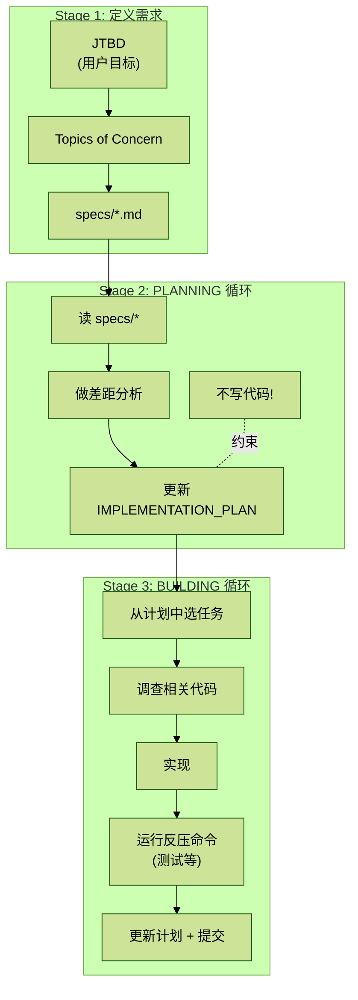

# SKILL解读-03-ralph-loop Skill 深度解读

## 目录

1. 概览
2. 目录结构
3. SKILL.md 深度解读
   3.1 YAML 前置元数据
   3.2 概览与三阶段流水线
   3.3 Step 1 - 收集输入
   3.4 Step 2 - 需求拆解为规格文件
   3.5 Step 3 - PROMPT.md 与 AGENTS.md
   3.6 Step 4 - 两套 Prompt 模板
   3.6.1 PLANNING Prompt（规划模式 - 不写代码）
   3.6.2 BUILDING Prompt（构建模式 - 执行实现）
   3.7 Step 5 - 构建单次迭代命令
   3.8 Step 6 - 输出脚本
   3.8.1 极简版（Geoff 风格）
   3.8.2 受控版（推荐）
   3.9 安全指南
   3.10 护栏（Guardrails）
4. 设计深层分析
   4.1 核心理念：AI 作为循环执行器
   4.2 与其他工作流的对比
   4.3 实际应用场景

## 1. 概览

`ralph-loop` 是一个用于生成“AI 编码循环脚本”的 Skill。它的核心功能是为用户生成一段可直接复制粘贴运行的 bash 脚本，让 AI 编码 CLI（如 Codex、Claude Code、OpenCode、Goose）以循环方式自动完成计划和构建任务。

名称来源：“Ralph Wiggum Loop”——源自 Ralph 的编程工作流方法论，通过 `PROMPT.md` + `AGENTS.md` 持久化上下文，让 AI 在每次迭代中读取并推进工作。

许可证：无单独许可证文件（仅包含 `SKILL.md`）

## 2. 目录结构

```text
ralph-loop/
└── SKILL.md    # 唯一文件 - 完整的技能定义
```

和 frontend-design 一样极简，但原因不同：frontend-design 是因为创意引导不需要脚本，ralph-loop 是因为它生成的脚本就是最终产物——Skill 本身就是一个“脚本生成器的说明书”。

## 3. SKILL.md 深度解读

### 3.1 YAML 前置元数据

```yaml
---
name: ralph-loop
description: Generate copy-paste bash scripts for Ralph Wiggum/AI agent loops
  (Codex, Claude Code, OpenCode, Goose). Use when asked for a "Ralph loop",
  "Ralph Wiggum loop", or an AI loop to plan/build code via PROMPT.md +
  AGENTS.md,
  SPECS, and IMPLEMENTATION_PLAN.md, including PLANNING vs BUILDING modes,
  backpressure, sandboxing, and completion conditions.
---
```

译文：为 Ralph Wiggum/AI 代理循环（Codex、Claude Code、OpenCode、Goose）生成可直接复制粘贴的 bash 脚本。当被要求创建“Ralph loop”、“Ralph Wiggum loop”，或通过 `PROMPT.md` + `AGENTS.md`、SPECS 和 `IMPLEMENTATION_PLAN.md` 进行 AI 循环规划/构建代码时触发，包括 PLANNING 与 BUILDING 模式、反压机制、沙箱和完成条件。

触发关键词：`Ralph loop`、`Ralph Wiggum loop`、`AI loop`，以及涉及 `PROMPT.md` / `AGENTS.md` / `IMPLEMENTATION_PLAN.md` 的循环构建请求。

### 3.2 概览与三阶段流水线

```text
## Overview
Generate a ready-to-run bash script that runs an AI coding CLI in a loop.
Align with the Ralph playbook flow:

1) Define requirements → JTBD → topics of concern → specs/*.md
2) PLANNING loop → create/update IMPLEMENTATION_PLAN.md (no implementation)
3) BUILDING loop → implement tasks, run tests (backpressure), update plan,
   commit

The loop persists context via PROMPT.md + AGENTS.md (loaded every iteration)
plus the on-disk plan/specs.
```

译文：生成一个可直接运行的 bash 脚本，让 AI 编码 CLI 以循环方式运行。遵循 Ralph 规范流程：

1. 定义需求 → JTBD（用户目标）→ 关注主题 → `specs/*.md`
2. PLANNING 循环 → 创建/更新 `IMPLEMENTATION_PLAN.md`（不做实现）
3. BUILDING 循环 → 实现任务、运行测试（反压）、更新计划、提交

循环通过 `PROMPT.md` + `AGENTS.md`（每次迭代都加载）以及磁盘上的计划/规格文件持久化上下文。

三阶段流水线示意：



> 说明：原图这一处也适合 ASCII 图，但为了在 Obsidian 中更紧凑地总览全局，这里优先转成了 Mermaid。

### 3.3 Step 1 - 收集输入

```text
### 1) Collect inputs (ask if missing)
- Goal / JTBD (what outcome is needed)
- CLI (codex, claude-code, opencode, goose, other)
- Mode: PLANNING, BUILDING, or BOTH
- Completion condition
  - Promise phrase (string to detect), or
  - Test/command to run each iteration, or
  - Plan sentinel (e.g., a line STATUS: COMPLETE in IMPLEMENTATION_PLAN.md)
- Max iterations
- Sandbox choice (none | docker | other) + security posture
- Backpressure commands (tests/lints/build) to embed in AGENTS.md
- Auto-approve flags (ask explicitly)
  - Codex: --full-auto
  - Claude Code: --dangerously-skip-permissions
```

译文：生成脚本前，若以下信息缺失则主动询问用户：

- 目标 / JTBD：需要达成什么结果
- CLI 工具：`codex`、`claude-code`、`opencode`、`goose` 或其他
- 模式：PLANNING、BUILDING 或 BOTH
- 完成条件（三选一）：Promise 短语（检测到该字符串即停止）/ 每次迭代执行的测试命令 / 计划哨兵（如 `IMPLEMENTATION_PLAN.md` 中出现 `STATUS: COMPLETE`）
- 最大迭代次数
- 沙箱选择：`none` / `docker` / 其他，以及安全策略
- 反压命令：测试 / lint / 构建命令，嵌入到 `AGENTS.md`
- 自动批准标志（必须显式询问）：Codex 用 `--full-auto`，Claude Code 用 `--dangerously-skip-permissions`

各输入项说明：

| 输入项 | 说明 | 示例 |
| --- | --- | --- |
| Goal / JTBD | 用户最终要达成什么结果 | “构建一个 REST API 服务” |
| CLI | 使用哪个 AI 编码工具 | codex、claude、opencode、goose |
| Mode | 运行模式 | PLANNING、BUILDING、BOTH |
| Completion Condition | 何时停止循环 | Promise 短语 / 测试命令 / Plan sentinel |
| Max Iterations | 最大迭代次数 |  |
| Sandbox | 沙箱选择 | none、docker、其他 |
| Backpressure | 反压命令（测试/lint/构建） | `npm test`、`cargo check` |
| Auto-approve | 自动批准标志 | `Codex: --full-auto; Claude: --dangerously-skip-permissions` |

关键设计：Auto-approve 标志要求显式询问用户，不能默认开启——这是安全意识的体现。

### 3.4 Step 2 - 需求拆解为规格文件

```text
### 2) Phase 1 - Requirements → specs
If the user wants "full Ralph" (or unclear requirements), do this before the
loop:
- Break the JTBD into topics of concern (1 topic = 1 spec file).
- For each topic, draft specs/<topic>.md.
- Use subagents to load URLs or existing docs into context for spec quality.
- Keep specs short and testable.
```

译文：如果用户想要“完整的 Ralph 流程”或需求不明确，在启动循环前先做需求拆解：

- 将 JTBD 拆解为关注主题（1 个主题 = 1 个规格文件）
- 为每个主题起草 `specs/<topic>.md`
- 可使用子代理加载 URL 或现有文档到上下文，以提升规格质量
- 规格保持简短且可测试

拆解逻辑：

```text
JTBD（用户目标）
    ↓
分解为 Topics of Concern（关注主题）
    ↓
每个主题 → 一个 specs/<topic>.md 文件
```

> 说明：这一处原图本身就是极简的文本结构示意，用 ASCII 保留更贴近截图。

### 3.5 Step 3 - PROMPT.md 与 AGENTS.md

```text
### 3) Phase 2/3 - PROMPT.md + AGENTS.md
- Context loaded each iteration: PROMPT.md + AGENTS.md.
- AGENTS.md should include:
  - project test commands (backpressure)
  - build/run instructions
  - any operational learnings
- PROMPT.md should reference:
  - specs/*.md
  - IMPLEMENTATION_PLAN.md
  - any relevant project files/dirs
```

译文：每次迭代加载的上下文：`PROMPT.md` + `AGENTS.md`。

`AGENTS.md` 应包含：项目测试命令（反压）、构建/运行指令、运行中积累的操作经验。

`PROMPT.md` 应引用：`specs/*.md`、`IMPLEMENTATION_PLAN.md`、相关项目文件/目录。

这是 Ralph Loop 的核心持久化机制——AI 上下文不依赖对话历史，而是每次迭代重新从磁盘文件读取，因此可以无限循环而不丢失状态。

### 3.6 Step 4 - 两套 Prompt 模板

```text
### 4) Two prompt templates (PLANNING vs BUILDING)
Create two prompts and swap PROMPT.md based on mode.
```

译文：创建两套 Prompt，根据模式切换 `PROMPT.md` 的内容。

#### 3.6.1 PLANNING Prompt（规划模式 - 不写代码）

```text
You are running a Ralph PLANNING loop for: <JTBD/GOAL>.

Read specs/* and the current codebase. Do a gap analysis and update
IMPLEMENTATION_PLAN.md only.
Rules:
- Do NOT implement.
- Do NOT commit.
- Prioritize tasks and keep plan concise.
- If requirements are unclear, write clarifying questions into the plan.

Completion:
If the plan is complete, add line: STATUS: COMPLETE
```

译文：你正在为 `<JTBD/GOAL>` 运行 Ralph PLANNING 循环。

读取 `specs/*` 和当前代码库，做差距分析，只更新 `IMPLEMENTATION_PLAN.md`。

规则：不得实现代码；不得提交；任务优先级排序，计划保持简洁；需求不清晰时将澄清问题写入计划。

完成条件：计划完成后，在文件末尾添加一行：`STATUS: COMPLETE`

设计意图：将“想”和“做”严格分离。规划阶段只产出计划文档，不碰代码，避免 AI 在需求不清晰时就开始写代码。

#### 3.6.2 BUILDING Prompt（构建模式 - 执行实现）

```text
You are running a Ralph BUILDING loop for: <JTBD/GOAL>.

Context:
- specs/*
- IMPLEMENTATION_PLAN.md
- AGENTS.md (tests/backpressure)

Tasks:
1) Pick the most important task from IMPLEMENTATION_PLAN.md.
2) Investigate relevant code (don't assume missing).
3) Implement.
4) Run the backpressure commands from AGENTS.md.
5) Update IMPLEMENTATION_PLAN.md (mark done + notes).
6) Update AGENTS.md if you learned new operational details.
7) Commit with a clear message.

Completion:
If all tasks are done, add line: STATUS: COMPLETE
```

译文：你正在为 `<JTBD/GOAL>` 运行 Ralph BUILDING 循环。

上下文：`specs/*`、`IMPLEMENTATION_PLAN.md`、`AGENTS.md`（测试/反压）。

每次迭代执行：①从计划中挑选最重要的任务；②调查相关代码（不要假设代码缺失）；③实现；④运行 `AGENTS.md` 中的反压命令；⑤更新计划（标记完成 + 备注）；⑥若学到新的操作细节则更新 `AGENTS.md`；⑦用清晰的消息提交。

完成条件：所有任务完成后添加一行：`STATUS: COMPLETE`

设计意图：每次迭代执行一个任务，执行后更新计划和操作文档，形成自我更新的上下文。步骤 ⑥ 特别精妙——AI 在实现过程中学到的东西（如某个 API 需要特殊配置）会被写回 `AGENTS.md`，让后续迭代受益。

### 3.7 Step 5 - 构建单次迭代命令

```text
### 5) Build the per-iteration command
- Codex: codex exec <FLAGS> "$(cat PROMPT.md)"
  - Requires git repo.
- Claude Code: claude <FLAGS> "$(cat PROMPT.md)"
- OpenCode: opencode run "$(cat PROMPT.md)"
- Goose: goose run "$(cat PROMPT.md)" (ask if they want the Goose recipe)

If the CLI is unknown, ask for the exact command to run each iteration.
```

译文：各 CLI 工具的单次迭代命令格式：

- Codex（需要 git 仓库）：`codex exec <FLAGS> "$(cat PROMPT.md)"`
- Claude Code：`claude <FLAGS> "$(cat PROMPT.md)"`
- OpenCode：`opencode run "$(cat PROMPT.md)"`
- Goose：`goose run "$(cat PROMPT.md)"`（询问用户是否需要 Goose recipe）

若 CLI 工具未知，询问用户每次迭代需要运行的确切命令。

共同模式：`<CLI> <FLAGS> "$(cat PROMPT.md)"` —— 用 `cat` 从文件读取 prompt，而非硬编码在脚本中。这样每次迭代自动获取最新的 `PROMPT.md` 内容。

### 3.8 Step 6 - 输出脚本

```text
### 6) Output a copy-paste script
Provide either a minimal loop or a controlled loop with max iters + stop
conditions.
```

译文：提供两种版本：极简循环，或带最大迭代次数和停止条件的受控循环。

#### 3.8.1 极简版（Geoff 风格）

```bash
while :; do cat PROMPT.md | claude ; done
```

只有一行。简单粗暴，没有停止条件，没有日志，没有错误处理。适合快速实验。

#### 3.8.2 受控版（推荐）

```bash
#!/usr/bin/env bash
set -euo pipefail  # 严格模式：错误即退出、未定义变量报错、管道错误传播

PROMISE="..."                    # 完成承诺短语（在输出中检测到就停止）
MAX_ITERS=...                    # 最大迭代次数
CLI_FLAGS="..."                  # CLI 工具的额外参数（可选）
PLAN_SENTINEL='STATUS: COMPLETE' # 计划文件中的完成标记
TEST_CMD="..."                   # 每次迭代后运行的测试命令（可选）

# 安全检查：必须在 git 仓库中运行
if ! git rev-parse --is-inside-work-tree >/dev/null 2>&1; then
  echo "❌ Run this inside a git repo."
  exit 1
fi

# 确保关键文件存在
touch PROMPT.md AGENTS.md IMPLEMENTATION_PLAN.md
LOG_FILE=".ralph/ralph.log"
mkdir -p .ralph

CLI_CMD="..."  # 例如 "codex exec" 或 "claude"

for i in $(seq 1 "$MAX_ITERS"); do
  echo -e "\n=== Ralph iteration $i/$MAX_ITERS ===" | tee -a "$LOG_FILE"

  # 执行 AI CLI，将 PROMPT.md 的内容作为输入
  $CLI_CMD $CLI_FLAGS "$(cat PROMPT.md)" | tee -a "$LOG_FILE"

  # 反压机制：每次迭代后运行测试
  if [[ -n "${TEST_CMD}" ]]; then
    echo "Running tests: $TEST_CMD" | tee -a "$LOG_FILE"
    bash -lc "$TEST_CMD" | tee -a "$LOG_FILE"
  fi

  # 完成检测：两种退出条件
  # 1. 日志中出现 Promise 短语
  # 2. 计划文件中出现 STATUS: COMPLETE
  if grep -Fq "$PROMISE" "$LOG_FILE" || grep -Fq "$PLAN_SENTINEL" \
    IMPLEMENTATION_PLAN.md; then
    echo "✅ Completion detected. Stopping." | tee -a "$LOG_FILE"
    exit 0
  fi
done

# 超过最大迭代次数仍未完成
echo "❌ Max iterations reached without completion." | tee -a "$LOG_FILE"
exit 1
```

受控版关键设计要点：

| 维度 | 设计 | 说明 |
| --- | --- | --- |
| 反压机制 | 每次迭代后运行 `TEST_CMD` | 测试失败时下一轮 AI 自然去修复，形成隐式质量门禁 |
| 双重完成检测 | Promise 短语 OR Plan sentinel | 两者更其一即可停止，灵活适配不同场景 |
| 日志持久化 | 所有输出 `tee` 到日志文件 | 便于事后审查每次迭代的行为 |
| Git 仓库要求 | 启动前强制检测 | 确保每次提交都有版本历史，支持回退 |

### 3.9 安全指南

```text
## Safety/Sandbox Guidance (must mention)
- Running with --dangerously-skip-permissions or --full-auto implies trust +
  risk.
- Recommend a sandbox (docker/e2b/fly) with minimal credentials and restricted
  network.
- Escape hatches: Ctrl+C to stop; git reset --hard to revert.
```

译文：

- 使用 `--dangerously-skip-permissions` 或 `--full-auto` 意味着完全信任 AI，伴随相应风险。
- 推荐使用沙箱（docker/e2b/fly），限制凭证和网络访问范围。
- 逃生通道：`Ctrl+C` 停止循环；`git reset --hard` 回退所有变更。

注意：Skill 要求生成脚本时必须提及安全事项，不可省略。

### 3.10 护栏（Guardrails）

```text
## Guardrails
- If requirements are unclear, insist on specs before BUILDING.
- If the plan looks stale/wrong, regenerate it (PLANNING loop).
- If backpressure commands are missing, ask for them and add to AGENTS.md.
```

译文：

- 需求不清晰时，坚持先完成 specs 再进入 BUILDING 模式。
- 计划看起来过时或有误时，重新运行 PLANNING 循环。
- 缺少反压命令时，向用户索要并添加到 `AGENTS.md`。

三条防御性规则：

| 维度 | 触发条件 | 处理方式 |
| --- | --- | --- |
| 需求不清 | 用户直接要求 BUILDING | 先完成 specs 再继续 |
| 计划过时 | 计划内容与现状不符 | 重跑 PLANNING 循环 |
| 缺少反压 | 没有测试/lint 命令 | 主动向用户索要 |

## 4. 设计深层分析

### 4.1 核心理念：AI 作为循环执行器

Ralph Loop 将 AI 从“一次性问答”提升为“循环执行器”。三个关键洞察：

**上下文持久化：** 每次迭代通过文件系统（`PROMPT.md`、`AGENTS.md`、`IMPLEMENTATION_PLAN.md`）传递上下文，而非依赖对话历史，因此可以无限循环而不丢失状态。

**自我演进：** AI 在 BUILDING 模式中会更新 `AGENTS.md`（操作知识）和 `IMPLEMENTATION_PLAN.md`（任务状态），形成正反馈循环——AI 越跑越“懂”这个项目。

**规划与执行分离：** PLANNING 模式和 BUILDING 模式严格分离，防止 AI 在想清楚之前就动手，避免方向性错误。

### 4.2 与其他工作流的对比

| 维度 | Ralph Loop | 交互式开发（如 Superpowers） |
| --- | --- | --- |
| 执行模式 | CLI 循环（无人值守） | 交互式对话 |
| 状态管理 | 文件系统（PROMPT.md 等） | 对话上下文 + 任务列表 |
| 质量保证 | 反压命令（测试） | 子代理审查 + TDD |
| 适用场景 | 大型自动化构建 | 交互式开发 |

Ralph Loop 更像是“放手让 AI 跑”，交互式开发更像是“和 AI 结对编程”。

### 4.3 实际应用场景

**MVP 快速构建：** 定义好 specs，让 AI 循环构建整个项目，无需人工干预每一步。

**大规模重构：** PLANNING 循环分析代码库，生成完整迁移计划；BUILDING 循环逐步执行，每步提交可回退。

**CI/CD 集成：** 作为自动化管道的一部分运行，用完成条件控制退出。

**探索性开发：** 极简版（`while :; do cat PROMPT.md | claude ; done`）适合快速原型，不需要任何配置。

---

> OCR 不确定片段：
> - 3.3 输入说明表中 `Auto-approve` 示例右侧在截图边缘略有截断，但可见内容应为 `Codex: --full-auto; Claude: --dangerously-skip-permissions`。
> - 本批截图只显示到 `4.3 实际应用场景`，`4.2 与其他工作流的对比` 以下若原文还有后续内容，当前不可见。
