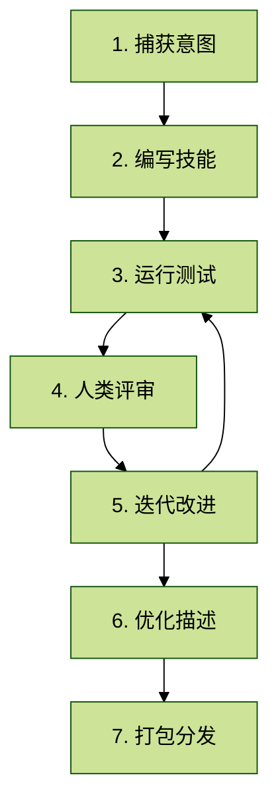
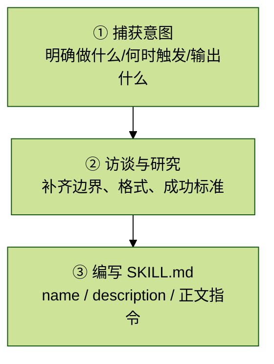
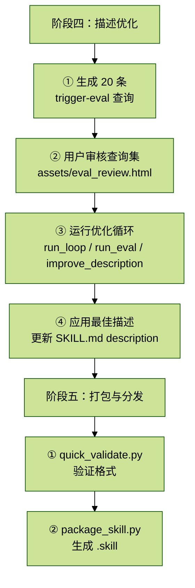

# SKILL解读-04-skill-creator Skill 深度解读

## 目录

1. 概览
2. 目录结构
3. SKILL.md 深度解读
   3.1 YAML 前置元数据
   3.2 核心流程概述
   3.3 与用户沟通原则
   3.4 创建技能
   3.4.1 捕获意图（Capture Intent）
   3.4.2 访谈与研究（Interview and Research）
   3.4.3 编写 SKILL.md
   3.4.4 技能编写指南（Skill Writing Guide）
   3.4.4.1 技能目录结构（Anatomy of a Skill）
   3.4.4.2 渐进式披露（Progressive Disclosure）
   3.4.4.3 领域组织（Domain Organization）
   3.4.4.4 编写风格（Writing Style）
   3.5 运行与评估测试
   3.5.1 Step 1 — 同时启动所有测试
   3.5.2 Step 2 — 测试运行期间起草断言
   3.5.3 Step 3 — 捕获 Timing 数据
   3.5.4 Step 4 — 评分、聚合与启动查看器
   3.5.5 Step 5 — 读取反馈
   3.6 改进技能
   3.7 高级：盲比较
   3.8 描述优化
   3.8.1 Step 1 — 生成触发评估查询
   3.8.2 Step 2 — 与用户确认评估集
   3.8.3 Step 3 — 运行优化循环

## 1. 概览

`skill-creator` 是一个“元技能”（meta-skill）——一个用来**创建和优化其他技能**的技能。它提供了一套完整的工作流：从捕获用户意图、编写技能草稿、运行测试评估、收集人类反馈、迭代改进，到优化技能描述和打包分发。

许可证：Apache License 2.0

## 2. 目录结构

```text
skill-creator/
├── SKILL.md                         # 技能主文件（完整工作流指南）
├── LICENSE.txt                      # Apache 2.0 许可证
├── agents/                          # 专用子代理指令
│   ├── grader.md                    # 评分子代理—评估断言是否通过
│   ├── comparator.md                # 盲比较子代理—A/B 盲测
│   └── analyzer.md                  # 分析子代理—模式分析 + 改进建议
├── references/                      # 参考文档
│   └── schemas.md                   # 所有 JSON 结构的 Schema 定义
├── scripts/                         # Python 工具脚本
│   ├── __init__.py                  # Python 包标记
│   ├── utils.py                     # 共享工具（SKILL.md 解析）
│   ├── run_eval.py                  # 触发评估—测试描述是否正确触发
│   ├── improve_description.py       # 描述优化—基于失败案例改进
│   ├── run_loop.py                  # 主优化循环——eval + improve 迭代
│   ├── generate_report.py           # HTML 报告生成
│   ├── aggregate_benchmark.py       # 基准测试聚合统计
│   ├── quick_validate.py            # 技能快速验证
│   └── package_skill.py             # 打包为 .skill 分发文件
├── eval-viewer/
│   ├── generate_review.py           # 生成并服务评审 UI
│   └── viewer.html                  # 交互式评审界面
└── assets/
    └── eval_review.html             # 触发评估集评审模板
```

整个 Skill Creator 围绕一个迭代循环运作：



## 3. SKILL.md 深度解读

### 3.1 YAML 前置元数据

```yaml
---
name: skill-creator
description: Create new skills, modify and improve existing skills, and measure
  skill performance. Use when users want to create a skill from scratch, edit,
  or optimize an existing skill, run evals to test a skill, benchmark skill
  performance with variance analysis, or optimize a skill's description for
  better triggering accuracy.
---
```

译文：创建新技能、修改和改进现有技能，并衡量技能性能。当用户想从零创建技能、编辑或优化现有技能、运行评估测试技能、对技能性能进行方差分析基准测试，或优化技能描述以提高触发准确率时使用。

### 3.2 核心流程概述

```text
A skill for creating new skills and iteratively improving them.

At a high level, the process of creating a skill goes like this:

- Decide what you want the skill to do and roughly how it should do it
- Write a draft of the skill
- Create a few test prompts and run claude-with-access-to-the-skill on them
- Help the user evaluate the results both qualitatively and quantitatively
  - While the runs happen in the background, draft some quantitative evals
    if there aren't any. Then explain them to the user.
  - Use the eval-viewer/generate_review.py script to show the user the results,
    and also let them look at the quantitative metrics
- Rewrite the skill based on feedback from the user's evaluation of the results
- Repeat until you're satisfied
- Expand the test set and try again at larger scale

Your job when using this skill is to figure out where the user is in this
process and then jump in and help them progress through these stages.
```

译文：这是一个用于创建新技能并迭代改进它们的技能。高层次流程如下：

- 决定技能要做什么，以及大致如何实现
- 编写技能草稿
- 创建几个测试提示，并在带该技能的 Claude 上运行
- 帮助用户从定性和定量两个维度评估结果
  - 在测试后台运行时，如果还没有定量评估，就顺手起草一些，并向用户解释
  - 使用 `eval-viewer/generate_review.py` 向用户展示结果，并让他们查看定量指标
- 根据用户对结果的反馈重写技能
- 重复直到满意
- 扩展测试集，并在更大规模上重试

使用此技能时，你的职责是判断用户当前处于这个流程的哪个阶段，然后帮助他们推进。

### 3.3 与用户沟通原则

```text
## Communicating with the user

The skill creator is liable to be used by people across a wide range of
familiarity with coding jargon. There's a trend now where the power of Claude
is inspiring plumbers to open up their terminals, parents and grandparents to
google "how to install npm". On the other hand, the bulk of users are probably
fairly computer-literate.

So please pay attention to context cues to understand how to phrase your
communication! In the default case:

- "evaluation" and "benchmark" are borderline, but OK
- for "JSON" and "assertion" you want to see serious cues from the user that
  they know what those things are before using them without explaining them

It's OK to briefly explain terms if you're in doubt.
```

译文：`skill-creator` 的用户对编程术语的熟悉程度差异很大。现在有一种趋势——Claude 的能力正在激励水管工打开终端、家长和祖父母去搜索“how to install npm”。另一方面，大多数用户可能仍然算比较懂电脑。

因此，要根据上下文线索来判断如何措辞。在默认情况下：

- `evaluation` 和 `benchmark` 属于勉强可以直接用的词
- 对于 `JSON` 和 `assertion`，你需要从用户那里看到足够强的线索，证明他们知道这些词的含义，否则不要不解释就直接使用

如果拿不准，简短解释术语是可以的。

### 3.4 创建技能

阶段一 — 创建技能：



#### 3.4.1 捕获意图（Capture Intent）

```text
### Capture Intent

Start by understanding the user's intent. The current conversation might
already contain a workflow the user wants to capture (e.g., they say "turn this
into a skill"). If so, extract answers from the conversation history first -
the tools used, the sequence of steps, corrections the user made, input/output
formats observed. The user may need to fill the gaps, and should confirm before
proceeding to the next step.

1. What should this skill enable Claude to do?
2. When should this skill trigger? (what user phrases/contexts)
3. What's the expected output format?
4. Should we set up test cases to verify the skill works? Skills with
   objectively verifiable outputs (file transforms, data extraction, code
   generation, fixed workflow steps) benefit from test cases. Skills with
   subjective outputs (writing style, art) often don't need them. Suggest the
   appropriate default based on the skill type, but let the user decide.
```

译文：从理解用户意图开始。当前对话中可能已经包含了用户想捕获的工作流（例如他们说“把这个变成一个 skill”）。如果是这样，先从对话历史中提取答案——使用了什么工具、步骤顺序、用户做过哪些修正、观察到的输入/输出格式。用户可能需要补齐空白，并应在进入下一步前确认。

需要明确的四个问题：

1. 这个技能应该让 Claude 做什么？
2. 什么时候应该触发？（什么用户短语/场景）
3. 期望的输出格式是什么？
4. 是否需要设置测试用例来验证技能是否工作？有客观可验证输出的技能（文件转换、数据提取、代码生成、固定工作流步骤）适合测试用例；有主观输出的技能（写作风格、艺术）通常不需要。根据技能类型建议合适的默认值，但让用户决定。

#### 3.4.2 访谈与研究（Interview and Research）

```text
### Interview and Research

Proactively ask questions about edge cases, input/output formats, example
files, success criteria, and dependencies. Wait to write test prompts until
you've got this part ironed out.

Check available MCPs - if useful for research (searching docs, finding similar
skills, looking up best practices), research in parallel via subagents if
available, otherwise inline. Come prepared with context to reduce burden on
the user.
```

译文：主动询问边界情况、输入/输出格式、示例文件、成功标准和依赖项。在这部分梳理清楚之前，不要急于编写测试提示。

检查可用的 MCP——如果对研究有用（搜索文档、查找类似技能、查阅最佳实践），在有子代理时并行研究，否则串行进行。做好准备，减少用户负担。

#### 3.4.3 编写 SKILL.md

```text
### Write the SKILL.md

Based on the user interview, fill in these components:

- name: Skill identifier
- description: When to trigger, what it does. This is the primary triggering
  mechanism - include both what the skill does AND specific contexts for when
  to use it. All "when to use" info goes here, not in the body. Note: currently
  Claude has a tendency to "undertrigger" skills -- to not use them when they'd
  be useful. To combat this, please make the skill descriptions a little bit
  "pushy". So for instance, instead of "How to build a simple fast dashboard to
  display internal Anthropic data.", you might write "How to build a simple
  fast dashboard to display internal Anthropic data. Make sure to use this
  skill whenever the user mentions dashboards, data visualization, internal
  metrics, or wants to display any kind of company data, even if they don't
  explicitly ask for a 'dashboard.'"
- compatibility: Required tools, dependencies (optional, rarely needed)
- the rest of the skill :)
```

译文：根据用户访谈结果填写以下组件：

- `name`：技能标识符
- `description`：何时触发、做什么。这是主要触发机制——要同时包含技能做什么，以及何时使用它的具体场景。所有“何时使用”的信息都放在这里，不放在正文。注意：Claude 目前有“触发不足”的倾向——在本该使用技能时却没有使用。为对抗这一点，请把技能描述写得稍微“积极主动”一点。比如，与其写 “How to build a simple fast dashboard to display internal Anthropic data.”，不如写 “How to build a simple fast dashboard to display internal Anthropic data. Make sure to use this skill whenever the user mentions dashboards, data visualization, internal metrics, or wants to display any kind of company data, even if they don't explicitly ask for a 'dashboard.'”
- `compatibility`：所需工具、依赖（可选，很少需要）
- skill 的其余部分 :)

#### 3.4.4 技能编写指南（Skill Writing Guide）

##### 3.4.4.1 技能目录结构（Anatomy of a Skill）

```text
skill-name/
├── SKILL.md (required)
│   ├── YAML frontmatter (name, description required)
│   └── Markdown instructions
└── Bundled Resources (optional)
    ├── scripts/     - Executable code for deterministic/repetitive tasks
    ├── references/  - Docs loaded into context as needed
    └── assets/      - Files used in output (templates, icons, fonts)
```

译文：技能目录结构：`SKILL.md`（必需，含 YAML 前置元数据和 Markdown 指令）；可选地绑定资源（`scripts/` 可执行代码、`references/` 按需加载的文档、`assets/` 输出用文件）。

##### 3.4.4.2 渐进式披露（Progressive Disclosure）

```text
Skills use a three-level loading system:
1. Metadata (name + description) - Always in context (~100 words)
2. SKILL.md body - In context whenever skill triggers (<500 lines ideal)
3. Bundled resources - As needed (unlimited, scripts can execute without
   loading)

Key patterns:
- Keep SKILL.md under 500 lines: if you're approaching this limit, add an
  additional layer of hierarchy along with clear pointers about where the model
  using the skill should go next.
- Reference files clearly from SKILL.md with guidance on when to read them
- For large reference files (>300 lines), include a table of contents
```

译文：技能使用三级加载系统：

1. 元数据（`name + description`）——始终在上下文中（约 100 词）
2. `SKILL.md` 正文——技能触发时加载，理想上 `<500` 行
3. 绑定资源——按需加载（无限制，脚本可不加载直接执行）

关键模式：

- `SKILL.md` 保持在 500 行以内；若接近上限，增加一层结构层级，并明确指引模型下一步去哪里
- 从 `SKILL.md` 清晰引用参考文件，并说明何时阅读
- 对于大型参考文件（`>300` 行），加入目录

##### 3.4.4.3 领域组织（Domain Organization）

```text
When a skill supports multiple domains/frameworks, organize by variant:

cloud-deploy/
├── SKILL.md (workflow + selection)
└── references/
    ├── aws.md
    ├── gcp.md
    └── azure.md

Claude reads only the relevant reference file.
```

译文：当技能支持多个领域/框架时，按变体组织。例如云部署技能：`SKILL.md` 包含工作流和选择逻辑，`references/` 下分别放 `aws.md`、`gcp.md`、`azure.md`。Claude 只读取相关的参考文件。

##### 3.4.4.4 编写风格（Writing Style）

```text
Try to explain to the model why things are important in lieu of heavy-handed
musty MUSTs. Use theory of mind and try to make the skill general and not
super-narrow to specific examples.

If you find yourself writing ALWAYS or NEVER in all caps, or using super rigid
structures, that's a yellow flag - if possible, reframe and explain the
reasoning so that the model understands why the thing you're asking for is
important. That's a more humane, powerful, and effective approach.
```

译文：尽量向模型解释“为什么重要”，而不是堆砌生硬的 MUST。运用“理论心智”，让技能保持通用性，而不是被具体例子限制得过窄。

如果你发现自己在写全大写的 `ALWAYS`、`NEVER`，或使用过于刚性的结构，那是一个黄旗——尽可能重写并解释背后的原因，让模型理解你要求某件事的重要性。这是一种更人性化、更有力、也更有效的方法。

测试用例格式示例：

```json
{
  "skill_name": "example-skill",
  "evals": [
    {
      "id": 1,
      "prompt": "User's task prompt",
      "expected_output": "Description of expected result",
      "files": []
    }
  ]
}
```

### 3.5 运行与评估测试

```text
## Running and evaluating test cases

This section is one continuous sequence — don't stop partway through.
Do NOT use /skill-test or any other testing skill.

Put results in <skill-name>-workspace/ as a sibling to the skill directory.
Within the workspace, organize results by iteration (iteration-1/, iteration-2/,
etc.) and within that, each test case gets a directory (eval-0/, eval-1/,
etc.).
Don't create all of this upfront - just create directories as you go.
```

译文：本节是一个连续流程——不要中途停下。不要使用 `/skill-test` 或任何其他测试技能。

将结果放在与技能目录同级的 `<skill-name>-workspace/` 中。在 workspace 内，按迭代次数组织结果（`iteration-1/`、`iteration-2/` 等），每次迭代内部，再按测试用例建立目录（`eval-0/`、`eval-1/` 等）。不要一开始就把所有目录都建好——边做边建即可。

#### 3.5.1 Step 1 — 同时启动所有测试

```text
### Step 1: Spawn all runs (with-skill AND baseline) in the same turn

For each test case, spawn two subagents in the same turn - one with the skill,
one without. This is important: don't spawn the with-skill ones first and then
come back for baselines later. Launch everything at once so it all finishes
around the same time.

Baseline run (same prompt, but the baseline depends on context):
- Creating a new skill: no skill at all. Same prompt, no skill path,
  save to without_skill/outputs/.
- Improving an existing skill: the old version. Before editing, snapshot the
  skill (cp -r <skill-path> <workspace>/skill-snapshot/), then point the
  baseline subagent at the snapshot. Save to old_skill/outputs/.

For each test case, write eval_metadata.json:
```

```json
{
  "eval_id": 0,
  "eval_name": "descriptive-name-here",
  "prompt": "The user's task prompt",
  "assertions": []
}
```

译文：在同一轮中，为每个测试用例同时启动两个子代理——一个带技能，一个不带技能。不要先跑带技能版本，再回头补基线。应一次性全部启动，让它们大致同时完成。

基线测试取决于场景：

- 创建新技能时：基线是不使用任何技能。相同 prompt、不传 skill path，输出保存到 `without_skill/outputs/`
- 改进现有技能时：基线是旧版本。编辑前先快照技能：`cp -r <skill-path> <workspace>/skill-snapshot/`，再让基线子代理指向该快照。输出保存到 `old_skill/outputs/`

#### 3.5.2 Step 2 — 测试运行期间起草断言

```text
### Step 2: While runs are in progress, draft assertions

Don't just wait for the runs to finish - you can use this time productively.
Draft quantitative assertions for each test case and explain them to the user.

Good assertions are objectively verifiable and have descriptive names - they
should read clearly in the benchmark viewer so someone glancing at the results
immediately understands what each one checks. Subjective skills (writing style,
design quality) are better evaluated qualitatively - don't force assertions
onto things that need human judgment.
```

译文：不要只是等待测试跑完——可以利用这段时间做事。为每个测试用例起草定量断言，并向用户解释这些断言。

好的断言应该是客观可验证的，并且具有描述性名称。这样在基准查看器中，一眼就能看懂每条断言检查什么。主观型技能（写作风格、设计质量）更适合定性评估——不要强行给需要人工判断的东西套断言。

#### 3.5.3 Step 3 — 捕获 Timing 数据

```text
### Step 3: As runs complete, capture timing data

When each subagent task completes, you receive a notification containing
total_tokens and duration_ms. Save this data immediately to timing.json in
the run directory.

This is the only opportunity to capture this data - it comes through the task
notification and isn't persisted elsewhere. Process each notification as it
arrives rather than trying to batch them.
```

```json
{
  "total_tokens": 84852,
  "duration_ms": 23332,
  "total_duration_seconds": 23.3
}
```

译文：每个子代理任务完成时，你会收到包含 `total_tokens` 和 `duration_ms` 的通知。应立即把这些数据保存到运行目录下的 `timing.json` 中。

这是捕获这些数据的唯一机会——它们通过任务通知传来，不会在其他地方持久化。每次收到通知就立刻处理，不要等着批量处理。

#### 3.5.4 Step 4 — 评分、聚合与启动查看器

```text
### Step 4: Grade, aggregate, and launch the viewer

Once all runs are done:

1. Grade each run - spawn a grader subagent (or grade inline) that reads
   agents/grader.md and evaluates each assertion against the outputs. Save
   results to grading.json in each run directory. The grading.json expectations
   array must use the fields text, passed, and evidence (no name/met/details
   or other variants) - the viewer depends on these exact field names.

2. Aggregate into benchmark - run the aggregation script from the
   skill-creator directory:
   python -m scripts.aggregate_benchmark <workspace>/iteration-N --skill-name
   <name>
   This produces benchmark.json and benchmark.md.

3. Do an analyst pass - read the benchmark data and surface patterns the
   aggregate stats might hide. See agents/analyzer.md for what to look for:
   non-discriminating assertions, high-variance evals, time/token tradeoffs.

4. Launch the viewer:
   nohup python <skill-creator-path>/eval-viewer/generate_review.py \
       <workspace>/iteration-N \
       --skill-name "my-skill" \
       --benchmark <workspace>/iteration-N/benchmark.json \
       > /dev/null 2>&1 &
   VIEWER_PID=$!

5. Tell the user something like: "I've opened the results in your browser.
   There are two tabs — 'Outputs' lets you click through each test case and
   leave feedback, 'Benchmark' shows the quantitative comparison. When you're
   done, come back here and let me know."
```

译文：所有测试完成后：

1. 为每次运行评分——启动一个 `grader` 子代理（或直接内联评分），读取 `agents/grader.md`，并根据输出评估每条断言。将结果保存到每个运行目录的 `grading.json`。`grading.json` 的 `expectations` 数组必须使用 `text`、`passed`、`evidence` 字段（不能写成 `name/met/details` 等变体），因为查看器依赖这些精确字段名。
2. 聚合成基准——在 `skill-creator` 目录下运行聚合脚本：  
   `python -m scripts.aggregate_benchmark <workspace>/iteration-N --skill-name <name>`  
   这会生成 `benchmark.json` 和 `benchmark.md`
3. 做一次分析师检查——读取基准数据，发现聚合统计可能掩盖的模式。参见 `agents/analyzer.md`：无区分性断言、高方差评估、时间/token 权衡
4. 启动查看器
5. 告知用户类似这样的话：  
   “I've opened the results in your browser. There are two tabs — 'Outputs' lets you click through each test case and leave feedback, 'Benchmark' shows the quantitative comparison. When you're done, come back here and let me know.”

#### 3.5.5 Step 5 — 读取反馈

```text
### Step 5: Read the feedback

When the user tells you they're done, read feedback.json:

Empty feedback means the user thought it was fine. Focus your improvements
on the test cases where the user had specific complaints.

Kill the viewer server when you're done with it:
    kill $VIEWER_PID 2>/dev/null
```

`feedback.json` 格式：

```json
{
  "reviews": [
    {"run_id": "eval-0-with-skill", "feedback": "the chart is missing axis labels", "timestamp": "..."},
    {"run_id": "eval-1-with-skill", "feedback": "", "timestamp": "..."},
    {"run_id": "eval-2-with-skill", "feedback": "perfect, love this", "timestamp": "..."}
  ],
  "status": "complete"
}
```

译文：用户告诉你看完了以后，读取 `feedback.json`。

空反馈表示用户觉得没问题。改进时应重点关注那些用户提出了具体抱怨的测试用例。

使用完查看器后，关闭服务：

```bash
kill $VIEWER_PID 2>/dev/null
```

### 3.6 改进技能

```text
## Improving the skill

This is the heart of the loop. You've run the test cases, the user has reviewed
the results, and now you need to make the skill better based on their feedback.
```

译文：这是整个循环的核心。你已经运行了测试用例，用户也已经评审了结果，现在你需要基于这些反馈让技能变得更好。

四条核心改进原则：

```text
1. Generalize from the feedback. We're trying to create skills that can be
used a million times across many different prompts. Rather than put in fiddly
overfitty changes, if there's some stubborn issue, try branching out and using
different metaphors, or recommending different patterns.

2. Keep the prompt lean. Remove things that aren't pulling their weight.
Read the transcripts, not just the final outputs - if the skill is making
the model waste time on unproductive things, remove those parts.

3. Explain the why. Try hard to explain the why behind everything you're
asking the model to do. Today's LLMs are smart. Even if the feedback from
the user is terse or frustrated, actually understand the task and transmit
this understanding into the instructions.

4. Look for repeated work across test cases. If all 3 test cases resulted in
the subagent writing a create_docx.py or a build_chart.py, that's a strong
signal the skill should bundle that script. Write it once, put it in
scripts/, and tell the skill to use it.
```

译文：

1. **从反馈中泛化**：目标是创造能在大量不同 prompt 中复用无数次的技能。不要做那种琐碎且过拟合的修补。如果某个问题很顽固，尝试换一种比喻、工作模式或推荐不同模式。
2. **保持精简**：删除那些没有价值的内容。阅读完整对话转录，而不只是最终输出——如果技能让模型把时间浪费在低价值步骤上，就删掉这些部分。
3. **解释为什么**：努力解释你要求模型做每件事背后的原因。现代 LLM 很聪明。即便用户反馈很简短、甚至带情绪，也要真正理解任务，并把这种理解传递进技能指令里。
4. **发现重复劳动**：如果 3 个测试用例都导致子代理写出了类似 `create_docx.py` 或 `build_chart.py` 的脚本，这是一个强信号，说明技能应该把这个脚本直接捆绑进去。写一次，放进 `scripts/`，并告诉技能使用它。

迭代循环：

```text
After improving the skill:

1. Apply your improvements to the skill
2. Rerun all test cases into a new iteration-<N+1>/ directory, including
   baseline runs.
3. Launch the reviewer with --previous-workspace pointing at the previous
   iteration
4. Wait for the user to review and tell you they're done
5. Read the new feedback, improve again, repeat

Keep going until:
- The user says they're happy
- The feedback is all empty (everything looks good)
- You're not making meaningful progress
```

### 3.7 高级：盲比较

```text
## Advanced: Blind comparison

For situations where you want a more rigorous comparison between two versions
of a skill (e.g., the user asks "is the new version actually better?"), there's
a blind comparison system. Read agents/comparator.md and agents/analyzer.md
for the details. The basic idea is: give two outputs to an independent agent
without telling it which is which, and let it judge quality. Then analyze why
the winner won.

This is optional, requires subagents, and most users won't need it.
The human review loop is usually sufficient.
```

译文：当你想更严格地比较两个技能版本（例如用户问“新版本真的更好吗？”）时，可以使用盲比较系统。具体细节见 `agents/comparator.md` 和 `agents/analyzer.md`。基本思路是：把两个输出交给一个独立代理，但不告诉它哪个是哪一个，让它自己判断质量，然后再分析赢家为什么会赢。

这是可选功能，需要子代理，大多数用户不会需要。通常人类评审循环已经足够。

### 3.8 描述优化

```text
## Description Optimization

The description field in SKILL.md frontmatter is the primary mechanism that
determines whether Claude invokes a skill. After creating or improving a skill,
offer to optimize the description for better triggering accuracy.
```

译文：`SKILL.md` 前置元数据中的 `description` 字段，是决定 Claude 是否调用技能的主要机制。创建或改进技能后，应主动提出优化描述，以提高触发准确率。

阶段四 — 描述优化（仅 Claude Code）与阶段五 — 打包与分发：



#### 3.8.1 Step 1 — 生成触发评估查询

```text
### Step 1: Generate trigger eval queries

Create 20 eval queries - a mix of should-trigger and should-not-trigger.

The queries must be realistic and something a Claude Code or Claude.ai user
would actually type. Not abstract requests, but requests that are concrete and
specific and have a good amount of detail. A little bit of backstory. Some
might be in lowercase or contain abbreviations or typos or casual speech.

Bad: "Format this data", "Extract text from PDF", "Create a chart"

Good: "ok so my boss just sent me this xlsx file (its in my downloads, called
something like 'Q4_sales final FINAL v2.xlsx') and she wants me to add a column
that shows the profit margin as a percentage. The revenue is in column C and
costs are in column D i think"

For should-NOT-trigger queries: the most valuable ones are the near-misses -
queries that share keywords or concepts with the skill but actually need
something different. The key thing to avoid: don't make should-not-trigger
queries obviously irrelevant. "Write a fibonacci function" as a negative test
for a PDF skill is too easy - it doesn't test anything.
```

查询集格式：

```json
[
  {"query": "the user prompt", "should_trigger": true},
  {"query": "another prompt", "should_trigger": false}
]
```

译文：创建 20 条评估查询，混合“应触发”和“不应触发”两类。

这些查询必须真实，像 Claude Code 或 Claude.ai 用户真的会输入的内容。不要抽象请求，而要具体、详细，最好带一点背景故事。有些查询可以是小写、缩写、错别字或口语表达。

反例不应写成明显无关的查询。最有价值的“不应触发”查询是“近似误触发”——它们和技能共享关键词或概念，但实际上需要的是别的东西。

#### 3.8.2 Step 2 — 与用户确认评估集

```text
### Step 2: Review with user

Present the eval set to the user for review using the HTML template:

1. Read the template from assets/eval_review.html
2. Replace the placeholders:
   - __EVAL_DATA_PLACEHOLDER__ → the JSON array of eval items
   - __SKILL_NAME_PLACEHOLDER__ → the skill's name
   - __SKILL_DESCRIPTION_PLACEHOLDER__ → the skill's current description
3. Write to a temp file and open it: open /tmp/eval_review_<skill-name>.html
4. The user can edit queries, toggle should-trigger, add/remove entries,
   then click "Export Eval Set"
5. The file downloads to ~/Downloads/eval_set.json

This step matters - bad eval queries lead to bad descriptions.
```

译文：用 HTML 模板把评估集展示给用户审核：

1. 读取模板：`assets/eval_review.html`
2. 替换占位符：
   - `__EVAL_DATA_PLACEHOLDER__` → 评估项 JSON 数组
   - `__SKILL_NAME_PLACEHOLDER__` → 技能名
   - `__SKILL_DESCRIPTION_PLACEHOLDER__` → 当前技能描述
3. 写入临时文件并打开：`open /tmp/eval_review_<skill-name>.html`
4. 用户可以编辑查询、切换 should-trigger、增删条目，然后点击 `"Export Eval Set"`
5. 文件下载到：`~/Downloads/eval_set.json`

这一步非常重要——坏的评估查询会导致坏的描述。

#### 3.8.3 Step 3 — 运行优化循环

```text
### Step 3: Run the optimization loop

Tell the user: "This will take some time — I'll run the optimization loop in
the background and check on it periodically."

Save the eval set to the workspace, then run in the background:

python -m scripts.run_loop \
  --eval-set <path-to-trigger-eval.json> \
  --skill-path <path-to-skill> \
  --model <model-id-powering-this-session> \
  --max-iterations 5 \
  --verbose

Use the model ID from your system prompt (the one powering the current session)
so the triggering test matches what the user actually experiences.

This handles the full optimization loop automatically. It splits the eval set
```

译文：告诉用户：

> "This will take some time — I'll run the optimization loop in the background and check on it periodically."

把评估集保存到 workspace，然后在后台运行：

```bash
python -m scripts.run_loop \
  --eval-set <path-to-trigger-eval.json> \
  --skill-path <path-to-skill> \
  --model <model-id-powering-this-session> \
  --max-iterations 5 \
  --verbose
```

使用 system prompt 中的模型 ID（也就是驱动当前会话的模型），这样触发测试才会匹配用户真实体验到的触发效果。

脚本自动完成完整优化循环：将评估集分为 60% 训练集和 40% 保留测试集，每个查询运行 3 次以获得可靠的触发率，然后调用 Claude 根据失败案例提出改进，最多迭代 5 次。完成后返回 JSON，`best_description` 按测试分数（而非训练分数）选取以防过拟合。

```text
### How skill triggering works

Skills appear in Claude's available_skills list with their name + description,
and Claude decides whether to consult a skill based on that description.
The important thing to know is that Claude only consults skills for tasks it
can't easily handle on its own - simple, one-step queries like "read this PDF"
may not trigger a skill even if the description matches perfectly, because
Claude can handle them directly with basic tools. Complex, multi-step, or
specialized queries reliably trigger skills when the description matches.

This means your eval queries should be substantive enough that Claude would
actually benefit from consulting a skill.
```

译文：技能以名称+描述出现在 Claude 的 `available_skills` 列表中，Claude 根据描述决定是否调用。重要的是：Claude 只在无法自行轻松处理任务时才调用技能。简单的单步查询（如“读这个 PDF”）即使描述完全匹配也可能不触发，因为 Claude 可以直接用基础工具处理。复杂的、多步骤的、专业性的查询在描述匹配时会更稳定地触发技能。因此评估查询应具有足够的实质性。

#### 3.8.4 Step 4 — 应用最佳描述

```text
### Step 4: Apply the result

Take best_description from the JSON output and update the skill's SKILL.md
frontmatter. Show the user before/after and report the scores.
```

译文：从 JSON 输出中取 `best_description`，更新技能的 `SKILL.md` 前置元数据。向用户展示前后对比并报告得分。

### 3.9 打包与分发

```text
### Package and Present (only if present_files tool is available)

Check whether you have access to the present_files tool. If you don't, skip
this step. If you do, package the skill and present the .skill file to the
user:

python -m scripts.package_skill <path/to/skill-folder>

After packaging, direct the user to the resulting .skill file path so they
can install it.
```

译文：检查是否有 `present_files` 工具。若有，运行打包脚本生成 `.skill` 文件并展示给用户；若无，则跳过此步。打包完成后，告知用户 `.skill` 文件路径以便安装。

### 3.10 平台适配说明

#### 3.10.1 Claude.ai

```text
## Claude.ai-specific instructions

In Claude.ai, the core workflow is the same (draft → test → review → improve →
repeat), but because Claude.ai doesn't have subagents, some mechanics change:

- Running test cases: No subagents means no parallel execution. Read the
  SKILL.md, then follow its instructions to accomplish the test prompt
  yourself, one at a time. Skip the baseline runs - just use the skill to
  complete the task.

- Reviewing results: If you can't open a browser, skip the browser reviewer
  entirely. Present results directly in the conversation. If the output is a
  file the user needs to see, save it to the filesystem and tell them where it
  is. Ask for feedback inline.

- Benchmarking: Skip the quantitative benchmarking - it relies on baseline
  comparisons which aren't meaningful without subagents.

- Description optimization: Requires the claude CLI tool (claude -p) which is
  only available in Claude Code. Skip it if you're on Claude.ai.

- Blind comparison: Requires subagents. Skip it.

- Updating an existing skill:
  - Preserve the original name. Note the skill's directory name and name
    frontmatter field - use them unchanged.
  - Copy to a writable location before editing. The installed skill path may
    be read-only. Copy to /tmp/skill-name/, edit there, and package from the
    copy.
```

译文：Claude.ai 核心工作流相同，但因为没有子代理，部分机制会变化：测试用例串行执行（无基线并行）；无法打开浏览器时直接在对话中展示结果；跳过定量基准测试、描述优化和盲比较；更新现有技能时保留原始名称不变，安装路径可能只读，先复制到 `/tmp/skill-name/` 再编辑和打包。

#### 3.10.2 Cowork

```text
## Cowork-Specific Instructions

- You have subagents, so the main workflow all works.
- You don't have a browser or display, so when generating the eval viewer,
  use --static <output_path> to write a standalone HTML file instead of
  starting a server.
- GENERATE THE EVAL VIEWER *BEFORE* evaluating inputs yourself. You want to
  get them in front of the human ASAP!
- Feedback works differently: since there's no running server, the viewer's
  "Submit All Reviews" button will download feedback.json as a file.
- Description optimization (run_loop.py / run_eval.py) should work fine since
  it uses claude -p via subprocess, not a browser.
- Save description optimization until you've fully finished making the skill
  and the user agrees it's in good shape.
```

译文：Cowork 有子代理，主工作流完整可用。但因为没有浏览器或显示器，生成评审查看器时要用 `--static <output_path>` 输出独立 HTML 文件而不是起服务；在自己评估输入前，先生成评审查看器，尽快让人类看到结果；反馈通过下载 `feedback.json` 文件提交；描述优化依赖 `claude -p` 子进程，因此可以正常工作；描述优化应放到技能已经做完且用户认可之后再进行。

## 4. 子代理文件详解

### 4.1 agents/grader.md — 评分子代理

定义了一个专门评测测试输出的 AI 代理。工作流程：读取执行转录文件 → 检查输出文件 → 对每个断言评判 PASS/FAIL（附证据引用）→ 提取并验证隐含声明 → 读取执行者备注 → 批判评估本身（评分者不仅评分，还评判“题目出得好不好”）。

输出格式（`grading.json`）：

```json
{
  "expectations": [
    {
      "text": "断言文本",
      "passed": true,
      "evidence": "支持判定的具体证据"
    }
  ],
  "summary": {"passed": 2, "failed": 1, "total": 3, "pass_rate": 0.67},
  "claims": [],
  "user_notes_summary": {},
  "eval_feedback": {
    "suggestions": [],
    "overall": "整体评估质量评价"
  }
}
```

### 4.2 agents/comparator.md — 盲比较子代理

实现 A/B 盲测系统，比较器**不知道哪个输出来自哪个技能**。流程：读取两个输出 → 理解任务要求 → 生成评分量规（`Content` + `Structure` 两个维度）→ 分别评分（1-5 分制，总分缩放到 1-10）→ 检查断言作为受理证据 → 确定获胜者。

关键设计：`"Stay blind"`——绝不推断哪个技能产出了哪个输出，消除对特定方法的偏见。

### 4.3 agents/analyzer.md — 分析子代理

有两个角色：

**角色 1：事后分析（盲比较结束后）**：揭示分析获胜者优势和失败者弱点，评估指令遵循度（1-10 分），生成按优先级排序的改进建议。

**角色 2：基准分析（分析多次运行结果）**：识别非区分性断言（两种配置都通过 → 没有测试价值）、发现高方差评估（可能是不稳定测试）、分析时间/token 开销。

## 5. 脚本文件详解

### 5.1 scripts/utils.py — 共享工具

```python
"""共享工具函数，被多个脚本引用"""

from pathlib import Path


def parse_skill_md(skill_path: Path) -> tuple[str, str, str]:
    """解析 SKILL.md 文件，返回 (name, description, full_content)

    处理 YAML 前置元数据，包括多行值指示符 (>, |, >>, |-)
    这些是 YAML 的折叠/字面量块语法
    """
    content = (skill_path / "SKILL.md").read_text()
    lines = content.split("\n")

    if lines[0].strip() != "---":
        raise ValueError("SKILL.md missing frontmatter (no opening ---)")

    end_idx = None
    for i, line in enumerate(lines[1:], start=1):
        if line.strip() == "---":
            end_idx = i
            break

    if end_idx is None:
        raise ValueError("SKILL.md missing frontmatter (no closing ---)")

    name = ""
    description = ""
    frontmatter_lines = lines[1:end_idx]
    i = 0
    while i < len(frontmatter_lines):
        line = frontmatter_lines[i]
        if line.startswith("name:"):
            name = line[len("name:"):].strip().strip('"').strip("'")
        elif line.startswith("description:"):
            value = line[len("description:"):].strip()
            # 处理 YAML 多行指示符
            # > = 折叠块（换行变空格）
            # | = 字面块（保留换行）
            # >- / |- 变体
            if value in (">", "|", ">-", "|-"):
                continuation_lines: list[str] = []
                i += 1
                while i < len(frontmatter_lines) and (
                    frontmatter_lines[i].startswith("  ") or
                    frontmatter_lines[i].startswith("\t")
                ):
                    continuation_lines.append(frontmatter_lines[i].strip())
                    i += 1
                description = " ".join(continuation_lines)
                continue
            else:
                description = value.strip('"').strip("'")
        i += 1

    return name, description, content
```

作用：所有其他脚本的基础——标准化解析 `SKILL.md` 的前置元数据，处理各种 YAML 多行语法。

### 5.2 scripts/run_eval.py — 触发评估

测试技能描述是否能正确触发。核心思路：在 `.claude/commands/` 创建临时命令文件，用 `claude -p` 测试查询是否触发该技能。

```python
def run_single_query(query, skill_name, skill_description, timeout,
                     project_root, model=None):
    """测试单个查询是否触发了指定技能

    工作原理：
    1. 在 .claude/commands/ 中创建临时命令文件
    2. 用 claude -p 发送查询，output-format stream-json 监控流式输出
    3. 检测 tool_use（Skill 或 Read 调用）判断是否触发
    4. 无论结果如何都清理临时文件
    """
    unique_id = uuid.uuid4().hex[:8]
    clean_name = f"{skill_name}-skill-{unique_id}"
    project_commands_dir = Path(project_root) / ".claude" / "commands"

    command_file = project_commands_dir / f"{clean_name}.md"

    try:
        project_commands_dir.mkdir(parents=True, exist_ok=True)
        indented_desc = "\n  ".join(skill_description.split("\n"))
        command_content = (
            f"---\n"
            f"description: |\n"
            f"  {indented_desc}\n"
            f"---\n\n"
            f"# {skill_name}\n\n"
            f"This skill handles: {skill_description}\n"
        )
        command_file.write_text(command_content)

        cmd = [
            "claude",
            "-p", query,
            "--output-format", "stream-json",
            "--verbose",
            "--include-partial-messages",
        ]
        if model:
            cmd.extend(["--model", model])

        # 移除 CLAUDECODE 环境变量以允许嵌套调用
        env = {k: v for k, v in os.environ.items() if k != "CLAUDECODE"}

        process = subprocess.Popen(
            cmd, stdout=subprocess.PIPE, stderr=subprocess.DEVNULL,
            cwd=project_root, env=env,
        )
        # ... 读取流式输出，检测 tool_use 事件 ...
        return triggered
    finally:
        if command_file.exists():
            command_file.unlink()  # 清理临时文件
```

```python
def run_eval(eval_set, skill_name, description, num_workers, timeout,
             project_root,
             runs_per_query=1, trigger_threshold=0.5, model=None):
    """并行运行整个评估集

    使用 ProcessPoolExecutor 并行测试所有查询。
    每个查询可运行多次（runs_per_query），触发率超过阈值则视为“触发”。
    trigger_threshold=0.5 意味着超过一半的运行触发了就算触发。
    """
    results = []
    with ProcessPoolExecutor(max_workers=num_workers) as executor:
        future_to_info = {}
        for item in eval_set:
            for run_idx in range(runs_per_query):
                future = executor.submit(
                    run_single_query, item["query"], skill_name, description,
                    timeout, str(project_root), model,
                )
                future_to_info[future] = (item, run_idx)

        query_triggers = {}
        query_items = {}
        for future in as_completed(future_to_info):
            item, _ = future_to_info[future]
            query = item["query"]
            query_items[query] = item
            if query not in query_triggers:
                query_triggers[query] = []
            try:
                query_triggers[query].append(future.result())
            except Exception:
                query_triggers[query].append(False)

        for query, triggers in query_triggers.items():
            item = query_items[query]
            trigger_rate = sum(triggers) / len(triggers)
            should_trigger = item["should_trigger"]
            # should_trigger=True: 触发率 >= 阈值 → PASS
            # should_trigger=False: 触发率 < 阈值 → PASS
            did_pass = trigger_rate >= trigger_threshold if should_trigger else \
                trigger_rate < trigger_threshold
            results.append({
                "query": query, "should_trigger": should_trigger,
                "trigger_rate": trigger_rate, "triggers": sum(triggers),
                "runs": len(triggers), "pass": did_pass,
            })

        passed = sum(1 for r in results if r["pass"])
        total = len(results)
        return {
            "skill_name": skill_name, "description": description,
            "results": results,
            "summary": {"total": total, "passed": passed, "failed": total - passed},
        }
```

作用：触发精度的度量工具——通过实际调用 `claude -p` 验证描述是否能在正确的查询上触发技能。并行化执行和多次重复运行确保统计可靠性。

### 5.3 scripts/improve_description.py — 描述优化

基于评估失败案例调用 Claude 来改进描述。

```python
def improve_description(skill_name, skill_content, current_description,
                        eval_results, history, model, test_results=None,
                        log_dir=None, iteration=None):
    """调用 Claude 生成改进的描述

    核心 prompt 设计：
    1. 提供当前描述和失败详情
    2. 提供历史尝试（避免重复）
    3. 提供技能内容（理解上下文）
    4. 要求泛化而非过拟合（100-200 词，硬限 1024 字符）
    """

    # 收集未触发的正确（应触发但没触发）
    failed_triggers = [
        r for r in eval_results["results"]
        if r["should_trigger"] and not r["pass"]
    ]
    # 收集误触发的反例（不应触发但触发了）
    false_triggers = [
        r for r in eval_results["results"]
        if not r["should_trigger"] and not r["pass"]
    ]

    prompt = f"""...(详细的优化指令)..."""
    text = _call_claude(prompt, model)

    # 解析响应中的 <new_description> 标签
    match = re.search(r"<new_description>(.*?)</new_description>", text,
                      re.DOTALL)
    description = match.group(1).strip().strip('"') if match else \
        text.strip().strip('"')

    # 安全网：超过 1024 字符则再调用一次要求缩短
    if len(description) > 1024:
        shorten_prompt = f"...(要求缩短的 prompt)..."
        shortened_text = _call_claude(shorten_prompt, model)
        # ... 解析缩短后的描述 ...

    # 记录完整交互日志（用于调试和审计）
    if log_dir:
        log_file = log_dir / f"improve_iter_{iteration or 'unknown'}.json"
        log_file.write_text(json.dumps(transcript, indent=2))

    return description
```

作用：描述优化的核心引擎——通过分析失败模式、参考历史尝试、理解技能内容，生成更准确的触发描述。1024 字符的硬限制和安全网机制确保描述可用性。

### 5.4 scripts/run_loop.py — 主优化循环

将 `run_eval` 和 `improve_description` 组合成自动化迭代循环。

```python
def split_eval_set(eval_set, holdout, seed=42):
    """分层抽样将评估集分为训练集和测试集

    按 should_trigger 分层，确保两种类型的查询在 train 和 test 中都有代表。
    使用固定种子确保可复现性。
    """
    random.seed(seed)
    trigger = [e for e in eval_set if e["should_trigger"]]
    no_trigger = [e for e in eval_set if not e["should_trigger"]]
    random.shuffle(trigger)
    random.shuffle(no_trigger)
    n_trigger_test = max(1, int(len(trigger) * holdout))
    n_no_trigger_test = max(1, int(len(no_trigger) * holdout))
    test_set = trigger[:n_trigger_test] + no_trigger[:n_no_trigger_test]
    train_set = trigger[n_trigger_test:] + no_trigger[n_no_trigger_test:]
    return train_set, test_set
```

```python
def run_loop(eval_set, skill_path, description_override, num_workers, timeout,
             max_iterations, runs_per_query, trigger_threshold, holdout, model,
             verbose, live_report_path=None, log_dir=None):
    """主循环：评估 → 改进 → 再评估 → ... → 返回最佳

    关键设计：
    1. Train/Test 分割防过拟合（默认 60/40）
    2. 战绩模型只能看到 train 结果（test 结果被遮蔽）
    3. 最终选择 test 分数最高的描述
    4. 实时 HTML 报告（自动刷新）
    5. 提前退出（train 全通过即停止）
    """
    project_root = find_project_root()
    name, original_description, content = parse_skill_md(skill_path)
    current_description = description_override or original_description

    if holdout > 0:
        train_set, test_set = split_eval_set(eval_set, holdout)
    else:
        train_set, test_set = eval_set, []

    history = []

    for iteration in range(1, max_iterations + 1):
        all_queries = train_set + test_set
        all_results = run_eval(eval_set=all_queries, skill_name=name,
                               description=current_description, ...)

        train_queries_set = {q["query"] for q in train_set}
        train_result_list = [r for r in all_results["results"] if r["query"] in
                             train_queries_set]
        test_result_list = [r for r in all_results["results"] if r["query"]
                            not in train_queries_set]

        history.append({...})

        if live_report_path:
            live_report_path.write_text(
                generate_html(partial_output, auto_refresh=True,
                              skill_name=name)
            )

        if train_summary["failed"] == 0:
            break  # 提前退出

        # 遮蔽 test 分数，只用 train 结果改进描述
        blinded_history = [
            {k: v for k, v in h.items() if not k.startswith("test_")}
            for h in history
        ]
        new_description = improve_description(
            skill_name=name, skill_content=content,
            current_description=current_description,
            eval_results=train_results,
            history=blinded_history,
            model=model,
        )
        current_description = new_description

        # 选择最佳：按 test 分数（若有），否则按 train 分数
        if test_set:
            best = max(history, key=lambda h: h["test_passed"] or 0)
        else:
            best = max(history, key=lambda h: h["train_passed"])

        return {"best_description": best["description"], "best_score": best_score,
                "history": history}
```

作用：整个描述优化的大脑——自动化运行“评估→改进”循环。Train/Test 分割和历史遮蔽是防止过拟合的关键机制，实时 HTML 报告让用户可观察优化进展。

### 5.5 scripts/generate_report.py — HTML 报告生成

```python
def generate_html(data, auto_refresh=False, skill_name=""):
    """生成 HTML 报告

    报告展示：
    - 摘要区：原始描述 vs 最佳描述，分数，迭代次数
    - 表格：每行 = 一次迭代；列 = Iter | Train分数 | Test分数 | Description | 每个查询的通过/失败
    - 最佳迭代高亮显示；训练列和测试列用不同背景色区分

    auto_refresh=True 时添加 <meta refresh> 标签，
    让浏览器每 5 秒自动刷新（用于实时监控）。

    使用色彩编码：
        绿色(#78c5d) = 通过
        红色(#c44) = 失败
        蓝色(#6a9bcc) = 测试集列
        黑色(#141413) = 训练集列
    """
    pass
```

作用：让优化过程可视化——用户可在浏览器中实时观察每次迭代的进展。精致的 UI 设计（使用 Google Fonts）体现了对用户体验的重视。

### 5.6 scripts/aggregate_benchmark.py — 基准测试聚合

```python
def calculate_stats(values):
    """计算基本统计量：mean, stddev, min, max

    使用样本标准差（n-1）而非总体标准差（n）
    """
    n = len(values)
    mean = sum(values) / n
    if n > 1:
        variance = sum((x - mean) ** 2 for x in values) / (n - 1)
        stddev = math.sqrt(variance)
    else:
        stddev = 0.0
    return {"mean": round(mean, 4), "stddev": round(stddev, 4),
            "min": round(min(values), 4), "max": round(max(values), 4)}
```

```python
def load_run_results(benchmark_dir):
    """从基准测试目录加载所有运行结果

    支持两种目录布局：
    - Workspace 布局：eval-N/with_skill/run-1/grading.json
    - Legacy 布局：runs/eval-N/with_skill/run-1/grading.json

    动态发现配置目录（不硬编码 with_skill/without_skill）
    """
    pass
```

```python
def aggregate_results(results):
    """聚合结果并计算配置间的 delta

    对每个配置计算 pass_rate, time_seconds, tokens 的统计量，
    计算第一个配置与第二个配置之间的差异。
    """
    pass
```

作用：将多次不确定性运行转化为可信的统计数据。支持灵活的目录布局和动态配置发现，确保在不同使用场景下都能正常工作。

### 5.7 scripts/quick_validate.py — 技能快速验证

```python
def validate_skill(skill_path):
    """验证技能的基本格式要求

    检查项：
    1. SKILL.md 文件是否存在
    2. 是否有有效的 YAML 前置元数据
    3. 是否包含必填字段（name, description）
    4. 是否有额外的字段（只允许：name, description, license,
       allowed-tools, metadata, compatibility）
    5. name 是否为 kebab-case 格式（小写字母+数字+连字符）
    6. name 长度 ≤ 64 字符
    7. description 不包含尖括号（<>）
    8. description 长度 ≤ 1024 字符
    9. compatibility 长度 ≤ 500 字符
    """
    skill_path = Path(skill_path)

    skill_md = skill_path / 'SKILL.md'
    if not skill_md.exists():
        return False, "SKILL.md not found"

    content = skill_md.read_text()
    if not content.startswith('---'):
        return False, "No YAML frontmatter found"

    match = re.match(r'^---\n(.*?)\n---', content, re.DOTALL)
    if not match:
        return False, "Invalid frontmatter format"

    frontmatter = yaml.safe_load(match.group(1))

    ALLOWED_PROPERTIES = {'name', 'description', 'license',
                          'allowed-tools', 'metadata', 'compatibility'}
    unexpected_keys = set(frontmatter.keys()) - ALLOWED_PROPERTIES
    if unexpected_keys:
        return False, f"Unexpected key(s): {', '.join(sorted(unexpected_keys))}"

    name = frontmatter.get('name', '').strip()
    if name and not re.match(r'^[a-z0-9-]+$', name):
        return False, f"Name '{name}' should be kebab-case"

    description = frontmatter.get('description', '').strip()
    if description and len(description) > 1024:
        return False, f"Description too long ({len(description)} chars). Max: 1024"

    return True, "Skill is valid!"
```

作用：分发前的质量门禁——确保技能符合平台规范，涵盖格式、字段白名单、命名规范和长度限制。

### 5.8 scripts/package_skill.py — 技能打包

```python
# 排除规则
EXCLUDE_DIRS = {"__pycache__", "node_modules"}      # 始终排除
EXCLUDE_GLOBS = {"*.pyc"}                           # 编译文件
EXCLUDE_FILES = {".DS_Store"}                       # 系统文件
ROOT_EXCLUDE_DIRS = {"evals"}                       # 仅在根目录排除（测试数据不打包）


def package_skill(skill_path, output_dir=None):
    """打包流程：
    1. 验证技能（调用 quick_validate）
    2. 遍历目录，排除不需要的文件
    3. 创建 ZIP 格式的 .skill 文件
    """
    valid, message = validate_skill(skill_path)
    if not valid:
        return None

    with zipfile.ZipFile(skill_filename, 'w', zipfile.ZIP_DEFLATED) as zipf:
        for file_path in skill_path.rglob('*'):
            if not file_path.is_file():
                continue
            arcname = file_path.relative_to(skill_path.parent)
            if should_exclude(arcname):
                continue
            zipf.write(file_path, arcname)
```

作用：技能分发的最后一步——产出可安装的 `.skill` 文件（ZIP 格式）。排除 `evals` 目录确保测试数据不会随技能泄露。

## 6. eval-viewer/ — 评审界面

`generate_review.py` + `viewer.html` 组成完整的评审 UI：

- `Outputs` 标签页：逐个浏览测试用例的输出，支持内联渲染（文本、图片、PDF、电子表格），可留下反馈；迭代 2+ 时显示上次的输出和反馈对比。
- `Benchmark` 标签页：展示通过率、计时、token 用量的统计数据，包含每个评估的详细分项和分析师观察结果。
- 交互：箭头键或前后按钮导航；`"Submit All Reviews"` 将所有反馈保存为 `feedback.json`。

## 7. 设计深层分析

### 7.1 Human in loop 设计

系统精心平衡了自动化和人工判断：

- **自动化**：评估运行、评分、聚合、描述优化。
- **人工判断**：评审输出质量、确认评估集、最终决策。

这反映了一个深刻的认识：对于创造性、主观性的输出，纯自动化评估不够可靠，但完全人工又太慢。

### 7.2 递归性

Skill Creator 本身就是一个 Skill，用来创建 Skill。这种递归性意味着它可以用来优化自己——理论上可以用 `skill-creator` 来改进 `skill-creator` 的描述触发率。

---

## OCR 不确定处

1. **文件名理解**
   - 按你的要求，固定理解为：`SKILL解读_04_skill_creator Skill`
   - 正文标题中截图显示为 `SKILL解读-04-skill-creator Skill 深度解读`，这里保留截图里的标题写法，但文件名语义按你要求固定理解

2. **3.8.3 续写段落的英文原文在截图中从中间开始**
   - 可见内容从 `into 60% train and 40% held-out test...` 开始。
   - 其前半句在本批截图中不可见，因此这里只按可见部分补充中文说明，不补写缺失的英文前缀。

3. **3.10.1 Claude.ai 段末存在轻微截断**
   - 可见到：`If the output is a file the user needs to see, save it to the filesystem and tell them where it is. Ask for feedback inline.`
   - 后续无更多内容，按截图可见范围止步。

4. **阶段五“验证格式”中的一条约束有轻微 OCR 不确定**
   - 可辨识内容为：
     `检查 name (kebab-case, ≤64字符), description (≤1024字符, ...), 前置元数据字段白名单。`
   - 其中 `description` 后括号中的中文限制项有轻微不清晰，未强行补脑。

5. **截图中有一处空白网格区域**
   - 位于 `3.4.4.2` 附近截图左上，未见可辨识文字，因此未转录。

6. **5.2 `run_single_query` 中流式输出检测逻辑被省略**
   - 截图明确显示为注释性省略：`# ... 读取流式输出，检测 tool_use 事件 ...`
   - 因此不补写具体实现。

7. **5.3 `improve_description` 中 prompt 与缩短后解析逻辑被省略**
   - 可见占位为：`prompt = f"""...(详细的优化指令)..."""` 与 `# ... 解析缩短后的描述 ...`
   - 保持原样，不脑补。

8. **5.4 `run_loop` 中部分变量细节未完全展开**
   - 可见存在 `history.append({...})`、`description=current_description, ...`、`train_results`、`train_summary`、`best_score` 等上下文引用。
   - 这些在截图中未完整展示，因此仅保留可见符号与说明，不补全定义。

9. **5.5 颜色值里绿色十六进制存在 OCR 轻微不确定**
   - 截图可辨识为 `绿色(#78c5d)`，但该值长度异常，疑似有字符缺失。
   - 按截图可见内容原样保留，不擅自修正。

10. **6. eval-viewer/ 部分没有出现代码，只出现功能说明**
    - 因此这里只按可见文字整理为结构说明，不补写 `generate_review.py` 或 `viewer.html` 的具体实现。

11. **7.2 递归性段落为纯说明性结尾**
    - 当前批截图到此结束，后续若还有内容，本片段不做推断。
