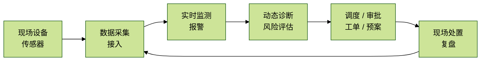
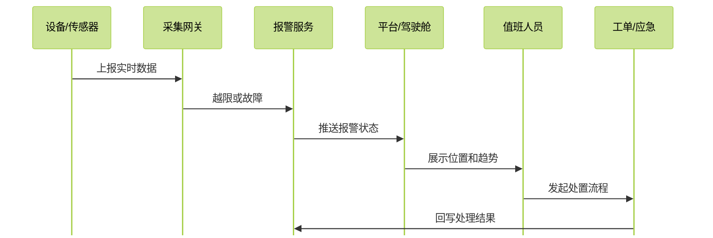

## For future Claude

这份笔记根据一组“EliteMine 采煤 / 生产管控平台”演示截图整理而成。截图显示该系统是一个面向煤矿生产、安全、设备、调度、审批和智能驾驶舱的综合管理平台。由于当前只有截图，没有后端接口文档、数据库设计或真实部署信息，以下架构说明属于基于 UI 和业务模块的合理归纳，置信度为中等。

# EliteMine 采煤生产管控平台：基础架构说明

这套系统可以理解为一个“煤矿生产经营 + 安全监测 + 智能驾驶舱”的一体化平台。它不是单一的监控大屏，也不是单纯的 OA 审批系统，而是把煤矿现场设备、生产计划、安全防治、报警诊断、人员流程和经营管理放到同一个入口中。

从截图来看，平台核心目标有三类：

- **看得见现场**：通过实时监测、3D 场景、视频监控、趋势曲线和报警状态，把井下采煤、通风、供配电、灾害防治等关键对象可视化。
- **管得住流程**：通过审批中心、公告中心、待办事项、报表填报和计划管理，把生产调度、安全隐患、事故填报、设备维修等流程固化下来。
- **判断得出风险**：通过动态诊断、报警推送、历史数据曲线和分析预测，帮助管理者判断当前安全状态和未来风险。

## 1. 总体定位

平台名称在登录页中体现为 **EliteMine 采煤**，主界面顶部显示为 **生产管控平台**。这说明它更像一个企业级煤矿生产管理门户，而不是某一个孤立业务子系统。

它的首页工作台承担“统一入口”的角色：用户登录后可以看到待办、已处理、已发起、收到事项、个人信息、公告通知、待办事项、动态诊断分数、常用应用和驾驶舱入口。

这类系统的关键不在于单个页面多复杂，而在于它需要把多个业务域串成一个闭环：

煤矿场景中，数据如果只停留在大屏上，就只能“展示”；如果进入审批、工单、调度和复盘流程，才真正变成“管理”。

## 2. 业务模块划分

从侧边栏和顶部标签页可以归纳出几个主要模块。

| 模块 | 主要作用 | 截图中可见能力 |
| --- | --- | --- |
| 我的工作台 | 统一入口和个人待办 | 动态诊断、公告、待办、应用入口、驾驶舱入口 |
| 审批中心 | 流程审批和表单填报 | 事故填报、经营报表、安全生产类填报、生产保障类流程 |
| 公告中心 | 信息发布与通知 | 安全检查通告、工作重点通知、报警类公告 |
| 动态诊断 | 对矿山安全状态进行综合评分 | 人员、环境、设备、运营等维度评分 |
| 配置驾驶舱 | 配置大屏和应用入口 | 生产、安全、设备、能耗、监控等驾驶舱 |
| 智能采煤系统 | 采煤设备与采煤过程监控 | 实时监测、故障报警、趋势曲线、现场监控 |
| 智能瓦斯抽采系统 | 瓦斯抽采泵站监测 | 泵站状态、管路、参数、现场视频 |
| 智能压风系统 | 压风机和管路监测 | 压风机状态、电流、功率、风包压力、温度等 |
| 顶板灾害防治管控 | 顶板压力与支架风险管理 | 实时数据、历史曲线、报警推送、分析预测 |
| 水害 / 火灾防治管控 | 灾害防治专题管理 | 监测、预警、处置和分析类功能 |
| 应急管理系统 | 事故与应急处置 | 与报警、预案、处置流程联动 |

可以看出，平台采用的是“门户 + 专题子系统 + 驾驶舱”的组织方式。门户负责入口，子系统负责业务闭环，驾驶舱负责态势展示。

## 3. 基础技术架构推测

仅根据截图无法确定具体技术栈，但可以推断出它至少需要以下几层。

### 3.1 感知与采集层

这一层连接井下和地面现场设备，是整个平台的数据来源。可能包括：

- 采煤机、液压支架、运输皮带、泵站、压风机、供配电设备。
- 瓦斯、风速、温度、压力、电流、电压、振动等传感器。
- 视频摄像头和现场图像。
- 人员定位、安全巡检、隐患上报等人工输入数据。

截图中的“实时参数”“现场监控”“故障信号”“风包超高压”“前轴高温”等字段，说明系统不仅展示结果，也接入了设备级状态和告警点位。

### 3.2 数据接入层

这一层负责把现场数据接入平台。典型能力包括：

- 设备协议接入：PLC、工业网关、传感器平台或厂商接口。
- 实时数据采集：周期性采样设备状态和传感器指标。
- 事件接入：故障、报警、越限、停机、恢复等事件。
- 视频流接入：将井下现场视频嵌入到平台页面中。

如果把煤矿现场类比成“身体”，这一层就是神经系统：它把温度、压力、疼痛和动作反馈传到大脑。

### 3.3 数据存储层

平台至少会有三类数据：

| 数据类型 | 说明 | 典型用途 |
| --- | --- | --- |
| 实时状态数据 | 当前设备状态、传感器值、报警状态 | 实时监测、驾驶舱、报警面板 |
| 历史时序数据 | 按时间存储的压力、温度、电流、风速等曲线 | 趋势曲线、历史追溯、预测分析 |
| 业务流程数据 | 审批单、报表、计划、工单、公告、用户权限 | 管理闭环、责任追踪、统计报表 |

其中实时监测和历史曲线通常依赖时序数据；审批、公告、报表则更像传统业务数据库；视频一般不直接存进业务库，而是由视频平台或流媒体服务提供。

### 3.4 业务服务层

这一层是平台的核心业务逻辑，主要包括：

- **用户与权限服务**：区分矿山、科室、角色、班组和用户权限。
- **流程审批服务**：支撑事故填报、计划上报、维修工单、公告发文等流程。
- **报警管理服务**：接收报警、分类、推送、确认、处理、复盘。
- **动态诊断服务**：把人员、环境、设备、运营等指标汇总成综合评分。
- **设备台账服务**：管理设备、点位、测点、安装位置、参数阈值。
- **报表统计服务**：生成生产经营、安全管理和设备运行报表。
- **驾驶舱服务**：为大屏和 3D 场景提供聚合后的展示数据。

### 3.5 展示与交互层

截图里有三类典型前端页面：

- **管理台页面**：表格、表单、查询、审批、公告、待办。
- **监控页面**：实时参数、故障状态、趋势曲线、视频弹窗。
- **驾驶舱页面**：深色主题、3D 模型、设备状态浮层、态势数据。

这说明平台既面向日常管理人员，也面向调度中心和生产现场值守人员。前端需要同时兼顾“密集操作”和“态势展示”。

## 4. 数据流转闭环

一个典型报警场景可以这样理解：

这类闭环的价值在于：报警不是一个孤立红点，而是会进入责任人、处置过程、结果记录和后续复盘。

## 5. 关键页面理解

### 5.1 登录页

登录页突出“EliteMine 采煤”和“智慧煤矿综合管控平台产品”。背景图使用井下采煤机械，强调系统服务于煤矿生产现场。

#### 截图证据：登录入口

> 对应系统品牌、登录入口与煤矿生产现场背景，适合放在登录页说明之后。

### 5.2 工作台

工作台是平台的首页，承担三种职责：

- 展示个人待办和流转状态：待处理、已处理、已发起、我收到的。
- 展示矿山当前诊断评分：综合评分、人员诊断、环境诊断、设备诊断、运营诊断。
- 提供业务入口：智能供配电、瓦斯灾害防治、年度采煤计划、一张图、智能采煤等。

工作台的设计逻辑是“先告诉用户今天有什么事，再告诉用户矿井现在是否安全，最后给用户进入各系统的入口”。

#### 截图证据：工作台与动态诊断

> 对应首页门户、个人待办、动态诊断评分、统计图表和移动端入口。

### 5.3 审批中心

审批中心把业务流程按类别组织：

- 调度指挥类：重大事故填报、伤亡事故填报。
- 经营报表类：生产经营日报填报、月计划填报。
- 安全生产类：风险辨识、隐患辨识、风量分配计划、测尘点设置、瓦斯观测记录。
- 生产保障类：设备维修工单、出库单、年度/月度生产计划、采掘衔接计划。
- 经营管理类：公告通知发文。

这说明平台不是只做监控，也在承担煤矿日常管理制度的线上化。

#### 截图证据：审批、公告与经营管理表单

> 对应审批中心、公告中心、计划填报、经营报表、表单列表和流程类业务入口。

### 5.4 智能采煤 / 瓦斯抽采 / 压风系统

这些页面更偏工业监控。常见结构是：

- 顶部切换：实时监测、故障报警、趋势曲线、现场监控。
- 中心区域：3D 场景、设备模型、管路或工作面。
- 两侧面板：关键设备状态、报警点位、实时参数。
- 弹窗：现场视频或设备细节。

这类页面的核心不是“做报表”，而是让值班人员快速回答三个问题：

1. 哪个设备正在运行？
2. 哪个指标异常？
3. 异常发生在哪里，是否需要现场处置？

#### 截图证据：智能采煤、瓦斯抽采、压风与现场监控

> 对应工业监控页面、3D 场景、设备状态、趋势曲线、现场视频和驾驶舱大屏。

### 5.5 顶板灾害防治管控

顶板灾害防治模块显示了“实时数据监测、历史数据及曲线、报警推送、分析预测”等标签。它更像一个专题风险管控系统，重点关注支架压力、左/右柱压力、初撑力、整架压力等指标。

这些指标通常用于判断顶板压力变化、支架受力异常和潜在安全风险。对这类系统来说，最重要的是时间序列变化，而不是单个时刻的数值。

#### 截图证据：顶板灾害防治与专题监测

> 对应顶板灾害防治模块中的实时数据、历史曲线、报警推送、分析预测、台账和统计报表。

## 6. 可以补充的系统设计要点

如果后续要把这份截图整理成项目文档，可以继续补下面几个部分。

### 6.1 权限模型

从截图中的用户 `admin001`、矿山信息、科长职位可以推断，系统至少需要：

- 用户。
- 角色。
- 部门 / 科室。
- 矿山 / 项目。
- 功能菜单权限。
- 数据范围权限。

煤矿系统尤其要注意数据范围：同一个集团可能有多个矿，不同矿的数据不能随便互看。

### 6.2 告警分级

告警不应该只有“有 / 无”，至少应区分：

- 提示。
- 一般告警。
- 严重告警。
- 紧急告警。
- 已确认。
- 已处理。
- 已恢复。

截图中已有红绿状态点和“低报 / 高报”等状态，这可以进一步抽象为统一告警模型。

### 6.3 设备点位模型

每个设备或传感器都应有统一编码：

- 所属矿山。
- 所属系统。
- 所属区域 / 巷道 / 工作面。
- 设备类型。
- 测点类型。
- 单位。
- 阈值。
- 采集频率。

没有统一点位模型，后续趋势曲线、报警统计、3D 场景挂点都会变得很难维护。

### 6.4 3D 场景与业务数据绑定

截图中的 3D 页面不是纯展示，它需要把模型对象和业务对象绑定起来。例如：

- 3D 模型里的压风机，对应设备台账中的某台压风机。
- 模型上的红点，对应当前报警事件。
- 浮层参数，对应实时数据点位。
- 点击设备弹窗，对应详情页、视频流或维修记录。

可以把它理解为：3D 场景是“空间索引”，业务系统是“数据和流程主体”。

## 7. 一句话总结

这套平台的基础架构可以概括为：

> 以煤矿现场设备和传感器数据为底座，通过实时监测、报警诊断、流程审批和专题驾驶舱，把生产、安全、设备、灾害防治和经营管理整合到一个统一的生产管控平台中。

它最重要的价值不是页面多，而是把“现场数据 -> 风险判断 -> 管理流程 -> 处置复盘”连接起来。
