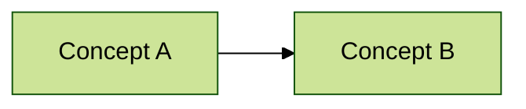

## For future Claude

This is one concrete Mentor learning session. Preserve what was taught, what reference/context material the learner provided, what the learner output, what failed, what improved, and what must be reviewed next. Separate user-provided context from AI inference. Link back to relevant raw sources, wiki concepts, question bank entries, and DailyNotes.

# Session - {{topic}}

## Goal

TBD.

## Reference Materials And Context

Use this section whenever the learner provides materials, screenshots, pasted text, article excerpts, book passages, code, repo context, interview notes, or prior conversation context.

| Item | Type | Source / Path / URL | How to use it | Reliability | Notes |
|---|---|---|---|---|---|
| 1 | pasted text / file / code / image / link / prior note | TBD | primary evidence / background / example / constraint | user-provided / verified / uncertain | TBD |

### Context Handling Rules

- Treat user-provided materials as the first grounding layer.
- Do not silently replace the provided context with generic explanation.
- If the provided material conflicts with prior memory, mark the conflict and ask or explain the assumption.
- Preserve key source paths, URLs, quoted labels, and page/chapter hints.
- Distinguish: `given by user`, `read from vault`, `inferred by AI`, `needs verification`.

## Self-Regulated Learning Cycle

### Plan / Forethought

- Today's learning goal:
- Prior knowledge check:
- Reference/context materials:
- Expected learner output:
- Selected strategy:

### Perform / Execution

- What the learner attempted:
- What AI explained or debugged:
- Real-time monitoring questions:
- Evidence of understanding or confusion:

### Reflect / Reflection

- Most stuck point:
- What changed after feedback:
- Knowledge to compress:
- Next review or drill:

## Input Classification

- Type: concept | code | question | reference_context | mixed
- Reason:
- Selected flow:
- Provided context needed before teaching: yes | no

## Daily 2.5h AI-Feynman Rhythm

Use this as the default learning rhythm when the learner wants a full daily study block. For shorter sessions, select only the relevant rows.

| Time | Activity | AI role | Cognitive target | Session artifact |
|---|---|---|---|---|
| 30 min | Learn new concept | Initial explanation, prerequisite map, clarification | Build first mental model | Concept explanation / source notes |
| 60 min | Hands-on practice | Debug, explain errors, generate variants | Procedural knowledge | Code notes / exercises / bug patterns |
| 20 min | Feynman explanation to AI | Act as confused student, ask precise follow-ups | Generation effect + metacognition | Feynman output + gap list |
| 10 min | Relation graph / analogy | Build cross-module links and analogy ladder | Far transfer | Relation graph / best analogy |
| 10 min | Review yesterday's cards | Ask active-recall questions | Spaced repetition + retrieval | Mastery update / review card result |

Principles:

- Generate first: ask the learner to try before giving the full answer when feasible.
- Interleave: connect new material with yesterday's weak points or cards.
- Compress at the end: convert the session into cards, weak points, and next drills.

## Teaching Mode Selection

- [ ] Mode 1 - AI as Student / Feynman Core
- [ ] Mode 2 - AI as Analogy Generator
- [ ] Mode 3 - AI as Relationship Graph Builder
- [ ] Mode 4 - AI as Deliberate Practice Coach
- [ ] Mode 5 - AI as Knowledge Compressor

Chosen teaching mode and why:

TBD.

Chosen Mentor mode and why:

TBD.

## Explanation

TBD.

## Direct Answer Or Code Reading

TBD.

## Hands-On Practice

- Task:
- Attempt:
- Error / confusion:
- Feedback:
- Re-attempt:

## Feynman Output

Learner explanation:

> TBD.

AI-as-student follow-up questions:

1. TBD.
2. TBD.
3. TBD.

Feedback:

- Clear:
- Vague:
- Wrong or missing:
- Better version:

## Relation Graph / Analogy

### Analogy Ladder

| Analogy | Helps explain | Breaks when |
|---|---|---|
| TBD | TBD | TBD |

### Relationship Map

## Exercises

### Basic

1. TBD.
2. TBD.
3. TBD.

### Advanced

1. TBD.
2. TBD.
3. TBD.

## Answer Check

- Correct:
- Incorrect:
- Needs review:
- Evidence from learner output:

## Interview Answer

### 60-second version

TBD.

### Deep-dive version

TBD.

## Knowledge Compression

### Core Framework

- TBD.

### Active Recall Cards

| Front | Back | Anti-confusion point | Next review |
|---|---|---|---|
| TBD | TBD | TBD | TBD |

## Weak Points

- TBD.

## Updates To Apply

- `30_active_learning_dashboard.md`:
- `20_session_index.md`:
- `personas/<tutor>.md`:
- `mastery/`:
- `question_bank/`:
- DailyNotes:
