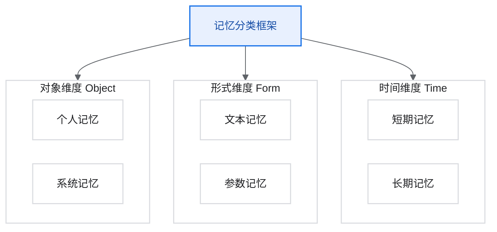
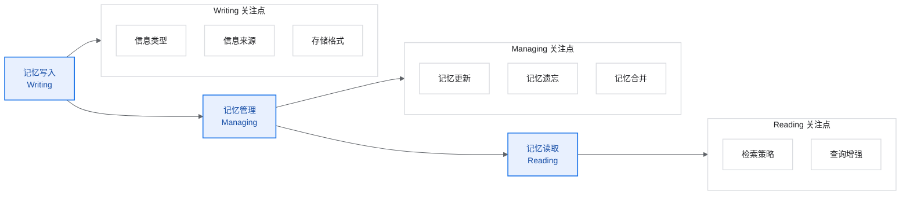
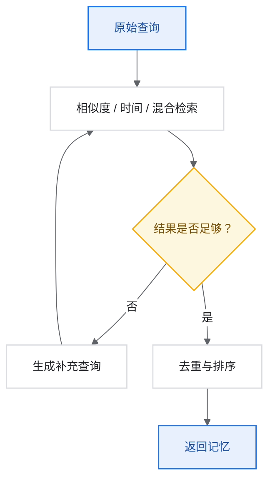

# 论文精读_Agent_A Survey on the Memory Mechanism of Large Language Model based Agents

> 大语言模型智能体的记忆机制综述

## 论文基本信息

| 项目 | 内容 |
|---|---|
| 标题 | A Survey on the Memory Mechanism of Large Language Model based Agents |
| 作者 | Zeyu Zhang, Quanyu Dai, Xiaohe Bo, Chen Ma, Rui Li, Xu Chen, Jieming Zhu, Zhenhua Dong, Ji-Rong Wen |
| 机构 | Renmin University of China, Huawei Noah's Ark Lab |
| 发表 | ACM Transactions on Information Systems（TOIS）2024 |
| arXiv | 2404.13501 |
| GitHub | <https://github.com/nuster1128/LLM_Agent_Memory_Survey> |
| 重要性 | 首个全面系统地综述 LLM Agent 记忆机制的论文 |
| 官方 PDF | <https://arxiv.org/pdf/2404.13501> |

> 这篇是 Agent Memory 领域最全面的综述。

## 1. 论文动机与贡献

### 1.1 研究背景

> 没有记忆，就没有文化。没有记忆，就没有文明、没有社会、没有未来。

LLM-based Agents 与原始 LLM 的核心区别在于其**自我演化能力（Self-evolving Capability）**，这是解决需要长期、复杂 Agent-环境交互的现实问题的基础。

记忆模块是支持 Agent-环境交互的关键组件：

- 决定 Agent 如何积累知识。
- 处理历史经验。
- 检索信息以支持行动。

### 1.2 研究空白

尽管已有很多记忆机制研究，但它们分散在不同论文中，缺乏：

- 从整体视角的系统性回顾。
- 通用有效的设计模式抽象。
- 启发未来研究的统一框架。

### 1.3 主要贡献

1. 正式定义记忆模块：提供狭义和广义两种定义。
2. 分析记忆必要性：从认知心理学、自我演化、Agent 应用三个角度。
3. 系统性分类总结：记忆写入、管理、读取的完整分类体系。
4. 评估方法综述：记忆模块的评估指标和方法。
5. 应用场景展示：记忆在不同场景中的重要作用。
6. 未来方向分析：现有局限性和潜在解决方案。

## 2. 记忆的定义

### 2.1 狭义定义

狭义记忆：Agent 在完成特定任务时积累的信息，用于支持后续行动。

```text
狭义记忆 = 任务相关信息 | 从交互中获取，用于当前任务
```

特点：

- 任务特定。
- 短期存储。
- 直接服务于当前目标。

### 2.2 广义定义

广义记忆：Agent 可以访问的所有信息，包括来自外部环境和内部积累的全部知识。

```text
广义记忆 = 内部记忆 ∪ 外部记忆

内部记忆：
- LLM 参数中编码的知识
- 上下文窗口中的信息

外部记忆：
- 外部数据库
- 知识库
- 文件系统
```

### 2.3 记忆分类框架

#### 2.3.1 三维分类体系

论文从对象维度、形式维度、时间维度三个角度组织 Agent 记忆。



#### 2.3.2 八象限分类

| 维度组合 | 描述 | 示例 |
|---|---|---|
| 个人-文本-短期 | 用户当前会话的对话历史 | In-context 对话 |
| 个人-文本-长期 | 用户的偏好和历史 | 用户画像数据库 |
| 个人-参数-短期 | 即时适应的个性化调整 | 少样本学习 |
| 个人-参数-长期 | 持久化的用户模型 | 个性化微调 |
| 系统-文本-短期 | 任务执行的临时信息 | 思维链中间步骤 |
| 系统-文本-长期 | 知识库和文档 | RAG 外部知识库 |
| 系统-参数-短期 | 临时能力增强 | 动态提示词调整 |
| 系统-参数-长期 | 模型的基础能力 | 预训练知识 |

## 3. 记忆的必要性分析

### 3.1 认知心理学视角

人类的记忆系统为 AI 提供了重要参考：

| 人类记忆类型 | 描述 | Agent 对应 |
|---|---|---|
| 感觉记忆 | 毫秒级，原始感知 | 输入 token 处理 |
| 短期记忆 | 秒到分钟，容量有限 | 上下文窗口 |
| 工作记忆 | 活跃处理空间 | Scratchpad |
| 长期记忆 | 持久存储 | 外部数据库 |

长期记忆的三种类型：

1. **情景记忆（Episodic）**：具体事件 -> 对话历史。
2. **语义记忆（Semantic）**：事实知识 -> 知识库。
3. **程序记忆（Procedural）**：技能方法 -> 工具使用模式。

### 3.2 自我演化视角

记忆是 Agent 自我演化的基础，支持三个关键功能。

#### 3.2.1 经验积累（Experience Accumulation）

```python
# 记住过去的错误和成功
def learn_from_experience(memory, new_experience):
    if new_experience.is_failure:
        memory.store(
            content=new_experience,
            tag="failure_case",
            lesson=extract_lesson(new_experience)
        )
    elif new_experience.is_success:
        memory.store(
            content=new_experience,
            tag="success_pattern",
            strategy=extract_strategy(new_experience)
        )
```

#### 3.2.2 环境探索（Environment Exploration）

记忆帮助决定何时、如何进行探索：

- 关注之前失败的尝试。
- 探索频率较低的动作。
- 避免重复无效行为。

#### 3.2.3 知识抽象（Knowledge Abstraction）

从原始观察中总结高层信息：

```text
原始观察 -> 模式识别 -> 规则抽象 -> 通用知识
```

### 3.3 Agent 应用视角

| 应用场景 | 记忆的作用 |
|---|---|
| 对话系统 | 维持对话连贯性，记住用户偏好 |
| 游戏 AI | 学习策略，记住对手行为 |
| 机器人 | 记住环境地图，学习操作技能 |
| 代码生成 | 记住代码风格，学习错误模式 |
| 推荐系统 | 建模用户兴趣演化 |

## 4. 记忆的设计：三阶段框架

论文将记忆机制划分为三个核心阶段。



## 5. 记忆写入（Memory Writing）

### 5.1 信息类型

#### 5.1.1 试验内信息（In-trial Information）

单次任务执行过程中产生的信息：

```python
class InTrialMemory:
    """单次试验内的记忆"""

    def __init__(self):
        self.observations = []          # 环境观察
        self.actions = []               # 执行的动作
        self.intermediate_steps = []    # 中间推理步骤
        self.feedback = []              # 环境反馈

    def record_step(self, observation, action, result):
        self.observations.append(observation)
        self.actions.append(action)
        self.feedback.append(result)
```

代表工作：

- **ReAct**：交替的推理-行动序列。
- **Chain-of-Thought**：中间推理步骤。
- **Scratchpad**：工作空间记录。

#### 5.1.2 跨试验信息（Cross-trial Information）

多次任务执行间积累的经验：

```python
class CrossTrialMemory:
    """跨试验的记忆"""

    def __init__(self):
        self.successful_strategies = []  # 成功策略
        self.failure_patterns = []       # 失败模式
        self.learned_rules = []          # 学到的规则

    def consolidate(self, trial_result):
        if trial_result.success:
            self.successful_strategies.append(
                self.extract_strategy(trial_result)
            )
        else:
            self.failure_patterns.append(
                self.analyze_failure(trial_result)
            )
```

代表工作：

- **Reflexion**：从失败中学习的反思机制。
- **Expel**：从经验中提取可复用知识。
- **Voyager**：技能库的持续积累。

#### 5.1.3 外部信息（External Information）

来自外部源的信息：

- 文档和知识库。
- API 和工具返回。
- 用户提供的信息。

### 5.2 信息来源

> 在 prompt 中如何把这些信息有效地结合起来？

| 来源类型 | 描述 | 示例 |
|---|---|---|
| 环境感知 | Agent 直接观察到的 | 网页内容、传感器数据 |
| Agent 生成 | Agent 自己产生的 | 推理过程、计划 |
| 用户输入 | 用户提供的 | 指令、反馈、偏好 |
| 外部检索 | 从外部源获取的 | 搜索结果、API 响应 |

### 5.3 存储格式

#### 5.3.1 文本记忆（Textual Memory）

以自然语言形式存储。

优点：

- 可解释性强。
- 用户友好。
- 易于检索和修改。

缺点：

- 占用空间大。
- 检索可能慢。
- 需要额外的向量化。

代表工作：

- **MemoryBank**：自然语言存储记忆。
- **Generative Agents**：记忆流。
- **ChatDB**：结构化文本存储。

```python
# 文本记忆示例
memory_entry = {
    "timestamp": "2024-01-15 10:30:00",
    "content": "User mentioned they prefer dark mode interfaces",
    "type": "user_preference",
    "importance": 0.8,
    "embedding": [0.1, 0.2, ...]  # 向量表示
}
```

#### 5.3.2 参数记忆（Parametric Memory）

编码在模型参数中。

优点：

- 检索效率高。
- 与模型紧密集成。
- 泛化能力强。

缺点：

- 可解释性差。
- 更新困难。
- 可能有灾难性遗忘。

代表工作：

- **ROME / MEMIT**：知识编辑。
- **LoRA 微调**：适应性记忆。
- **Continual Learning**：持续学习。

## 6. 记忆管理（Memory Managing）

### 6.1 记忆更新（Memory Update）

#### 6.1.1 增量更新

```python
def incremental_update(memory, new_info):
    """增量添加新信息"""
    # 检查是否已存在相似记忆
    similar = memory.find_similar(new_info, threshold=0.9)

    if similar:
        # 合并或更新现有记忆
        memory.merge(similar, new_info)
    else:
        # 添加新记忆
        memory.add(new_info)
```

#### 6.1.2 反思更新

```python
def reflective_update(memory, recent_experiences):
    """基于反思的记忆更新"""
    # 分析最近经验
    patterns = analyze_patterns(recent_experiences)

    # 生成高层次洞察
    insights = generate_insights(patterns)

    # 更新记忆
    for insight in insights:
        memory.add(insight, type="reflection")
```

### 6.2 记忆遗忘（Memory Forgetting）

#### 6.2.1 基于时间的遗忘

艾宾浩斯遗忘曲线：

```python
def ebbinghaus_retention(memory, current_time):
    """基于艾宾浩斯曲线的遗忘"""
    hours_passed = (current_time - memory.last_access).hours

    # 基础遗忘曲线
    base_retention = 0.9 ** (hours_passed / 24)

    # 考虑复习次数的强化
    strength = 1.5 ** memory.access_count

    retention = base_retention * strength + memory.importance
    return max(0.0, min(1.0, retention))
```

代表工作：MemoryBank。

#### 6.2.2 基于重要性的遗忘

```python
def importance_based_forgetting(memory_store, capacity):
    """基于重要性的选择性遗忘"""
    if len(memory_store) <= capacity:
        return

    # 计算每条记忆的综合分数
    scores = []
    for m in memory_store:
        score = (
            0.4 * m.importance +
            0.3 * m.recency +
            0.3 * m.access_frequency
        )
        scores.append((m, score))

    # 保留高分记忆
    scores.sort(key=lambda x: x[1], reverse=True)
    memory_store.keep_only([m for m, s in scores[:capacity]])
```

### 6.3 记忆合并（Memory Merging）

#### 6.3.1 摘要合并

```python
def summarize_merge(memories, llm):
    """通过摘要合并多条记忆"""
    memories_text = "\n".join([m.content for m in memories])

    prompt = f"""
    Summarize the following memories into a concise summary:

    {memories_text}

    Keep key facts, remove redundancy.
    """

    summary = llm.generate(prompt)
    return Memory(content=summary, type="merged")
```

#### 6.3.2 层级压缩

```python
def hierarchical_compression(memories, levels=3):
    """层级压缩记忆"""
    results = {}

    # 第一层：详细摘要
    results["detailed"] = summarize(memories, max_tokens=1000)

    # 第二层：中等摘要
    results["medium"] = summarize(memories, max_tokens=300)

    # 第三层：简要摘要
    results["brief"] = summarize(memories, max_tokens=100)

    return results
```

## 7. 记忆读取（Memory Reading）

### 7.1 检索策略

#### 7.1.1 基于相似度的检索

```python
def similarity_retrieval(query, memory_store, k=5):
    """基于向量相似度的检索"""
    query_embedding = embed(query)

    similarities = []
    for memory in memory_store:
        sim = cosine_similarity(query_embedding, memory.embedding)
        similarities.append((memory, sim))

    # 返回 top-k
    similarities.sort(key=lambda x: x[1], reverse=True)
    return [m for m, s in similarities[:k]]
```

#### 7.1.2 基于时间的检索

```python
def temporal_retrieval(memory_store, time_range=None, k=5):
    """基于时间的检索"""
    if time_range:
        start, end = time_range
        filtered = [m for m in memory_store
                    if start <= m.timestamp <= end]
    else:
        filtered = memory_store

    # 按时间排序
    filtered.sort(key=lambda x: x.timestamp, reverse=True)
    return filtered[:k]
```

#### 7.1.3 混合检索（Hybrid Retrieval）

Generative Agents 的经典公式：

```python
def hybrid_retrieval(query, memory_store, current_time,
                     alpha=1.0, beta=1.0, gamma=1.0):
    """混合检索：相关性 + 时近性 + 重要性"""
    query_embedding = embed(query)
    scores = []

    for memory in memory_store:
        # 相关性
        relevance = cosine_similarity(query_embedding, memory.embedding)

        # 时近性（指数衰减）
        hours = (current_time - memory.last_access).total_seconds() / 3600
        recency = 0.995 ** hours

        # 重要性
        importance = memory.importance

        # 归一化并加权
        score = (alpha * normalize(relevance) +
                 beta * normalize(recency) +
                 gamma * normalize(importance))
        scores.append((memory, score))

    scores.sort(key=lambda x: x[1], reverse=True)
    return scores
```

### 7.2 检索增强技术

#### 7.2.1 查询重写（Query Rewriting）

```python
def rewrite_query(original_query, llm):
    """使用 LLM 重写查询以提高检索效果"""
    prompt = f"""
    Rewrite the following query to be more specific and
    likely to retrieve relevant memories:

    Original: {original_query}

    Consider:
    - Key entities and concepts
    - Temporal references
    - Related topics

    Rewritten query:
    """
    return llm.generate(prompt)
```

#### 7.2.2 HyDE（Hypothetical Document Embeddings）

```python
def hyde_retrieval(query, memory_store, llm):
    """HyDE: 生成假设文档来增强检索"""
    # 生成假设答案
    prompt = f"Answer this question: {query}"
    hypothetical_answer = llm.generate(prompt)

    # 使用假设答案的 embedding 进行检索
    hyde_embedding = embed(hypothetical_answer)

    return similarity_retrieval_with_embedding(
        hyde_embedding, memory_store
    )
```

#### 7.2.3 迭代检索

```python
def iterative_retrieval(query, memory_store, llm, max_iterations=3):
    """迭代检索：根据结果改进查询"""
    results = []
    current_query = query

    for i in range(max_iterations):
        # 检索
        new_results = similarity_retrieval(current_query, memory_store)
        results.extend(new_results)

        # 判断是否需要继续
        if is_sufficient(results, query):
            break

        # 生成新查询
        current_query = generate_followup_query(
            query, results, llm
        )

    return deduplicate(results)
```



## 8. 记忆评估方法

### 8.1 评估维度

| 维度 | 描述 | 指标 |
|---|---|---|
| 有效性 | 记忆是否帮助任务完成 | 任务成功率、准确率 |
| 效率 | 检索和存储的效率 | 延迟、吞吐量 |
| 容量 | 能存储多少记忆 | 记忆条数、总大小 |
| 一致性 | 长期行为的一致性 | 人设保持率 |
| 可扩展性 | 随规模增长的表现 | 性能衰减曲线 |

### 8.2 评估基准

#### 8.2.1 LOCOMO 基准

Long-Context Conversation Memory 评估：

| 问题类型 | 描述 | 难度 |
|---|---|---|
| Single-hop | 直接检索单条记忆 | 低 |
| Multi-hop | 需要关联多条记忆 | 中 |
| Temporal | 涉及时序推理 | 中 |
| Open-domain | 开放式问答 | 高 |

#### 8.2.2 Deep Memory Retrieval（DMR）

```python
def evaluate_dmr(agent, test_cases):
    """深度记忆检索评估"""
    results = []

    for case in test_cases:
        # 1. 进行多轮对话（植入信息）
        for session in case.history_sessions:
            agent.chat(session)

        # 2. 在新会话中提问
        response = agent.chat(case.query)

        # 3. 评估是否正确回忆
        correct = evaluate_response(response, case.expected)
        results.append(correct)

    return sum(results) / len(results)
```

### 8.3 评估方法

#### 8.3.1 自动评估

```python
def automatic_evaluation(agent, benchmark):
    metrics = {
        "retrieval_recall": [],
        "response_accuracy": [],
        "consistency_score": []
    }

    for sample in benchmark:
        # 检索召回率
        retrieved = agent.retrieve(sample.query)
        recall = len(set(retrieved) & set(sample.ground_truth)) / \
                 len(sample.ground_truth)
        metrics["retrieval_recall"].append(recall)

        # 响应准确率
        response = agent.respond(sample.query)
        accuracy = evaluate_accuracy(response, sample.expected)
        metrics["response_accuracy"].append(accuracy)

    return {k: sum(v) / len(v) for k, v in metrics.items()}
```

#### 8.3.2 人工评估

评估维度：

- **相关性**：响应是否与问题相关。
- **准确性**：信息是否正确。
- **连贯性**：是否与历史一致。
- **自然度**：语言是否自然。

## 9. 典型应用场景

### 9.1 对话系统

```python
class MemoryAugmentedChatbot:
    def __init__(self):
        self.short_term = []          # 当前会话
        self.long_term = VectorStore()  # 历史记忆
        self.user_profile = {}        # 用户画像

    def chat(self, message):
        # 1. 检索相关记忆
        relevant = self.long_term.search(message)

        # 2. 构建上下文
        context = self.build_context(
            self.short_term, relevant, self.user_profile
        )

        # 3. 生成响应
        response = self.generate(context, message)

        # 4. 更新记忆
        self.short_term.append((message, response))
        self.update_profile(message)

        return response
```

### 9.2 游戏 NPC

记忆功能：

- 记住玩家的行为和选择。
- 维护 NPC 间的关系网络。
- 学习游戏策略。

### 9.3 代码 Agent

```python
class CodingAgent:
    def __init__(self):
        self.code_patterns = []     # 代码模式库
        self.error_history = []     # 错误历史
        self.project_context = {}   # 项目上下文

    def fix_bug(self, code, error):
        # 检索类似错误的修复经验
        similar_fixes = self.search_error_history(error)

        # 使用经验指导修复
        fix = self.generate_fix(code, error, similar_fixes)

        # 记录本次修复
        self.error_history.append({
            "error": error,
            "fix": fix,
            "success": self.verify(fix)
        })

        return fix
```

### 9.4 多 Agent 系统

记忆挑战：

- 共享 vs 私有记忆的划分。
- 记忆同步和一致性。
- 信息不对称处理。

## 10. 现有局限与未来方向

### 10.1 当前局限

| 局限 | 描述 | 影响 |
|---|---|---|
| 可扩展性 | 大规模记忆管理困难 | 性能下降 |
| 效率 | 文本记忆检索慢 | 延迟增加 |
| 准确性 | 检索可能不精确 | 响应质量下降 |
| 一致性 | 长期记忆可能冲突 | 行为不一致 |
| 隐私 | 记忆可能泄露信息 | 安全风险 |

### 10.2 未来方向

#### 10.2.1 更高效的参数化记忆

```text
目标：将文本记忆高效编码到参数中
方法：
- 高效微调（LoRA、Adapter）
- 知识蒸馏
- 持续学习技术
```

#### 10.2.2 多 Agent 记忆系统

```text
挑战：
- 共享记忆的访问控制
- 记忆的分布式存储
- 集体智慧的涌现

方向：
- 联邦记忆学习
- 记忆共识机制
- 层级记忆架构
```

#### 10.2.3 记忆的可解释性

```text
需求：
- 理解为什么检索到特定记忆
- 解释记忆如何影响决策
- 提供记忆编辑接口
```

#### 10.2.4 安全与隐私

```text
问题：
- 记忆中的敏感信息
- 记忆的对抗攻击
- 遗忘权的实现

方案：
- 差分隐私
- 选择性遗忘
- 访问控制
```

## 11. 论文覆盖的重要工作列表

| 工作 | 年份 | 核心贡献 |
|---|---:|---|
| Generative Agents | 2023 | 记忆流 + 反思 + 规划 |
| MemGPT | 2023 | OS 风格的分层记忆 |
| Reflexion | 2023 | 自我反思的语言强化学习 |
| MemoryBank | 2023 | 艾宾浩斯遗忘曲线 |
| Expel | 2023 | 从经验中提取知识 |
| RET-LLM | 2023 | 读写记忆的通用框架 |
| ChatDB | 2023 | 数据库辅助的对话记忆 |
| Voyager | 2023 | 技能库的持续积累 |
| SCM | 2023 | 自控制记忆框架 |
| GITM | 2023 | 暗黑记忆用于游戏 |

## 12. 总结

### 12.1 核心要点

1. **记忆是 Agent 的基石**：使 LLM 从无状态转变为有状态。
2. **三阶段框架**：写入、管理、读取的系统化设计。
3. **混合检索是关键**：相关性 + 时近性 + 重要性。
4. **评估需多维度**：有效性、效率、一致性、可扩展性。
5. **应用场景广泛**：对话、游戏、编程、多 Agent。

### 12.2 设计建议

```text
记忆系统设计检查清单：

□ 明确记忆类型（试验内 / 跨试验 / 外部）
□ 选择存储格式（文本 / 参数 / 混合）
□ 设计写入策略（信息筛选、重要性评估）
□ 实现管理机制（更新、遗忘、合并）
□ 优化检索策略（混合检索、查询增强）
□ 建立评估体系（自动 + 人工）
□ 考虑扩展性和效率
□ 处理隐私和安全
```

GitHub：<https://github.com/nuster1128/LLM_Agent_Memory_Survey>
