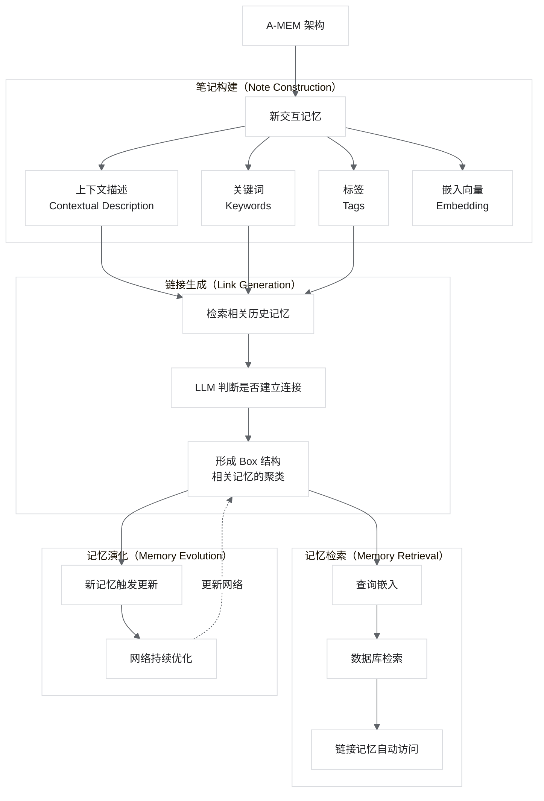
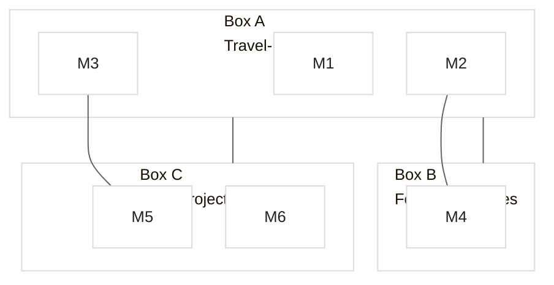
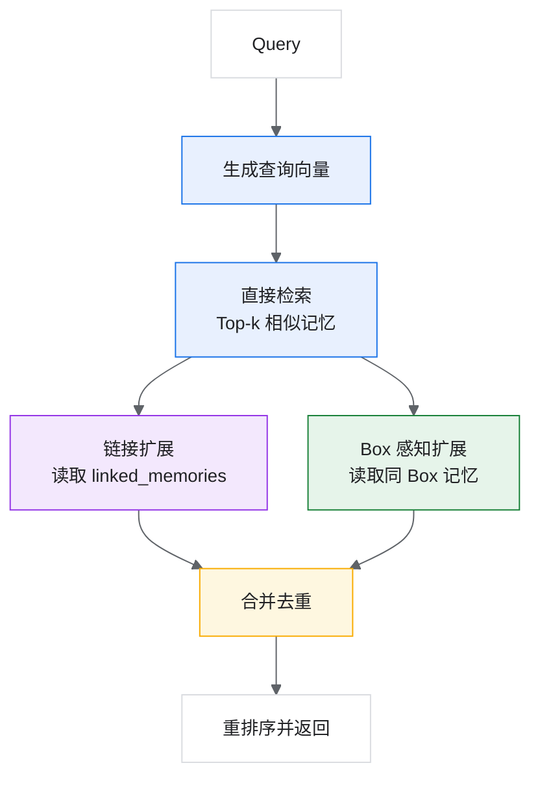

# 第四周-06 论文精读 5：A-MEM - Agentic Memory for LLM Agents

> A-MEM：LLM Agent 的自主记忆系统

## 论文基本信息

| 项目 | 内容 |
|---|---|
| 标题 | A-MEM: Agentic Memory for LLM Agents |
| 作者 | Wujiang Xu, Zujie Liang, Kai Mei, Hang Gao, Juntao Tan, Yongfeng Zhang |
| 机构 | Rutgers University, Sun Yat-sen University |
| arXiv | 2502.12110 |
| 发布时间 | 2025 年 2 月 |
| GitHub | https://github.com/agiresearch/A-mem |
| 原论文 PDF | https://arxiv.org/pdf/2502.12110 |
| 本地 PDF | `01.raw\08.Research\00.Agent\Memory_A-MEM- Agentic Memory for LLM Agents.pdf` |
| 核心创新 | 基于 Zettelkasten 方法的自组织记忆网络 |

> 结合 5、6、7、9 节观看。A-MEM 的重点不是只做“存储和检索”，而是让记忆像知识卡片一样自动生成属性、建立链接、按上下文持续演化。

## 0. 总览：Zettelkasten 与核心架构

A-MEM 试图解决传统 Agent 记忆系统的结构僵硬问题。传统系统通常预定义 `ADD / UPDATE / DELETE` 这类固定操作，而 A-MEM 更接近“自主组织的知识网络”：每条记忆都被构建成富属性笔记，再由 LLM 判断与历史记忆之间是否存在有意义连接，并在新记忆加入后触发旧记忆的上下文演化。

| 核心指标 | A-MEM 表现 |
|---|---|
| 跨模型平均提升 | 在 6 个基础模型上均优于基线 |
| 链接生成重要性 | 消融实验中移除链接生成性能下降最明显 |
| 组织方式 | 动态 Box 聚类 + 记忆间链接 |
| 核心机制 | Note Construction、Link Generation、Memory Retrieval、Memory Evolution |

### 0.1 什么是 Zettelkasten？

Zettelkasten 是一种知识管理方法，由德国社会学家 Niklas Luhmann 创造。

```text
Zettelkasten 核心原则：
1. 原子性（Atomicity）：每条笔记聚焦单一概念
2. 唯一标识（Unique ID）：每条笔记有唯一编号
3. 链接（Linking）：笔记之间通过链接相连
4. 涌现（Emergence）：知识网络自然涌现结构
```

A-MEM 的灵感：

- 记忆作为“原子笔记”。
- 动态建立记忆之间的链接。
- 形成自组织的知识网络。

### 0.2 A-MEM 整体架构

```mermaid
%%{init: {"theme": "base", "flowchart": {"nodeSpacing": 32, "rankSpacing": 46, "padding": 16, "htmlLabels": true, "curve": "basis"}, "themeVariables": {"fontSize": "14px", "fontFamily": "Source Code Pro, JetBrains Mono, Consolas, Microsoft YaHei, monospace", "primaryColor": "#FFFFFF", "primaryBorderColor": "#DADCE0", "primaryTextColor": "#202124", "lineColor": "#5F6368", "secondaryColor": "#F8F9FA", "tertiaryColor": "#E8F0FE", "clusterBkg": "#FFFFFF", "clusterBorder": "#DADCE0", "edgeLabelBackground": "#FFFFFF"}}}%%
flowchart LR
    A["输入<br/>新交互记忆"]:::neutral
    B["笔记构建<br/>Note Construction<br/>生成富属性笔记"]:::blue
    C["链接生成<br/>Link Generation<br/>发现历史记忆连接"]:::purple
    D["记忆检索<br/>Memory Retrieval<br/>向量检索 + 链接扩展"]:::accent
    E["记忆演化<br/>Memory Evolution<br/>触发旧记忆更新"]:::yellow
    F["自组织记忆网络<br/>Boxes + Links"]:::neutral

    A --> B --> C --> F
    F --> D
    C --> E --> F

    classDef neutral fill:#FFFFFF,stroke:#DADCE0,color:#202124;
    classDef blue fill:#E8F0FE,stroke:#1A73E8,color:#202124;
    classDef purple fill:#F3E8FD,stroke:#9334E6,color:#202124;
    classDef accent fill:#E6F4EA,stroke:#188038,color:#202124;
    classDef yellow fill:#FEF7E0,stroke:#F9AB00,color:#202124;
```



### 0.3 与传统记忆方法的差异

| 方面 | Agentic RAG | A-MEM |
|---|---|---|
| 主动性体现 | 检索阶段，例如何时检索、检索什么 | 存储和演化阶段 |
| 知识库 | 静态 | 动态自演化 |
| 记忆组织 | 被动 | 主动构建连接 |
| 核心创新 | 智能检索 | 记忆自组织 |

## 1. 研究背景与动机

### 1.1 现有记忆系统的局限

尽管 LLM Agent 可以有效使用外部工具完成复杂任务，但现有记忆系统存在明显不足。

| 局限性 | 描述 |
|---|---|
| 组织简单 | 仅支持基本的存储和检索 |
| 结构固定 | 预定义的记忆操作，例如 `ADD / UPDATE / DELETE` |
| 缺乏关联 | 记忆之间缺少有意义的连接 |
| 适应性差 | 难以适应不同任务的需求 |

### 1.2 与 Agentic RAG 的区别

传统 Agentic RAG 通常把“智能性”放在检索环节，例如判断是否检索、检索哪个工具、如何整合检索结果。A-MEM 把智能性前移到记忆组织层：新记忆进入系统时，就被结构化、链接、聚类，并可能反向更新旧记忆。

```text
传统记忆系统：
Input -> Fixed Operations (ADD/UPDATE/DELETE) -> Storage

A-MEM：
Input -> Note Construction -> Link Generation -> Memory Evolution
        （生成属性）         （建立连接）        （触发更新）
```

### 1.3 Zettelkasten 方法的启发

A-MEM 继承 Zettelkasten 的关键思想：记忆不是孤立条目，而是可以通过上下文、关键词、标签和实体形成网络。

A-MEM 的记忆组织逻辑：

- 每条记忆都像一张原子卡片。
- 卡片包含上下文描述、关键词、标签、实体、嵌入向量和链接信息。
- 新卡片加入时，会寻找历史卡片并建立语义连接。
- 旧卡片也可以被新卡片触发更新，形成持续演化的记忆网络。

## 2. 核心贡献

### 2.1 主要贡献

1. 自主记忆架构：记忆可以自动生成上下文描述、建立连接、演化内容。
2. 动态组织机制：无需预定义操作，记忆结构自适应形成。
3. 多属性笔记生成：包含描述、关键词、标签等结构化属性。
4. 记忆演化机制：新记忆可以触发旧记忆的更新。

### 2.2 与现有系统的本质区别

```text
传统记忆系统：
- 固定操作
- 存储和检索为主
- 记忆之间关系弱
- 难以形成自组织结构

A-MEM：
- 生成结构化笔记
- 自动识别关联
- 动态聚类成 Box
- 新旧记忆共同演化
```

## 3. 系统架构

### 3.1 整体架构



### 3.2 Box 概念

借鉴 Zettelkasten 的“盒子”概念，相关记忆通过相似的上下文描述聚集成 Box。



注意：一条记忆可以同时属于多个 Box，例如 `M2` 同时在 Box A 和 Box B 中。

## 4. 笔记构建（Note Construction）

### 4.1 笔记结构

每条记忆被构建为包含多属性的“笔记”：

```python
@dataclass
class MemoryNote:
    """A-MEM 的记忆笔记结构"""

    # 唯一标识
    id: str

    # 原始内容
    raw_content: str

    # 结构化属性
    contextual_description: str  # 上下文描述
    keywords: List[str]          # 关键词列表
    tags: List[str]              # 标签分类
    entities: List[str]          # 提取的实体

    # 向量表示
    embedding: List[float]

    # 链接信息
    linked_memories: List[str]   # 链接的记忆 ID
    box_ids: List[str]           # 所属的 Box

    # 元数据
    timestamp: datetime
    last_updated: datetime
    evolution_count: int = 0     # 被演化更新的次数
```

### 4.2 属性生成

使用 LLM 为新记忆生成结构化属性。

```python
def construct_note(raw_memory: str, llm) -> MemoryNote:
    """构建完整的记忆笔记"""

    prompt = f"""
    Analyze the following memory and generate structured attributes:

    Memory: "{raw_memory}"

    Generate:
    1. Contextual Description: A rich description that captures the
       context, implications, and potential connections of this memory.

    2. Keywords: 3-5 key terms that capture the essence.

    3. Tags: Categories this memory belongs to, e.g. preference,
       fact, event, relationship.

    4. Entities: Named entities mentioned, e.g. people, places, things.

    Output as JSON.
    """

    attributes = llm.generate(prompt, response_format="json")

    # 生成嵌入向量
    embedding = get_embedding(raw_memory)

    return MemoryNote(
        id=generate_uuid(),
        raw_content=raw_memory,
        contextual_description=attributes["contextual_description"],
        keywords=attributes["keywords"],
        tags=attributes["tags"],
        entities=attributes["entities"],
        embedding=embedding,
        timestamp=datetime.now()
    )
```

### 4.3 属性生成示例

输入记忆：

```text
"I prefer morning meetings because I'm more alert before lunch"
```

生成的属性：

```json
{
  "contextual_description": "User has a work schedule preference related to their cognitive energy levels. They experience higher alertness in morning hours, which affects their preference for meeting scheduling.",
  "keywords": ["morning meetings", "alertness", "schedule preference"],
  "tags": ["work_preference", "schedule", "productivity"],
  "entities": ["User"]
}
```

## 5. 链接生成（Link Generation）

### 5.1 链接生成流程

```mermaid
%%{init: {"theme": "base", "flowchart": {"nodeSpacing": 32, "rankSpacing": 46, "padding": 16, "htmlLabels": true, "curve": "basis"}, "themeVariables": {"fontSize": "14px", "fontFamily": "Source Code Pro, JetBrains Mono, Consolas, Microsoft YaHei, monospace", "primaryColor": "#FFFFFF", "primaryBorderColor": "#DADCE0", "primaryTextColor": "#202124", "lineColor": "#5F6368", "secondaryColor": "#F8F9FA", "tertiaryColor": "#E8F0FE", "clusterBkg": "#FFFFFF", "clusterBorder": "#DADCE0", "edgeLabelBackground": "#FFFFFF"}}}%%
flowchart LR
    A["Step 1<br/>新记忆笔记"]:::blue
    B["Step 2<br/>检索相似历史记忆"]:::neutral
    C["Step 3<br/>LLM 判断是否连接"]:::purple
    D["Step 4<br/>生成双向链接"]:::accent
    E["Step 5<br/>更新 Box 聚类"]:::yellow

    A --> B --> C --> D --> E

    classDef blue fill:#E8F0FE,stroke:#1A73E8,color:#202124;
    classDef neutral fill:#FFFFFF,stroke:#DADCE0,color:#202124;
    classDef purple fill:#F3E8FD,stroke:#9334E6,color:#202124;
    classDef accent fill:#E6F4EA,stroke:#188038,color:#202124;
    classDef yellow fill:#FEF7E0,stroke:#F9AB00,color:#202124;
```



```python
def generate_links(new_note: MemoryNote, memory_store, llm):
    """为新笔记生成与历史记忆的链接"""

    # 1. 检索最相关的历史记忆
    candidates = memory_store.search_similar(
        query_embedding=new_note.embedding,
        top_k=10
    )

    # 2. 对每个候选，使用 LLM 判断是否建立链接
    links = []
    for candidate in candidates:
        should_link = evaluate_link(new_note, candidate, llm)
        if should_link:
            links.append(candidate.id)
            # 双向链接
            candidate.linked_memories.append(new_note.id)

    new_note.linked_memories = links
    return new_note
```

### 5.2 链接评估

```python
def evaluate_link(note_a: MemoryNote, note_b: MemoryNote, llm) -> bool:
    """使用 LLM 评估两条记忆是否应该被链接"""

    prompt = f"""
    Evaluate whether these two memories should be linked.

    Memory A:
    - Content: {note_a.raw_content}
    - Context: {note_a.contextual_description}
    - Keywords: {note_a.keywords}

    Memory B:
    - Content: {note_b.raw_content}
    - Context: {note_b.contextual_description}
    - Keywords: {note_b.keywords}

    Consider:
    - Do they share common topics or entities?
    - Could one provide context for the other?
    - Is there a logical, causal, or temporal relationship?
    - Would retrieving one benefit from also retrieving the other?

    Answer: YES or NO, with brief reasoning.
    """

    response = llm.generate(prompt)
    return "YES" in response.upper()
```

### 5.3 链接类型

虽然论文没有显式区分，但链接可以按语义分类。

| 链接类型 | 描述 | 示例 |
|---|---|---|
| 主题相关 | 共享相同主题 | “喜欢意大利菜” ↔ “最爱的餐厅是意大利餐厅” |
| 因果关系 | 一个导致另一个 | “对花生过敏” → “避免泰国菜” |
| 时间关系 | 时间上相关 | “计划下周去日本” ↔ “预订了东京的酒店” |
| 实体共享 | 涉及相同实体 | “John 是我的同事” ↔ “John 喜欢喝咖啡” |
| 补充信息 | 互相补充 | “我是素食者” ↔ “我摄入蛋白质主要靠豆腐” |

## 6. 记忆检索（Memory Retrieval）

### 6.1 检索流程

A-MEM 的检索不是只返回向量相似的结果，还会自动访问与命中记忆相连的相关记忆。



```python
def retrieve_memories(query: str, memory_store) -> List[MemoryNote]:
    """检索相关记忆，包括链接的记忆"""

    # 1. 生成查询嵌入
    query_embedding = get_embedding(query)

    # 2. 向量相似度搜索
    direct_results = memory_store.search_similar(
        query_embedding=query_embedding,
        top_k=5
    )

    # 3. 获取链接的记忆
    linked_results = []
    for note in direct_results:
        for linked_id in note.linked_memories:
            linked_note = memory_store.get_by_id(linked_id)
            if linked_note not in direct_results:
                linked_results.append(linked_note)

    # 4. 合并并排序
    all_results = direct_results + linked_results
    return rank_by_relevance(all_results, query)
```

### 6.2 Box 感知检索

当检索到某条记忆时，同一个 Box 中的相关记忆也会被自动访问。

```python
def box_aware_retrieval(query: str, memory_store) -> List[MemoryNote]:
    """Box 感知的记忆检索"""

    # 1. 基础检索
    initial_results = memory_store.search_similar(query, top_k=3)

    # 2. 扩展到相关 Box
    expanded_results = set(initial_results)
    for note in initial_results:
        for box_id in note.box_ids:
            box_members = memory_store.get_box_members(box_id)
            expanded_results.update(box_members)

    # 3. 过滤和排序
    return filter_and_rank(expanded_results, query)
```

## 7. 记忆演化（Memory Evolution）

### 7.1 演化机制

A-MEM 的核心创新之一是记忆演化：新记忆的加入可以触发旧记忆的更新。

```python
def evolve_memories(new_note: MemoryNote, memory_store, llm):
    """新记忆触发历史记忆的演化"""

    # 1. 获取链接的历史记忆
    linked_memories = [
        memory_store.get_by_id(mid)
        for mid in new_note.linked_memories
    ]

    # 2. 检查每条历史记忆是否需要更新
    for old_note in linked_memories:
        evolution_decision = evaluate_evolution(new_note, old_note, llm)

        if evolution_decision["should_evolve"]:
            # 更新上下文描述
            old_note.contextual_description = update_description(
                old_note.contextual_description,
                evolution_decision["new_context"]
            )

            # 更新关键词
            old_note.keywords = merge_keywords(
                old_note.keywords,
                evolution_decision["new_keywords"]
            )

            # 记录演化
            old_note.last_updated = datetime.now()
            old_note.evolution_count += 1

            memory_store.update(old_note)
```

### 7.2 演化评估

```python
def evaluate_evolution(new_note: MemoryNote, old_note: MemoryNote, llm):
    """评估新记忆是否应该触发旧记忆的演化"""

    prompt = f"""
    A new memory has been added that is linked to an existing memory.
    Evaluate whether the new memory provides information that should
    update the existing memory's context.

    Existing Memory:
    - Content: {old_note.raw_content}
    - Current Context: {old_note.contextual_description}

    New Memory:
    - Content: {new_note.raw_content}
    - Context: {new_note.contextual_description}

    Questions:
    1. Does the new memory provide additional context for the existing one?
    2. Does it clarify, expand, or modify understanding of the existing memory?
    3. Should the existing memory's description be updated?

    If yes, provide:
    - new_context: Updated contextual description
    - new_keywords: Any new keywords to add

    Output as JSON.
    """

    return llm.generate(prompt, response_format="json")
```

### 7.3 演化示例

原始记忆：

```text
Content: "I love Italian food"
Context: "User has a preference for Italian cuisine"
Keywords: ["Italian food", "cuisine preference"]
```

新记忆：

```text
Content: "I'm vegetarian"
Context: "User follows a vegetarian diet"
```

演化后的原始记忆：

```text
Content: "I love Italian food"
Context: "User has a preference for Italian cuisine, specifically vegetarian Italian dishes"
Keywords: ["Italian food", "cuisine preference", "vegetarian options"]
```

## 8. 实验评估

### 8.1 实验设置

测试的基础模型：

- GPT-4
- GPT-3.5-turbo
- Claude-3
- Llama-3-70B
- Mixtral-8x7B
- Qwen-72B

基线方法：

- Full History：使用完整对话历史。
- RAG：标准检索增强生成。
- MemGPT：分层记忆系统。
- LangChain Memory：开源记忆模块。
- Summarization：摘要压缩方法。

### 8.2 主要结果

#### 8.2.1 跨模型性能对比

| 模型 | Baseline | A-MEM | 提升 |
|---|---:|---:|---:|
| GPT-4 | 72.3 | 81.5 | 0.127 |
| GPT-3.5 | 65.8 | 74.2 | 0.128 |
| Claude-3 | 70.1 | 78.9 | 0.126 |
| Llama-3-70B | 63.5 | 72.8 | 0.146 |
| Mixtral-8x7B | 58.2 | 67.4 | 0.158 |
| Qwen-72B | 61.3 | 70.6 | 0.152 |

#### 8.2.2 按任务类型的性能

| 任务类型 | RAG | MemGPT | A-MEM |
|---|---:|---:|---:|
| 单跳问答 | 75.2 | 78.4 | 82.1 |
| 多跳推理 | 58.3 | 64.7 | 73.5 |
| 时间推理 | 62.1 | 68.2 | 74.8 |
| 开放问答 | 64.5 | 69.3 | 76.2 |

关键发现：A-MEM 在多跳推理和时间推理上提升最显著。

### 8.3 消融实验

| 组件 | 移除后性能下降 |
|---|---:|
| 上下文描述 | -8.30% |
| 链接生成 | -11.20% |
| 记忆演化 | -5.70% |
| 关键词/标签 | -3.40% |

关键发现：链接生成是最重要的组件。

## 9. 实现细节

### 9.1 核心实现

```python
class AgenticMemory:
    """A-MEM 的核心实现"""

    def __init__(self, llm, embedding_model, vector_store):
        self.llm = llm
        self.embedding_model = embedding_model
        self.vector_store = vector_store  # ChromaDB

    def add_memory(self, content: str) -> MemoryNote:
        """添加新记忆的完整流程"""

        # 1. 构建笔记
        note = self._construct_note(content)

        # 2. 生成链接
        note = self._generate_links(note)

        # 3. 分配到 Box
        note = self._assign_to_boxes(note)

        # 4. 存储
        self.vector_store.add(note)

        # 5. 触发演化
        self._trigger_evolution(note)

        return note

    def _construct_note(self, content: str) -> MemoryNote:
        """步骤 1：构建笔记"""
        prompt = f"""
        Generate structured attributes for this memory:
        "{content}"

        Output JSON with:
        - contextual_description
        - keywords (list)
        - tags (list)
        - entities (list)
        """

        attrs = self.llm.generate(prompt, response_format="json")
        embedding = self.embedding_model.encode(content)

        return MemoryNote(
            id=str(uuid.uuid4()),
            raw_content=content,
            contextual_description=attrs["contextual_description"],
            keywords=attrs["keywords"],
            tags=attrs["tags"],
            entities=attrs["entities"],
            embedding=embedding
        )

    def _generate_links(self, note: MemoryNote) -> MemoryNote:
        """步骤 2：生成链接"""
        candidates = self.vector_store.search(
            note.embedding,
            top_k=10
        )

        links = []
        for candidate in candidates:
            if self._should_link(note, candidate):
                links.append(candidate.id)
                candidate.linked_memories.append(note.id)
                self.vector_store.update(candidate)

        note.linked_memories = links
        return note

    def _should_link(self, note_a: MemoryNote, note_b: MemoryNote) -> bool:
        """判断是否应该链接"""
        prompt = f"""
        Should these memories be linked?

        A: {note_a.raw_content}
        B: {note_b.raw_content}

        Answer YES or NO.
        """

        response = self.llm.generate(prompt)
        return "YES" in response.upper()

    def retrieve(self, query: str, top_k: int = 5) -> List[MemoryNote]:
        """记忆检索"""
        query_embedding = self.embedding_model.encode(query)

        # 直接检索
        direct = self.vector_store.search(query_embedding, top_k)

        # 扩展链接
        expanded = set(direct)
        for note in direct:
            for linked_id in note.linked_memories:
                linked = self.vector_store.get(linked_id)
                expanded.add(linked)

        return self._rank(list(expanded), query)[:top_k]
```

### 9.2 使用示例

```python
# 初始化
from langchain_openai import ChatOpenAI, OpenAIEmbeddings
import chromadb

llm = ChatOpenAI(model="gpt-4")
embeddings = OpenAIEmbeddings()
chroma = chromadb.Client()

memory = AgenticMemory(llm, embeddings, chroma)

# 添加记忆
memory.add_memory("I love hiking in the mountains")
memory.add_memory("My favorite trail is in Colorado")
memory.add_memory("I'm training for a marathon")

# 检索
results = memory.retrieve("What outdoor activities does the user enjoy?")
# 返回：hiking, Colorado trail, marathon training
# 这些记忆通过链接相互关联
```

## 10. 与其他方法的对比

### 10.1 架构对比

| 方面 | A-MEM | Mem0 | MemGPT |
|---|---|---|---|
| 核心理念 | Zettelkasten 自组织 | 生产级效率 | 操作系统风格 |
| 记忆结构 | 笔记 + 链接 | 向量 + 图 | 分层存储 |
| 组织方式 | 动态涌现 | 显式管理 | 分页管理 |
| 更新机制 | 演化 | 工具调用 | 函数调用 |
| 主要优势 | 知识网络 | 扩展性 | 无限上下文 |

### 10.2 适用场景对比

| 场景 | 推荐方案 | 原因 |
|---|---|---|
| 知识密集型对话 | A-MEM | 链接发现隐藏关联 |
| 生产环境部署 | Mem0 | 高效、可扩展 |
| 超长对话 | MemGPT | 无限上下文管理 |
| 简单记忆需求 | RAG | 简单直接 |

## 11. 局限性与未来方向

### 11.1 当前局限

| 局限 | 描述 |
|---|---|
| 计算开销 | 链接评估需要多次 LLM 调用 |
| 链接质量 | 依赖 LLM 的判断能力 |
| 可扩展性 | 大量记忆时链接评估成本高 |
| 链接维护 | 删除记忆时需要更新链接 |

### 11.2 未来方向

1. 高效链接算法：减少 LLM 调用次数。
2. 层级 Box 结构：支持 Box 的嵌套和层级。
3. 链接类型显式化：区分不同类型的链接。
4. 分布式部署：支持大规模记忆网络。

## 12. 总结

### 12.1 核心要点

1. Zettelkasten 启发：原子笔记 + 动态链接 = 知识网络。
2. 多属性笔记：不只是内容，还有描述、关键词、标签。
3. 链接生成：LLM 驱动的有意义连接发现。
4. 记忆演化：新记忆可以更新旧记忆的理解。
5. Box 组织：相关记忆自然聚类。

### 12.2 设计启示

```text
A-MEM 的设计哲学：

1. 记忆不是孤立的 -> 建立有意义的连接
2. 结构不是预定义的 -> 让结构自然涌现
3. 记忆不是静态的 -> 允许记忆演化
4. 检索不是终点 -> 链接带来更多发现
```

### 12.3 实践建议

- 适合场景：知识工作者助手、研究辅助、长期学习伴侣。
- 注意事项：控制链接评估的成本，定期清理过时链接。
- 组合使用：可与 Mem0 / MemGPT 结合，取长补短。

## 13. 阅读结论

A-MEM 提出了一种新的记忆组织思路：把记忆当作可连接、可演化、可自组织的知识卡片，而不是只把它们当作可检索文本片段。它的优势不在于单次检索，而在于长期运行后形成的记忆网络。

这篇论文对 Agent 记忆系统的启发是：生产级记忆不只需要“记住”，还需要“组织记忆”和“让旧记忆随着新经验更新”。当任务依赖长期偏好、跨主题关联、多跳推理和知识积累时，A-MEM 的结构会比普通 RAG 更有想象力。

GitHub: https://github.com/agiresearch/A-mem  
arXiv: https://arxiv.org/abs/2502.12110
