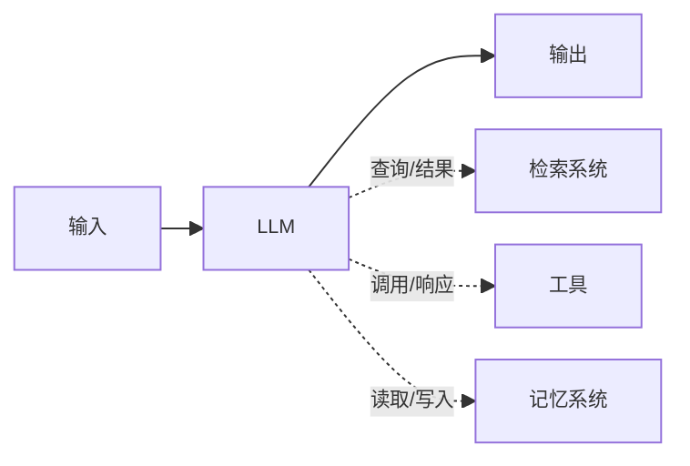
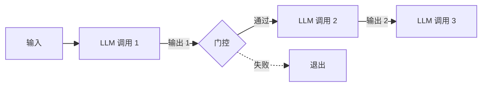
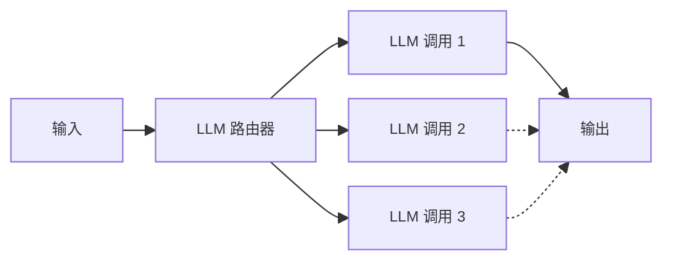
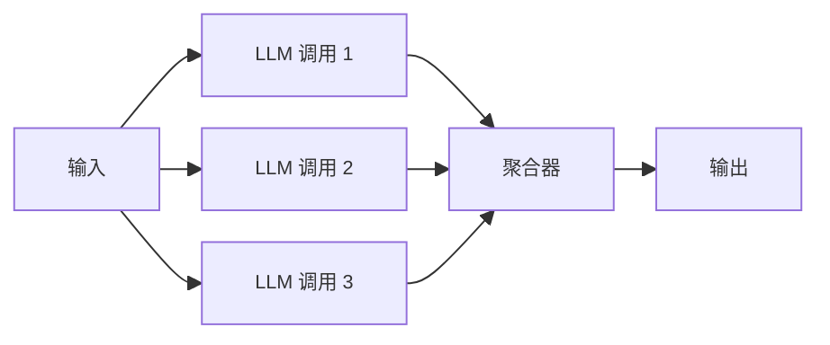
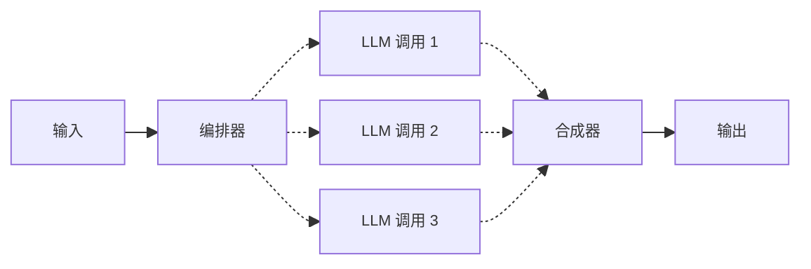
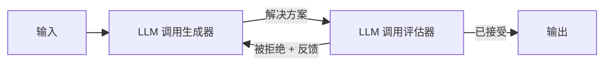
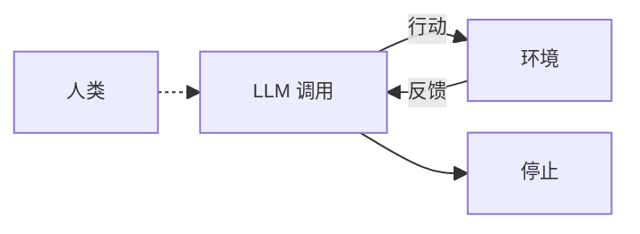
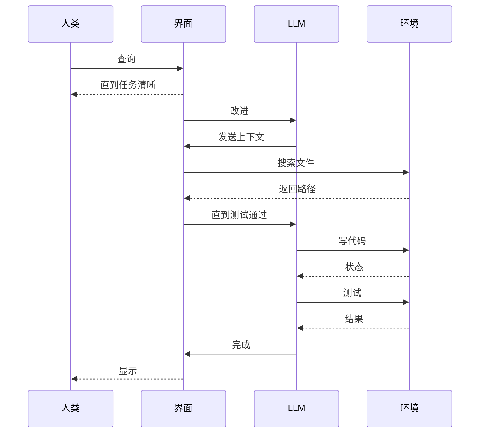

# 【论文精读】Building effective agents

原文链接：https://www.anthropic.com/engineering/building-effective-agents

我们与数十个跨行业团队合作构建 LLM Agent 的经验是：**拥抱简单可组合的模式**。

过去一年里，我们与数十个构建大型语言模型（LLM）Agent 的团队合作，遍及多个行业。我们发现，**最成功的应用场景往往不是使用复杂框架或专门库，而是采用简洁且可组合的模式**。

在这篇文章中，我们将分享这些经验，并为开发者在**构建有效 Agent 时提供实用建议**。

## 1. 什么是 Agent？

“Agent”有多种定义方式。有些客户将 Agent 定义为能够长时间独立运行、使用各种工具完成复杂任务的全自主系统；也有些客户用这个词来形容更具约束性、遵循预先定义好工作流程的实现方式。在 Anthropic，我们将这些不同的实现形式都称为 “Agentic 系统”，但在架构上我们会在 “工作流（workflow）” 和 “Agent” 之间做出重要区分：

- **工作流（workflow）**：LLM 与工具的交互通过预先编排好的代码路径来实现。
- **Agent**：LLM 自主决策如何进行流程、如何使用工具，并在任务执行过程中保持主动权。

在下面的内容里，我们会详细阐述这**两种类型的 Agentic 系统**。在附录 1（“实践中的 Agent”）中，我们还会介绍两个客户真正获得价值的领域，展示这类系统的具体用例。

## 2. 什么时候（不）该使用 Agent

在用 LLM 构建应用时，我们通常建议：先从**最简单的方案**开始，只有在必要时才增加复杂度。有时，这意味着根本不需要构建 Agentic 系统。Agentic 系统往往会**牺牲一些延迟和成本来换取更好的任务性能**，所以在决定是否采用之前，应该评估这样的权衡是否值得。

如果确有需要增加复杂度，可以选择**工作流来执行相对明确的任务，以获得可预测性和一致性**；而在需要大规模灵活性和由模型驱动的决策时，**Agent 则是更佳选择**。不过对于绝大部分应用来说，通过检索或补充上下文即可实现的单次 LLM 调用往往就够了。

判断时可以优先问两个问题：

1. 思考在场景中解决了什么问题，帮助谁来解决这个问题。
2. 找到这个领域里面做得最好的人，和他交流，看看他是怎么完成这个任务的。

### 2.1 直接问答场景

**场景**：一个 FAQ 客服聊天机器人，用户问题大多集中在已知范围内，比如“退款流程”“产品使用说明”等。

**实现方式**：在用户发问时，通过检索（Retrieval）或其他方式找到最相关的文档片段，然后将该文档片段和用户问题一起输入到 LLM，让它生成答案。

**是否需要 Agent**：

- **不需要**：因为任务非常明确：给定用户问题，在有限范围里做“查找并回答”。LLM 的作用是基于已有内容去补充、总结或直接回答。
- **好处**：简单、高效、可控，几乎不用担心 LLM 调用外部工具或产生额外成本。
- **缺点**：不像灵活；如果用户需求突然变得很复杂，需要跨多份文档或执行额外操作时，系统就力不从心。

### 2.2 基于工作流的多步骤处理

**场景**：你想构建一个文本处理系统，用户**提交一篇文章后，需要先做摘要，再做情感分析，最后把结果存到数据库**。

**实现方式**：将这个流程拆分为若干“步骤”或“节点”，比如：

1. 调用 LLM 执行“摘要”。
2. 调用 LLM 或特定模型执行“情感分析”。
3. 将结果写入数据库（或调用 API）。

各步骤在逻辑上是顺序且确定的。

**是否需要 Agent**：

- **不需要**：因为流程相对固定；你只需要把各步骤组合成一个工作流（pipeline），每个阶段都清楚要做什么。
- **好处**：可预测，易于测试和调试，系统行为稳定。
- **缺点**：如果需求频繁变动，或流程中的每个步骤不再像“摘要-情感分析-存库”这么有序，维护工作流会越来越复杂，这时可能就要考虑更灵活的机制。

### 2.3 动态工具调用的复杂任务

**场景**：一个“私人助理”类应用，用户可能提出各种跨工具请求，比如先在日历里帮我找有空的时间段，再去航班信息网站查询机票价格，比较后自动预订合适的机票，并发送会议邀请给对应联系人。

**实现方式**：让 LLM 可以根据用户当前需求和上下文来自行判断调用什么工具、以什么顺序调用。例如：

1. 先调用日历 API 获取空闲时间段。
2. 发现需要查询机票，调用航班 API。
3. 比对价格后确定行程。
4. 再调用邮件/通讯 API 发送相关邀请或确认邮件。

**是否需要 Agent**：

- **需要（典型的 Agentic 场景）**：因为此时需要**灵活的决策和多工具间的动态切换**，工作流很难事先穷举所有可能的顺序或分支。
- **好处**：高度自动化，能应对用户多样化的需求，且可由 LLM 的“推理”能力自动决定下一步动作。
- **缺点**：成本和复杂度更高，需要仔细考虑如何管控 Agent 的行为边界，以避免因误调用或无限循环带来的时间和金钱浪费；调试和监控也相对更难。

### 2.4 检索补充 vs. 代理决策

**场景**：用户只想阅读一份最新报告的要点，这份报告可能是企业内部文件，未公开。

**实现方式**：可以直接做“检索 + LLM 生成”：把文档索引后，用户问题直接检索相应内容并返回给 LLM，总结并呈现要点。

**是否需要 Agent**：

- **不需要**：这只是一轮问答，任务范围明确，Agentic 系统提供的那种“多步推断和多工具决策”价值不大。
- **好处**：实现简单，响应速度快，成本也低。
- **缺点**：在用户需求一直非固定、问题可预测性较低的情况下，这几乎是最佳方案；但一旦用户希望系统根据报告内容再去做更多推理或决定，比如自动生成 PPT、对比其他文件、调用外部数据库写入结果等，则可能需要更复杂的机制。

### 什么情况下（不）该使用 Agent：核心参考点

1. **任务是否高度确定、单步就能完成？**
   - 如果是，通常直接调用 LLM 或基于检索的简单工作流就够了。

2. **需要多步骤/多工具，而且流程的顺序或逻辑并不固定？**
   - 如果答案是“是”，考虑使用 Agentic 系统让模型根据上下文决定下一步；如果答案是“否”，使用固定工作流即可。

3. **是否能接受额外的调用成本和潜在延迟？**
   - Agent 往往会多次调用模型或外部工具。如果这是不可接受的，则不如使用简单的调用方式。

4. **系统的可控性和可预测性有多重要？**
   - 工作流一般可控性更高；Agentic 系统带来灵活性的同时，也带来更高的不可预测性，因此需要更完善的监控和限制。

### 总结

- 简单问题、固定流程，一般无需 Agent，**直接用单次 LLM 调用（可配合检索）或基于工作流的常规方法就够了**。
- 复杂决策、需要多步动态行动，**使用 Agentic 系统能让模型更灵活地“自主”决策调用外部工具**，提升复杂场景下的自动化能力，但要付出更高的开发与维护成本，以及不可预测性。
- 在真正落地时，**先从最简单的方案开始**；若发现需求中出现大量非线性、多变路径的操作需求，Agent 可能才是真正合适的选择。

落地前可以用这个清单收束判断：

1. 明确场景的需求。
2. 和专业的人沟通，场景踩坑，讲工作流具体化。
3. 先用最简单也是最基础的方案，调用 LLM API 先把这个工作流搭起来。
4. 看看存在什么问题，是否有非线性、多变路径的操作需求，是否要升级为 Agent。

## 3. 何时以及如何使用框架

目前有很多框架能让我们更轻松地构建 Agentic 系统，比如：

- LangChain 的 LangGraph
- Amazon Bedrock 的 AI Agent 框架
- Dify（可视化拖拽式 LLM 工作流构建器）
- Coze（另一个可视化工具，用于构建和测试复杂工作流）
- 阿里云百炼平台

这些框架简化了许多底层工作，例如调用 LLM、定义并解析工具、串联多次调用等，从而让初学者更快上手。但它们也会引入额外的抽象层，导致底层的提示词（prompt）和响应（response）不易直接看到，**增加了排错难度**。另外，一旦有了框架提供的便捷功能，也容易让人无意识地增加系统复杂度，而简单的设置原本就足够。

我们的建议是：**初期可以尝试直接使用 LLM API，很多模式通过几行代码就能实现。一旦要使用框架，也务必了解其底层工作原理。** 对底层逻辑的错误认知，往往是我们在客户那里看到的常见问题。

## 4. 构建模块、工作流

参考 notebook：

https://github.com/anthropics/anthropic-cookbook/blob/main/patterns/agents/basic_workflows.ipynb

本节讨论生产环境中常见的 Agentic 系统模式。我们将从最基础的构件——增强型 LLM（augmented LLM）开始，然后依次介绍从简单到复杂的各种工作流与 Agent 模式。

### 4.1 基础构件：增强型 LLM-给 LLM 加上手和脚

Agentic 系统的基本构件是增强型 LLM，它结合了检索（retrieval）、工具（tools）和记忆（memory）等扩展功能。当前的模型具备主动使用这些功能的能力：它们能够自行编写搜索查询、选择合适的工具、决定要保留哪些信息等等。

**增强型 LLM**

在实现时，我们建议着重关注两点：

- **针对具体用例进行定制**：确保这些增强功能与业务需求紧密结合，并且只保留真正需要的功能。
- **提供简洁、文档完善的接口**：保证模型能方便地调用到检索、工具或记忆等资源。

实现增强功能的方法有很多。其中一种是使用我们刚刚发布的 **Model Context Protocol**，通过一个简单的客户端实现，就能与不断扩展的第三方工具生态系统对接。

简而言之，**提供一套调用的模块化接口**。

在后续的讨论中，我们默认每次 LLM 调用都有权限使用这些增强功能。

### 4.2 工作流：Prompt Chaining（提示词串联）

Prompt Chaining 将一个较大任务分解为一系列连续的子步骤，每次 LLM 调用都会处理上一步的输出。你也可以在这些步骤间插入**编程逻辑（如文中的 “gate”）**，以检查过程是否仍然处于正确轨道。

**Prompt Chaining 工作流**

**适用场景**：当一个任务能被轻松地、清晰地拆分为固定子任务，且主要目标是以**牺牲一定的延迟为代价来换取更高的准确度**时，这种方式非常有效。把每次 LLM 调用限定在一个更简单的子任务上，可以提高成功率。

**常见示例**：

- 先生成营销文案，再将其翻译成另一种语言。
- 先写出文档大纲并检查其是否满足一定标准，然后根据大纲写出完整文档。

### 4.3 工作流：Routing（路由）

Routing 是先对**输入进行分类，然后将其导向相应的下游处理流程**。这样你可以根据类别来设计更有针对性的 prompt，从而减少因某些特殊类型输入而拖累整体性能的情况。

**Routing 工作流**

**适用场景**：当任务比较复杂、包含几个明显不同的类别，而这些类别最好分别处理时就适合使用路由。分类可以由 LLM 或者传统的分类算法/模型来完成。

**路由器就是一个意图识别模块**，可以通过 LLM，也可以通过类 BERT 模型的分类器等策略。

**常见示例**：

- 客服系统中，根据用户问题类型（如普通咨询、退款请求、技术支持）分流到不同的后续流程、提示词或工具。
- 对容易/常见的问题调用小模型（例如 1b 或者 1.5b 的小模型），对困难/罕见的问题调用更强大的模型（例如 Claude 3.7 Sonnet），以在成本与速度之间做平衡。

### 4.4 工作流：Parallelization（并行化）

有些时候，LLM 可以并行地执行某些步骤，然后再通过编程聚合结果。这种并行化主要有两种常见形式：

1. **Sectioning**：将任务划分成独立子任务，并行执行。
2. **Voting**：对同一个任务多次调用 LLM，以获得多种不同的输出，然后综合这些结果。

**并行化工作流**

**适用场景**：当子任务可以并行以加快速度，或者需要多个不同角度来获得更高的置信度时，并行化非常有效。尤其是在那些需要从多个视角考虑问题的复杂场景中，让每一次 LLM 调用都专注于自己的一个块，可以更好地确保整体质量。

**常见示例**：

- **Sectioning**：
  - 在一个场景中，一个模型实例处理用户请求，另一个模型实例并行检测请求是否违规或不当。这通常比同一次调用同时处理内容过滤和主任务更可靠。
  - 自动评估 LLM 性能（Evals），让每个模型实例分别评估同一回答的不同维度。

- **Voting**：
  - 对某段代码进行安全审核，让多个模型或多个不同的提示词同时检查是否有漏洞，如果任何一个发现了问题，就会触发报警。
  - 对一段内容是否违规进行判断，让多个提示词从不同角度去审查，再根据投票结果做最终决定，以平衡误判与漏判。

### 4.5 工作流：Orchestrator-Workers（调度者-工作者）

在 Orchestrator-Workers 工作流中，**一个中心 LLM（Orchestrator）会动态拆解任务**，并将各个子任务分配给其他 LLM（Workers）来执行，然后再汇总结果。

**Orchestrator-Workers 工作流**

**适用场景**：适用于复杂任务且无法提前预测需要多少子任务或子任务的形式。例如在代码场景中，一次提交可能需要同时修改多个文件，每个文件的修改方式也不一样。与“并行化”在结构上相似，但它的核心区别在于灵活性：并行化的子任务通常是提前定义好的，而 orchestrator-workers 是实时由 orchestrator 来决定要拆分哪些子任务。

**常见示例**：

- 需要对多个文件做复杂改动的编码场景。
- 需要搜索、分析多方信息进行搜索任务。

### 4.6 工作流：Evaluator-Optimizer（评估者-优化者）

Evaluator-Optimizer 工作流中，**一个 LLM 负责生成初始回答，另一个 LLM 提供评估及反馈。二者循环进行**，直到得到满意的结果或达到某个停止条件。

**Evaluator-Optimizer 工作流**

**适用场景**：当任务有明确的评估标准，且通过迭代完善（例如有人给出反馈）可以显著提升结果质量时，这种方式就非常有用。它的原理类似人类写作：先写初稿，然后根据反馈多次修改，打磨最终稿。

**常见示例**：

- **文学翻译**：其中评估者 LLM 能指出翻译中微妙的不足，从而帮助优化者 LLM 不断修正。
- **多轮搜索任务**：评估者会根据目前收集的信息质量来决定是否需要再进行一次搜索。

## 5. 如何构建 Agent

参考文章：https://www.anthropic.com/engineering/swe-bench-sonnet

随着 LLM 在理解复杂输入、推理与规划、可靠地调用工具以及自我纠错方面的能力不断增强，Agent 在实际生产环境中日渐成熟。**Agent 的工作通常由用户指令或与用户的互动开始，一旦任务明确，Agent 会自主规划并执行必要的步骤，包括使用工具，也可能在需要时与用户再次沟通。**它在每一步执行时都需要收集真实的环境信息（例如工具返回结果、代码执行结果）来评估执行进度。如果过程中遇到需要用户决策的场景，Agent 会暂停以获取反馈。在常见场景下，任务完成就会终止，但也可以设定额外的停止条件（比如最大迭代次数）来保持可控性。

Agent 能够应对更加复杂的任务，但其实现并不一定复杂：**往往就是让一个 LLM 在一个循环里，不断依据环境反馈来调用工具、输出结果**。因此，设计清晰且文档齐全的工具集非常关键。关于如何优化工具的设计，参见附录 1（“给工具做 Prompt Engineering”）。

**自主 Agent**

**适用场景**：当任务是开放性的、无法预知所需步骤数量，或者无法硬编码固定的流程时，Agent 非常适合。因为它可能需要多轮交互或搜索，**必须对模型的决策能力有一定信任度**。同时，Agent 的多轮决策也会带来更多的成本和潜在错误累积。所以在进入生产环境前，需要进行充分的测试，并建立合适的安全防护。

**常见示例**：

- **工程类实现**：
  - 能自动处理 SWE-bench 任务的代码 Agent（https://www.anthropic.com/engineering/swe-bench-sonnet），需要对多个文件做编辑，并基于任务描述自行决定具体怎么改。
  - “计算机使用”参考实现，其中 LLM 通过调用计算机来完成任务。

### 5.1 自主 Agent 交互序列

**主要参与者**：

- **人类**：发起查询并接收最终结果。
- **界面**：作为人类与 LLM 之间的中介。
- **LLM**：处理查询并执行任务。
- **环境**：提供文件系统和执行环境。

**交互流程**：

1. **任务明确阶段（循环）**：
   - 人类发送初始查询到界面。
   - 界面向 LLM 发送澄清请求。
   - LLM 向人类提供改进建议。
   - 这个循环持续“直到任务清晰”。

2. **准备阶段**：
   - 界面向 LLM 发送上下文。
   - LLM 向环境搜索文件。
   - 环境返回路径给 LLM。

3. **代码实现阶段（循环）**：
   - “直到测试通过”的循环：
     - LLM 向环境写代码。
     - 环境向 LLM 返回状态。
     - LLM 向环境发送测试命令。
     - 环境向 LLM 返回结果。

4. **完成阶段**：
   - LLM 向界面发送完成信号。
   - 界面向人类显示结果。

这个序列图清晰地展示了一个完整的开发工作流程，特别是在代码编写和测试场景中，通过迭代优化确保任务明确并且代码质量达标。

## 6. 将这些模式结合或自定义

以上这些**构建块和工作流模式**并不是强制性的，而是对现有生产环境中常见场景的一个总结。开发者完全可以根据自身需求对其进行组合和改造。与任何 LLM 功能一样，最重要的是测量性能并进行迭代。记住那句关键原则：**只有当简单方案无法满足需求时，才去进一步提升系统复杂度**。

## 7. 总结

在 LLM 领域取得成功，不在于构建复杂的系统，而在于构建对你有用的那个系统。先从简单的 prompt 开始，通过完善的评估方法来优化它；只有在确实需要时，再考虑多步 Agentic 系统。

在实现 Agent 时，我们通常遵循三个核心原则：

1. **保持设计的简单性。**
2. **强调透明度**，最好能够显式展示 Agent 的思考或规划步骤。
3. **认真打磨 Agent-Computer Interface（ACI）**，使用清晰的工具文档和充分的测试。

框架可以帮助你快速起步，但如果要真正上生产环境，**不妨考虑减少抽象层，回归到基础组件的方式来搭建**。遵循这些原则，你可以构建既强大又**可靠、可维护，并且让用户信赖的 Agent**。

## 附录 1：给工具做 Prompt Engineering

无论你构建哪种 Agentic 系统，工具（tools）很可能是其中的关键要素。工具让 Claude 能够通过在 API 中定义工具的结构和用法，来对外部服务或 API 进行操作。Claude 的响应中如果出现了一个 Tool use block，就表示它计划调用该工具。**如何为工具提供完善的提示词（prompt engineering）**，对 Agent 能否正确调用工具至关重要。以下是一些注意事项：

1. **相同操作可以有多种实现形式**
   - 比如，对文件进行编辑操作，可以让模型写出 “diff” 格式，也可以让它直接重写整个文件。对结构化输出，可以让模型把代码放到 Markdown 或者 JSON 中。
   - 对人类来说，这些格式可以无损地互相转换，但对 LLM 来说，难度会有差异。
   - 例如写 diff 格式，模型需要提前知道要修改多少行，并在 diff 块开头标明。
   - 如果要在 JSON 中输出代码，模型还要处理换行、引号的转义。

2. **选择对模型更友好的格式**
   - 给模型足够的上下文或 Token，让它能在作答前先“想清楚要写啥”。
   - 尽量使用模型在公开数据中“经常见到”的格式。
   - 避免过多的格式“负担”，比如必须准确计算某段代码的行数，或者必须转义大量字符串。

3. **把工具设计成“友好的外设”**
   - 设身处地想想：工具文档对模型来说是否清晰易懂？如果对人类开发者来说，文档晦涩难懂，模型也同样会觉得难。
   - 最好提供示例用法、边界情况、输入格式等。
   - 适当调整参数名称、描述等，让它们更直观易懂。
   - 测试模型的调用情况：针对不同输入多做试验，观察错误是怎么发生的，然后迭代改进工具设计。
   - 让工具本身更不容易被误用：比如如果发现模型在处理相对路径时容易出错，就可以要求它必须使用绝对路径。

在我们为 SWE-bench 构建 Agent 时，实际上花在优化工具设计上的时间比优化提示词还多。比如我们注意到模型在调用相对路径工具时经常出错，因为它可能在执行过程中切换了目录。最终，我们把这个工具的路径参数改为必须使用绝对路径，从此模型就能非常顺畅地使用了。
