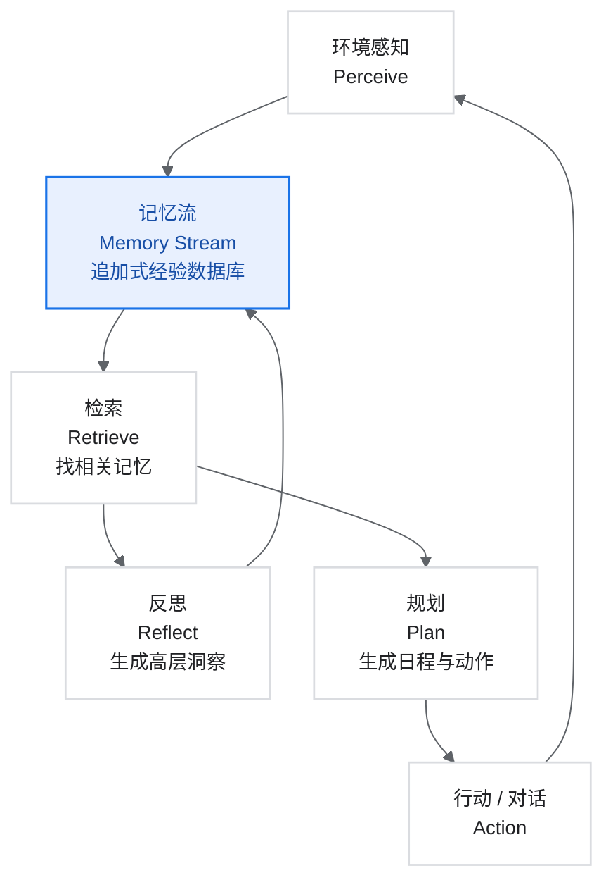
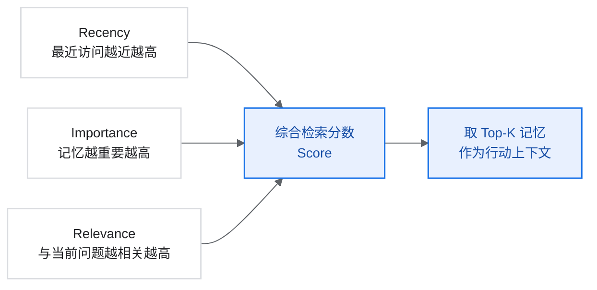

# 【论文精读】Generative Agents: Interactive Simulacra of Human Behavior

生成式智能体：人类行为的交互式仿真

## 📋 论文基本信息

| 项目 | 内容 |
| --- | --- |
| 标题 | Generative Agents: Interactive Simulacra of Human Behavior |
| 作者 | Joon Sung Park, Joseph C. O'Brien, Carrie J. Cai, Meredith Ringel Morris, Percy Liang, Michael S. Bernstein |
| 机构 | Stanford University, Google Research |
| 发表 | UIST 2023, ACM Symposium on User Interface Software and Technology |
| arXiv | [2304.03442](https://arxiv.org/abs/2304.03442) |
| DOI | [10.1145/3586183.3606763](https://doi.org/10.1145/3586183.3606763) |
| PDF | [arXiv PDF](https://arxiv.org/pdf/2304.03442) |
| 代码 | [joonspk-research/generative_agents](https://github.com/joonspk-research/generative_agents) |
| 引用量 | 2000+（截至 2025 年） |
| 使用模型 | GPT-3.5-turbo |

## 1. 研究背景与动机

### 1.1 研究愿景

可信的人类行为代理（Believable proxies of human behavior）可以赋能多种交互式应用：

- **沉浸式环境**：游戏、虚拟世界中的 NPC。
- **人际沟通排练空间**：练习困难对话的安全环境。
- **原型设计工具**：测试社交系统设计。
- **社会科学研究**：模拟人群行为。

这篇论文的核心目标不是让智能体回答问题，而是让它们在一个开放世界里持续生活、记忆、互动，并涌现出类似人类社会的行为。

### 1.2 核心挑战

人类行为的空间是庞大而复杂的。尽管大语言模型在单一时间点模拟人类行为方面取得进展，但要创建能够确保长期连贯性的通用智能体，需要解决：

1. **管理不断增长的记忆**：随着交互进行，记忆持续积累。
2. **处理动态事件**：新的交互、冲突和事件不断出现和消退。
3. **处理社会动态**：多个智能体之间的级联社会互动。

### 1.3 成功标准

要实现可信的人类行为模拟，系统必须能够：

- **长期检索**：在长时间跨度内检索相关事件和交互。
- **反思泛化**：对记忆进行反思，得出更高层次的推断。
- **规划推理**：创建在当下和长期行为弧线中都合理的计划和反应。

## 2. 核心贡献

### 2.1 主要贡献总结

1. **生成式智能体**：可信的人类行为仿真，动态地根据智能体不断变化的经历和环境进行调节。
2. **新的架构**：使生成式智能体能够记忆、检索、反思、与其他智能体交互、规划。
3. **两类评估**：
   - 控制评估：建立架构组件重要性的因果效应。
   - 端到端评估：识别故障模式。
4. **伦理讨论**：讨论生成式智能体在交互系统中的机会与伦理/社会风险。

### 2.2 通讯行为示例

仅给定一个用户指定的概念——“Isabella Rodriguez 想要举办一个情人节派对”，智能体们在接下来两天内自主地：

- 传播派对邀请。
- 结识新朋友。
- 互相邀请约会去派对。
- 协调在正确的时间一起到达派对。

## 3. Smallville：交互式沙盒世界

### 3.1 环境设计

研究者创建了名为 **Smallville** 的沙盒环境，灵感来自《模拟人生》。

```text
Smallville 环境
├── 住宅区
│   ├── Lin家（Mei Lin, John Lin, Eddy Lin）
│   ├── Moore家（Sam Moore, Jennifer Moore）
│   └── Moreno家（Francisco, Carmen, Luis）
├── 商业区
│   ├── Hobbs Cafe（Isabella Rodriguez）
│   ├── Willow Market and Pharmacy（Tom Moreno）
│   └── The Rose and Crown Pub
├── 公共区域
│   ├── Harvey Oak Supply Store
│   ├── Johnson Park
│   └── Town Hall（选举期间）
└── 学术区
    ├── Dorm for Oak Hill College
    └── Library
```

### 3.2 智能体设置

- 25 个独特的智能体以精灵头像形式存在。
- 每个智能体的身份由一段自然语言种子记忆描述。
- 描述包含职业、关系、性格特点。

### 3.3 智能体示例

**John Lin - 药剂师**

```text
John Lin is a pharmacy shopkeeper at the Willow Market and Pharmacy
who loves to help people. He is always looking for ways to make the
process of getting medication easier for his customers...
```

**Isabella Rodriguez - 咖啡馆老板**

```text
Isabella Rodriguez is the owner of Hobbs Cafe. She is friendly and
outgoing, and loves to chat with her customers about their lives and
the latest town gossip...
```

**Klaus Mueller - 研究生**

```text
Klaus Mueller is a graduate student who is writing his thesis on
the effects of gentrification in low-income neighborhoods. He is
passionate about social justice and loves to discuss his research...
```

### 3.4 用户交互方式

1. **观察模式**：观看智能体的日常活动。
2. **对话模式**：以某个人物身份与智能体交流。
3. **内心独白模式**：输入想法到智能体脑中。
4. **环境修改**：改变环境中的物体或状态。

## 4. 生成式智能体架构（核心技术）

### 4.1 架构概览



核心循环可以理解为：

1. 智能体感知环境并把事件写入记忆流。
2. 当需要行动时，从记忆流中检索相关记忆。
3. 基于检索出的记忆进行反思，形成高层次认识。
4. 生成日程计划，并根据新事件做反应与重规划。
5. 执行动作或对话，再把结果写回记忆流。

### 4.2 记忆流（Memory Stream）

记忆流是记录智能体 **全部经历** 的综合数据库，是 **仅追加（append-only）** 的。

#### 4.2.1 记忆对象结构

每条记忆包含：

```python
class MemoryObject:
    description: str        # 事件的自然语言描述
    creation_timestamp: datetime  # 创建时间
    last_access_timestamp: datetime  # 最近访问时间
    importance_score: int   # 重要性评分（1-10）
    embedding: vector       # 嵌入向量（用于相似度计算）
```

#### 4.2.2 记忆类型

1. **观察（Observations）**：智能体直接感知到的事件。
2. **反思（Reflections）**：智能体生成的高层次洞察。
3. **计划（Plans）**：智能体的未来行动安排。

#### 4.2.3 记忆示例时间线

```text
[2023-02-13 06:00] Klaus Mueller is sleeping
[2023-02-13 07:00] Klaus Mueller is waking up and stretching
[2023-02-13 07:30] Klaus Mueller is eating breakfast
[2023-02-13 08:00] Klaus Mueller is reading a book on gentrification
[2023-02-13 09:00] Klaus Mueller is heading to Hobbs Cafe
[2023-02-13 09:15] Klaus Mueller sees Isabella Rodriguez at Hobbs Cafe
[2023-02-13 09:20] Klaus Mueller is talking to Isabella about his research
[2023-02-13 09:45] Isabella mentions she is planning a Valentine's party
[2023-02-13 10:00] Klaus Mueller decides to attend Isabella's party
[2023-02-13 10:30] Klaus Mueller is working on his thesis at the library
...
```

### 4.3 检索机制（Retrieval）

当智能体需要决定如何行动时，系统会检索记忆流中的相关子集。

#### 4.3.1 三因素综合评分

综合评分由三个因素构成：



#### 4.3.2 时近性（Recency）

使用指数衰减函数，最近访问的记忆得分更高：

```python
def recency_score(memory, current_time):
    hours_since_access = (current_time - memory.last_access_timestamp).hours
    decay_rate = 0.995
    return decay_rate ** hours_since_access
```

#### 4.3.3 重要性（Importance）

使用 LLM 评估记忆的重要性（1-10 分）：

```text
Prompt:
On the scale of 1 to 10, where 1 is purely mundane (e.g., brushing teeth,
making bed) and 10 is extremely poignant (e.g., a break up, college
acceptance), rate the likely poignancy of the following piece of memory.

Memory: [记忆内容]
Rating: <fill in>
```

评分示例：

| 记忆 | 评分 |
| --- | ---: |
| 刷牙 | 1 |
| 在超市买菜 | 2 |
| 与朋友讨论研究项目 | 5 |
| Klaus 告诉 Isabella 他在写关于士绅化的论文 | 6 |
| 收到大学录取通知 | 9 |
| 分手 | 10 |

#### 4.3.4 相关性（Relevance）

计算查询与记忆的余弦相似度：

```python
def relevance_score(query, memory):
    query_embedding = get_embedding(query)
    memory_embedding = memory.embedding
    return cosine_similarity(query_embedding, memory_embedding)
```

#### 4.3.5 综合评分公式

```python
def retrieval_score(memory, query, current_time):
    # 各分数归一化到 [0, 1]
    recency = min_max_normalize(recency_score(memory, current_time))
    importance = min_max_normalize(memory.importance_score / 10)
    relevance = min_max_normalize(relevance_score(query, memory))

    # 等权重组合（alpha = 1.0）
    alpha = 1.0
    final_score = alpha * recency + alpha * importance + alpha * relevance
    return final_score

# 检索 top-k 记忆
def retrieve(query, memory_stream, k=100):
    scored_memories = [(m, retrieval_score(m, query, now()))
                       for m in memory_stream]
    sorted_memories = sorted(scored_memories, key=lambda x: x[1], reverse=True)
    return [m for m, score in sorted_memories[:k]]
```

### 4.4 反思机制（Reflection）

反思是更高层次、更抽象的思考，使智能体能够进行泛化和推断。

#### 4.4.1 触发条件

当最近感知事件的重要性分数累积总和超过阈值时触发：

```python
importance_threshold = 150  # 示例阈值

def check_reflection_trigger(agent):
    recent_importance_sum = sum(m.importance for m in agent.recent_perceptions)
    if recent_importance_sum >= importance_threshold:
        trigger_reflection(agent)
        agent.recent_perceptions = []  # 重置
```

实践中，智能体大约每天反思 2-3 次。

#### 4.4.2 反思生成过程

第一步：确定反思问题。

```text
Prompt:
Given only the information above, what are 3 most salient high-level
questions we can answer about the subjects in the statements?

输入：最近100条记忆
输出：3个需要反思的问题
```

示例输出：

```text
1. What is Klaus Mueller's primary focus and passion?
2. How does Klaus Mueller spend his typical day?
3. What is the nature of Klaus Mueller's relationship with Isabella Rodriguez?
```

第二步：为每个问题生成洞察。

```text
Prompt:
Statements about Klaus Mueller:
1. Klaus Mueller is writing a research paper on gentrification
2. Klaus Mueller is discussing his research with Isabella Rodriguez
3. Klaus Mueller spends long hours at the library
4. Klaus Mueller is passionate about urban development
5. Klaus Mueller mentioned he wants to make a positive impact

What 5 high-level insights can you infer from the above statements?
(example format: insight (because of 1, 5, 3))
```

示例输出：

```text
1. Klaus Mueller is dedicated to academic research on social issues
   (because of 1, 3, 4)
2. Klaus Mueller values meaningful connections and enjoys sharing his
   passions with others (because of 2)
3. Klaus Mueller is motivated by a desire to create positive social
   change (because of 4, 5)
```

#### 4.4.3 反思存储

反思被存储回记忆流中，与普通记忆同等对待，可以被后续检索使用。这使得智能体可以基于反思进行进一步的反思，也就是递归反思。

### 4.5 规划机制（Planning）

规划帮助智能体在时间维度上保持行为连贯性。

#### 4.5.1 计划结构

```python
class Plan:
    description: str    # 行动描述
    location: str       # 地点
    start_time: datetime  # 开始时间
    duration: int       # 持续时间（分钟）
```

#### 4.5.2 分层规划过程

自顶向下递归细化：

```text
第一层：日计划（粗粒度）
    ↓ 细化
第二层：小时计划
    ↓ 细化
第三层：5-15分钟计划（细粒度）
```

第一步：生成日计划。

```text
Prompt:
Name: Klaus Mueller (age: 24)
Innate traits: dedicated, curious, passionate about social justice
Klaus Mueller's status: Klaus is a graduate student working on his thesis
Current Date: Tuesday February 13

In broad strokes, what is Klaus Mueller's plan for today?
```

输出：

```text
1) Wake up and get ready for the day (7:00am - 8:00am)
2) Have breakfast and review research notes (8:00am - 9:00am)
3) Go to Hobbs Cafe for coffee (9:00am - 10:00am)
4) Work on thesis at the library (10:00am - 12:00pm)
5) Have lunch (12:00pm - 1:00pm)
6) Continue thesis work (1:00pm - 5:00pm)
7) Take a break and exercise (5:00pm - 6:00pm)
8) Have dinner (6:00pm - 7:00pm)
9) Read and relax (7:00pm - 10:00pm)
10) Prepare for bed (10:00pm - 11:00pm)
```

第二步：细化到小时。

```text
Prompt:
[Klaus's summary]
Today's plan item: "Go to Hobbs Cafe for coffee (9:00am - 10:00am)"
Please break this down into 5-15 minute chunks:
```

输出：

```text
1) 9:00am - Walk to Hobbs Cafe
2) 9:10am - Order coffee and find a seat
3) 9:15am - Check phone and relax
4) 9:25am - Notice Isabella and greet her
5) 9:30am - Have a conversation with Isabella about her cafe
6) 9:45am - Discuss Valentine's party plans
7) 9:55am - Say goodbye and prepare to leave
```

#### 4.5.3 反应与重新规划

智能体在执行计划时，如果观察到需要反应的情况，可以中途改变计划：

```text
Prompt:
[Agent's Summary Description]
[Agent's Current Plan]

It is 9:30am. Klaus Mueller sees Maria Lopez crying on a park bench.

Context: Klaus doesn't know Maria well but has seen her around campus.

Given the context, should Klaus react to the observation, and if so, what
would be an appropriate reaction? If Klaus should not react, output "No reaction".
```

可能输出：

```text
Klaus should react. He should approach Maria with concern and ask if she is
okay, offering support or a listening ear if needed.
```

### 4.6 对话生成

当两个智能体相遇并决定交谈时，系统生成自然对话：

```text
Prompt:
[Isabella's Summary Description]
[Isabella's Relevant Memories about Klaus]
[Klaus's Summary Description]
[Klaus's Relevant Memories about Isabella]

Isabella and Klaus are having a conversation at Hobbs Cafe.

Dialogue so far:
Isabella: "Good morning Klaus! Working on your research today?"
Klaus: "Yes, I've been making good progress on my gentrification paper."
Isabella: "That sounds fascinating! I'd love to hear more about it."

What would Klaus say next?
```

## 5. 实验评估

### 5.1 评估方法

通过“采访”智能体来评估其能力，使用自然语言探测以下方面：

| 评估维度 | 描述 | 示例问题 |
| --- | --- | --- |
| 自我认知 | 了解自己的身份 | "Give an introduction of yourself." |
| 记忆 | 记住过去事件和人物 | "Who is [name]?" "What happened yesterday?" |
| 规划 | 合理规划未来 | "What will you be doing at 10am tomorrow?" |
| 反应 | 对新情况做出反应 | "Your breakfast is burning! What would you do?" |
| 反思 | 高层次理解 | "Describe your relationship with [name] in one sentence." |

### 5.2 消融实验设置

| 条件 | 描述 |
| --- | --- |
| 完整架构 | 记忆流 + 检索 + 反思 + 规划 |
| 无反思 | 移除反思机制 |
| 无规划 | 移除规划机制，仅根据当前情境行动 |
| 无观察检索 | 不检索与当前观察相关的记忆 |
| 人类基线 | 人类观看智能体生活后扮演智能体回答 |

### 5.3 评估结果

100 名众包评估者对不同条件的可信度进行排名（1=最可信，5=最不可信）：

| 条件 | 平均排名 | 排名第一比例 |
| --- | ---: | ---: |
| 完整架构 | 1.96 | 43% |
| 人类基线 | 2.49 | 25% |
| 无反思 | 3.06 | 15% |
| 无规划 | 3.38 | 10% |
| 无观察 | 4.11 | 7% |

关键发现：**完整架构甚至超越了人类基线**。

### 5.3.2 定性观察

成功案例：

- 智能体能记住多天前的对话细节。
- 智能体展示了一致的性格特征。
- 智能体根据过去经历调整行为。

失败模式：

1. **检索失败**：未能检索到相关记忆。
2. **记忆虚构**：添加了未发生的细节。
3. **过于正式**：从语言模型继承了不自然的正式语气。

### 5.4 涌现社会行为

#### 5.4.1 信息扩散

```text
Day 1 Morning: Isabella tells Klaus about her Valentine's party plan
Day 1 Afternoon: Klaus tells Ayesha, Maria about the party
Day 1 Evening: Maria tells her roommates about the party
Day 2: 12 agents know about the party
Day 2 Evening: 8 agents show up to the party
```

#### 5.4.2 关系形成

- Klaus 和 Maria 因为共同认识 Isabella 而成为朋友。
- Sam 和 Jennifer 决定一起去情人节派对约会。

#### 5.4.3 协调行为

- 多个智能体协调在同一时间到达派对。
- 智能体互相约定一起去某个地点。

## 6. 架构细节与成本

### 6.1 提示词工程

论文使用了大量精心设计的提示词，完整提示词见附录。核心原则：

- 提供足够的上下文。
- 明确输出格式要求。
- 使用示例引导输出。

### 6.2 计算成本

对于 25 个智能体运行 2 天模拟：

- **API 调用次数**：大量，每个行动决策都需要 LLM 调用。
- **成本**：论文未明确披露，但估计数百美元。
- **延迟**：每个智能体每个时间步约需数秒。

### 6.3 效率优化

- **缓存常用查询**：相同输入直接返回缓存结果。
- **批量处理**：多个智能体的独立计算并行处理。
- **智能跳过**：睡眠等明确状态不需要复杂推理。

## 7. 总结与影响

### 7.1 核心贡献

1. **证明可行性**：LLM 可以驱动可信的长期行为模拟。
2. **提出架构**：记忆流 + 检索 + 反思 + 规划的组合。
3. **开源代码**：促进了后续研究。

### 7.2 对后续研究的影响

这篇论文是 Agent Memory 领域的奠基之作，直接影响了：

- MemGPT 的分层存储设计。
- Reflexion 的自我反思机制。
- 众多多智能体模拟系统。

### 7.3 局限性

1. **成本高**：大量 LLM 调用。
2. **规模受限**：仅测试了 25 个智能体。
3. **环境简单**：Smallville 是相对简单的 2D 环境。
4. **时间尺度短**：仅测试了 2 天。

## 8. 关键代码示例

### 8.1 记忆检索伪代码

```python
def retrieve_memories(agent, query, count=100):
    """搜索与查询最相关的记忆"""
    scores = []
    for memory in agent.memory_stream:
        recency = compute_recency(memory)
        importance = memory.importance / 10
        relevance = cosine_sim(embed(query), memory.embedding)

        # 归一化并加权求和
        score = normalize(recency) + normalize(importance) + normalize(relevance)
        scores.append((memory, score))

    # 返回Top-K
    scores.sort(key=lambda x: x[1], reverse=True)
    return [m for m, s in scores[:count]]
```

### 8.2 反思生成伪代码

```python
def generate_reflection(agent):
    """生成高层次反思"""
    # 获取最近记忆
    recent = agent.memory_stream[-100:]

    # 生成反思问题
    questions = llm.generate(
        f"Given these memories: {recent}\n"
        "What are 3 salient high-level questions?"
    )

    # 为每个问题生成洞察
    for question in questions:
        relevant = retrieve_memories(agent, question, 50)
        insight = llm.generate(
            f"Memories: {relevant}\n"
            f"Question: {question}\n"
            "Generate insight with citations."
        )

        # 将反思添加到记忆流
        agent.memory_stream.append(
            Memory(insight, type="reflection", importance=8)
        )
```

## 9. 参考文献精选

- Park et al., 2023. [Generative Agents: Interactive Simulacra of Human Behavior](https://arxiv.org/abs/2304.03442)
- Park et al., 2022. Social Simulacra（前作）
- Wei et al., 2022. Chain of Thought Prompting
- OpenAI, 2023. GPT-4 Technical Report
- Bates, 1994. The Role of Emotion in Believable Agents

> 📖 本文是 Agent Memory 领域的开山之作。
