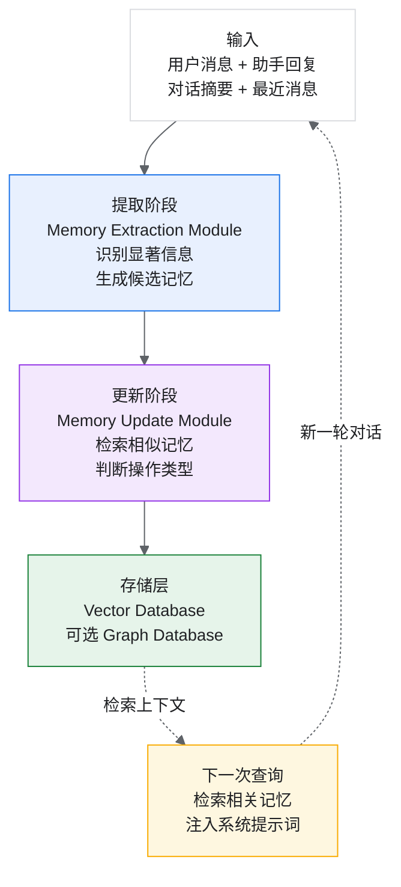
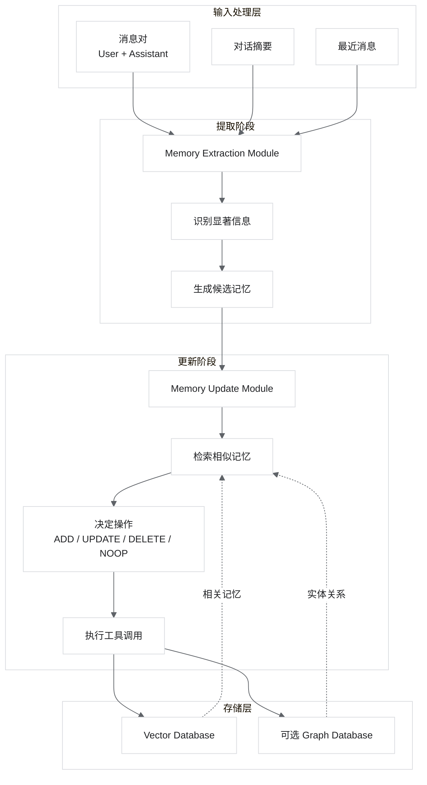
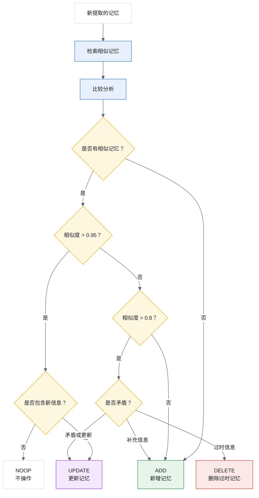
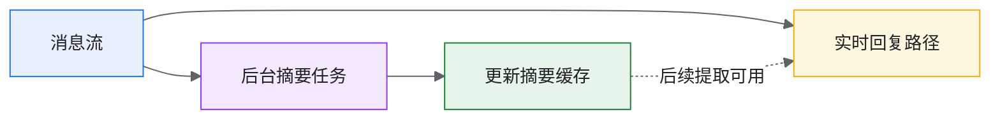
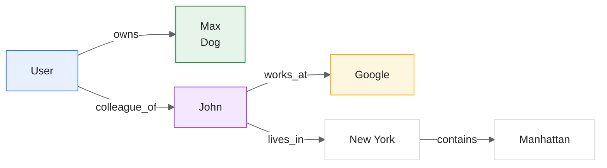

# 第四周-05 论文精读 4：Mem0 - Building Production-Ready AI Agents with Scalable Long-Term Memory

> Mem0：构建具有可扩展长期记忆的生产级 AI Agent

## 论文基本信息

| 项目 | 内容 |
|---|---|
| 标题 | Mem0: Building Production-Ready AI Agents with Scalable Long-Term Memory |
| 作者 | Prateek Chhikara, Dev Khant, Saket Aryan, Taranjeet Singh, Deshraj Yadav |
| 机构 | Mem0.ai |
| arXiv | 2504.19413 |
| 发布时间 | 2025 年 4 月 |
| GitHub | https://github.com/mem0ai/mem0 |
| 官网 | https://mem0.ai |
| 文档 | https://docs.mem0.ai/ |
| 原论文 PDF | https://arxiv.org/pdf/2504.19413 |
| 本地 PDF | `01.raw\08.Research\00.Agent\Memory_Mem0- Building Production-Ready AI Agents with Scalable Long-Term Memory.pdf` |

> 结合 4、5、6、9、10、11 节看：这篇论文的重点是“记忆的提取逻辑和原则”。在个性化输出场景里，系统需要从上一轮上下文里抽取真正会影响下一次回答的关键信息，而不是把所有历史都塞回模型。

## 0. 总览：整体架构与核心概念

论文给出的目标很直接：让 AI Agent 在生产环境里拥有可扩展、可更新、低延迟、低成本的长期记忆。

| 核心指标 | Mem0 表现 |
|---|---|
| 准确率提升 | 相比 OpenAI 方案高 26% |
| 延迟降低 | p95 延迟降低 91% |
| Token 节省 | 节省超过 90% token |
| 图记忆额外提升 | 相比基础 Mem0 高约 2% |

### 0.1 核心问题与 Mem0 的解决思路

现有方案的问题：

1. 只依赖上下文窗口会受到长度限制。
2. RAG 检索历史对话时，噪声、时序和更新问题很难处理。
3. 摘要会压缩掉个性化细节。
4. 旧记忆与新事实冲突时缺少明确的更新机制。

Mem0 的解决方案：

1. 动态提取对话中的显著信息。
2. 对既有记忆做增量更新，而不是全量重建。
3. 支持 `ADD`、`UPDATE`、`DELETE`、`NOOP` 四类操作。
4. 使用向量数据库存储记忆，并可选加入图数据库表示实体关系。

### 0.2 系统架构



### 0.3 四类记忆操作

| 操作 | 含义 | 适用场景 |
|---|---|---|
| `ADD` | 添加新记忆 | 没有相似旧记忆，或新信息应独立保存 |
| `UPDATE` | 更新既有记忆 | 新信息补充或替代旧信息 |
| `DELETE` | 删除过时记忆 | 旧偏好或事实已经失效 |
| `NOOP` | 不执行操作 | 新信息重复，或者不值得长期记忆 |

## 1. 研究背景与动机

### 1.1 核心问题

大语言模型虽然在生成上下文连贯的响应方面表现出色，但固定的上下文窗口对长期多会话的一致性维护提出了挑战。

| 问题 | 影响 |
|---|---|
| 上下文窗口限制 | 无法处理超长对话历史 |
| 会话隔离 | 跨会话信息丢失 |
| 计算成本高 | 全上下文方法的 token 消耗巨大 |
| 延迟问题 | 长上下文导致响应变慢 |

### 1.2 现有方案的不足

| 方案 | 局限性 |
|---|---|
| 全上下文方法 | token 成本高，延迟大 |
| 标准 RAG | 检索粒度粗，缺乏动态更新 |
| 简单摘要 | 信息丢失严重 |
| 现有记忆系统 | 准确率不足，难以扩展 |

### 1.3 Mem0 的目标

构建一个生产就绪的记忆系统：

- 高准确率：超过 OpenAI 方案 26%。
- 低延迟：降低 91% p95 延迟。
- 低成本：节省 90% 以上 token。
- 可扩展：支持大规模部署。

## 2. 核心贡献

### 2.1 两种架构

Mem0 基础记忆架构：

- 动态提取对话中的显著信息。
- 增量处理和更新记忆。
- 高效检索相关记忆。

Mem0^g 图记忆增强版本：

- 图结构记忆表示。
- 捕获实体间复杂关系。
- 支持多跳推理。

### 2.2 关键指标

| 指标 | Mem0 表现 |
|---|---|
| 准确率提升 | 比 OpenAI 方案高 26% |
| 延迟降低 | 比全上下文方法低 91% |
| Token 节省 | 超过 90% |
| 图记忆额外提升 | 比基础 Mem0 高约 2% |

## 3. 系统架构

### 3.1 整体架构概览

Mem0 系统可以抽象成四层：输入层、提取阶段、更新阶段、存储层。



### 3.2 增量处理模式

Mem0 采用增量处理设计，而非批量处理。

```python
# 传统批量处理
def batch_process(full_conversation):
    # 处理整个对话历史
    memories = extract_all(full_conversation)
    return memories


# Mem0 增量处理
def incremental_process(new_message_pair, context):
    # 仅处理新增消息对
    new_memories = extract_from_pair(new_message_pair, context)
    update_memory_store(new_memories)
    return new_memories
```

优势：

- 实时响应，无需等待。
- 资源消耗可控。
- 与实时对话无缝集成。

## 4. 提取阶段（Extraction Phase）

### 4.1 输入组成

提取阶段的输入由三部分组成：

```python
extraction_input = {
    "message_pair": {
        "user": "I'm planning a trip to Japan next month",
        "assistant": "That sounds exciting! Japan in spring..."
    },
    "conversation_summary": "User is discussing travel plans...",
    "recent_messages": [
        # 最近 N 轮对话
    ]
}
```

### 4.2 对话摘要模块

异步摘要生成：定期刷新对话摘要，不阻塞主流程。

```python
class ConversationSummarizer:
    def __init__(self, refresh_interval=10):
        self.refresh_interval = refresh_interval
        self.current_summary = ""
        self.message_count = 0

    async def update_summary_async(self, messages):
        """异步更新摘要"""
        if self.message_count % self.refresh_interval == 0:
            self.current_summary = await self.generate_summary(messages)

    def generate_summary(self, messages):
        prompt = f"""
        Summarize the key points from this conversation:
        {messages}

        Focus on: facts, preferences, decisions, and plans.
        """
        return llm.generate(prompt)
```

### 4.3 记忆提取

从消息对中提取显著信息：

```python
def extract_memories(message_pair, context):
    """从消息对中提取记忆"""

    prompt = f"""
    Given the following conversation context and new messages,
    extract any significant information worth remembering.

    Context Summary: {context.summary}
    Recent Messages: {context.recent_messages}

    New User Message: {message_pair.user}
    New Assistant Response: {message_pair.assistant}

    Extract memories in the following format:
    - Each memory should be a standalone fact or preference
    - Include relevant entities and relationships
    - Rate importance (1-10)

    Output as JSON list of memories.
    """

    extracted = llm.generate(prompt, response_format="json")
    return parse_memories(extracted)
```

提取示例：

| 原始对话 | 提取的记忆 |
|---|---|
| "I'm vegetarian and love Italian food" | `["User is vegetarian", "User loves Italian food"]` |
| "I have a meeting with John tomorrow at 3pm" | `["User has meeting with John on [date] at 3pm"]` |
| "My dog Max turned 5 last week" | `["User has a dog named Max", "Max is 5 years old"]` |

## 5. 更新阶段（Update Phase）

### 5.1 更新决策流程



### 5.2 四种操作类型

```python
class MemoryOperation(Enum):
    ADD = "add"        # 添加新记忆
    UPDATE = "update"  # 更新现有记忆
    DELETE = "delete"  # 删除过时记忆
    NOOP = "noop"      # 无需操作
```

操作决策逻辑：

```python
def decide_operation(new_memory, similar_memories):
    """决定对记忆执行什么操作"""

    if not similar_memories:
        return MemoryOperation.ADD, new_memory

    most_similar = similar_memories[0]
    similarity = most_similar.similarity_score

    if similarity > 0.95:
        # 几乎相同，检查是否需要更新
        if has_new_information(new_memory, most_similar):
            return MemoryOperation.UPDATE, merge(new_memory, most_similar)
        else:
            return MemoryOperation.NOOP, None

    elif similarity > 0.8:
        # 相关但不同，可能是更新
        if is_contradiction(new_memory, most_similar):
            # 新信息覆盖旧信息
            return MemoryOperation.UPDATE, new_memory
        else:
            # 补充信息
            return MemoryOperation.ADD, new_memory

    else:
        # 不够相似，作为新记忆添加
        return MemoryOperation.ADD, new_memory
```

### 5.3 工具调用机制

Mem0 使用 Tool Call 机制执行记忆操作：

```python
memory_tools = [
    {
        "name": "add_memory",
        "description": "Add a new memory to the store",
        "parameters": {
            "content": "string",
            "importance": "float",
            "entities": "list[string]"
        }
    },
    {
        "name": "update_memory",
        "description": "Update an existing memory",
        "parameters": {
            "memory_id": "string",
            "new_content": "string"
        }
    },
    {
        "name": "delete_memory",
        "description": "Delete an outdated memory",
        "parameters": {
            "memory_id": "string",
            "reason": "string"
        }
    }
]
```

### 5.4 异步摘要生成机制

为什么需要异步摘要：

- 摘要只需要覆盖主线信息，不需要阻塞实时对话。
- 对话摘要可以被后续记忆提取阶段复用。
- 摘要生成通常属于非实时路径。



## 6. Mem0^g：图记忆增强

### 6.1 图记忆的动机

基础 Mem0 使用向量存储，但难以处理：

- 实体间的复杂关系。
- 多跳推理问题。
- 知识的结构化表示。

Mem0^g 通过图结构增强记忆表示。



### 6.2 图记忆架构

```python
class GraphMemory:
    def __init__(self):
        self.entities = {}   # 实体节点
        self.relations = []  # 关系边

    def add_entity(self, entity_id, entity_type, attributes):
        self.entities[entity_id] = {
            "type": entity_type,
            "attributes": attributes
        }

    def add_relation(self, source, relation, target, properties=None):
        self.relations.append({
            "source": source,
            "relation": relation,
            "target": target,
            "properties": properties or {}
        })

    def query_neighbors(self, entity_id, relation_type=None, depth=1):
        """查询实体的邻居"""
        results = []
        for rel in self.relations:
            if rel["source"] == entity_id:
                if relation_type is None or rel["relation"] == relation_type:
                    results.append(rel)
                    if depth > 1:
                        results.extend(
                            self.query_neighbors(rel["target"], None, depth - 1)
                        )
        return results
```

### 6.3 实体和关系提取

```python
def extract_entities_and_relations(memory_content, llm):
    """从记忆内容中提取实体和关系"""

    prompt = f"""
    Extract entities and relationships from this memory:

    "{memory_content}"

    Output format:
    {{
        "entities": [
            {{"id": "...", "type": "PERSON|PLACE|THING|EVENT", "name": "..."}}
        ],
        "relations": [
            {{"source": "...", "relation": "...", "target": "..."}}
        ]
    }}
    """

    return llm.generate(prompt, response_format="json")
```

提取示例：

```json
{
  "input": "My colleague John works at Google in Mountain View",
  "entities": [
    {"id": "e1", "type": "PERSON", "name": "John"},
    {"id": "e2", "type": "ORGANIZATION", "name": "Google"},
    {"id": "e3", "type": "PLACE", "name": "Mountain View"}
  ],
  "relations": [
    {"source": "e1", "relation": "works_at", "target": "e2"},
    {"source": "e2", "relation": "located_in", "target": "e3"},
    {"source": "user", "relation": "colleague_of", "target": "e1"}
  ]
}
```

### 6.4 多跳查询

图记忆支持复杂的多跳查询：

```python
def multi_hop_query(graph, query, max_hops=3):
    """执行多跳查询"""

    # 1. 从查询中提取起始实体
    start_entities = extract_query_entities(query)

    # 2. 进行多跳遍历
    all_paths = []
    for entity in start_entities:
        paths = graph.traverse(
            start=entity,
            max_depth=max_hops
        )
        all_paths.extend(paths)

    # 3. 收集路径上的所有信息
    context = compile_path_context(all_paths)

    return context


# 示例查询
query = "Where does my colleague John work?"
# 遍历：User -> colleague_of -> John -> works_at -> Google
# 结果："John works at Google"
```

## 7. 实验评估

### 7.1 评估基准：LOCOMO

LOCOMO（Long-Context Conversation Memory）用于评估长上下文对话记忆。

| 问题类型 | 描述 | 挑战 |
|---|---|---|
| Single-hop | 单步检索 | 基础记忆检索 |
| Temporal | 时间相关 | 时间推理能力 |
| Multi-hop | 多步推理 | 关联多条记忆 |
| Open-domain | 开放问答 | 综合理解能力 |

### 7.2 基线对比

Mem0 与多类基线系统进行了系统对比：

| 类别 | 代表方法 |
|---|---|
| 记忆增强系统 | MemGPT, Zep |
| RAG 方法 | 不同 chunk size 和 k 值 |
| 全上下文方法 | 处理完整对话历史 |
| 开源方案 | LangChain Memory |
| 商业方案 | OpenAI Memory |
| 专用平台 | 其他记忆管理平台 |

### 7.3 主要结果

#### 7.3.1 准确率对比

| 方法 | Single-hop | Temporal | Multi-hop | Open-domain | Overall |
|---|---:|---:|---:|---:|---:|
| OpenAI Memory | 68.2 | 65.4 | 58.3 | 62.1 | 63.5 |
| RAG (best) | 72.1 | 68.7 | 61.2 | 65.8 | 66.9 |
| Full Context | 79.3 | 75.2 | 71.8 | 72.4 | 74.7 |
| Mem0 | 82.5 | 78.6 | 73.4 | 76.2 | 77.7 |
| Mem0^g | 84.1 | 80.2 | 76.8 | 77.9 | 79.8 |

Mem0 相对 OpenAI Memory 提升 26%。

#### 7.3.2 效率对比

| 方法 | p95 延迟 (ms) | Token 使用 | 相对成本 |
|---|---:|---:|---:|
| Full Context | 3200 | 100% | 100% |
| RAG | 450 | 35% | 35% |
| Mem0 | 290 | 8% | 8% |

Mem0 实现 91% 延迟降低，并节省 90% 以上 token。

### 7.4 图记忆的额外增益

| 问题类型 | Mem0 | Mem0^g | 提升 |
|---|---:|---:|---:|
| Single-hop | 82.5 | 84.1 | 0.019 |
| Temporal | 78.6 | 80.2 | 0.020 |
| Multi-hop | 73.4 | 76.8 | 0.046 |
| Open-domain | 76.2 | 77.9 | 0.022 |

关键发现：图记忆在 Multi-hop 问题上提升最显著，约 +4.6%。

## 8. 实现细节

### 8.1 使用示例

```python
from openai import OpenAI
from mem0 import Memory


# 初始化
openai_client = OpenAI()
memory = Memory()


def chat_with_memories(message: str, user_id: str = "default_user") -> str:
    # 1. 搜索相关记忆
    relevant_memories = memory.search(
        query=message,
        user_id=user_id,
        limit=3
    )

    # 2. 格式化记忆上下文
    memories_str = "\n".join(
        f"- {entry['memory']}"
        for entry in relevant_memories["results"]
    )

    # 3. 构建系统提示
    system_prompt = f"""You are a helpful AI assistant.

    Relevant memories about this user:
    {memories_str}

    Use these memories to provide personalized responses.
    """

    # 4. 生成响应
    response = openai_client.chat.completions.create(
        model="gpt-4",
        messages=[
            {"role": "system", "content": system_prompt},
            {"role": "user", "content": message}
        ]
    )

    assistant_message = response.choices[0].message.content

    # 5. 存储新记忆
    memory.add(
        messages=[
            {"role": "user", "content": message},
            {"role": "assistant", "content": assistant_message}
        ],
        user_id=user_id
    )

    return assistant_message


# 使用
response = chat_with_memories(
    "I'm planning a trip to Japan next month",
    user_id="alice"
)
print(response)

# 后续对话会记住这个信息
response = chat_with_memories(
    "What should I pack?",
    user_id="alice"
)
# AI 会基于“日本旅行”的记忆给出相关建议
```

### 8.2 配置选项

```python
from mem0 import Memory

config = {
    # LLM 配置
    "llm": {
        "provider": "openai",
        "model": "gpt-4o-mini",
        "temperature": 0.1
    },

    # 向量存储配置
    "vector_store": {
        "provider": "chroma",  # 或 "pinecone", "qdrant"
        "collection_name": "memories"
    },

    # 图存储配置（可选）
    "graph_store": {
        "provider": "neo4j",
        "url": "bolt://localhost:7687",
        "user": "neo4j",
        "auth_value": "<redacted>"
    },

    # 记忆配置
    "memory": {
        "max_memories": 1000,
        "similarity_threshold": 0.7
    }
}

memory = Memory.from_config(config)
```

> 注：截图中的图数据库登录字段已做脱敏替换。

### 8.3 API 接口

```python
# 添加记忆
memory.add(
    messages=[...],
    user_id="user_123",
    metadata={"source": "chat"}
)

# 搜索记忆
results = memory.search(
    query="What does the user like?",
    user_id="user_123",
    limit=5
)

# 获取所有记忆
all_memories = memory.get_all(user_id="user_123")

# 更新记忆
memory.update(
    memory_id="mem_abc",
    data={"content": "Updated content"}
)

# 删除记忆
memory.delete(memory_id="mem_abc")

# 删除用户所有记忆
memory.delete_all(user_id="user_123")

# 获取记忆历史
history = memory.history(memory_id="mem_abc")
```

## 9. 与其他系统的对比

### 9.1 功能对比

| 特性 | Mem0 | MemGPT | RAG | OpenAI Memory |
|---|---|---|---|---|
| 动态记忆提取 | 是 | 否 | 否 | 是 |
| 记忆更新/删除 | 是 | 是 | 否 | 否 |
| 图记忆支持 | 是 | 否 | 否 | 否 |
| 多用户支持 | 是 | 是 | 是 | 否 |
| 生产就绪 | 是 | 部分 | 是 | 是 |
| 开源 | 是 | 是 | N/A | 否 |

### 9.2 架构对比

| 方面 | Mem0 | MemGPT |
|---|---|---|
| 设计理念 | 记忆中心 | 操作系统风格 |
| 处理方式 | 增量处理 | 分页管理 |
| 存储结构 | 向量 + 图 | 分层（核心/归档/召回） |
| 更新机制 | 工具调用 | 函数调用 |
| 主要优势 | 生产效率 | 无限上下文 |

## 10. 应用场景

### 10.1 个人助手

```text
# 记住用户偏好
"User prefers dark mode"
"User is vegetarian"
"User's timezone is PST"

# 个性化响应
user: "Recommend a restaurant for tonight"
assistant: "Based on your vegetarian preference, I recommend Green Garden, which has great vegan options..."
```

### 10.2 客户支持

```text
# 记住客户信息和历史问题
"Customer has premium subscription"
"Customer previously had billing issue in January"
"Customer's account ID is #12345"

# 提供连贯的支持体验
```

### 10.3 医疗健康

```text
# 记住健康信息
"Patient is allergic to penicillin"
"Patient has Type 2 diabetes"
"Patient's last checkup was on 2024-01-15"

# 提供安全的健康建议
```

### 10.4 教育辅导

```text
# 记住学习进度
"Student completed Lesson 5 on Python basics"
"Student struggles with recursion concepts"
"Student prefers visual learning"

# 个性化教学
```

## 11. 局限性与未来方向

### 11.1 当前局限

| 局限 | 描述 |
|---|---|
| 依赖 LLM 质量 | 记忆提取质量依赖底层 LLM |
| 图构建成本 | 实体关系提取需要额外计算 |
| 冷启动问题 | 新用户没有历史记忆 |
| 隐私考虑 | 长期存储用户信息的隐私风险 |

### 11.2 未来方向

1. 更智能的遗忘机制：自动识别和清理过时信息。
2. 跨用户知识共享：在保护隐私的前提下共享通用知识。
3. 多模态记忆：支持图像、音频等模态的记忆。
4. 联邦记忆：分布式记忆存储和计算。

## 12. 总结

### 12.1 核心贡献

1. 生产级架构：Mem0 提供了可直接部署的记忆解决方案。
2. 增量处理：高效的实时记忆管理。
3. 图记忆增强：Mem0^g 支持复杂关系和多跳推理。
4. 显著性能提升：26% 准确率提升，91% 延迟降低。

### 12.2 实践建议

选择指南：

使用 Mem0 基础版，当：

- 需要快速部署。
- 主要处理简单查询。
- 资源受限。

使用 Mem0^g 图增强版，当：

- 需要处理复杂关系。
- 有 Multi-hop 查询需求。
- 实体关系是核心。

### 12.3 关键代码

```python
# 最小可用示例
from mem0 import Memory

m = Memory()

# 添加记忆
m.add("I love pizza", user_id="user1")
m.add("I'm allergic to nuts", user_id="user1")

# 检索记忆
results = m.search("What food should I avoid?", user_id="user1")
# 返回："I'm allergic to nuts"
```

## 13. 阅读结论

Mem0 是当前比较成熟的生产级 Agent 记忆解决方案之一。它的关键不是“保存更多历史”，而是把对未来响应有价值的信息从对话中持续抽取出来，并用明确的更新策略维护长期记忆。

在 Agent 工程实践中，Mem0 的价值主要体现在：

- 将长期记忆从上下文窗口中解耦出来。
- 通过增量更新降低延迟和 token 成本。
- 用图记忆增强实体关系和多跳推理能力。
- 提供面向生产环境的 API、存储配置和多用户管理能力。

GitHub: https://github.com/mem0ai/mem0  
Docs: https://docs.mem0.ai/
