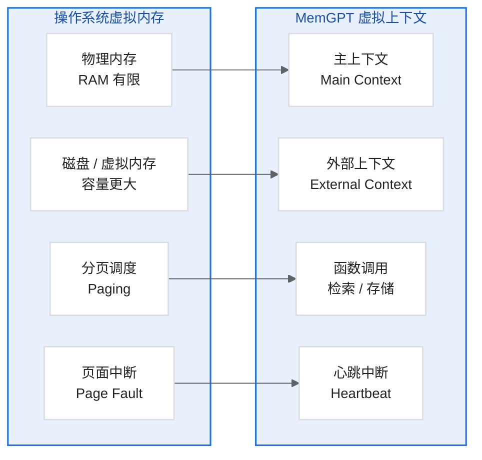
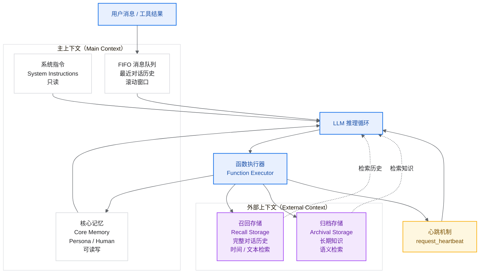
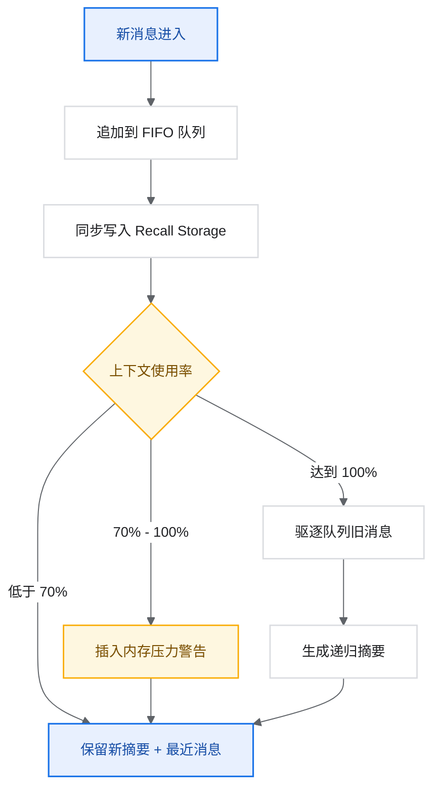
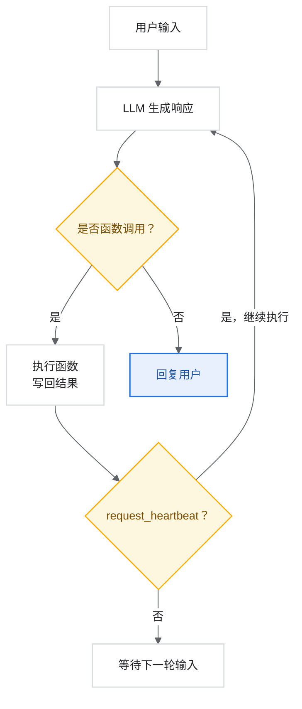

# 论文精读_Agent_MemGPT - Towards LLMs as Operating Systems

> MemGPT：将 LLM 打造为操作系统

## 论文基本信息

| 项目 | 内容 |
|---|---|
| 标题 | MemGPT: Towards LLMs as Operating Systems |
| 作者 | Charles Packer, Vivian Fang, Shishir G. Patil, Kevin Lin, Sarah Wooders, Joseph E. Gonzalez, Ion Stoica |
| 机构 | UC Berkeley |
| 发表 | NeurIPS 2023 Workshop / ICLR 2024 |
| arXiv | 2310.08560 |
| 代码 | <https://github.com/cpacker/MemGPT>（现已发展为 Letta 框架） |
| 官网 | <https://research.memgpt.ai/> |
| 官方 PDF | <https://arxiv.org/pdf/2310.08560> |

## 1. 研究背景与动机

### 1.1 核心问题：上下文窗口的局限

大语言模型（LLM）虽然革命性地改变了 AI 领域，但受到**有限上下文窗口**的严重制约：

| 问题场景 | 具体挑战 |
|---|---|
| 长对话 | 对话超过上下文限制后，早期内容被截断，失去连续性 |
| 文档分析 | 长文档无法一次性放入上下文 |
| 多会话记忆 | 每次对话独立，无法记住之前的交互 |
| 人格一致性 | 长期交互中难以保持一致的人设 |

### 1.2 核心洞察：操作系统的启发

传统操作系统如何解决类似问题？

**虚拟内存机制：**

- 物理 RAM 有限，但通过虚拟内存提供“无限”内存的幻觉。
- 数据在快速内存（RAM）和慢速存储（磁盘）之间**分页（Paging）**。
- 对应用程序透明，自动管理。

**类比到 LLM：**

```text
操作系统                         MemGPT
------------------------------------------------------------
物理内存（RAM）        <->      主上下文（Main Context）
虚拟内存 / 磁盘        <->      外部上下文（External Context）
页面调度              <->      函数调用检索 / 存储
页面中断              <->      心跳中断（Heartbeat）
```



## 2. 核心贡献

### 2.1 主要贡献

1. **虚拟上下文管理（Virtual Context Management）**：借鉴操作系统的分层内存管理思想。
2. **自管理内存的 LLM**：LLM 通过函数调用自主管理自己的记忆。
3. **心跳中断机制（Heartbeat）**：允许 LLM 连续执行多步操作。
4. **两个评估领域的验证**：文档分析和多会话对话。

### 2.2 核心思想

> MemGPT 教会 LLM 管理自己的内存，从而实现无限上下文。

## 3. 系统架构详解

### 3.1 整体架构图

MemGPT 把上下文分为主上下文和外部上下文。主上下文类似 RAM，存放当前推理必须直接可见的信息；外部上下文类似磁盘，存放完整历史和长期知识，并通过函数调用显式检索或写入。



ASCII 结构可以概括为：

```text
MemGPT 架构
|
+-- 主上下文（Main Context）
|   |
|   +-- 系统指令（System Instructions）
|   |   [只读]
|   |
|   +-- 工作上下文（Working Context）
|   |   - Persona 子块：Agent 的人格描述
|   |   - Human 子块：用户的关键信息
|   |   [可读写]
|   |
|   +-- FIFO 消息队列
|       - 最近的对话历史（滚动窗口）
|
+-- 外部上下文（External Context）
    |
    +-- 召回存储（Recall Storage）
    |   - 完整对话历史
    |   - 可按时间 / 文本搜索
    |
    +-- 归档存储（Archival Storage）
        - 长期知识存储
        - 可嵌入向量搜索
```

### 3.2 主上下文组件详解

#### 3.2.1 系统指令（System Instructions）

- 只读，不可被 LLM 修改。
- 描述控制流程、如何使用不同类型的记忆。
- 包含 MemGPT 函数的使用说明。

示例系统指令片段：

```text
You are MemGPT, an AI assistant with access to multiple memory systems.

Memory Hierarchy:
1. Core Memory: Always visible in your context. Edit via functions.
2. Archival Memory: Infinite size, but requires explicit search.
3. Recall Memory: Full conversation history, searchable.

When context is running low, proactively save important information
to archival memory before it's lost.
```

#### 3.2.2 工作上下文（Working Context）/ 核心记忆

固定大小的可读写区域，存储关键信息。

**Persona 子块：**Agent 的人格信息。

```text
Persona:
- Name: MemGPT Assistant
- Personality: Helpful, curious, patient
- Special abilities: Can remember conversations across sessions
- Current goals: Help user with their research project
```

**Human 子块：**用户的关键信息。

```text
Human:
- Name: Alex
- Preferences: Prefers concise responses
- Known facts: Is a PhD student studying ML
- Recent topics: Discussed transformer architectures
```

#### 3.2.3 FIFO 消息队列

- 存储最近的对话历史。
- 先进先出（FIFO）策略。
- 包括：系统消息、用户消息、助手消息、函数调用及其返回值。

### 3.3 外部上下文组件详解

#### 3.3.1 召回存储（Recall Storage）

- 存储完整的对话历史。
- 包括所有消息类型：不仅是 user / assistant，还包括 system、tool calls 等。
- 支持多种搜索方式：
  - 基于时间戳的搜索。
  - 基于文本的搜索。
  - 基于嵌入向量的语义搜索。

#### 3.3.2 归档存储（Archival Storage）

- 无限大小的长期存储。
- 更结构化的深层存储空间。
- 用于存储：反思、洞察、重要信息。
- 支持向量相似度搜索。

### 3.4 队列管理器（Queue Manager）

队列管理器负责管理 FIFO 队列和上下文溢出：

```python
class QueueManager:
    def __init__(self, warning_threshold=0.7, flush_threshold=1.0):
        self.warning_threshold = warning_threshold  # 70%
        self.flush_threshold = flush_threshold      # 100%

    def process_new_message(self, message):
        # 1. 将新消息添加到 FIFO 队列
        self.fifo_queue.append(message)

        # 2. 同步保存到召回存储
        self.recall_storage.save(message)

        # 3. 检查上下文使用率
        usage = self.get_context_usage()

        if usage >= self.flush_threshold:
            self.flush_queue()
        elif usage >= self.warning_threshold:
            self.insert_memory_warning()

    def flush_queue(self):
        # 1. 选择要驱逐的消息（如 50% 的队列）
        to_evict = self.fifo_queue[:len(self.fifo_queue) // 2]

        # 2. 生成递归摘要
        new_summary = self.generate_summary(
            self.current_summary,
            to_evict
        )

        # 3. 更新摘要，移除旧消息
        self.current_summary = new_summary
        self.fifo_queue = self.fifo_queue[len(to_evict):]
```



#### 3.4.2 内存压力警告

当上下文接近容量时，插入警告消息：

```text
[SYSTEM WARNING]
Your context is 85% full. Consider saving important information to
archival memory using archival_memory_insert() before it's lost.
```

### 3.5 函数执行器（Function Executor）

将 LLM 输出解析为函数调用并执行。

#### 3.5.1 核心记忆函数

```python
# 追加到核心记忆
def core_memory_append(section: str, content: str):
    """
    Append content to a section of core memory.

    Args:
        section: "persona" or "human"
        content: Text to append
    """
    pass

# 替换核心记忆内容
def core_memory_replace(section: str, old: str, new: str):
    """
    Replace content in core memory.

    Args:
        section: "persona" or "human"
        old: Text to find
        new: Text to replace with
    """
    pass
```

#### 3.5.2 归档记忆函数

```python
# 插入到归档记忆
def archival_memory_insert(content: str):
    """
    Insert content into archival memory for long-term storage.
    """
    pass

# 搜索归档记忆
def archival_memory_search(query: str, page: int = 0):
    """
    Search archival memory using semantic similarity.

    Args:
        query: Search query
        page: Result page number for pagination
    """
    pass
```

#### 3.5.3 召回记忆函数

```python
# 搜索召回记忆
def recall_memory_search(query: str, page: int = 0):
    """
    Search recall memory (conversation history).
    """
    pass

# 按时间搜索
def recall_memory_search_date(start: str, end: str, page: int = 0):
    """
    Search recall memory within a date range.
    """
    pass
```

## 4. 心跳机制（Heartbeat）

### 4.1 为什么需要心跳？

标准 LLM 交互是单轮的：用户输入 -> 模型输出。

但 MemGPT 需要支持多步操作：

1. 搜索归档记忆。
2. 根据搜索结果决定是否继续搜索。
3. 最终生成回复。

### 4.2 心跳工作原理

```python
def memgpt_step(agent, user_message):
    # 将用户消息添加到上下文
    agent.add_message(user_message)

    while True:
        # LLM 生成响应（可能是函数调用）
        response = agent.llm.generate(agent.context)

        if response.is_function_call():
            # 执行函数
            result = agent.execute_function(response.function_call)
            agent.add_function_result(result)

            # 检查是否请求心跳（继续执行）
            if response.function_call.request_heartbeat:
                continue  # 继续循环，允许更多操作
            else:
                break     # 等待下一个用户输入
        else:
            # 直接回复用户
            return response.message
```



### 4.3 心跳示例

```text
User: "What did we discuss about transformers last week?"

MemGPT 内部流程：

1. [Function Call] recall_memory_search("transformers", request_heartbeat=True)
   -> 返回：找到 3 条相关记录

2. [心跳触发，继续执行]
   [Function Call] recall_memory_search_date("2024-01-01", "2024-01-07",
   request_heartbeat=True)
   -> 返回：找到更具体的讨论内容

3. [心跳触发，继续执行]
   [生成回复] "Last week, we discussed the attention mechanism in
   transformers..."
```

## 5. 实验评估

### 5.1 评估任务一：文档分析

#### 5.1.1 任务设计

使用**嵌套键值对（Nested KV）**任务：

```text
数据结构：
key_1 -> value_1 (which is also key_2)
key_2 -> value_2 (which is also key_3)
key_3 -> final_value

任务：给定 key_1，返回 final_value
需要多次检索才能完成
```

#### 5.1.2 实验结果

| 方法 | 嵌套深度 1 | 嵌套深度 2 | 嵌套深度 3 | 嵌套深度 4 |
|---|---:|---:|---:|---:|
| Fixed-context LLM | 98% | 45% | 12% | 3% |
| MemGPT | 100% | 100% | 98% | 95% |

关键发现：

- 固定上下文 LLM 在深度嵌套时性能急剧下降。
- MemGPT 通过迭代检索保持高准确率。

### 5.2 评估任务二：多会话对话

#### 5.2.1 任务设计：深度记忆检索（DMR）

```text
设置：
- 与 Agent 进行 5 轮对话（Session 1-5）
- 在 Session 6 中，询问关于 Session 1-5 中特定话题的问题
- 评估 Agent 是否能准确回忆

示例：
Session 1: 讨论用户的宠物猫 Whiskers
Session 2-5: 讨论其他话题
Session 6: "你还记得我宠物的名字吗？"
```

#### 5.2.2 实验结果

| 方法 | DMR 准确率 |
|---|---:|
| GPT-4（固定上下文） | 32% |
| GPT-3.5（固定上下文） | 18% |
| MemGPT（GPT-4） | 78% |
| MemGPT（GPT-3.5） | 63% |

### 5.3 评估任务三：对话开场

评估 Agent 开始新对话时是否能体现对用户的了解：

| 方法 | SIM-1 | SIM-3 | SIM-H |
|---|---:|---:|---:|
| GPT-4 Fixed | 0.12 | 0.18 | 0.21 |
| MemGPT | 0.45 | 0.52 | 0.48 |

> SIM = 与理想开场白的相似度。

## 6. 与其他方法的对比

### 6.1 与标准 RAG 的区别

| 特性 | 标准 RAG | MemGPT |
|---|---|---|
| 检索时机 | 每次查询前预先检索 | LLM 自主决定何时检索 |
| 检索次数 | 通常单次 | 可多次迭代 |
| 写入能力 | 无 | 可写入和更新记忆 |
| 上下文管理 | 被动 | 主动自管理 |

### 6.2 与 Generative Agents 的区别

| 特性 | Generative Agents | MemGPT |
|---|---|---|
| 设计目标 | 模拟人类行为 | 扩展上下文能力 |
| 反思机制 | 基于重要性阈值触发 | 由 LLM 自主决定 |
| 存储结构 | 单一记忆流 | 分层存储（核心 / 归档 / 召回） |
| 应用场景 | 多 Agent 模拟 | 通用对话和文档分析 |

## 7. 系统提示词设计

### 7.1 核心指令结构

```text
===== MEMGPT SYSTEM PROMPT =====

[1. 角色定义]
You are MemGPT, an AI assistant with self-editing memory.

[2. 内存层级说明]
Your memory system has multiple levels:

Core memory (always visible):
- Persona: Your identity and personality
- Human: Information about the user

Archival memory (infinite, requires search):
- Long-term storage for reflections and insights
- Use archival_memory_insert and archival_memory_search

Recall memory (conversation history):
- Full history of all interactions
- Use recall_memory_search functions

[3. 控制流说明]
When you generate a function call, you can request a "heartbeat"
to continue processing without waiting for user input.

[4. 内存管理指令]
- Proactively save important information before context fills
- Update core memory when you learn new facts about the user
- Search archival memory when asked about past events

[5. 函数定义]
Available functions:
- core_memory_append(section, content)
- core_memory_replace(section, old, new)
- archival_memory_insert(content)
- archival_memory_search(query, page)
- recall_memory_search(query, page)
- send_message(message)
```

## 8. 实现细节与成本

### 8.1 Token 使用分析

以 32K 上下文窗口为例：

- 系统指令：约 2,000 tokens（6.25%）。
- 工作上下文：约 1,000 tokens（3.1%）。
- 函数定义：约 1,500 tokens（4.7%）。
- 可用于对话：约 27,500 tokens（86%）。

### 8.2 递归摘要策略

当队列溢出时，生成摘要：

```python
def generate_recursive_summary(old_summary, evicted_messages):
    prompt = f"""
    Previous summary:
    {old_summary}

    New messages to incorporate:
    {evicted_messages}

    Generate an updated summary that captures all important information.
    Focus on: facts, preferences, commitments, relationships.
    """
    return llm.generate(prompt)
```

### 8.3 延迟与成本

- **每轮交互**：可能需要多次 LLM 调用（心跳机制）。
- **检索操作**：向量搜索的延迟。
- **Token 成本**：比标准对话高，但远低于将所有历史放入上下文。

## 9. 局限性与未来方向

### 9.1 当前局限

1. **Token 预算权衡**：系统指令会占用上下文空间。
2. **延迟增加**：多步操作比单轮响应慢。
3. **会话隔离**：默认按会话处理，跨会话的非线性检索能力有限。
4. **摘要信息丢失**：递归摘要可能丢失细节。

### 9.2 未来方向

1. 更复杂的记忆层级：
   - 情景记忆（特定事件）。
   - 语义记忆（通用知识）。
   - 程序记忆（技能）。
2. 多 Agent 记忆共享。
3. 硬件加速的记忆管理。
4. 更智能的遗忘机制。

## 10. 代码示例：简化版 MemGPT

```python
from openai import OpenAI
from typing import List, Dict, Optional
import json


class SimpleMemGPT:
    def __init__(self, model="gpt-4"):
        self.client = OpenAI()
        self.model = model

        # 核心记忆
        self.core_memory = {
            "persona": "I am a helpful AI assistant with memory.",
            "human": "Unknown user."
        }

        # 归档记忆（向量数据库简化为列表）
        self.archival_memory: List[str] = []

        # 召回记忆（对话历史）
        self.recall_memory: List[Dict] = []

        # 当前对话（FIFO 队列）
        self.messages: List[Dict] = []

    def get_system_prompt(self) -> str:
        return f"""You are MemGPT. You have access to memory functions.

Core Memory (always visible):
Persona: {self.core_memory['persona']}
Human: {self.core_memory['human']}

Archival entries: {len(self.archival_memory)}
Recall entries: {len(self.recall_memory)}

Available functions:
- core_memory_append(section, content)
- core_memory_replace(section, old, new)
- archival_memory_insert(content)
- archival_memory_search(query)
- send_message(message)

Always respond using send_message function."""

    def execute_function(self, name: str, args: Dict) -> str:
        if name == "core_memory_append":
            section = args["section"]
            content = args["content"]
            self.core_memory[section] += f"\n{content}"
            return f"Appended to {section}"

        elif name == "core_memory_replace":
            section = args["section"]
            old = args["old"]
            new = args["new"]
            self.core_memory[section] = self.core_memory[section].replace(old, new)
            return f"Replaced in {section}"

        elif name == "archival_memory_insert":
            self.archival_memory.append(args["content"])
            return "Inserted into archival memory"

        elif name == "archival_memory_search":
            query = args["query"].lower()
            results = [m for m in self.archival_memory if query in m.lower()]
            return json.dumps(results[:5])

        elif name == "send_message":
            return args["message"]

        return "Unknown function"

    def chat(self, user_message: str) -> str:
        # 添加用户消息
        self.messages.append({"role": "user", "content": user_message})
        self.recall_memory.append({"role": "user", "content": user_message})

        # 构建请求
        messages = [
            {"role": "system", "content": self.get_system_prompt()},
            *self.messages[-10:]  # 保留最近 10 条
        ]

        # 定义函数
        functions = [
            {
                "name": "send_message",
                "description": "Send a message to the user",
                "parameters": {
                    "type": "object",
                    "properties": {
                        "message": {"type": "string"}
                    },
                    "required": ["message"]
                }
            },
            # ... 其他函数定义
        ]

        # 调用 LLM
        response = self.client.chat.completions.create(
            model=self.model,
            messages=messages,
            functions=functions,
            function_call="auto"
        )

        # 处理响应
        message = response.choices[0].message

        if message.function_call:
            name = message.function_call.name
            args = json.loads(message.function_call.arguments)
            result = self.execute_function(name, args)

            if name == "send_message":
                self.messages.append({"role": "assistant", "content": result})
                return result

        return message.content or ""


# 使用示例
agent = SimpleMemGPT()
print(agent.chat("Hi! My name is Alex and I'm a data scientist."))
print(agent.chat("What's my profession?"))
```

## 11. 总结

### 11.1 核心创新

1. **操作系统视角**：将 LLM 类比为处理器，上下文类比为内存。
2. **分层存储**：主上下文 + 外部上下文的设计。
3. **自管理内存**：LLM 通过函数调用管理自己的记忆。
4. **心跳机制**：支持多步迭代操作。

### 11.2 重要意义

- **证明了可行性**：固定上下文 LLM 可以实现“无限”上下文。
- **开创了范式**：自管理记忆的 Agent 设计模式。
- **影响深远**：Letta 框架、Mem0 等后续工作都受其启发。

### 11.3 实践建议

1. 对于需要长期记忆的应用，考虑 MemGPT 架构。
2. 根据应用场景调整核心记忆的结构。
3. 注意平衡系统指令的详细程度和 token 消耗。
4. 实现适当的遗忘 / 压缩策略。

> MemGPT 现已发展为 Letta 框架，建议结合官方文档继续学习：<https://docs.letta.com/>
