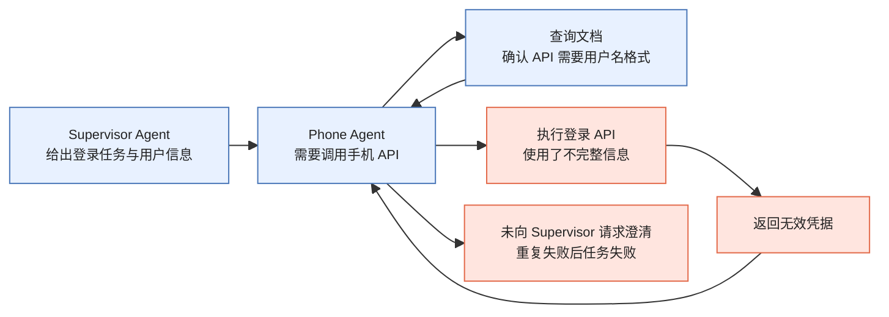

# 【论文精读】Why Do Multi-Agent LLM Systems Fail?

论文主题：面向多智能体系统的失败模式分类、诊断与自动标注工具 MAST  
论文链接：[Why Do Multi-Agent LLM Systems Fail?](https://arxiv.org/abs/2503.13657)

> 🧐 前情回顾：一个 Agent 系统通常包含 query 查询组件、plan 规划组件、action 执行组件、reflect 反思组件、memory 记忆组件。本文关注的是这些组件组合成多智能体系统以后，为什么仍然会出现大量失败。

## 一、摘要

- **性能落差**：主流 MAS 在公开基准上的表现并不稳定，失败率动辄超过 60%，甚至简单任务也层层失败。
- **缺乏系统性诊断**：过去对 MAS 的讨论多集中在功能和架构，缺少对失败模式的系统刻画。
- **本文贡献**：
  - 提出 **MAST 失败分类法**：首个基于实证的多智能体失败知识图谱，包含 3 大类、14 种失败模式。
  - 提出 **LLM-as-a-Judge 评测流水线**：使用 o1 模型自动标注失败类型，few-shot 设置下与人工一致度约 `κ = 0.77`。
  - 用 AG2-MathChat 与 ChatDev 验证 MAST 的调试价值。
  - 开放数据与工具：200+ 完整对话、标注与评测脚本全部开源。

### 1.1 失败率概览

从图 1 可以看到，6 个流行多智能体系统在不同基准上的失败率非常高：

| 系统 | 基准 | 成功率 | 失败率 |
| --- | --- | ---: | ---: |
| MetaGPT | ProgramDev | 40.0% | 60.0% |
| ChatDev | ProgramDev | 33.3% | 66.7% |
| HyperAgent | SWE-Bench Lite | 25.3% | 74.7% |
| AppWorld | Test-C | 13.3% | 86.7% |
| AG2 | OlympiadBench | 59.0% | 41.0% |
| Magentic-One | GAIA | 38.0% | 62.0% |

### 1.2 MAST 失败模式总览

MAST 将 MAS 失败映射到两个维度：

- **发生阶段**：Pre-Execution、Execution、Post-Execution。
- **失败类别**：Specification Issues、Inter-Agent Misalignment、Task Verification。

```mermaid
%%{init: {"flowchart": {"nodeSpacing": 18, "rankSpacing": 24}, "themeVariables": {"fontSize": "11px"}}}%%
flowchart TB
    M["MAST: Multi-Agent System Failure Taxonomy"]

    M --> FC1["FC1: Specification Issues<br/>规范问题 / 系统设计<br/>41.77%"]
    FC1 --> FM11["FM-1.1 Disobey Task Specification<br/>未遵循任务规范 10.98%"]
    FC1 --> FM12["FM-1.2 Disobey Role Specification<br/>未遵循智能体角色 0.50%"]
    FC1 --> FM13["FM-1.3 Step Repetition<br/>步骤重复 17.14%"]
    FC1 --> FM14["FM-1.4 Loss of Conversation History<br/>上下文丢失 3.33%"]
    FC1 --> FM15["FM-1.5 Unaware of Termination Conditions<br/>未能识别任务完成 9.82%"]

    M --> FC2["FC2: Inter-Agent Misalignment<br/>智能体间失配 / 通信协作<br/>36.94%"]
    FC2 --> FM21["FM-2.1 Conversation Reset<br/>对话重置 2.33%"]
    FC2 --> FM22["FM-2.2 Fail to Ask for Clarification<br/>未请求澄清 11.65%"]
    FC2 --> FM23["FM-2.3 Task Derailment<br/>任务跑偏 7.15%"]
    FC2 --> FM24["FM-2.4 Information Withholding<br/>信息扣留 1.66%"]
    FC2 --> FM25["FM-2.5 Ignored Other Agent Input<br/>忽略其他智能体输入 0.17%"]
    FC2 --> FM26["FM-2.6 Reasoning-Action Mismatch<br/>推理与行动不匹配 13.98%"]

    M --> FC3["FC3: Task Verification<br/>任务验证 / 质量控制<br/>21.30%"]
    FC3 --> FM31["FM-3.1 Premature Termination<br/>过早终止 7.82%"]
    FC3 --> FM32["FM-3.2 No or Incomplete Verification<br/>无验证或验证不完整 6.82%"]
    FC3 --> FM33["FM-3.3 Incorrect Verification<br/>验证错误 6.66%"]

    classDef spec fill:#efe0ff,stroke:#9455ff,color:#222;
    classDef align fill:#ffe0d9,stroke:#e36a4a,color:#222;
    classDef verify fill:#dff2df,stroke:#53a65b,color:#222;
    class FC1,FM11,FM12,FM13,FM14,FM15 spec;
    class FC2,FM21,FM22,FM23,FM24,FM25,FM26 align;
    class FC3,FM31,FM32,FM33 verify;
```

### 1.3 快速诊断

- **最突出问题**：步骤重复 `17.14%` 最高，说明编排策略、流程设置或循环逻辑是主要痛点。
- **阶段定位**：例如 “2.4 信息扣留” 出现在 Execution 区域，意味着要检查智能体之间的沟通逻辑，而不是前置提示。
- **资源投入**：若只优化验证器，最多覆盖约 1/5 的失败；通信协作与规范问题也需要同步修补。
- **横向对比**：作者用这张图作为“仪表盘”，比较各 MAS 的失败分布，从而指导定向改进。

## 二、研究方法

本节介绍如何识别多智能体系统中的主要失败模式，并建立结构化失败分类法。作者强调，收集并提出一套失败模式分类是一项极具挑战且耗时的任务：分类体系既要足够宽，覆盖不同 MAS 与基准上可能出现的各种失败；又要足够细，能对具体失败提供洞察。

方法论上，作者采用扎根理论（Grounded Theory, GT）：从实际 MAS 执行轨迹中迭代式采样、开放编码、恒定比较分析、备忘录撰写与理论构建。

### 2.1 核心目标与挑战

- **目标**：识别 MAS 中普遍存在的失败模式，并创建一个结构化分类体系，命名为 MAST。
- **挑战**：
  - **广度与深度平衡**：分类体系需要足够广泛，覆盖 MAS 与基准测试中的各种失败模式。
  - **具体性与洞察力**：分类体系又要足够具体和详细，能为观察到的失败提供深入见解。
  - **一致性与清晰度**：不同人员使用分类体系标注同一个 MAS 执行过程时，结论应高度一致。这意味着分类定义必须非常清晰。

### 2.2 研究方法流程

```mermaid
%%{init: {"flowchart": {"nodeSpacing": 18, "rankSpacing": 24}, "themeVariables": {"fontSize": "11px"}}}%%
flowchart LR
    A["1. MAS Trace Collections<br/>收集多智能体执行轨迹"] --> B["2. Failure Identification<br/>识别失败案例"]
    B --> C["3. Inter-Annotator Agreement<br/>人工标注者一致性研究"]
    C --> D["4-5. LLM Annotator<br/>训练与验证自动标注器"]
    D --> E["6. MAST<br/>形成失败分类体系"]
    E --> F["7. MAS Failure Detection<br/>自动检测 MAS 失败"]

    classDef data fill:#eef5ff,stroke:#4a77b8,color:#222;
    classDef taxonomy fill:#efe0ff,stroke:#9455ff,color:#222;
    classDef eval fill:#e4f4e4,stroke:#4e9c58,color:#222;
    class A,B data;
    class C,D taxonomy;
    class E,F eval;
```

整个研究流程大致分为四个阶段：

1. **基于数据的初步分类体系构建**：使用扎根理论，从实际 MAS 执行数据中归纳失败模式。
2. **分类体系的验证与迭代优化**：通过标注者间一致性研究验证并完善分类体系。
3. **分类体系的泛化能力测试**：在未参与构建过程的新 MAS 上测试分类体系的适用性。
4. **自动化标注工具开发**：开发基于大语言模型的自动标注器，用于自动识别失败模式。

### 2.3 数据收集与分析：扎根理论 GT 阶段

#### 2.3.1 扎根理论方法

- 采用 GT 是因为它是一种“产生性研究方法”，直接从经验数据中构建理论，而不是预先设定假设再去验证。
- 这种“归纳性”使失败模式能够本有机地从数据中浮现，避免研究者的主观偏见。
- 技术步骤包括理论抽样、开放编码、持续比较分析、备忘录和理论化。

#### 2.3.2 理论抽样

- **目的**：为了确保识别出的失败模式具有多样性，研究者有目的地选择不同 MAS 与任务来收集数据。
- **选择标准**：基于 MAS 的目标、组织结构、实现方法和底层智能体角色的差异来选择系统。
- **任务选择**：选择能代表系统预期能力的典型任务，而不是人为制造的困难场景。
- **分析的 MAS**：HyperAgent、AppWorld、AG2、ChatDev、MetaGPT。
- **使用的基准**：
  - SWE-Bench-Lite：用于 HyperAgent。
  - Test-C：用于 AppWorld。
  - ProgramDev：用于 MetaGPT 与 ChatDev。
  - GSM-Plus：用于 AG2。
- **保留的 MAS**：OpenManus 与 Magentic-One 没有用于 GT 或 IAA 研究，而是留作后续泛化能力测试。

#### 2.3.3 基准与评测重点

- **SWE-Bench-Lite ↔ HyperAgent**
  - 定位：软件工程自动缺陷修复。
  - 数据来源：从原始 SWE-Bench 中抽取 300 条 “bug 修复 issue”。
  - 任务形式：给定一条带失败单元测试的 issue，要求模型生成最小补丁，使测试通过。
  - 评测指标：100% 通过原有测试，强调函数级正确性和非表面文本匹配。
  - 意义：检验多智能体在阅读代码、定位 bug、生成补丁、运行 CI 循环中的协同能力。

- **Test-C ↔ AppWorld**
  - 定位：交互式 App 操作与 API 调用。
  - AppWorld 框架：构造一个由多款虚拟 App 与用户人物组成的可控“数字世界”。
  - 任务形式：每条用例包含 Supervisor、Instruction、Initial State。
  - 评测指标：在限定步数内把环境精确变为目标状态；失败率常用。
  - 意义：考验代理对工具调用顺序、参数填充、异常处理的详细规划与执行。

- **ProgramDev ↔ MetaGPT 与 ChatDev**
  - 定位：多代理协同的软件项目生成。
  - 数据集：作者自制的 32 个中等规模编程需求。
  - 任务形式：给定一行需求，由代理团队更新需求、讨论设计、产出多文件代码。
  - 评测指标：项目通过 unit test / integration test 的比例，也可辅助考察代码质量或功能覆盖。
  - 意义：突出分工与沟通失败点，例如需求误解、接口不一致、代码依赖丢失等。

- **GSM-Plus ↔ AG2**
  - 定位：鲁棒数学推理。
  - 任务形式：单步或多步数值推理题，需要输出正确最终答案。
  - 评测指标：准确率，以及不同提示策略下的一致性。
  - 意义：揭示多智能体在记忆依赖与深层推理之间的脆弱点，尤其是中途协作链条断裂导致的计算错误。

### 2.4 标注者间一致性研究与迭代优化：IAA 阶段

作者使用 Cohen's Kappa 衡量两位独立标注者对同一批离散标签的标注一致性。它用来排除“纯随机一致”造成的虚假高一致度。

#### 2.4.1 计算公式

$$
\kappa = \frac{P_o - P_e}{1 - P_e}
$$

| 符号 | 含义 |
| --- | --- |
| $P_o$ | Observed agreement：标注者实际一致的比例 |
| $P_e$ | Expected agreement by chance：若双方随机标注，各类别按各自边际概率独立出现时的期望一致比例 |

边界情况：

- 当 $P_o = P_e$，则 $\kappa = 0$。
- 当 $P_o = 1$，则 $\kappa = 1$。
- $\kappa$ 还能取负值，表示一致性低于随机水平。

#### 2.4.2 Kappa 取值解释

| K 范围 | 一致性等级 | 直观含义 |
| --- | --- | --- |
| `< 0` | 差于随机 | 标注彼此“唱反调” |
| `0-0.20` | 极弱 | 几乎无一致性 |
| `0.21-0.40` | 弱 | 定义仍含糊 |
| `0.41-0.60` | 中等 | 勉强可用 |
| `0.61-0.80` | 强 | 多数科研可接受 |
| `0.81-1.00` | 几乎完美 | 高度可靠 |

为什么比“百分比一致”更可靠：

- 百分比一致只能看直接相同率。若数据极度不平衡，两人都倾向选同一类，也会轻易得到高一致率。
- Kappa 通过 $P_e$ 校正这种基于类别分布的偶然吻合，给出“超出随机”的真实一致度。
- 应用场景包括标注指南、分类体系、医学影像、心理量表、自然语言标注等。

#### 2.4.3 三轮 IAA 迭代

- **轮次 1**
  - 样本：从 150+ 条追踪中抽取 5 条不同 MAS 追踪。
  - 任务：3 位标注者使用初步分类体系进行独立标注。
  - 结果：一致性非常低，Cohen's Kappa 约为 `0.24`。
  - 行动：标注者共同讨论分歧，迭代地修改分类体系，包括修改失败模式定义、拆分或合并模式、添加新模式或删除旧模式。为避免数据泄漏，改进后使用全新追踪做第 2 轮测试。

- **轮次 2**
  - 样本：另选 5 条追踪，每个来自不同 MAS。
  - 任务：标注者使用第 1 轮改进后的分类体系标注。
  - 结果：首次尝试达到较好一致性，平均 Cohen's Kappa 约为 `0.92`。

- **轮次 3**
  - 样本：再选另外 5 条追踪。
  - 任务：使用第 2 轮结束后确定下来的最终分类体系标注。
  - 结果：仍保持强一致，平均 Cohen's Kappa 约为 `0.84`。

结论：经过三轮 IAA 与迭代优化，最终得到的 MAST 分类体系是可靠的。标注过程不包含标注本身时间，仅解决分歧就花费约 10 小时。

### 2.5 MAST 跨 MAS 的泛化能力

该部分测试最终确定的 MAST 分类体系是否适用于开发过程中未见过的 MAS。

- **背景**：GT 和 IAA 研究使用了前 5 个 MAS，而 OpenManus 与 Magentic-One 未参与原始分类体系构建。
- **测试对象**：OpenManus 与 Magentic-One。
- **方法**：对这些新 MAS 产生的追踪进行 IAA 研究，但不再更新分类体系。
- **结果**：标注者间一致性达到 Cohen's Kappa 约 `0.79`。
- **结论**：MAST 具有良好泛化能力，可以应用于原始分类体系开发期间未遇到的领域外 MAS 和任务。

### 2.6 LLM 标注器

作者开发了一个基于 LLM 的自动化工具，用来标注 MAS 失败。

- **目标**：在 MAST 分类体系和 IAA 研究完成后，创建一种自动化方法，使用 MAST 发现和诊断 MAS 追踪中的失败模式。
- **方法**：采用 “LLM 作为判别者”（LLM-as-a-Judge）策略。
- **使用模型**：OpenAI o1 模型。
- **系统提示输入**：
  - MAST 中所有失败模式及其详细解释。
  - 一些失败模式示例。
- **实验对比**：
  - 不提供示例。
  - 提供上下文示例，即 few-shot learning。
- **验证**：
  - 基准：使用第 3 轮 IAA 研究中人类标注者达成共识的结果作为黄金标准。
  - 指标：准确率与 Cohen's Kappa。
  - 结果：提供上下文示例时，LLM 标注器表现更好，准确率约 `94%`，Cohen's Kappa 约 `0.77`。
- **应用**：基于验证结果，研究者使用可靠的 LLM 标注器标注剩余约 200 条追踪语料库。

## 三、研究结果

### 3.1 引言部分

MAST 的提出与构建过程说明，多智能体系统故障分类法不是凭空想象出来的，而是基于实证研究。作者分析了来自 7 个不同任务领域的 200+ 多智能体系统追踪，通过扎根理论与 IAA 迭代优化，确保分类的可靠性和一致性。

MAST 识别了 **14 种细粒度失败模式**，更重要的是，它将这些故障模式的根本原因追溯到执行阶段：

- Pre-Execution：执行前。
- Execution：执行中。
- Post-Execution：执行后。

这些类别不是基于故障表面现象，而是基于故障的根本原因来划分。

### 3.2 多智能体系统故障分类法

#### 3.2.1 FC1：规范问题（Specification Issues）

- **根源**：系统设计时的决策失误，或者用户给出的指令规范写得不好或模糊。
- **表现**：问题通常在执行阶段显现，但根本原因在执行前，例如系统架构、指令细节、状态管理等。
- **包含的故障模式**：
  - FM-1.1：未遵循任务要求，10.98%。
  - FM-1.2：未遵循智能体角色，0.50%。
  - FM-1.3：步骤重复，17.14%，通常因为死板的轮次配置。
  - FM-1.4：上下文丢失，3.33%。
  - FM-1.5：未能识别任务完成，9.82%。
- **深入讨论 FM-1.1 与 FM-1.2**：
  - 这些不只是 LLM 普遍存在的“指令遵循”问题，背后有更深层的原因，需要不同修复方法。
  - MAS 设计本身有缺陷，例如角色、工作流程不合理。
  - 用户指令写得差。
  - 底层 LLM 理解能力有限。
  - LLM 理解了指令，但不一定会执行。
- **洞察 1**：未遵循规范并不只是指令遵循能力问题，也可以通过更好的 MAS 设计来解决。
- **例子：ChatDev Wordle**：用户要求做一个标准 Wordle 游戏，但系统使用了固定词库并引入每日更换单词的约束，导致偏离原始任务。改进智能体角色规范后，任务成功率显著提升。

#### 3.2.2 FC2：智能体间协作失调（Inter-Agent Misalignment）

- **根源**：执行过程中，智能体之间交互和协调出现问题，导致无法有效协作以达成共同目标。
- **包含的故障模式**：
  - FM-2.1：对话重置，2.33%。
  - FM-2.2：未请求澄清，11.65%。
  - FM-2.3：任务跑偏，7.15%。
  - FM-2.4：信息扣留，1.66%。
  - FM-2.5：忽略其他智能体输入，0.17%。
  - FM-2.6：推理与行动不匹配，13.98%。

**FM-2.4 信息扣留示例：**

该例子中，电话智能体知道需要正确的用户名格式，但没有把“凭据格式不正确”的关键信息反馈给监督智能体，也没有请求澄清。最终反复登录失败，任务失败。

核心故障分析：

- 电话智能体掌握了成功完成任务所需的关键信息，但未传达给需要该信息的监督智能体。
- 监督智能体没有得到关于正确用户名格式的反馈，无法纠正自己的错误输入。
- 这体现了 FC2 的典型特征：智能体之间的沟通和协调问题阻碍共同目标实现。
- 与纯粹的解释错误不同，这类问题需要 MAST 提供的细粒度模式来定位。

#### 3.2.3 FC3：任务验证（Task Verification）

- **根源**：验证过程不足、未能检测或纠正错误，或者任务过早终止。
- **关注点**：这类失败关系到最终输出的质量控制。
- **包含的故障模式**：
  - FM-3.1：过早终止，7.82%。
  - FM-3.2：无验证或验证不完整，6.82%。
  - FM-3.3：验证错误，6.66%。
- **例子：FM-3.2 验证不完整**
  - ChatDev 生成的国际象棋程序通过了所有验证环节，但运行时有 bug。
  - 原因是验证器只做表面检查，例如代码编译、注释、规则检查，没有根据实际游戏规则或在线知识进行验证。
  - 这不是缺少验证，而是验证器局限。

### 3.3 MAST 有效性评估

作者从三个关键方面评估 MAST 的效果。

#### 3.3.1 对未见系统的泛化能力

- 在验证阶段，作者把 MAST 和基于 LLM 的自动标注器应用于两个未参与分类法开发过程的 MAS 系统和基准测试。
- 自动标注器与人类标注者的一致性达到 `0.79` 的 Cohen's Kappa，属于强一致。
- 这说明 MAST 能有效捕捉和分类未见系统中的故障，适用于不同任务和系统。

#### 3.3.2 平衡的分布

- 故障在 MAST 三个主要类别中分布相对均衡：
  - FC1：41.77%。
  - FC2：36.94%。
  - FC3：21.30%。
- 没有某个类别占据绝对主导地位，说明 MAST 覆盖了多样化故障类型，而不是只反映某一种系统设计偏见。
- 不同 MAS 呈现出不同故障特征，例如 AppWorld 更多出现过早终止，OpenManus 更多出现步骤重复。

#### 3.3.3 清晰的类别区分度

- 作者对三个主要故障类别进行相关性分析，发现它们之间的相关性很低，约 `0.17-0.32`。
- 这说明三个类别捕捉了 MAS 故障的不同方面，支持分类法结构合理性。
- 类别区分度很重要，因为表面行为相似的故障可能源于不同根本原因。

### 3.4 验证器就是你所需要的一切吗？

这一节讨论验证器在 MAS 中的作用和局限。

- **验证失败很普遍**：FM-3.2 与 FM-3.3 合计占所有观察故障的 `13.48%`。
- **验证器有帮助但不是万能药**：
  - 有明确验证器角色的系统通常比没有验证器的系统故障数更少。
  - 这支持“显式检查能够提高输出质量”的直觉。
  - 但是，即使有验证器，MAS 的整体成功率仍可能很低。例如 ChatDev 在 ProgramDev 数据集上处理一些有大量依赖的高度复杂项目时，仍然只达到 33.33% 成功率。
- **当前验证器常只执行表面检查**：例如检查是否缺少注释、代码是否能编译，而难以确认更深层的正确性。
- **需要更强验证策略**：
  - 检查外部知识或现有实现。
  - 在生成过程中结合严格测试。
  - 可能使用强化学习。
  - 同时评估低级别正确性和高级别目标达成度。
- **干预研究**：作者在 ChatDev 中增加额外验证步骤，专注于高层任务目标，而不是简单代码级检查。该干预使得 ProgramDev 任务成功率绝对提升 `15.6%`。
- **洞察 2**：需要多层级验证。低级别检查是不够的；稳健的 MAS 需要模块化单元测试、目标达成度评估与整体质量评估。

### 3.5 超越正确性的开放挑战

MAST 当前主要聚焦任务正确性和完成度相关失败，因为这是 MAS 可用性的基本前提。但作者也观察到另一个重要问题：**效率低下**。

- **例子：AppWorld Spotify**
  - 一个任务要求播放列表中的前 10 首歌。
  - 协调器和 Spotify 智能体执行 10 轮对话，每次只获取一首歌。
  - 尽管 Spotify 智能体本来可以通过一次有效行动获取前 10 首歌。
- **后果**：
  - 模型调用量、运行时间和延迟显著增加。
  - 有时甚至达到 10 倍以上。
- **未来工作**：
  - 优化效率不只是为了正确性，也要考虑成本、速度、鲁棒性、可扩展性和安全性。
  - 作者承认，这些维度对 MAS 实际部署非常重要，是未来的重要研究方向。

## 四、更好的 Agent 系统

### 4.1 MAST 作为实用开发工具

作者强调，MAST 不只是理论定义，也是一种基础性框架和实用工具，可用于理解、调试并改进 MAS。

#### 4.1.1 面临的挑战

- 开发健壮 MAS 非常困难。
- 当系统在某个基准上失败率很高时，开发者往往只能对单个失败执行记录进行临时、点对点调试。
- 评估改进措施是否真的解决预期问题非常复杂。即使成功率有所提升，也难以判断是修复了预期问题、引入了新问题，还是只对特定情况有效。

#### 4.1.2 MAST 提供的解决方案

- MAST 建立了一套结构化词汇表，使系统诊断更清晰。
- 自动化分析工具可以在大量执行记录中识别重复故障模式。
- 定量概览可以指出最频繁出现的故障模式，从而引导开发者优先解决最高影响区域。
- 例如 HyperAgent 可以通过重点解决任务规范问题和验证错误来获得显著改进。

#### 4.1.3 用于评估改进

- MAST 有助于严谨评估改进措施。
- 开发者不仅可以依赖总体成功率，还可以使用 MAST 做改进前后的对比分析。
- 作者案例研究显示，在 ChatDev 与 AG2 上进行干预后，虽然总体性能有所提升，但基于 MAST 的分析显示：
  - 某些具体故障得到了缓解。
  - 某些新故障被引入。
  - 某些取舍被暴露出来。
- 这种细粒度视角对理解为什么某个干预有效，以及如何继续迭代构建更健壮系统非常重要。

### 4.2 超越模型能力：系统设计的重要性

#### 4.2.1 核心发现

- MAST 观察到的许多错误并非全部归因于模型能力不足。
- 一个关键发现是：许多 MAS 的失败源于系统设计，而不仅仅是底层 LLM 的局限。
- 这意味着，仅依靠更强模型不一定能保证更可靠的 MAS 性能。

#### 4.2.2 干预研究证据

作者在案例研究中采用两种策略改进智能体：

- **架构修改**：调整 MAS 的拓扑结构、角色组织和协作方式。
- **提示词修改**：优化角色说明、工作指令与交互约束。

为了公平评估，他们在干预前后使用相同底层 LLM 和相同用户指令。结果显示性能得到了提升，这表明对 MAS 系统设计本身的改进可以减少失败，且这种改进超出模型能力的限制。

#### 4.2.3 更深层挑战与未来方向

- 虽然干预措施带来了统计上显著的改进，但并非所有故障模式都被根除，某些原本较少的任务成功率仍然很低。
- 要实现高可靠性，需要对智能体组织、通信协议、上下文管理和验证集成进行更根本的变革。
- MAST 的作用是提供必要框架，帮助识别结构性弱点，并指导设计更复杂、更高可靠性的 MAS 架构。

## 五、总结

本文提出 MAST，作为诊断和评估多智能体系统失败的实用框架。它的价值不只是列举失败类型，而是把失败追溯到系统设计、智能体通信和任务验证三个层面。

核心结论：

- 当前流行 MAS 的失败率普遍偏高，很多失败不是单纯的模型能力问题。
- 失败主要集中在规范问题、智能体间协作失调和任务验证不足。
- MAST 通过 3 大类、14 种失败模式，为 MAS 调试提供了结构化语言。
- Cohen's Kappa 与 IAA 研究表明，该分类体系具有较高一致性。
- LLM 标注器能够大规模自动标注 MAS 失败，适合用于系统迭代。
- 更好的 Agent 系统需要改进组织、通信、上下文管理和多层级验证，而不是只等待更强的 LLM。

一句话总结：**MAST 把多智能体系统失败从“看起来不对”变成了“可以分类、可以定位、可以量化、可以迭代修复”的工程诊断问题。**
