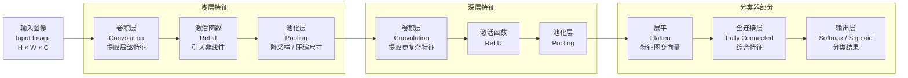

# CNN
CNN 是 **Convolutional Neural Network,** 即卷积神经网络。它是一类特别适合处理图像、视频、语音频谱等网格结构数据的神经网络。常用于进行图像分类(Classification), 目标检测(Detection), 图像分割(Segmentation)任务

**CNN 的结构**
按工程结构看，一个基础 CNN 通常由三类层组成：
- **卷积层**：负责提取局部特征，例如边缘、纹理、形状片段
- **池化层**：负责降维，缩小特征图，降低计算量，并保留主要响应
- **全连接层**：负责把前面提取到的特征映射到最终任务输出，例如分类类别
$CNN图像处理流程:\text{输入图像} \rightarrow \text{卷积} \rightarrow \text{激活} \rightarrow \text{池化} \rightarrow \text{多次重复} \rightarrow \text{展平} \rightarrow \text{全连接} \rightarrow \text{输出}$


## 卷积层 Convolution
**卷积层的作用是从局部区域提取特征**

这是 CNN 的核心, CNN 的卷积层可以理解成一组“会学习的局部特征探测器”. 输入图像不是一次性全部塞进一个神经元，而是让一个小窗口，也就是 **卷积核 kernel/filter**，在图像上滑动。每滑到一个位置，就和当前位置覆盖的局部区域做一次计算，得到输出特征图上的一个数

### 单通道卷积计算
$$ Y[i,j]=\sum_{u=0}^{K_h-1}\sum_{v=0}^{K_w-1}X[i+u,j+v]W[u,v]+b $$

| 符号    | 含义         |
| ----- | ---------- |
| $X$   | 输入特征图      |
| $W$   | 卷积核权重      |
| $Y$   | 输出特征图      |
| $K_h$ | 卷积核高度      |
| $K_w$ | 卷积核宽度      |
| $u,v$ | 卷积核内部的位置索引 |
| $b$   | 偏置项        |
**一句话**
> **取输入的一块局部区域，与卷积核逐元素相乘，再求和，加偏置**

**具体例子**
输入 $3\times3$：$X= \begin{bmatrix} 1 & 2 & 3\\ 4 & 5 & 6\\ 7 & 8 & 9 \end{bmatrix}$

卷积核 $2\times2$：$W= \begin{bmatrix} 1 & 0\\ 0 & 1 \end{bmatrix}$

而且 $stride =1$，$padding =0$

左上角输出：$Y[0,0] = 1\times1+2\times0+4\times0+5\times1 = 6$
右上角输出：$Y[0,1] = 2\times1+3\times0+5\times0+6\times1 = 8$
左下角输出：$Y[1,0] = 4\times1+5\times0+7\times0+8\times1 = 12$
右下角输出：$Y[1,1] = 5\times1+6\times0+8\times0+9\times1 = 14$

所以输出是：$Y= \begin{bmatrix} 6 & 8\\ 12 & 14 \end{bmatrix}$

也就是：$3\times3 \xrightarrow{2\times2\ \text{卷积核}} 2\times2$


### 多通道卷积计算
真实图像通常不是单通道，而是 RGB 三通道：$X \in \mathbb{R}^{C_{in}\times H\times W}$
比如彩色图片：$C_{in}=3$
多通道卷积时，一个卷积核不是单独的 $K_h \times K_w$，而是：$C_{in}\times K_h\times K_w$

也就是说，每个输入通道都有一片对应的卷积核权重。
完整公式：
$$
Y[o,i,j]=
\sum_{c=0}^{C_{in}-1}
\sum_{u=0}^{K_h-1}
\sum_{v=0}^{K_w-1}
X[c,iS_h+u-P_h,jS_w+v-P_w]\cdot W[o,c,u,v]+b[o]
$$

| 符号           | 含义                  |
| ------------ | ------------------- |
| $C_{in}$     | 输入通道数               |
| $o$          | 第几个输出通道             |
| $c$          | 第几个输入通道             |
| $S_h,S_w$    | 高度、宽度方向 stride      |
| $P_h,P_w$    | 高度、宽度方向 padding     |
| $W[o,c,u,v]$ | 第 $o$ 个输出通道对应的卷积核权重 |

**如果有 $C_{out}$ 个卷积核，就会得到 $C_{out}$ 个输出特征图：**
$$
Y \in \mathbb{R}^{C_{out}\times H_{out}\times W_{out}}
$$
### 卷积输出尺寸公式
**最常用版本**

$$H_{out}= \left\lfloor \frac{H_{in}+2P_h-K_h}{S_h} \right\rfloor+1$$
$$W_{out}= \left\lfloor \frac{W_{in}+2P_w-K_w}{S_w} \right\rfloor+1$$
**记忆方法**
$$\boxed{ \text{out(输出尺寸)} = \frac{ \text{in(输入尺寸)}+2\times\text{padding(填充)}-\text{(kernel卷积核尺寸)} }{ \text{stride(步长)} } +1 }$$
**一句话**
> **加 padding，减 kernel，除 stride，再加一**

## 池化层


## 全连接层


PyTorch 中常用的卷积层 API 是：

```python
nn.Conv2d(
    in_channels,
    out_channels,
    kernel_size,
    stride=1,
    padding=0,
    dilation=1,
    groups=1,
    bias=True,
)
```

其中 `in_channels` 是输入通道数，`out_channels` 可以理解成卷积核个数，也就是输出特征图的通道数。

池化层用于降低特征图尺寸，常见有最大池化和平均池化。最大池化保留局部区域中的最大响应：

$$
Y(i,j) = \max_{(m,n) \in \Omega} X(i+m,j+n)
$$

平均池化则取局部区域均值：

$$
Y(i,j) = \frac{1}{|\Omega|}\sum_{(m,n)\in \Omega}X(i+m,j+n)
$$

PyTorch 中常用池化 API 是：

```python
# 最大池化
nn.MaxPool2d(kernel_size=2, stride=2, padding=0)

# 平均池化
nn.AvgPool2d(kernel_size=2, stride=2, padding=0)
```

感受野指的是输出特征图上某一个位置，能够“看到”的原始输入区域大小。网络越深，感受野通常越大，因此浅层更偏向边缘、纹理等局部特征，深层更偏向物体部件和语义特征。

经典 CNN 结构通常可以概括为：

$$
Input \rightarrow [Conv + ReLU + Pool] \times n \rightarrow FullyConnected \rightarrow Output
$$

其中 ReLU 激活函数为：

$$
ReLU(x) = \max(0, x)
$$

CNN 相比全连接网络处理图像的优势在于参数更少、空间结构保留得更好、对局部平移有一定鲁棒性。例如一张 $224 \times 224 \times 3$ 的图片，如果直接接全连接层，参数量会非常大；而卷积核只在局部区域计算，并且在不同位置共享参数，因此更适合图像任务。

面试里可以用一句话总结 CNN：CNN 通过卷积核在图像上滑动来提取局部特征，再通过层层堆叠把低级视觉特征组合成高级语义特征。

# CNN 相关的 PyTorch API

黑马讲义里介绍 CNN 时，重点落在两个核心 API：卷积层 `nn.Conv2d` 和池化层 `nn.MaxPool2d` / `nn.AvgPool2d`。它们对应 CNN 里最关键的两件事：提取局部特征、压缩空间尺寸。

PyTorch 处理图像张量时，默认形状通常是：

$$
(N, C, H, W)
$$

其中：

- $N$：batch size，一次输入多少张图片；
- $C$：channel，通道数；
- $H$：height，图像高度；
- $W$：width，图像宽度。

如果用 `matplotlib` 读取图片，常见形状是 `(H, W, C)`，送进 PyTorch 卷积层之前通常要转换成 `(C, H, W)`，再增加 batch 维度：

```python
img = torch.tensor(img)          # (H, W, C)
img = img.permute(2, 0, 1)       # (C, H, W)
img = img.unsqueeze(0)           # (N, C, H, W)
```

## nn.Conv2d

`nn.Conv2d` 是二维卷积层，常用于图像任务。官方 API 形式是：

```python
torch.nn.Conv2d(
    in_channels,
    out_channels,
    kernel_size,
    stride=1,
    padding=0,
    dilation=1,
    groups=1,
    bias=True,
    padding_mode="zeros",
)
```

常用参数解释：

- `in_channels`：输入通道数，必须等于输入张量 `(N, C, H, W)` 里的 $C$。
- `out_channels`：输出通道数，也可以理解为卷积核个数；有多少个卷积核，就得到多少张输出特征图。
- `kernel_size`：卷积核大小，例如 `3` 表示 $3 \times 3$，`(3, 5)` 表示 $3 \times 5$。
- `stride`：卷积核滑动步长，越大输出特征图越小。
- `padding`：在输入边缘补 0，常用于控制输出尺寸。
- `dilation`：空洞卷积的膨胀率，用来扩大感受野。
- `bias`：是否给每个输出通道加偏置。

示例：

```python
import torch
import torch.nn as nn

x = torch.randn(32, 3, 224, 224)
conv = nn.Conv2d(
    in_channels=3,
    out_channels=16,
    kernel_size=3,
    stride=1,
    padding=1,
)

y = conv(x)
print(y.shape)  # torch.Size([32, 16, 224, 224])
```

这里输入是 32 张 RGB 图片，所以 `in_channels=3`；输出通道数是 16，所以输出特征图形状里的第二维变成 16。

卷积层输出尺寸公式为：

$$
H_{out} = \left\lfloor \frac{H_{in} + 2P - D(K - 1) - 1}{S} + 1 \right\rfloor
$$

其中 $P$ 是 padding，$D$ 是 dilation，$K$ 是 kernel size，$S$ 是 stride。宽度 $W_{out}$ 同理。

## nn.MaxPool2d

`nn.MaxPool2d` 是最大池化层，用局部窗口里的最大值代表这一小块区域。它常用于保留最强响应，同时降低特征图尺寸。

```python
torch.nn.MaxPool2d(
    kernel_size,
    stride=None,
    padding=0,
    dilation=1,
    return_indices=False,
    ceil_mode=False,
)
```

常用写法：

```python
pool = nn.MaxPool2d(kernel_size=2, stride=2)

x = torch.randn(32, 16, 224, 224)
y = pool(x)
print(y.shape)  # torch.Size([32, 16, 112, 112])
```

最大池化不会改变通道数，只改变空间尺寸。上例中 $C=16$ 不变，$H,W$ 从 $224 \times 224$ 变成 $112 \times 112$。

## nn.AvgPool2d

`nn.AvgPool2d` 是平均池化层，用局部窗口里的平均值代表这一小块区域。它不像最大池化那样强调最强响应，而是保留局部区域的平均信息。

```python
torch.nn.AvgPool2d(
    kernel_size,
    stride=None,
    padding=0,
    ceil_mode=False,
    count_include_pad=True,
    divisor_override=None,
)
```

示例：

```python
pool = nn.AvgPool2d(kernel_size=2, stride=2)

x = torch.randn(32, 16, 224, 224)
y = pool(x)
print(y.shape)  # torch.Size([32, 16, 112, 112])
```

## nn.Flatten 和 nn.Linear

CNN 前半部分通常是卷积层和池化层，后半部分常接全连接层做分类。卷积层输出是四维张量 `(N, C, H, W)`，而全连接层 `nn.Linear` 需要二维输入 `(N, features)`，所以中间通常需要展平。

```python
flatten = nn.Flatten()

x = torch.randn(32, 16, 7, 7)
y = flatten(x)
print(y.shape)  # torch.Size([32, 784])
```

然后接全连接层：

```python
classifier = nn.Linear(16 * 7 * 7, 10)
logits = classifier(y)
print(logits.shape)  # torch.Size([32, 10])
```

这里的 `10` 可以理解成分类任务的类别数，例如 CIFAR-10 就有 10 类。

## 一个最小 CNN 示例

把上面的 API 串起来，一个非常小的 CNN 可以写成：

```python
import torch
import torch.nn as nn

model = nn.Sequential(
    nn.Conv2d(in_channels=3, out_channels=16, kernel_size=3, padding=1),
    nn.ReLU(),
    nn.MaxPool2d(kernel_size=2, stride=2),
    nn.Conv2d(in_channels=16, out_channels=32, kernel_size=3, padding=1),
    nn.ReLU(),
    nn.MaxPool2d(kernel_size=2, stride=2),
    nn.Flatten(),
    nn.Linear(32 * 8 * 8, 10),
)

x = torch.randn(4, 3, 32, 32)
y = model(x)
print(y.shape)  # torch.Size([4, 10])
```

这个例子里，输入是 CIFAR-10 风格的 $32 \times 32$ RGB 图片。经过两次 `MaxPool2d(kernel_size=2, stride=2)` 后，空间尺寸从 $32 \times 32$ 变成 $16 \times 16$，再变成 $8 \times 8$，所以进入全连接层前的特征数是：

$$
32 \times 8 \times 8
$$

面试里可以这样回答：`nn.Conv2d` 负责提取局部特征，`MaxPool2d/AvgPool2d` 负责压缩空间尺寸，`Flatten` 把四维特征图摊平成二维特征向量，`Linear` 负责输出分类结果。
