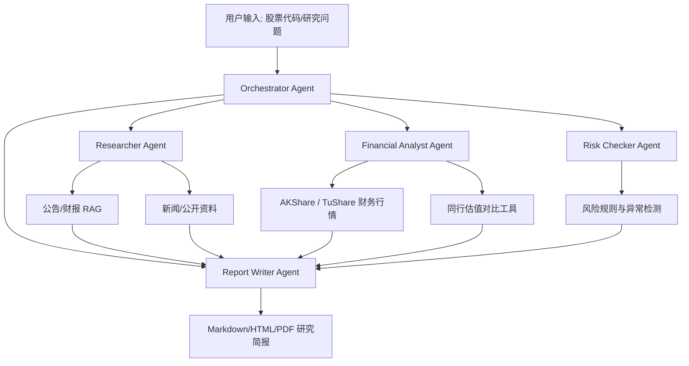

# 金融研究 Agent 中台项目包装

## 1. 参考项目：anthropics/financial-services

参考仓库：[anthropics/financial-services](https://github.com/anthropics/financial-services)

这是 Anthropic 官方为金融服务行业准备的一套 Claude Agent、Skill、命令和 MCP Connector 模板，目标是把投行、研究、私募、财富管理、基金运营里的重复分析工作做成可安装、可改造、可部署的 AI 工作流。

它不是一个传统业务系统，而是一套“金融工作流蓝图”：用 Markdown/YAML 定义 Agent、Skill、命令和数据连接器。类比来看，它更像“金融分析师团队 SOP + 工具箱”，不是一个开箱即用的 SaaS。

核心组成：

- Agent：端到端工作流，例如 Pitch Agent、Market Researcher、Earnings Reviewer、Model Builder、GL Reconciler。
- Skill：领域方法论，例如 comps-analysis、dcf-model、audit-xls、earnings-analysis。
- Command：显式触发入口，例如 `/comps`、`/dcf`、`/earnings`。
- MCP Connector：连接 FactSet、Morningstar、LSEG、PitchBook、S&P Global、Egnyte 等外部数据源或企业文档库。
- Managed Agent Cookbooks：通过 `agent.yaml`、subagents、steering examples 支持后台化部署。

它的核心 insight 是：金融 AI Agent 不应该先做成“万能聊天机器人”，而应拆成三层：

1. 领域方法论层：Skill，定义金融任务该怎么做、怎么检查。
2. 工作流编排层：Agent，把多个 skill 串成完整业务流程。
3. 数据接入层：MCP Connector，把受控金融数据、文档库、终端和企业系统接进来。

## 2. 这里面有没有 RAG

结论：有 RAG 的影子，但它不是一个 RAG-first 项目，而是 Workflow-first。

传统 RAG：

```text
用户问题 -> 检索相关文档 -> 拼进上下文 -> 生成答案
```

这个项目更像：

```text
业务任务
-> Agent 判断工作流
-> 调用 Skill 方法论
-> 通过 MCP / 文件 / 数据平台取资料
-> 子 Agent 分工
-> 生成模型、memo、deck、审计结果
-> 人类签核
```

最接近 RAG 的部分：

- `earnings-reviewer`：读取 earnings call transcript 和 filings，再生成 model update / note draft。
- `market-researcher`：围绕行业、公司、peer comps 做资料收集和研究。
- `kyc-screener`：解析 onboarding docs，再按规则检查缺口。
- `valuation-reviewer`：读取 GP packages，跑 valuation template。
- `statement-auditor`：读取 LP statements 和 NAV pack 做 tie-out。
- `financial-analysis` 里的 MCP connectors：如果接的是 Egnyte、研究库、数据平台，就可能承担检索增强角色。

关键判断：它没有把重点放在“怎么建向量索引、怎么 chunk、怎么 embedding、怎么 rerank”。这些底层 RAG 管线大概率被外部数据源、MCP server 或企业内部系统吸收了。

## 3. 国内数据源对应关系

海外 connector 和国内数据源不能简单一一替代，更合理的映射是按数据类型对应。

| 海外 Connector | 主要能力 | 中国国内大致对应 |
|---|---|---|
| FactSet | 多资产数据、公司财务、组合分析、量化 API、研究工作流 | Wind 万得、同花顺 iFinD、东方财富 Choice、恒生聚源 Gildata |
| Morningstar | 基金、ETF、评级、组合、资产配置、财富管理数据 | Wind 基金库、Choice 基金数据、iFinD 基金/理财数据、基金业协会公开数据 |
| LSEG / Refinitiv | 全球行情、FICC、宏观、新闻、交易前分析、数据终端 | Wind、iFinD、Choice；债券/外汇还包括中债登、中债估值、上清所、CFETS |
| PitchBook | 私募股权、VC、并购、公司融资、投资机构数据 | 清科私募通、IT桔子、企查查/天眼查融资数据、烯牛数据、Wind/Choice PEVC 数据 |
| S&P Global / Capital IQ | 公司财务、行业、评级、并购、信用、能源、供应链等 | Wind、Choice、iFinD、恒生聚源；信用评级可接中诚信国际、联合资信、东方金诚、上海新世纪 |
| Egnyte | 企业文档库、权限、文件协作、尽调资料室 | 企业微信文档/微盘、飞书云文档、钉钉文档/宜搭、金山文档企业版、泛微/致远 OA、私有化对象存储或 NAS |

如果对应到中国金融机构的实际架构，通常会变成：

```text
FactSet / LSEG / S&P Capital IQ
≈ Wind + iFinD + Choice + 聚源 + 交易所/监管数据 + 企业内部知识库
```

个人最现实能接的组合：

```text
结构化行情/财务：AKShare + TuShare Pro
公告/财报文本：巨潮资讯 + 交易所公告
企业工商/KYC：天眼查开放平台 或 企查查开放平台
内部知识库：本地 PDF/Markdown/Excel + 向量库
```

个人可接程度：

| 数据源 | 个人可接程度 | 适合做什么 |
|---|---|---|
| AKShare | 高 | A 股、基金、期货、宏观、债券、外汇、公开数据抓取；适合个人研究、RAG 原型、MCP demo |
| TuShare Pro | 高，但有积分门槛 | A 股日线、财务、指数、基金、部分宏观数据；适合量化研究和结构化数据 API |
| BaoStock | 中高 | 免费 A 股历史行情、财务、宏观等；适合低成本学习和回测 |
| 天眼查/企查查开放平台 | 中 | 企业工商、股权穿透、司法风险、KYC、供应商筛查；通常需要注册、认证、购买套餐 |
| 巨潮资讯、交易所、证监会、基金业协会、央行、统计局 | 中 | 公告、财报、监管文件、宏观数据、基金备案；适合公告 RAG 和披露文件解析 |
| Choice / iFinD | 中低 | 专业投研终端、Excel 插件、量化接口；个人理论上能买，但价格和授权不轻 |
| Wind / 恒生聚源 / 清科私募通 / LSEG / FactSet / S&P Capital IQ | 低 | 机构投研、券商、基金、银行、企业数据平台；个人接入通常不现实或性价比很低 |

## 4. 面试项目包装

不要把它包装成“金融 RAG 问答机器人”，那样太普通。更好的定位是：

```text
中国市场金融研究 Agent 工作台：
用公开数据 + 本地文档 + 多 Agent 工作流，自动生成 A 股公司研究简报。
```

项目名候选：

```text
CN Financial Research Agent
```

一句话介绍：

```text
一个面向 A 股研究的 Agentic Workflow 系统：接入 AKShare / TuShare / 巨潮公告 / 本地研报，通过 MCP 风格工具和 RAG 检索，自动完成公司画像、财务摘要、公告解读、估值对比和研究简报生成。
```

重点不是“问答”，而是“工作流产出”。这比普通 RAG 更能体现工程设计能力。

### MVP 模块

| 模块 | 要做什么 | 面试价值 |
|---|---|---|
| 数据接入层 | 接 AKShare 或 TuShare，拉 A 股行情、财务指标、指数、行业数据 | 展示真实数据工程能力 |
| 公告/财报检索层 | 从巨潮或本地 PDF/HTML/Markdown 财报中切 chunk、建索引、做检索 | 展示 RAG 基础能力 |
| 工具层 | 封装 `get_stock_price`、`get_financials`、`search_announcements`、`compare_peers` 等工具 | 展示 Agent tool calling 能力 |
| Agent 工作流层 | 拆成 researcher、financial-analyst、risk-checker、report-writer | 展示多 Agent 编排能力 |
| 报告生成层 | 输出 Markdown / HTML / PDF 研究简报 | 展示产品闭环 |
| 审计层 | 每个结论附来源、数据时间、引用片段 | 展示金融场景里的可信性意识 |

### 推荐演示流程

用户输入：

```text
分析贵州茅台，生成一份面向投资研究的简报。
```

系统执行：

```text
1. 拉取公司基础信息、行情、估值、财务摘要
2. 检索最近公告和年报片段
3. 找同行公司做 PE/PB/ROE 对比
4. 生成收入、利润、现金流、风险点摘要
5. 输出一份带引用来源的研究简报
```

最终产物：

```text
公司概览
核心财务指标
估值与同行对比
近期公告摘要
经营风险
需要人工复核的问题
数据来源与引用
```

### 技术栈建议

| 层 | 推荐选择 |
|---|---|
| 后端 | Python + FastAPI |
| 数据 | AKShare + TuShare Pro + 本地公告/PDF |
| RAG | SQLite/Chroma/Qdrant；个人项目用 Chroma 或 SQLite 向量扩展即可 |
| Agent | OpenAI Responses API / LangGraph / 自写轻量编排器 |
| 前端 | Next.js 或 Streamlit；求稳可先用 Streamlit |
| 报告 | Markdown + HTML/PDF 导出 |
| 数据库 | SQLite 起步，后续可换 Postgres |
| 部署 | Docker Compose |

### 架构草图



### 和普通 RAG 项目的差异

普通 RAG：

```text
问问题 -> 检索文档 -> 回答
```

这个项目：

```text
研究任务 -> 拆解工作流 -> 调工具取结构化数据 -> 检索非结构化材料 -> 多 Agent 交叉检查 -> 生成可复核报告
```

工程亮点：

- RAG 不直接生成结论，只提供证据，结论由分析 Agent 汇总，并附引用。
- 结构化数据和非结构化文本分开处理：行情、财务、估值走 API；公告、年报、研报走 RAG。
- 每个 Agent 有明确边界：researcher 找资料，analyst 算指标，risk-checker 挑错，writer 成文。
- 保留人类签核：系统只生成研究辅助材料，不构成投资建议。
- 可观测性：保存工具调用、数据时间戳、引用来源、报告版本。

### README 推荐结构

```markdown
# CN Financial Research Agent

## 项目简介
## 为什么不是普通 RAG
## 核心能力
## 系统架构
## 数据源
## Agent 工作流
## Demo
## 本地运行
## 示例输出
## 风险与合规边界
## 后续计划
```

### 面试讲法

```text
这个项目参考了 Anthropic financial-services 的设计思路，但没有直接复制它的 Claude plugin 生态，而是把它改造成适合中国个人开发者的数据环境：结构化数据用 AKShare/TuShare，公告和财报做 RAG，多 Agent 负责研究、建模、风控和报告生成。项目重点不是问答，而是把金融研究任务产品化成可追踪、可复核的工作流。
```

### 最小可交付版本

第一版只做这 5 件事：

1. 支持输入 A 股股票代码。
2. 拉取价格、估值、财务摘要。
3. 导入一份年报或公告 PDF/Markdown，做 RAG 检索。
4. 生成一份 Markdown 研究简报。
5. 每个核心结论附数据来源或引用片段。

不建议一开始做：

- 全市场投研平台
- 自动交易
- 投资建议机器人
- 复杂回测系统
- 全量 Wind/Choice 替代
- 花哨多 Agent 但没有真实数据

最终定位：

```text
我做了一个面向中国 A 股研究场景的 Agentic Research Workflow。它把公开金融数据、公告 RAG、多 Agent 分工和可复核报告生成组合起来，解决研究初稿生产和资料核验问题。
```

## 5. 中台是什么意思

中台本质上是：

```text
把多个业务都会反复用到的能力沉淀成共享平台，给前台快速复用。
```

直观比喻：

```text
前台 = 面向用户和业务变化的门店、柜台、App 页面、业务场景
中台 = 后厨、中央厨房、共享加工中心
后台 = 财务、人事、法务、基础设施、核心系统
```

餐厅如果每个门店都自己采购、切菜、熬汤、配料，扩张会很慢；中央厨房把通用能力做好，门店只负责组合和销售。这就是中台的基本思想。

工程化表达：

```text
中台 = 企业级可复用能力平台
```

关键词：

- 复用：多个前台业务共用同一套能力。
- 沉淀：把一次次项目里重复出现的东西抽出来。
- 服务化：通过 API、SDK、数据服务、工作流给别人调用。
- 支撑快速变化：前台可以快速试新业务，而不用每次从零搭系统。

常见中台：

| 类型 | 是什么 | 例子 |
|---|---|---|
| 业务中台 | 复用业务能力 | 用户中心、商品中心、订单中心、支付中心、权限中心、会员中心 |
| 数据中台 | 复用数据能力 | 指标体系、标签体系、画像、数据资产、数据 API、报表服务 |
| 技术中台 | 复用技术能力 | 登录认证、消息队列、网关、监控、CI/CD、低代码平台 |
| AI 中台 | 复用 AI 能力 | 模型网关、Prompt 管理、RAG 检索、Agent 编排、评测、审计 |
| 风控中台 | 复用风险判断能力 | 黑名单、反欺诈规则、异常交易检测、KYC、权限审计 |

放到金融 Agent 项目里：

```text
前台：研究员输入“分析贵州茅台”，查看报告页面
中台：股票数据服务、公告检索服务、RAG 服务、估值对比服务、Agent 编排服务
后台：数据库、对象存储、日志系统、权限系统、模型供应商、任务调度
```

项目可以这样包装：

```text
我不是只做一个 RAG 问答页面，而是做一个金融研究中台：把行情数据、公告检索、财务指标、同行对比、报告生成、引用审计这些能力封装成可复用服务，上层可以接研究报告、投委会 memo、KYC 审查等不同业务场景。
```

判断一个东西是不是中台：

```text
如果它只服务一个页面、一个功能、一个项目，大概率不是中台。
如果它能被多个业务线、多个应用、多个 Agent 复用，它才有中台意味。
```

中台不是“很多微服务的集合”，也不是“把系统做复杂就叫中台”。真正的中台要回答三个问题：

1. 复用了什么能力？
2. 谁在调用它？
3. 调用后是否真的让前台更快？

如果这三个问题答不上来，那通常只是“披着中台名字的平台工程”。

## 6. 后续可摄取主题

这份 RAW 未来可以拆成以下 Wiki 节点：

- `anthropics/financial-services` 项目页
- 金融 Agentic Workflow
- 金融 RAG 与 Agent 工作流的区别
- MCP Connector 国内替代数据源
- 个人可接金融数据源
- 中国 A 股研究 Agent 项目方案
- AI 中台
- 金融研究中台
- 面试项目包装方法

