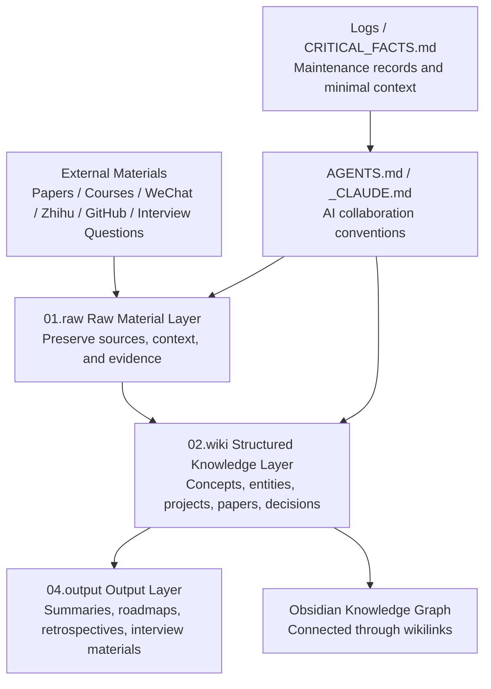

<div align="center">

# LLM-Wiki

### Large Language Model Knowledge Graph & AI-Collaborative Personal Knowledge Base

A Chinese Obsidian knowledge base for **LLM / Agent / RAG / Post-training / AI Engineering**, designed to accumulate systematic learning, interview preparation, paper reading, engineering practice, and long-term knowledge compounding.

[](https://github.com/VectorPeak/LLM-Wiki)
[](./LICENSE)


`LLM` · `Agent` · `RAG` · `SFT` · `RLHF` · `Evaluation` · `Interview` · `Knowledge Graph` · `Obsidian`

</div>

---

## Why This Project Exists

The hard part of learning LLMs is usually not that there are too few materials, but that there are too many materials without a coordinate system: courses, papers, WeChat articles, Zhihu posts, GitHub projects, interview questions, and daily ideas keep flowing in. Without structured accumulation, they easily become a pile of bookmarks that cannot be reused.

This project organizes those materials into an **AI-collaborative personal knowledge base**: humans can read, link, and review through Obsidian, while AI Agents can also read, rewrite, summarize, and maintain it according to shared conventions. It is more like a “knowledge warehouse + navigation system” than a linear tutorial.

- **Fight fragmentation**: Put raw materials such as WeChat articles, Zhihu posts, courses, papers, and interview questions into `01.raw/` first, ensuring that sources remain traceable.
- **From materials to knowledge**: `01.raw/` is the ore, while `02.wiki/` is the refined metal; the former preserves context, and the latter distills concepts, entities, projects, and decisions.
- **Learning, interviews, and engineering in one place**: The same knowledge system supports LLM fundamentals, project retrospectives, interview preparation, and open-source practice.
- **Built for future AI collaboration**: Through `AGENTS.md`, `_CLAUDE.md`, frontmatter, `[[wikilinks]]`, and logging conventions, future AI Agents can continue the work with low friction.

Several concepts are easy to confuse but important:

| Concept | Meaning in This Project | Opposite / Easily Confused Concept |
|---|---|---|
| Second Brain | A long-term, searchable, reusable personal knowledge system | Temporary bookmarks, browser favorites, piles of chat logs |
| Knowledge Graph | Connecting concepts, papers, projects, people, and questions through links | Isolated notes without context |
| Raw Layer | The raw-material layer that preserves sources, context, and evidence as much as possible | Summarizing too early and losing information |
| Wiki Layer | The structured knowledge layer maintained by both humans and AI | Unorganized material, one-off outputs |
| AI-Collaborative Knowledge Base | Written so future humans and AI can both understand and continue maintaining it | Casual notes readable only by the current author |

---

## Quick Start

If you only want to start using this knowledge base quickly, follow this path:

### 1. Clone the Repository

```bash
git clone https://github.com/VectorPeak/LLM-Wiki.git
cd LLM-Wiki
```

### 2. Open with Obsidian

In [Obsidian](https://obsidian.md/), choose **Open folder as vault** and open the repository root. The repository uses Markdown, `[[wikilinks]]`, and a directory-based structure, so the reading and search experience is best in Obsidian.

### 3. Choose a Reading Entry Point

| Goal | Recommended Entry |
|---|---|
| Understand the whole knowledge base | `index.md` |
| Prepare for LLM / Agent / RAG interviews | `01.raw/04.Interview/` |
| Learn large-model fundamentals systematically | `01.raw/03.SelfNotes/` |
| Read course and training-camp materials | `01.raw/09.Book&Courses/` |
| View papers and research materials | `01.raw/08.Research/` |
| Organize WeChat, Zhihu, and web clippings | `01.raw/05.Wechat/`, `01.raw/06.Zhihu/`, `01.raw/07.Website/` |

### 4. Let AI Agents Help Maintain It

If you want an AI Agent to help organize, migrate, or generate notes, it is recommended to let it read these files first:

- `AGENTS.md`: Agent operating manual and command routing.
- `_CLAUDE.md`: Vault writing rules, directory conventions, and AI-first rules.
- `CRITICAL_FACTS.md`: Minimal necessary background information.

A practical principle is: **put raw materials into `01.raw/` first, then gradually distill them into `02.wiki/`**. This preserves evidence while accumulating reusable knowledge structure.

---

## Directory Structure

The current repository is an Obsidian Vault. Core content mainly lives in `01.raw/`, while `02.wiki/` is the target layer for future knowledge distillation and structured maintenance.

```text
LLM-Wiki/
├── .obsidian/                 # Obsidian local configuration
├── 01.raw/                    # Raw material layer: preserve evidence first, then refine knowledge
│   ├── 00.WorkSpace/          # Project packaging, drafts, temporary workspace
│   ├── 01.Inbox/              # Inbox: temporary entry point for new materials
│   ├── 02.DailyNotes/         # Journals / daily notes
│   ├── 03.SelfNotes/          # Self-study notes, interview basics, personal summaries
│   ├── 04.Interview/          # LLM interview questions, resume templates, job-prep materials
│   ├── 05.Wechat/             # WeChat Official Account clippings
│   ├── 06.Zhihu/              # Zhihu clippings
│   ├── 07.Website/            # Web articles and site clippings
│   ├── 08.Research/           # Papers, research materials, and metadata
│   ├── 09.Book&Courses/       # Books, courses, bootcamps, and manuals
│   ├── 10.GitHub/             # GitHub project notes and snapshots
│   ├── 11.Leetcode/           # Algorithm practice and LeetCode materials
│   └── 12.Others/             # Other materials not yet categorized
├── 02.wiki/                   # Structured knowledge layer: concepts, entities, projects, decisions, etc.
├── 03.templates/              # Obsidian / AI writing templates
├── 04.output/                 # AI-generated results, cleaned drafts, exports
├── 03.Mentor/                 # Learning mentor, review, and assisted-learning materials
├── Bases/                     # Obsidian Bases view configuration
├── boards/                    # Kanban data
├── Excalidraw/                # Hand-drawn diagrams, whiteboards, visual sketches
├── Logs/                      # Operation logs and work records
├── AGENTS.md                  # Codex / Agent operating manual
├── CRITICAL_FACTS.md          # High-frequency key facts entry point
├── index.md                   # Vault navigation entry point
├── _CLAUDE.md                 # Vault writing, maintenance, and collaboration conventions
└── README.md                  # Project description
```

Recommended reading order:

1. Read `README.md` first to understand the project positioning.
2. Then read `index.md` to get the Vault map.
3. When AI Agents need to participate in maintenance, read `AGENTS.md` and `_CLAUDE.md` first.
4. When looking for specific materials, start from the corresponding topic folder under `01.raw/`.

---

## Knowledge Flow Diagram

This repository is not a “dumping ground for materials,” but a pipeline from raw information to reusable knowledge: preserve evidence first, distill structure next, and finally produce outputs that are readable, searchable, and reusable.



You can think of it as a “knowledge refinery”: `01.raw/` is like crude oil, complete but heavy; `02.wiki/` is like refined fuel, better for search, review, and reuse; `04.output/` is the finished product for specific tasks.

---

## Learning Routes

Different readers can enter from different entry points; there is no need to read everything linearly from start to finish.

| Learning Goal | Recommended Path | Suitable Scenario |
|---|---|---|
| LLM fundamentals | `01.raw/03.SelfNotes/` → `01.raw/09.Book&Courses/` → `02.wiki/` | Build basic concepts around Transformers, training, inference, and evaluation |
| RAG engineering practice | `01.raw/09.Book&Courses/` → `01.raw/10.GitHub/` → `04.output/` | Understand retrieval, chunking, recall, reranking, evaluation, and engineering deployment |
| Agent systems | `01.raw/08.Research/` → `01.raw/03.SelfNotes/` → `02.wiki/` | Understand tool use, memory, multi-agent systems, and production-grade Agent design |
| Large-model interview preparation | `01.raw/04.Interview/` → `01.raw/03.SelfNotes/` → `04.output/` | Prepare for LLM / RAG / Agent / training / inference roles |
| Paper reading and distillation | `01.raw/08.Research/` → `02.wiki/` → `04.output/` | Turn papers from reading materials into concept cards and reusable notes |
| AI-assisted maintenance | `AGENTS.md` → `_CLAUDE.md` → `CRITICAL_FACTS.md` → `Logs/` | Let AI Agents continue organizing, archiving, summarizing, and restructuring the knowledge base |

The recommended way to work is: **choose a goal first, then read along the corresponding route instead of wandering through the whole repository**. The larger a knowledge base becomes, the more it needs entry points; otherwise readers enter a library without signs.

---

## Content Maturity

Not all content in this repository is at the same maturity level. To avoid misreading it, use the following mental model:

| Layer | Location | Maturity | Reading Advice |
|---|---|---|---|
| Raw materials | `01.raw/` | Low to medium: preserves sources and context, may not be fully cleaned | Good for verification, backtracking, and finding primary materials; do not treat it directly as final conclusions |
| Structured knowledge | `02.wiki/` | Medium to high: distilled, linked, and rewritten | Good for review, search, and building concept networks |
| Templates and outputs | `03.templates/`, `04.output/` | Medium: serves concrete tasks and may include stage-specific assumptions | Good for reusing formats, generating summaries, preparing interviews or reports |
| Maintenance conventions | `AGENTS.md`, `_CLAUDE.md`, `CRITICAL_FACTS.md` | High: defines how AI and humans collaborate on maintenance | Read before editing the repository |
| Logs and boards | `Logs/`, `boards/` | Medium: records process and state | Good for understanding project evolution, but not necessarily final knowledge conclusions |

In short: **the raw layer is responsible for trustworthy sources, the wiki layer for structured understanding, and the output layer for task-oriented expression**. If a piece of content comes from an external article, course, or clipping, always go back to the original source to verify time, context, and copyright boundaries.

---

## Notes

- **This is a knowledge base, not a code package**: The repository is mainly Markdown, Obsidian configuration, clippings, and knowledge notes. Do not look for an installation entry point as you would in a normal software project.
- **Do not casually rewrite the raw layer**: `01.raw/` is closer to an “evidence layer.” Unless explicitly cleaning, migrating, or deduplicating, preserve the original context as much as possible.
- **Read the rules before AI editing**: Any automated organizing, restructuring, or batch note generation should start by reading `AGENTS.md` and `_CLAUDE.md`.
- **External information must be traceable**: For papers, articles, projects, and time-sensitive facts, preserve the original URL, date, source, and necessary recency markers.
- **Prefer `[[wikilinks]]`**: Important people, projects, concepts, papers, tools, and decisions should be linked whenever possible so knowledge does not become isolated.
- **Respect copyright and privacy**: Clippings are mainly for personal learning and indexing. Do not package unauthorized full-text content as original work, and avoid committing sensitive information when adding new material.
- **Keep paths and encoding stable**: The repository contains Chinese directories, special characters, and Obsidian syntax. Use UTF-8 and handle file paths with literal-path-safe scripts.
- **Do not mix temporary artifacts into the knowledge layer**: Intermediate files, caches, experimental outputs, and one-off results should go into the agreed temporary or output locations instead of polluting core notes.

---

## FAQ

### Who is this project for?

It is for learners systematically studying LLM / Agent / RAG, as well as people preparing for large-model job interviews, distilling paper notes, and organizing open-source project experience.

### How is it different from a regular blog?

A blog is usually a one-off publication for readers. LLM-Wiki is more like an evolving knowledge operating system: materials can first enter the raw layer, then gradually be distilled into wiki entries, retrospectives, graphs, and outputs.

### Where should I start the first time I open it?

Start with `index.md`, the Vault navigation entry. If your goal is interviews, start with `01.raw/04.Interview/`; if your goal is systematic learning, start with `01.raw/03.SelfNotes/` and `01.raw/09.Book&Courses/`.

### Why separate `01.raw/` and `02.wiki/`?

They serve different roles: `01.raw/` preserves “evidence and context,” while `02.wiki/` stores “structured understanding.” Using a refining analogy, the raw layer is ore and the wiki layer is the refined material. If ore is treated directly as the finished product, later search and reuse become heavy.

### Is it normal for `02.wiki/` to be empty or sparse?

Yes. The project’s current main assets are in `01.raw/`, while `02.wiki/` is the long-term target layer for gradually turning raw materials into concept cards, project cards, paper cards, and a knowledge graph.

### Can it be used directly for interview preparation?

Yes, but it is better used as a material library and review map rather than a set of answers to memorize. Interview-related content mainly lives in `01.raw/04.Interview/`, and works best when used together with systematic notes in `03.SelfNotes/`.

### How do I open it with Obsidian?

After cloning the repository, choose **Open folder as vault** in Obsidian and open the repository root. Because the notes heavily use Markdown and `[[wikilinks]]`, the reading experience in Obsidian is better than in a plain text editor.

### Are contributions welcome?

You can use Issues or PRs to report directory mistakes, typos, broken links, factual errors, and structural suggestions. When submitting new content, preserve sources, dates, context, and necessary copyright notes as much as possible.

### What is the license?

Code and original curated content in this repository follow the [MIT License](./LICENSE) by default. External clippings, citations, papers, and course materials still belong to their original authors or copyright holders.