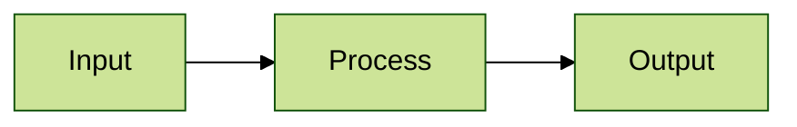

# Vault Operating Manual - LLM_wiki

> Read this file before doing anything in this vault.
> This vault uses the obsidian-second-brain Codex build installed in `AGENTS.md` and `.codex/`.

---

## Section 0 - AI-First Vault Rule

This vault is designed for future AI agents to retrieve, reason over, and update. Obsidian is the storage layer; Codex is the working interface.

Every note written by Codex must follow the AI-first rule:

1. Include self-contained context.
2. Start with a `## For future Claude` preamble after frontmatter.
3. Use rich frontmatter with `date`, `type`, `tags`, and `ai-first: true`.
4. Add recency markers for external claims.
5. Preserve source URLs verbatim.
6. Use `[[wikilinks]]` for people, projects, concepts, decisions, and sources.
7. Mark confidence when a claim is inferred or uncertain.

The full local spec is `.codex/references/ai-first-rules.md`.

---

## Vault Identity

- Owner: TBD
- Primary purpose: AI-first LLM wiki and second brain
- Vault style: wiki-style, LLM-first
- Last initialized: 2026-06-15
- Timezone: Asia/Shanghai

---

## Core Architecture

| Path | Purpose | Write rule |
|---|---|---|
| `01.raw/` | Original source material | Add new source files only when ingesting or capturing originals. Avoid rewriting existing raw files unless the user asks for cleanup or migration. |
| `02.wiki/` | AI-maintained knowledge workspace | Codex may create and update notes here using AI-first rules. |
| `03.Mentor/` | Active Mentor learning system | Use for AI-assisted learning sessions, active dashboard, session index, mastery cards, question bank, personas, and Mentor templates. |
| `._trash&cache/` | Temporary stitching cache, disposable working files, and soft trash | Use for transient image/file stitching cache, OCR scratch output, generated intermediates that should not pollute the vault, and trash-like material waiting for possible recovery. Do not treat it as a knowledge source unless the user explicitly points to a file inside it. Never use it for durable notes. |
| `.codex/references/` | Codex reference docs and secondary operating notes | Keep detailed reference material here; keep root files focused on entrypoints. |
| `index.md` | Catalog and navigation entrypoint | Regenerate when vault structure changes. |
| `.codex/references/log.md` | Pointer to operation logs | Keep as pointer only. Daily entries live in `Logs/`. |
| `Logs/` | Append-only vault operation logs | Append dated entries. Do not rewrite history. |
| `Bases/` | Obsidian Bases configs | Update only when folder mappings change. |
| `boards/` | Kanban boards | Create/update boards when tasks or projects need workflow state. |
| `_trash/` | Soft-deleted notes | Move here only after explicit confirmation. |

---

## Raw Schema

`01.raw/` stores source material exactly as captured:

- `01.raw/00.WorkSpace/` - scratch space, staging, temporary imports, and in-progress rewrites
- `01.raw/01.Inbox/` - intake queue for newly clipped raw material
- `01.raw/02.DailyNotes/` - raw daily-note source files
- `01.raw/03.SelfNotes/` - personal notes and self-study source material
- `01.raw/04.Interview/` - interview notes, question banks, transcripts, and spreadsheet sources
- `01.raw/05.Wechat/` - WeChat source clippings; root-level author folders, loose items for mixed/short sets, `._Wechat_metadata/` for metadata
- `01.raw/06.Zhihu/` - Zhihu source clippings; root-level author folders, loose items for mixed/short sets, `._Zhihu_metadata/` for metadata
- `01.raw/07.Website/` - website captures and exported web articles
- `01.raw/08.Research/` - verified paper PDFs and metadata; taxonomy:
  - `00.Agent/`
  - `01.RAG/`
  - `02.PostTraining/SFT/`
  - `02.PostTraining/RL/`
  - `03.Training_Systems/`
  - `04.Personal/`
  - `05.Other/`
  - `_metadata/`
- `01.raw/09.Book&Courses/` - books, courses, and manuals kept raw by source
- `01.raw/10.GitHub/` - raw project snapshots under `owner/repo/`
- `01.raw/11.Leetcode/` - problem sets and practice notes
- `01.raw/12.Transcripts/` - reserved transcript intake
- `01.raw/13.Videos/` - reserved video intake

Keep `04.Interview` and `09.Book&Courses` raw-first. Do not over-split them until the volume or a user request justifies it.

Raw source notes should use:

```yaml
---
date: YYYY-MM-DD
type: source
tags: [source]
source_type: article | transcript | pdf | video
source_url: ""
content_hash: ""
ai-first: true
---
```

Once a raw source exists, treat it as immutable. Derived knowledge belongs in `02.wiki/`.

---

## Wiki Layer

`02.wiki/` is the maintained knowledge graph:

- `02.wiki/entities/` - people, companies, tools, organizations
- `02.wiki/concepts/` - ideas, frameworks, methodologies, synthesis pages
- `02.wiki/projects/` - project hubs and project-specific architecture notes
- `02.wiki/daily/` - daily notes
- `02.wiki/logs/` - work logs and dev logs
- `02.wiki/reviews/` - weekly, monthly, and thematic reviews
- `02.wiki/tasks/` - standalone task notes
- `02.wiki/decisions/` - ADRs and decision records

Search before creating. Duplicate notes are vault rot.

---

## Naming Conventions

- Daily note: `YYYY-MM-DD.md`
- Work log: `YYYY-MM-DD - Description.md`
- Raw source: `YYYY-MM-DD - Source Title.md`
- Entity: full canonical name
- Project: proper project name
- Decision: `ADR-YYYY-MM-DD - Title.md`

Use ASCII filenames unless the source title or user's existing naming convention requires otherwise.

---

## Operating Rules

- Read `index.md` first when navigating the vault.
- Search exhaustively before claiming that a note or fact is absent.
- Never invent names, dates, roles, facts, prices, or citations. Use `TBD` when unknown.
- Keep external claims source-linked and dated.
- Propagate important writes to linked notes, `index.md`, today's daily note, and `Logs/YYYY-MM-DD.md` when relevant.
- Ask before deleting, archiving, moving private material, or changing templates.

## Markdown Diagram Rules

When writing Markdown documents in this vault, Mermaid diagrams should default to the `forest` theme and be authored for easy whole-graph viewing. Prefer compact left-to-right or top-down layouts, short node labels, and explicit Mermaid init blocks such as:

````markdown

````

For larger diagrams, split the graph into smaller diagrams or use subgraphs so readers can see the whole structure without heavy horizontal dragging.
